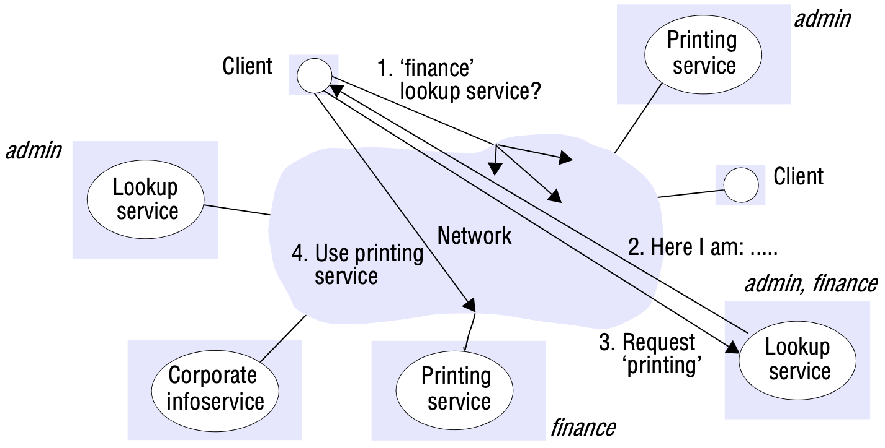

# Chapter 19 MOBILE AND UBIQUITOUS COMPUTING

[TOC]

## Association

**The association problem and the boundary principle**. Once a device can communicate in the smart space, it is faced with the *association problem*: how to associate appropriately within it. Solutions to the association problem must address two main aspects: scale and scope.

The *boundary principle* states that smart spaces need to have system boundaries that correspond accurately to meaningful spaces as they are normally defined territorially and administratively.

### Discovery services

Clients find out about the services provided in a smart space using a *discovery service*.

The issues to be dealt with in the design of a discovery service are as follows:

- Low-effort, appropriate association
- Service description and query language
- Smart-space-specific discovery
- Directory implementation
- Service volatility

*Service discovery in Jini*

## Interoperation

### Data-oriented programming for volatile systems

We call systems that use an unvarying service interface, such as UNIX pipes and the Web, *data-oriented* (or, equivalently, *content-oriented*).

Event systems provide instances of event services. Each system offers a fixed, generic interface by which components called *publishers* publish structured data known as events and, correspondingly, components called *subscribers* receive events. Each event service is associated with some physical or logical scope of event delivery.