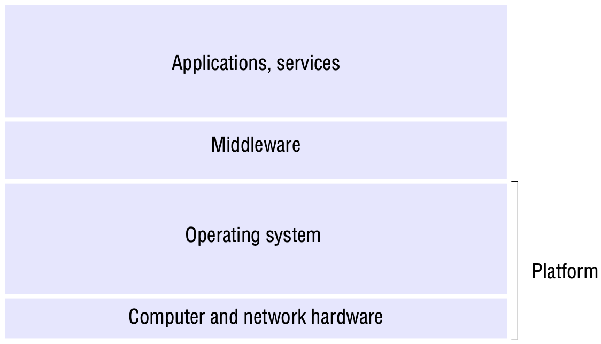
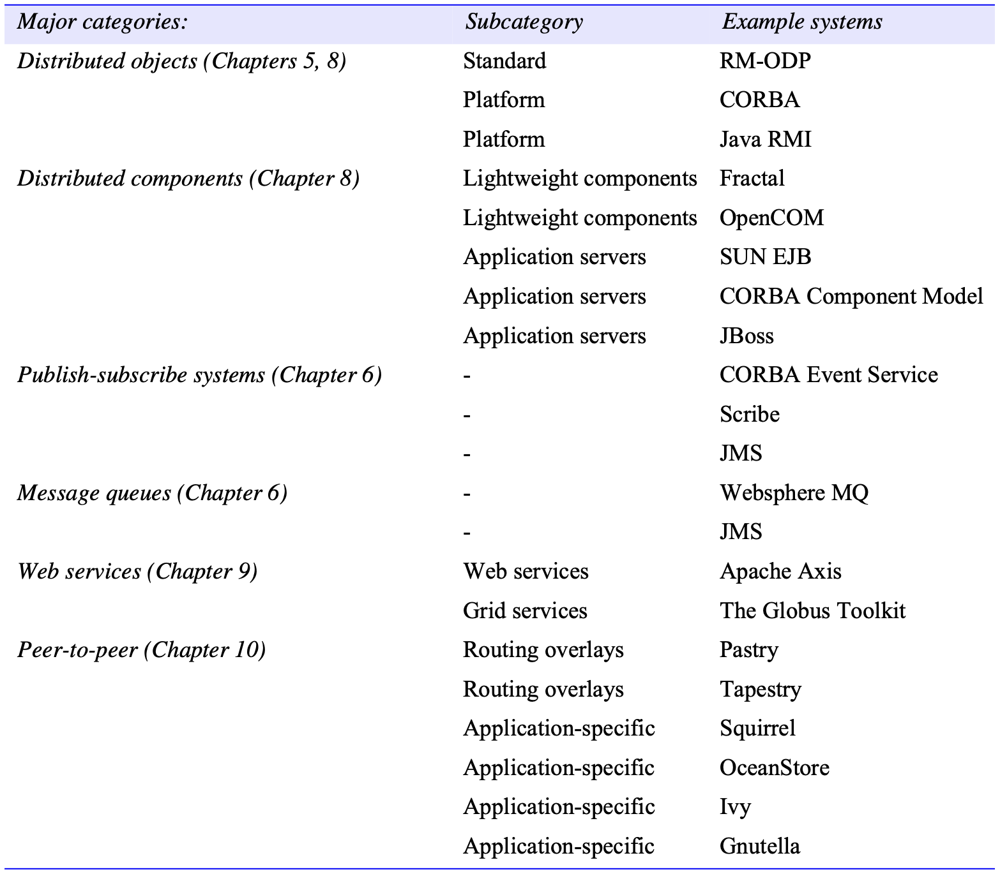
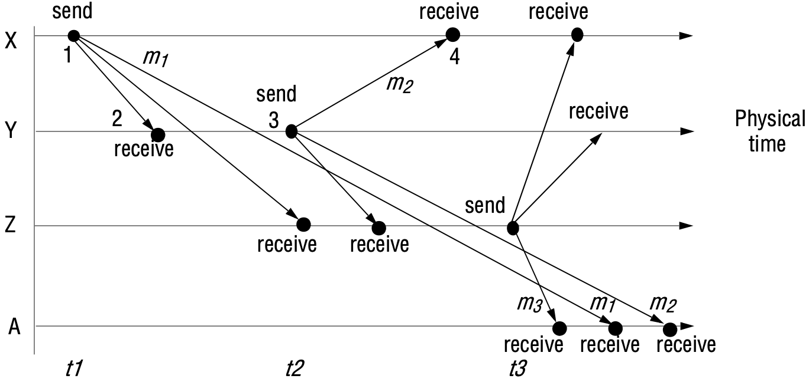
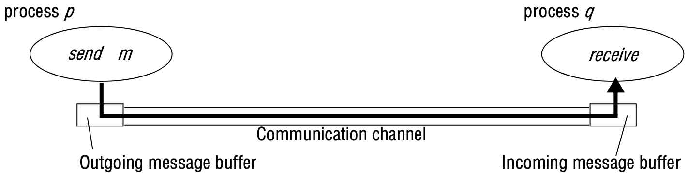
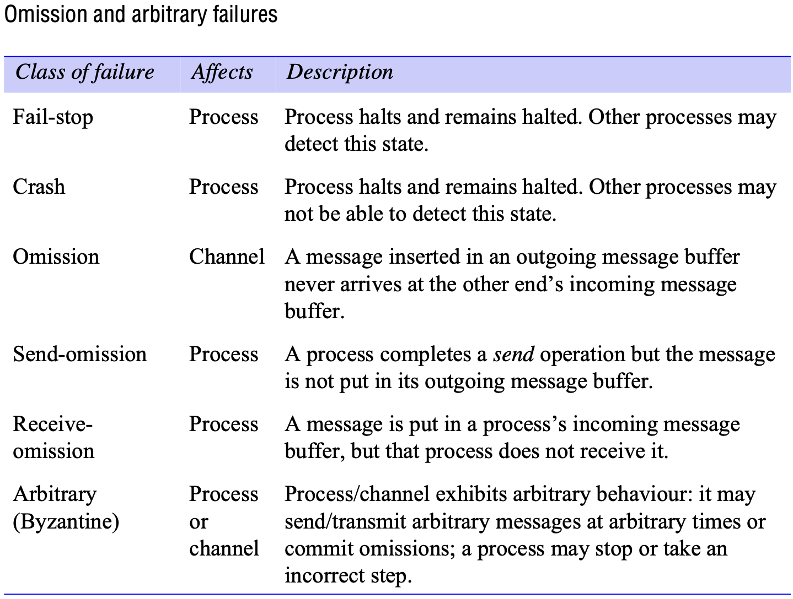
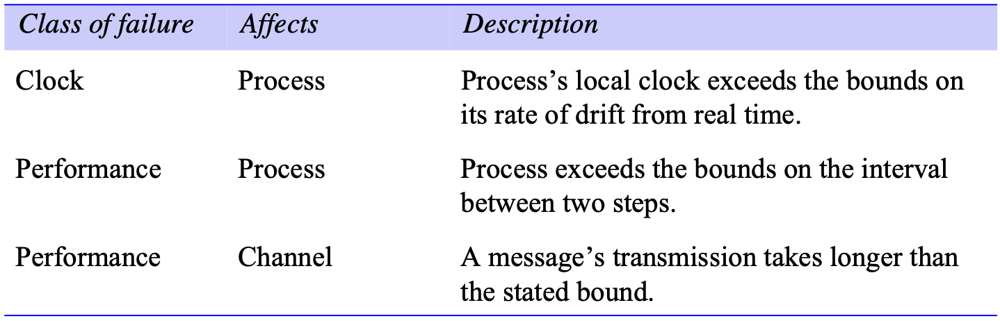

# SYSTEM MODELS

[TOC]

## Introduction

*Physical models* are the most explicit way in which to describe a system; they capture the hardware composition of a system in terms of the computers (and other devices, such as mobile phones) and their interconnecting networks.

*Architectural models* describe a system in terms of the computational and communication tasks performed by its computational elements; the computational elements being individual computers or aggregates of them supported by appropriate network interconnections.

*Fundamental models* take an abstract perspective in order to examine individual aspects of a distributed system.

## Physical models

Generations of distributed systems:

| Distributed systems: | Early                                                    | Internet-scale                                               | Contemporary                                                 |
| -------------------- | -------------------------------------------------------- | ------------------------------------------------------------ | ------------------------------------------------------------ |
| Scale                | Small                                                    | Large                                                        | Ultra-large                                                  |
| Heterogeneity        | Limited(typically, relatively homogenous configurations) | Significant in terms of platforms, languages, and middleware | Added dimensions introduced, including radically different styles of architecture. |
| Openness             | Not a priority                                           | Significant priority with a range of standards introduced    | Major research challenge with existing standards not yet able to embrace complex systems. |
| Quality of service   | In its infancy                                           | Significant priority with range of services introduced       | Major research challenge with existing services not yet able to embrace complex systems. |

## Architectural models

### Architectural elements

Communication paradigms:

- *Interprocess communication* refers to the relatively low-level support for communication between processes in distributed systems, including message-passing primitives, direct access to the API offered by Internet protocols (socket programming) and support for multicast communication.
- *Remote invocation*
  - *Request-reply protocols*: Request-reply protocols are effectively a pattern imposed on an underlying message-passing service to support client-server computing.
  - *Remote procedure calls*.
  - *Remote method invocation*.
- *Indirect communication*
  - Group communication.
  - Publish-subscribe systems.
  - Message queues.
  - Tuple spaces.
  - Distributed shared memory.

### Architectural patterns

*Layering* In a layered approach, a complex system is partitioned into a number of layers, with a given layer making use of the services offered by the layer below. A given layer therefore, offers a software abstraction, with higher layers being unaware of implementation details, or indeed of any other layers beneath them.

*Software and hardware service layers in distributed systems*

*Tiered architecture*. Tiered architectures are complementary to layering. Whereas layering deals with the vertical organization of services into layers of abstraction, tiering is a technique to organize the functionality of a given layer and place this functionality into appropriate servers and, as a secondary consideration, onto physical nodes.

### Associated middleware solutions

*Categories of middleware*

## Fundamental models

### Interaction model

Two significant factors affecting interacting processes in a distributed system:

- Performance of communication channels

  Communication over a computer network has the following performance characteristics relating to latency, bandwidth and jitter.

- Computer clocks and timing events

  Each computer in a distributed system has its own internal clock, which can be used by local processes to obtain the value of the current time. Therefore, two processes running on different computers can each associate timestamps with their events. However, even if the two processes read their clocks at the same time, their local clocks may supply different time values. This is because computer clocks drift from perfect time and, more importantly, their drift rates differ from one another.

*Synchronous distributed systems:* Hadzilacos and Toueg define a synchronous distributed system to be one in which the following bounds are defined:

- The time to execute each step of a process has known lower and upper bounds.
- Each message transmitted over a channel is received within a known bounded time.
- Each process has a local clock whose drift rate from real time has a known bound.

An *asynchronous distributed system* is one in which there are no bounds on:

- Process execution speeds.
- Message transmission delays.
- Clock drift rates.

If the clocks on $X$'s, $Y$'s and $Z$'s Computers could be synchronized, then each message could carry the time on the local computer's clock when it was sent. For example, messages $m_1$, $m_2$ and $m_3$ would carry times $t_1$, $t_2$ and $t_3$ where $t_1 < t_2 < t_3$. The messages received will be displayed to users according to their time ordering. If the clocks are roughly synchronized, then these timestamps will often be in the correct order.

*Real-time ordering of events*

### Failure model

**Omission failures** The faults classified as *omission failures* refer to cases when a process or communication channel fails to perform actions that it is supposed to do.

- *Process omission failures*: The chief omission failure of a process is to crash.

- *Communication omission failures*

  

  *Processes and channels*

Failures can be categorized according to their severity. All of the failures we have described so far are *benign* failures. Most failures in distributed systems are benign. Benign failures include failures of omission as well as timing failures and performance failures:

- *Arbitrary failures*. The term *arbitrary* or *Byzantine* failure is used to describe the worst possible failure semantics, in which any type of error may occur.

- *Timing failures*. Timing failures are applicable in synchronous distributed systems where time limits are set on process execution time, message delivery time and clock drift rate.

  

  *Timing failures*

- *Masking failures*

The term *reliable communication* is defined in terms of validity and integrity as follows:

- *Validity*: Any message in the outgoing message buffer is eventually delivered to the incoming message buffer.
- *Integrity*: The message received is identical to one sent, and no messages are delivered twice.

The threats to integrity come from two independent sources:

- Any protocol that retransmits messages but does not reject a message that arrives twice. Protocols can attach sequence numbers to messages so as to detect those that are delivered twice.
- Malicious users that may inject spurious messages, replay old messages or tamper with messages. Security measures can be taken to maintain the integrity property in the face of such attacks.

