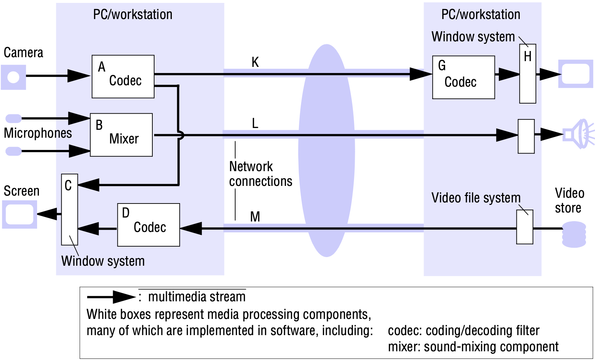
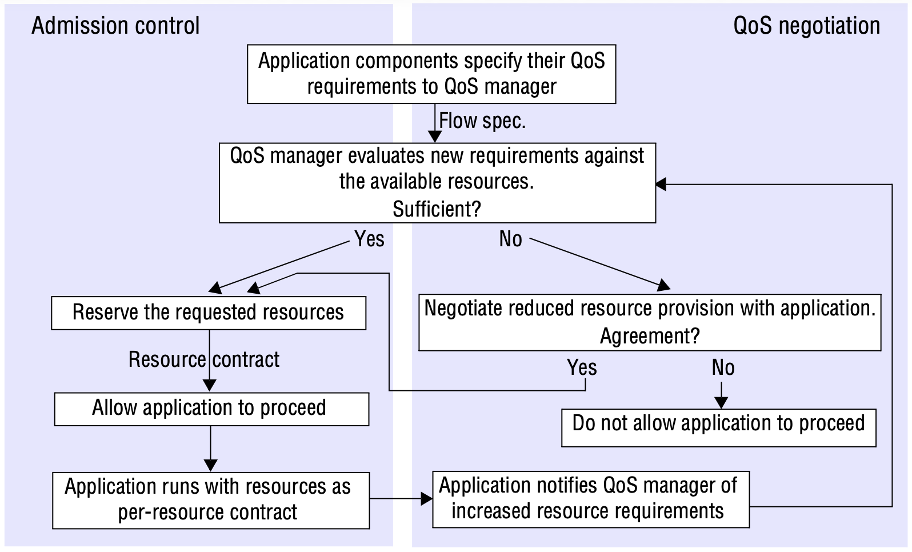
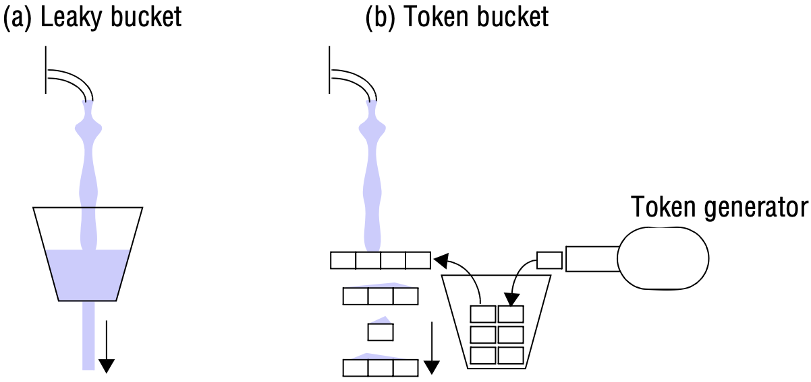
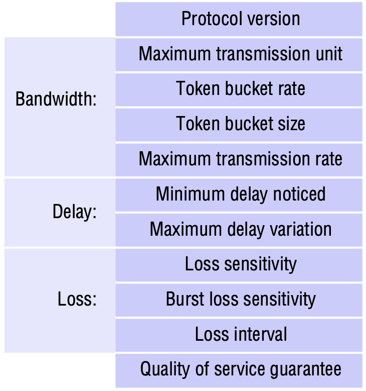
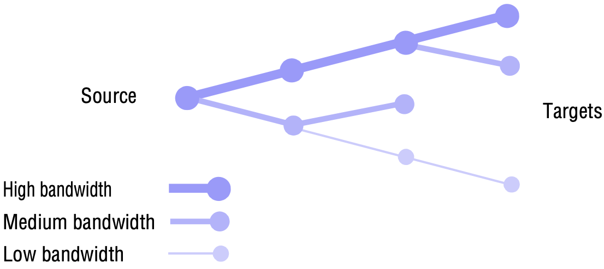

# 20 DISTRIBUTED MULTIMEDIA SYSTEMS

[TOC]

## Quality of service management

In order to achieve timely delivery, applications need guarantees that the necessary resources will be allocated and scheduled at the required times. The management and allocation of resources to provide such guarantees is referred to as *quality of service management*.

*Typical infrastructure components for multimedia applications*

*The QoS manager's task*

### Quality of service negotiation

*Traffic shaping algorithms*

**Traffic shaping**. Traffic shaping is the term used to describe the use of output buffering to smooth the flow of data elements.

**Flow specifications**. A collection of QoS parameters is typically known as a flow specification, or *flow spec* for short.

In Internet RFC 1363, a flow spec is defined as 11 16-bit numeric values:

*The RFC 1363 flow spec*

### Admission control

Admission control regulates access to resources to avoid resource overload and to protect resources from requests that they cannot fulfill.

**Bandwidth reservation**. A common way to ensure a certain QoS level for a multimedia stream is to reserve some portion of resource bandwidth for its exclusive use.

## Resource management

### Resource scheduling

Processes need to have resources assigned to them according to their priority. A resource scheduler determines the priority of processes based on certain criteria.

**Fair scheduling**. If several streams compete for the same resource, it becomes necessary to consider fairness and to prevent ill-behaved streams taking too much bandwidth. A straightforward approach ensuring fairness is to apply round-robin scheduling to all streams in the same class.

**Real-time scheduling**. Assuming that the CPU resources have not been overallocated, they assign CPU time slots to a set of processes in a manner that ensures that they complete their tasks on time.

## Stream adaptation

### Scaling

If adaptation is performed at the target of a stream, the load on any bottleneck in the system is not decreased and the overload situation persists. It is useful to adapt a stream to the bandwidth available in the system before it enters a bottleneck resource in order to resolve contention. This is known as *scaling*.

For video, the following scaling methods are appropriate:

- *Temporal scaling*: Reduces the resolution of the video stream in the time domain by decreasing the number of video frames transmitted within an interval.
- *Spatial scaling*: Reduces the number of pixels of each image in a video stream.
- *Frequency scaling*: Modifies the compression algorithm applied to an image.
- *Amplitudinal scaling*: Reduces the colour depths for each image pixel.
- *Colour-space scaling*: Reduces the number of entries in the colour space.

### Filtering

*Filtering*

