# 3 NETWORKING AND INTERNETWORKING

[TOC]

## Types of network

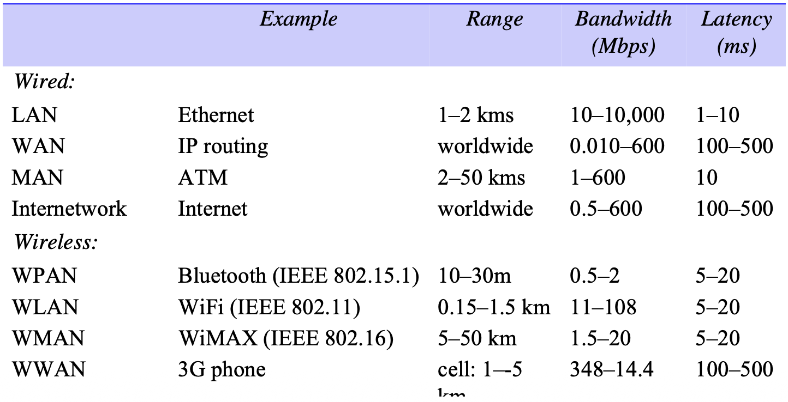

*Network performance*

## Network principles

### Packet transmission

Packets of restricted length are used:

- so that each computer in the network can allocate sufficient buffer storage to hold the largest possible incoming packet.
- to avoid the undue delays that would occur in waiting for communication channels to become free if long messages were transmitted without subdivision.

### Switching schemes

The four types of switching that are used in computer networking:

- Broadcast
- Circuit switching
- Packet switching
- Frame relay

### Protocols

The term *protocol* is used to refer to a well-known set of rules and formats to be used for communication between processes in order to perform a given task. The definition of a protocol has two important parts to it:

- a specification of the sequence of messages that must be exchanged;
- a specification of the format of the data in the messages.

**Protocol layers**. Network software is arranged in a hierarchy of layers. Each layer presents an interface to the layers above it that extends the properties of the underlying communication system. A layer is represented by a module in every computer connected to the network.

*Conceptual layering of protocol software*

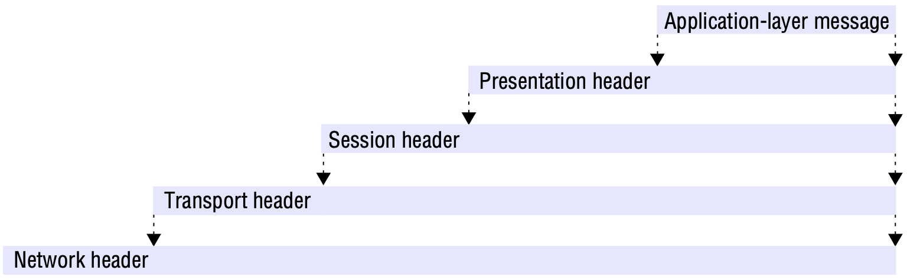

*Encapsulation as it is applied in layered protocols*

**Protocol suites**. A complete set of protocol layers is referred to as a *protocol suite* or a *protocol stack*, reflecting the layered structure.

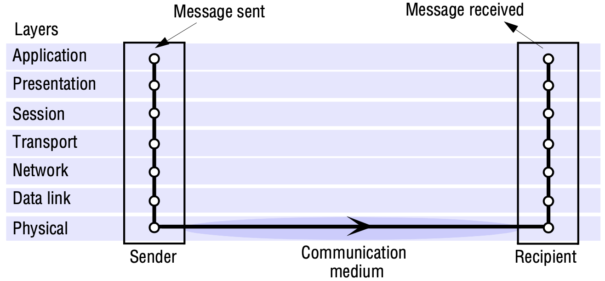

*Protocol layers in the ISO Open Systems Interconnection (OSI) protocol model*

OSI protocol summary:

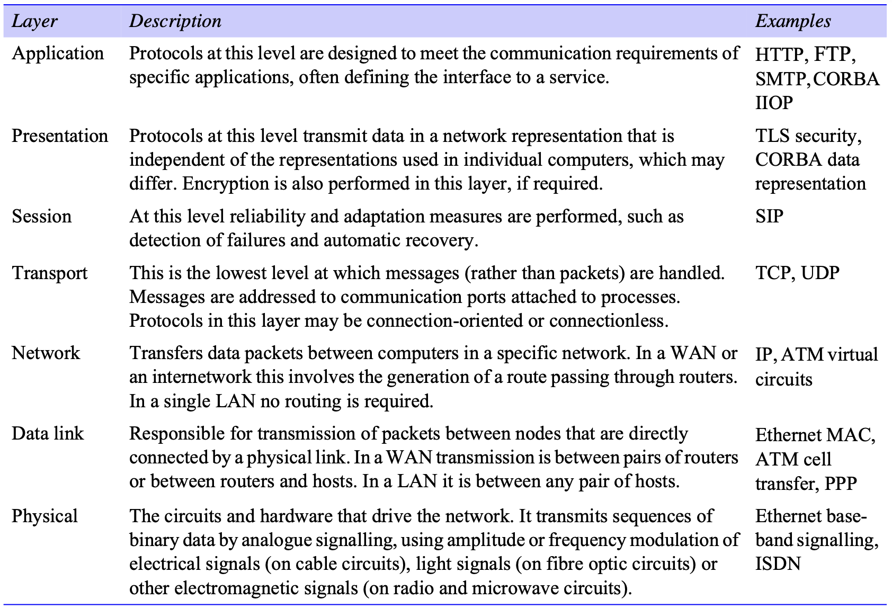

**Packet assembly**. The task of dividing messages into packets before transmission and reassembling them at the receiving computer is usually performed in the transport layer.

The network-layer protocol packets consist of a *header* and a *data field*. In most network technologies, the data field is variable in length, with the maximum length called the *maximum transfer unit*(MTU). If the length of a message exceeds the MTU of the underlying network layer, it must be fragmented into chunks of the appropriate size, with sequence numbers for use on reassembly, and transmitted in multiple packets.

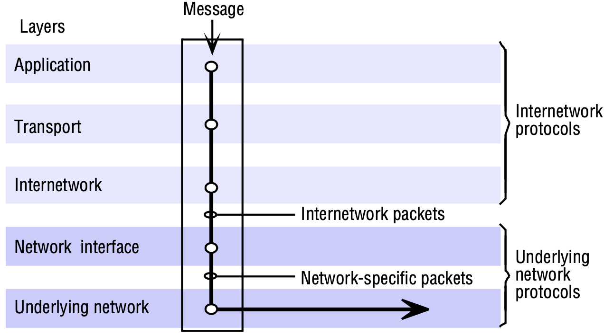

*Internetwork layers*

**Ports**. The transport layer's task is to provide a network-independent message transport service between pairs of network *ports*. Ports are software-defined destination points at a host computer. They are attached to processes, enabling data transmission to be addressed to a specific process at a destination node.

**Addressing**. The transport layer is responsible for delivering messages to destinations with *transport addresses* that are composed of the *network address* of a host computer and a *port number*. A network address is a numeric identifier that uniquely identifies a host computer and enables it to be located by nodes that are responsible for routing data to it.

There are two approaches to the delivery of packets by the network layers:

- *Datagram packet delivery*
- *Virtual circuit packet delivery*

### Routing

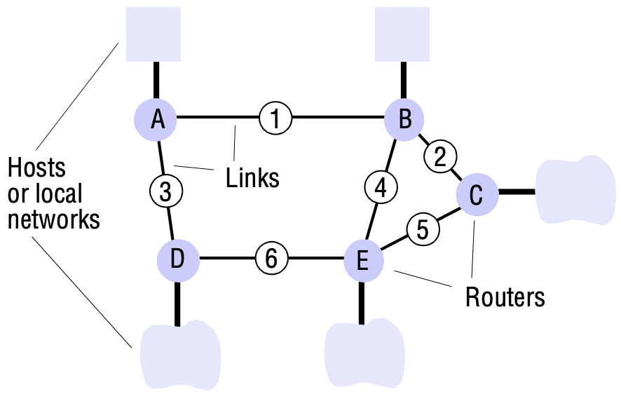

*Routing in a wide area network*

A routing algorithm has two parts:

1. It must make decisions that determine the route taken by each packet as it travels through the network.
2. It must dynamically update its knowledge of the network based on traffic monitoring and the detection of configuration changes or failures. This activity is less time-critical; slower and more computation-intensive techniques can be used.

## Internet protocols

### IP addressing

The scheme used for assigning host addresses to networks and the computers connected to them had to satisfy the following requirements:

- It must be universal.
- It must be efficient in its use of the address space.
- The addressing scheme must lend itself to the development of a flexible and efficient routing scheme, but the addresses themselves cannot contain very much of the information needed to route a packet to its destination.

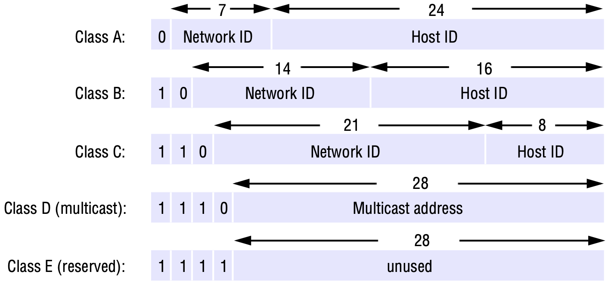

*Internet address structure, showing field sizes in bits*

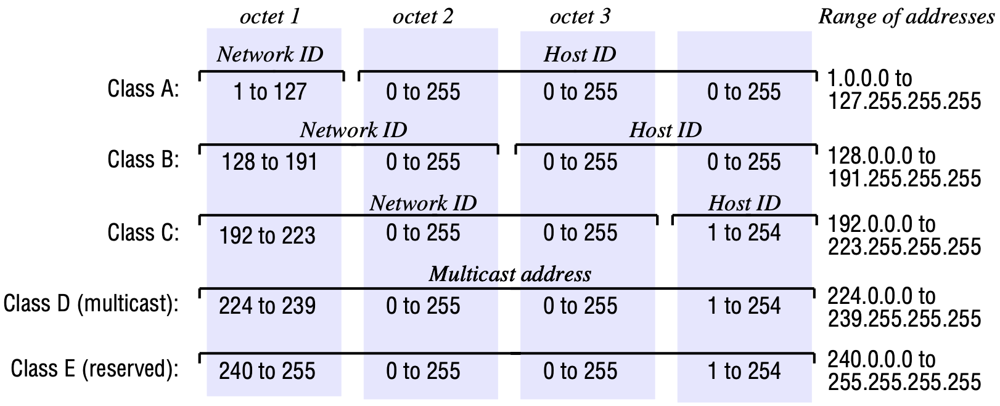

*Decimal representation of Internet addresses*

### The IP protocol

The IP protocol transmits datagrams from one host to another, if necessary via intermediate routers.

**Address resolution**. The address resolution module is responsible for converting Internet addresses to network addresses for a specific underlying network (sometimes called physical addresses).

### IP routing

**Backbones**. The topological map of the Internet is partitioned conceptually into *autonomous systems* (ASs), which are subdivided into *areas*.

**Routing on a local subnet**. Packets addressed to hosts on the same network as the sender are transmitted to the destination host in a single hop, using the host identifier part of the address to obtain the address of the destination host on the underlying network. The IP layer simply uses ARP to get the network address of the destination and then uses the underlying network to transmit the packets.

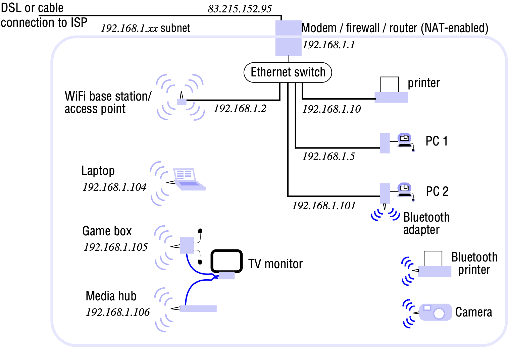

*A typical NAT-based home network*

### IP version 6

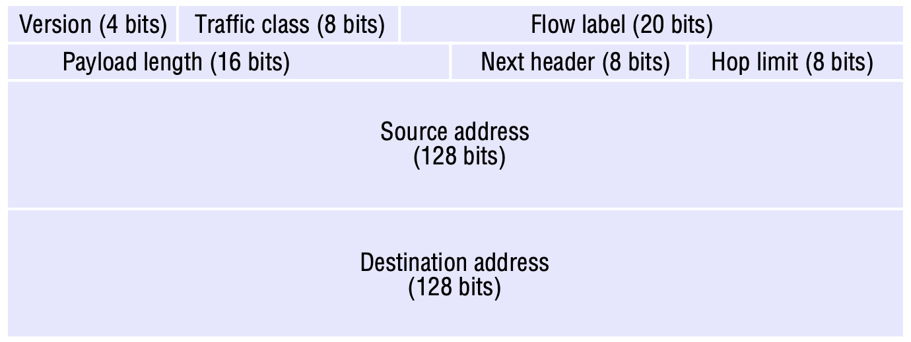

*IPv6 header layout*

### Mobile IP

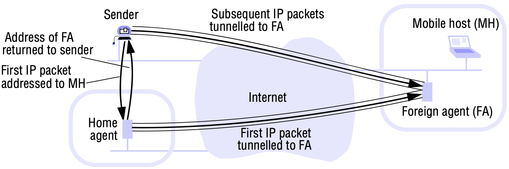

*The Mobile IP routing mechanism*

