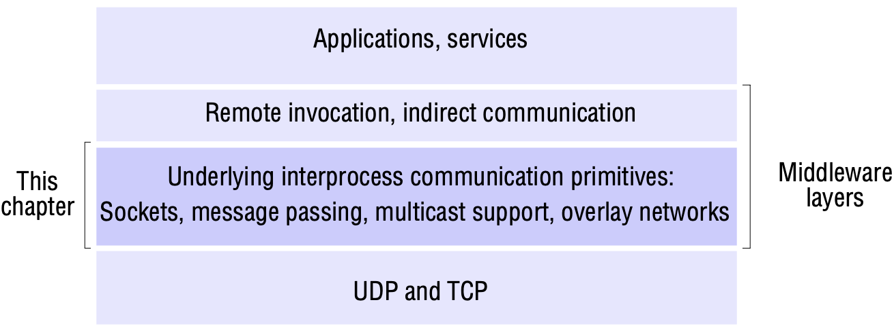
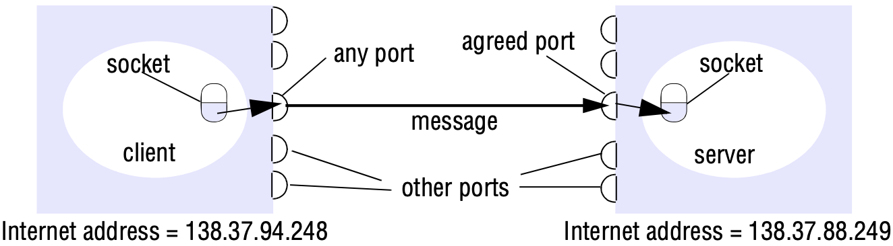
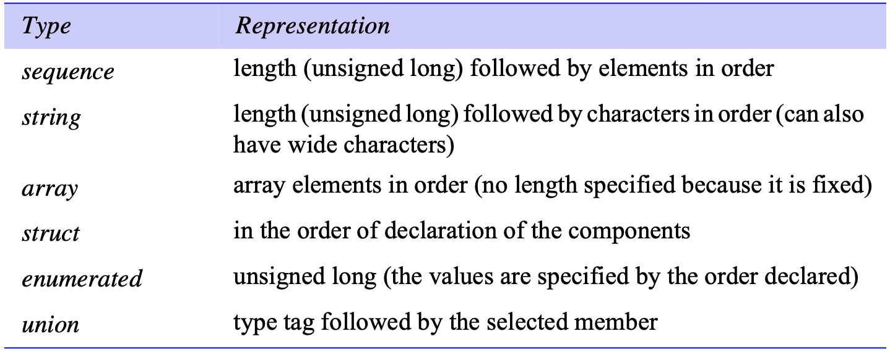
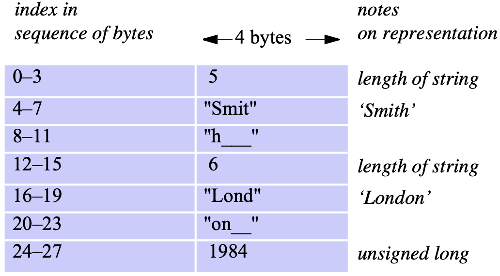
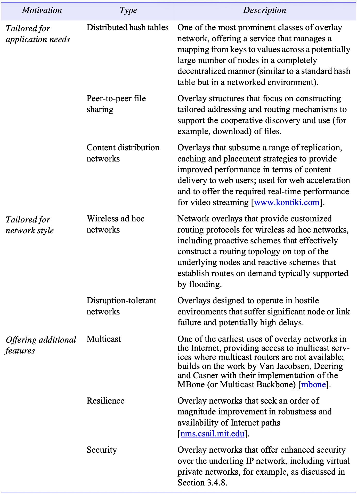

# 4 INTERPROCESS COMMUNICATION

[TOC]

## Introduction

*Middleware layers*

The Message Passing Interface (MPI) is a standard developed to provide an API for a set of message-passing operations with synchronous and asynchronous variants.

## The API for the Internet protocols

### The characteristics of interprocess communication

In the *synchronous* form of communication, the sending and receiving processes synchronize at every message.

In the *asynchronous* form of communication, the transmission of the message proceeds in parallel with the sending process.

Using the following approach to provide location transparency:

- Client programs refer to services by name and use a name server or binder to translate their names into server locations at runtime.

### Sockets

*Sockets and ports*

Both forms of communication (UDP and TCP) use the *socket* abstraction, which provides an endpoint for communication between processes.

### UDP datagram communication

The following are some issues relating to datagram communication:

- *Message size*: The receiving process needs to specify an array of bytes of a particular size in which to receive a message. If the message is too big for the array, it is truncated on arrival.
- *Blocking*: Sockets normally provide non-blocking *sends* and blocking *receives* for datagram communication.
- *Timeout*: The *receive* that blocks forever is suitable for use by a server that is waiting to receive requests from its clients.
- *Receive from any*

UDP datagrams suffer from the following failures:

- *Omission failures*
- *Ordering*

UDP datagrams are sometimes an attractive choice because they do not suffer from the overheads associated with guaranteed message delivery. There are three main sources of overhead:

- the need to store state information at the source and destination;
- the transmission of extra message;
- latency for the sender.

### TCP stream communication

The API to the TCP protocol, which originates from BSD 4.x UNIX, provides the abstraction of a stream of bytes to which data may be written and from which data may be read. The following characteristics of the network are hidden by the stream abstraction:

- Message sizes
- Lost messages
- Flow control
- Message duplication and ordering
- Message destinations

The following are some outstanding issues related to stream communication:

- Matching of data items
- Blocking
- Threads

## External data representation and marshalling

*Marshalling* is the process of taking a collection of data items and assembling them into a form suitable for transmission in a message.

*Unmarshalling* is the process of disassembling them on arrival to produce an equivalent collection of data items at the destination.

### CORBA's Common Data Representation (CDR)

*Primitive types*: CDR defines a representation for both big-endian and little-endian orderings. Values are transmitted in the sender's ordering, which is specified in each message. The recipient translates if it requires a different ordering.

*Constructed types*: The primitive values that comprise each constructed type are added to a sequence of bytes in a particular order.

*CORBA CDR for constructed types*

*CORBA CDR message*

### Remote object references

A *remote object reference* is an identifier for a remote object that is valid throughout a distributed system. A remote object reference is passed in the invocation message to specify which object is to be invoked.

## Multicast communication

Multicast messages provide a useful infrastructure for constructing distributed systems with the following characteristics:

1. Fault tolerance based on replicated services.
2. Discovering services in spontaneous networking.
3. Better performance through replicated data.
4. Propagation of event notifications.

### IP multicast - An implementation of multicast communication

*IP multicast* is built on top of the Internet Protocol (IP).

*Multicast routers*: IP packets can be multicast both on a local network and on the wider Internet.

*Multicast address allocation*: Class D addresses (that is, addresses in the range *224.0.0.0* to *239.255.255.255*) are reserved for multicast traffic and managed globally by the Internet Assigned Numbers Authority (IANA). The management of this address space is reviewed annually, with current practice documented in RPC 3171. This document defines a partitioning of  this address space into a number of blocks, including:

- Local Network Control Block (*224.0.0.0* to *224.0.0.225*), for multicast traffic within a given local network.
- Internet Control Block (*224.0.1.0* to *224.0.1.225*).
- Ad Hoc Control Block (*224.0.2.0* to *224.0.255.0*), for traffic that does not fit any other block.
- Administratively Scoped Block (*239.0.0.0* to *239.255.255.255*), which is used to implement a scoping mechanism for multicast traffic (to constrain propagation).

## Network virtualization: Overlay networks

An *overlay network* is a virtual network consisting of nodes and virtual links, which sits on top of an underlying network (such as an IP network) and offers something that is not otherwise provided:

- A service that is tailored towards the needs of a class of applications or a particular higher-level service.
- More efficient operation in a given networked environment.
- An additional feature.

Overlay networks have the following advantages:

- They enable new network services to be defined without requiring changes to the underlying network, a crucial point given the level of standardization in this area and the difficulties of amending underlying router functionality.
- They encourage experimentation with network services and the customization of services to particular classes of application.
- Multiple overlays can be defined and can coexist, with the end result being a more open and extensible network architecture.

*Types of overlay*

