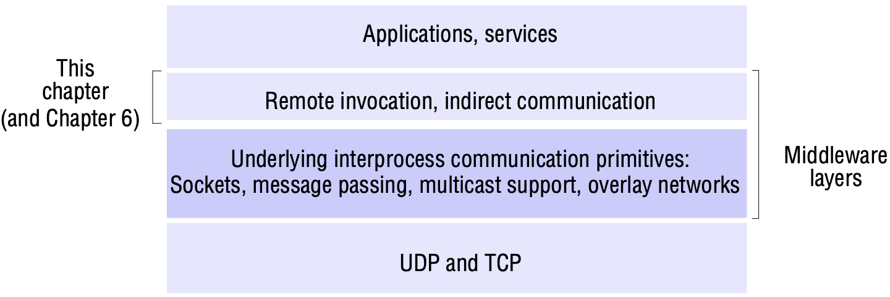
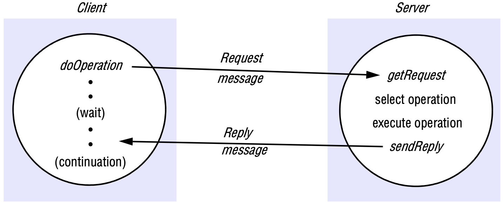
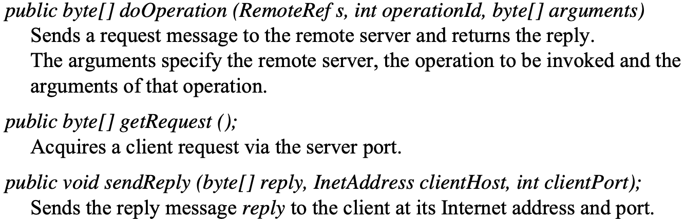
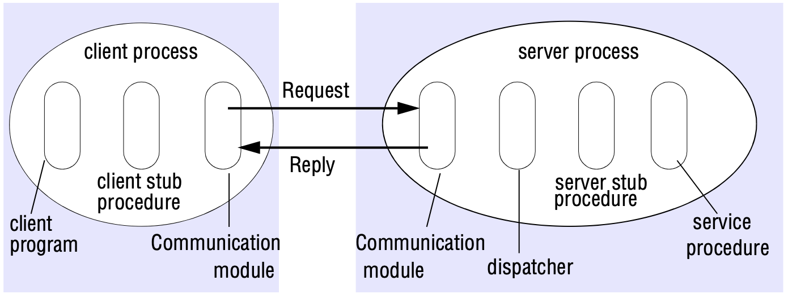
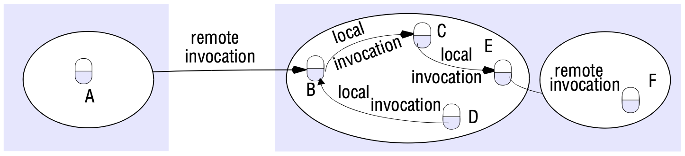
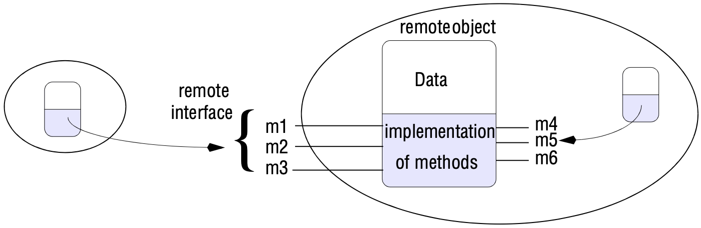
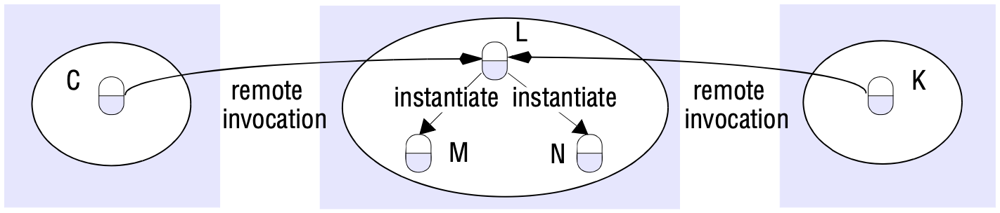
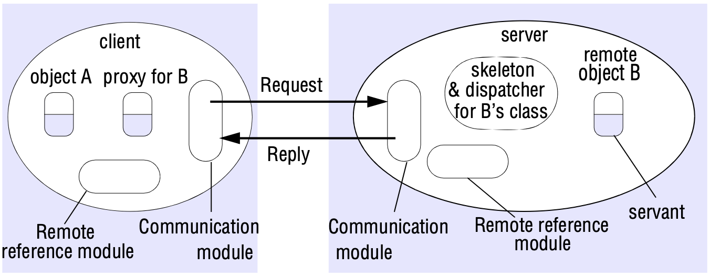

# 5 REMOTE INVOCATION

[TOC]

## Introduction

*Middleware layers*

## Request-reply protocols

*Request-reply communication*

*Operations of the request-reply protocol*

**Message identifiers**. Any scheme that involves the management of messages to provide additional properties such as reliable message delivery or request-reply communication requires that each message have a unique message identifier by which it may be referenced. A message identifier consists of two parts:

1. a *requestId*, which is taken from an increasing sequence of integers by the sending process;
2. an identifier for the sender process.

**Failure model of the request-reply protocol**. If the three primitives *doOperation*, *getRequest* and *sendReply* are implemented over UDP datagrams, then they suffer from the same communication failures. That is:

- They suffer from omission failures.
- Messages are not guaranteed to be delivered in sender order.

**Styles of exchange protocols**. Three protocols, that produce differing behaviours in the presence of communication failures are used for implementing various types of request behaviour. They were originally identified by Spector:

- the $request(R)$ protocol;
- the $request-reply(RR)$ protocol;
- the $request-reply-acknowledge\ reply(RRA)$ protocol.

## Remote procedure call

### Design issues for RPC

**Interfaces in distributed systems**: In a distributed program, the modules can run in separate processes. In the client-server model, in particular, each server provides a set of procedures that are available for use by clients.

There are a number of benefits to programming with interfaces in distributed systems, stemming from the important separation between interface and implementation:

- As with any form of modular programming, programmers are concerned only with the abstraction offered by the service interface and need not be aware of implementation details.
- Extrapolating to (potentially heterogeneous) distributed systems, programmers also do not need to know the programming language or underlying platform used to implement the service (an important step towards managing heterogeneity in distributed systems).
- This approach provides natural support for software evolution in that implementations can change as long as long as the interface (the external view) remains the same. More correctly, the interface can also change as long as it remains compatible with the original.

The definition of service interfaces is influenced by the distributed nature of the underlying infrastructure:

- It is not possible for a client module running in one process to access the variables in a module in another process.
- The parameter-passing mechanisms used in local procedure calls are not suitable when the caller and procedure are in different processes.
- Another difference between local and remote modules is that addresses in one process are not valid in another remote one. Therefore, addresses cannot be passed as arguments or returned as results of calls to remote modules.

### Implementation of RPC

*Role of client and server stub procedures in RPC*

## Remote method invocation

*Remote method invocation* (RMI) is closely related to RPC, the commonalities between RMI and RPC are as follows:

- They both support programming with interfaces, with the resultant benefits that stem from this approach.
- They are both typically constructed on top of request-reply protocols and can offer a range of call semantics such as *at-least-once* and *at-most-once*.
- They both offer a similar level of transparency - that is, local and remote calls emply the same syntax but remote interfaces typically expose the distributed nature of the underlying call.

The following differences lead to added expressiveness when it comes to the programming of complex distributed applications and services:

- The programmer is able to use the full expressive power of object-oriented programming in the development of distributed systems software, including the use of objects, classes and inheritance, and can also employ related object-oriented design methodologies and associated tools.
- Building on the concept of object identity in object-oriented systems, all objects in an RMI-based system have unique object references (whether they are local or remote), such object references can also be passed as parameters, thus offering significantly richer parameter-passing semantics than in RPC.

### Design issues for RMI

*Remote and local method invocations*

*A remote object and its remote interface*

*Instantiation of method objects*

### Implementation of RMI

*The role of proxy and skeleton in remote method invocation*