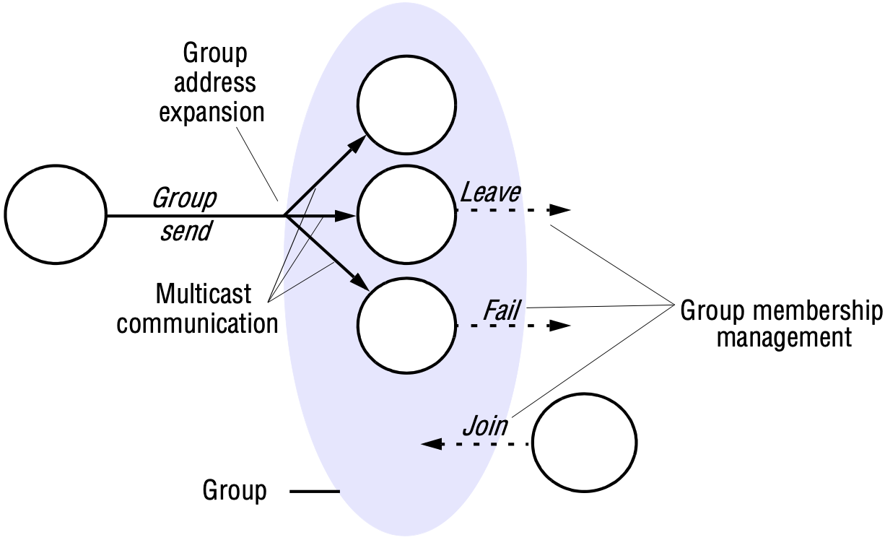
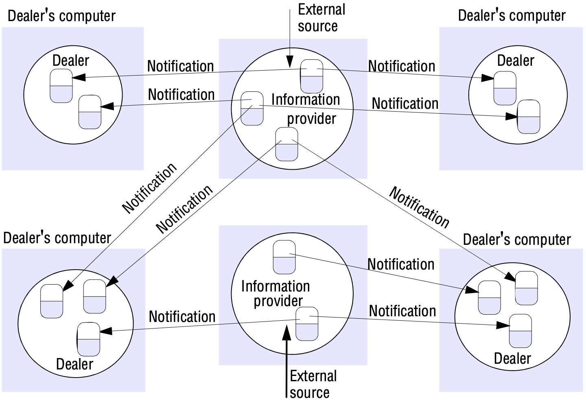
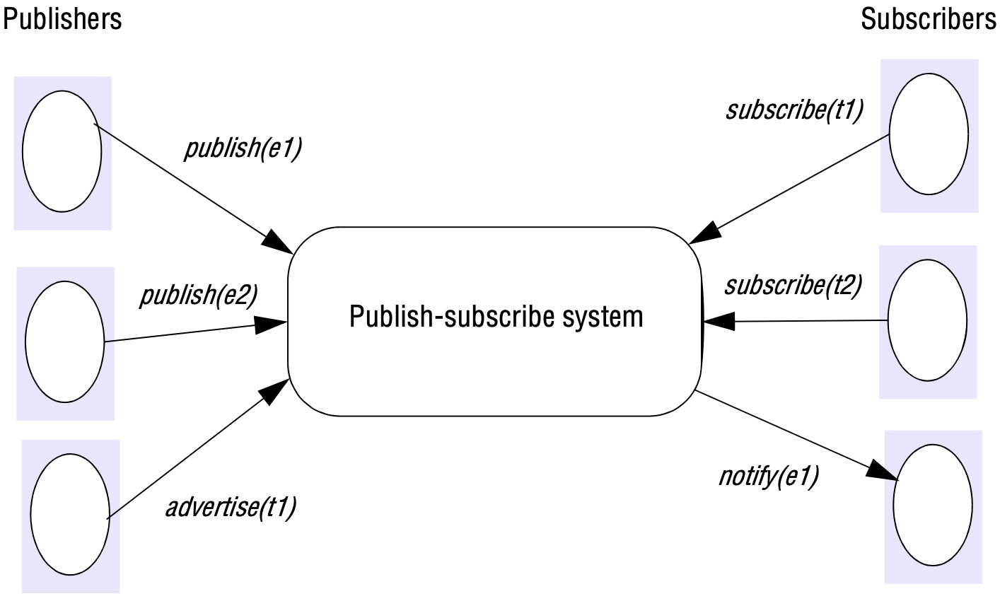
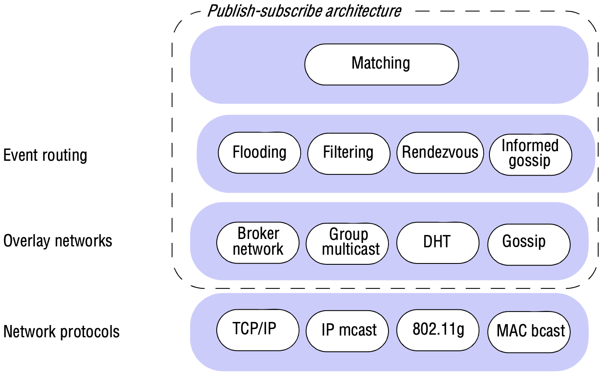
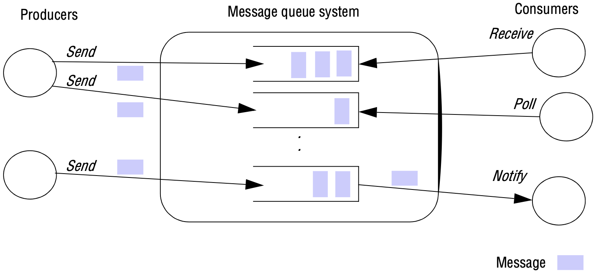
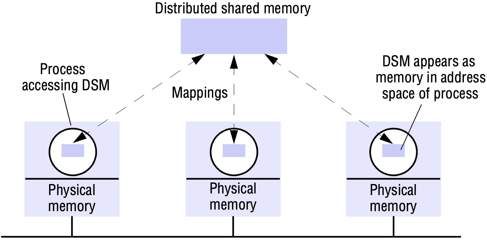

# 6 INDIRECT COMMUNICATION

[TOC]

## Introduction

*Space and time coupling in distributed systems*

## Group communication

### Implementation issues

That of *agreement*, stating that if the message is delivered to one process, then it is delivered to all processes in the group.

Group communication services offer *ordered multicast*, with the option of one or more of the following properties (wth hybrid solutions also possible):

- *FIFO ordering*: First-in-first-out (FIFO) ordering (also referred to as source ordering) is concerned with preserving the order from the perspective of a sender process, in that if a process sends one message before another, it will be delivered in this order at all processes in the group.
- *Causal ordering*: Causal ordering takes into account causal relationships between messages, in that if a message *happens before* another message in the distributed system, this so-called causal relationship will be preserved in the delivery of the associated messages at all processes.
- *Total ordering*: In total ordering, if a message is delivered before another message at one process, then the same order will be preserved at all processes.

*The role of group membership management*

## Publish-subscribe systems

A publish-subscribe system is a system where *publishers* publish structured events to an event service, and *subscribers* express interest in particular events through *subscriptions,* which can be arbitrary patterns over the structured events.

The task of the publish-subscribe system is to match subscriptions against published events and ensure the correct delivery of *event notifications*.

*Dealing room system*

Publish-subscribe systems have two main characteristics:

- *Heterogeneity*: When event notifications are used as a means of communication, components in a distributed system that were not designed to interoperate can be made to work together. All that is required is that event-generating objects publish the types of events they offer, and that other objects subscribe to patterns of events and provide an interface for receiving and dealing with the resultant notifications.
- *Asynchronicity*: Notifications are sent asynchronously by event-generating publishers to all the subscribers that have expressed an interest in them to prevent publishers needing to synchronize with subscribers - publishers and subscribers need to be decoupled.

### The programming model

*The publish-subscribe paradigm*

As mentioned above, the expressiveness of publish-subscribe systems is determined by the subscription (filter) model, with a number of schemes defined and considered here in increasing order of sophistication:

- *Channel-based*: In this approach, publishers publish events to named channels and subscribers then subscribe to one of these named channels to receive all events sent to that channel.
- *Topic-based (also referred to as subject-based)*: In this approach, we make the assumption that each notification is expressed in terms of a number of fields, with one field denoting the topic.
- *Content-based*: Content-based approaches are a generalization of topic-based approaches, allowing the expression of subscriptions over a range of fields in an event notification.
- *Type-based*: These approaches are intrinsically linked object-based approaches, where objects have a specified type. In type-based approaches, subscriptions are defined in terms of types of events, and matching is defined in terms of types or subtypes of the given filter.

### Implementation issues

*The architecture of publish-subscribe systems*

- *Flooding*: The simplest approach is based on *flooding*, that is, sending an event notification to all nodes in the network and then carrying out the appropriate matching at the subscriber end.
- *Filtering*: One principle that underpins many approaches is to apply *filtering* in the network of brokers. This is referred to as *filtering-based routing*. Brokers forward notifications through the network only where there is a path to a valid subscriber.
- *Rendezvous*: To understand this approach, it is necessary to view the set of all possible events as an event space and to partition responsibility for this event space between the set of brokers in the network. In particular, this approach defines rendezvous nodes, which are broker nodes responsible for a given subset of the event space.

## Message queues

*Message queues* (or more accurately, distributed message queues) are a further important category of indirect communication systems. Whereas groups and publish-subscribe provide a one-to-many style of communication, message queues provide a *point-to-point* service using the concept of a message queue as an indirection, thus achieving the desired properties of space and time uncoupling.

### The programming model

The programming model offered by message queues is very simple. It offers an approach to communication in distributed systems through queues. In particular, producer processes can *send* messages to a specific queue and other (consumer) processes can then receive messages from this queue. Three styles of receive are generally supported:

- a *blocking receive*, which will block until an appropriate message is available;
- a *non-blocking receive* (a polling operation), which will check the status of the queue and return a message if available, or a not available indication otherwise;
- a *notify* operation, which will issue an event notification when a message is available in the associated queue.

*The message queue paradigm*

## Shared memory approaches

### Distributed shared memory

Distributed shared memory (DSM) is an abstraction used for sharing data between computers that do not share physical memory.

*The distributed shared memory abstraction*

### Tuple space communication

In the tuple space programming model, processes communicate through a tuple space - a shared collection of tuples.

*The tuple space abstraction*

