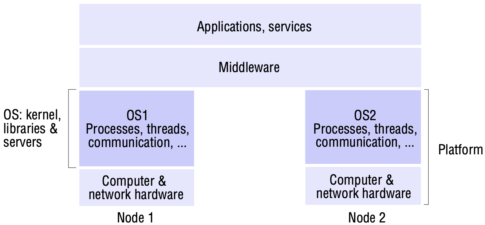
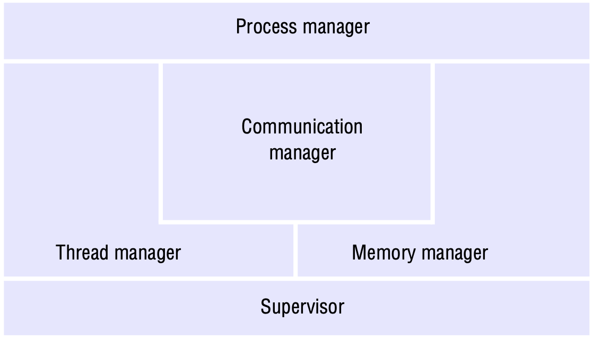
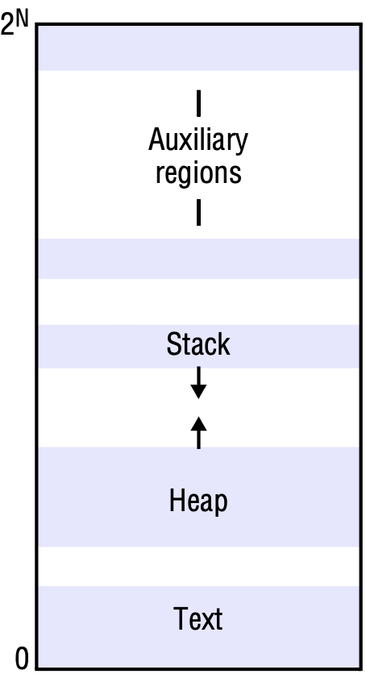
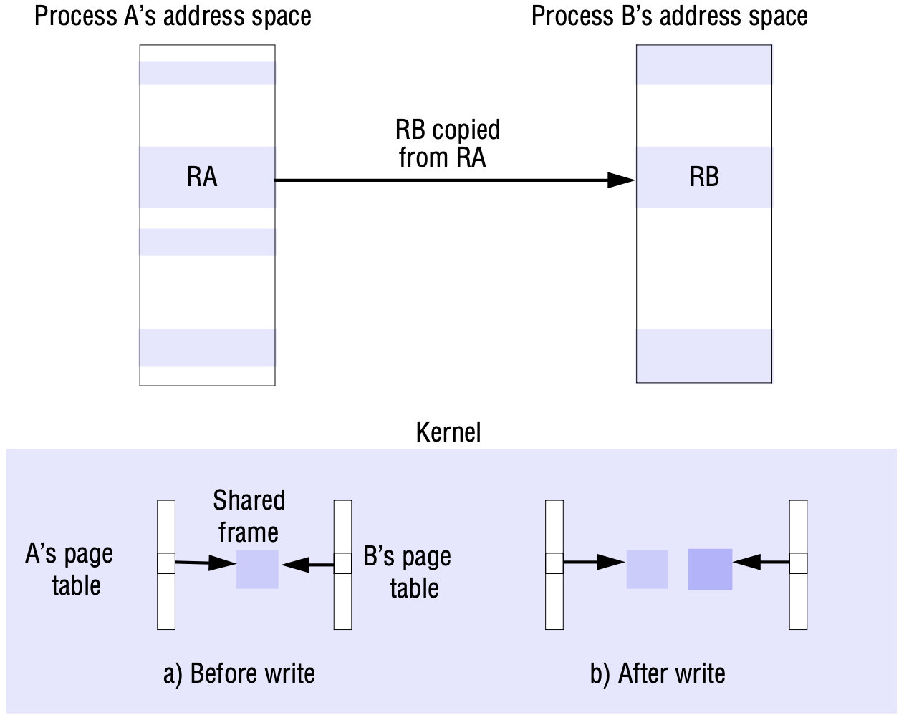
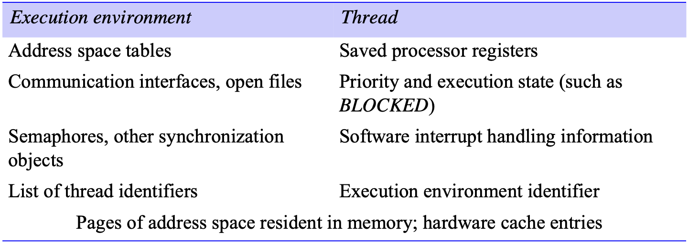
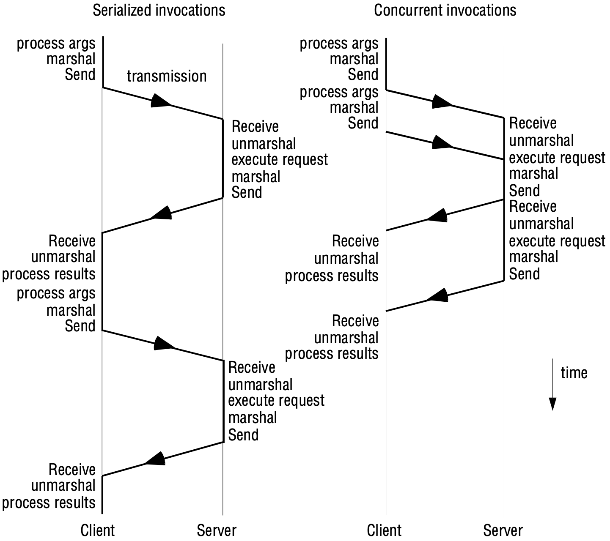
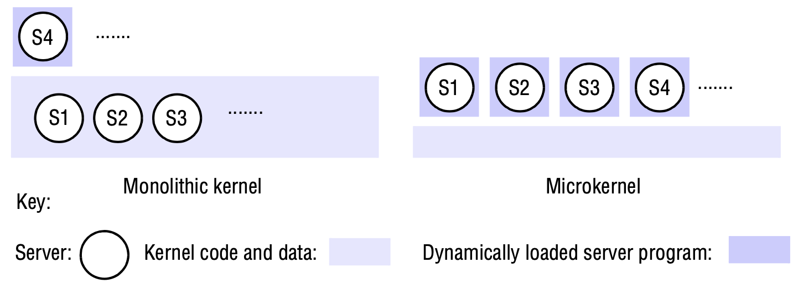

# 7 OPERATING SYSTEM SUPPORT

[TOC]

## Introduction

One could envisage an operating system in which users are never concerned with where their programs run or the location of any resources. There is a *single system image*.

## The operating system layer

*System layers*

Kernels and server processes are the components that manage resources and present clients with an interface to the resources. As such, we require at least the following of them:

- *Encapsulation*: They should provide a useful service interface to their resources.
- *Protection*: Resources require protection from illegitimate accesses.
- *Concurrent processing*: Clients may share resources and access them concurrently. Resource managers are responsible for achieving concurrency transparency.

*Core OS functionality*

The core OS components and their responsibilities are:

- *Process manager*: Creation of and operations upon processes. A process is a unit of resource management, including an address space and one or more threads.
- *Thread manager*: Thread creation, synchronization and scheduling. Threads are schedulable activities attached to processes.
- *Communication manager*: Communication between threads attached to different processes on the same computer. Some kernels also support communication between threads in remote processes. Other kernels have no notion of other computers built into them, and an additional service is required for external communication.
- *Memory manager*: Management of physical and virtual memory.
- *Supervisor*: Dispatching of interrupts, system call traps and other exceptions; control of memory management unit and hardware caches; processor and floating-point unit register manipulations.

## Protection

**Kernels and protection**. The kernel is a program that is distinguished by the fact that it remains loaded from system initialization and its code is executed with complete access privileges for the physical resources on its host computer. In particular, it can control the memory management unit and set the processor registers so that no other code may access the machine's physical resources except in acceptable ways.

Most processors have a hardware mode register whose setting determines whether privileged instructions can be executed, such as those used to determine which protection tables are currently employed by the memory management unit. A kernel process executes with the processor in *supervisor*(privileged) mode; the kernel arranges that other processes execute in *user*(unprivileged) mode.

The kernel also sets up *address spaces* to protect itself and other processes from the accesses of an aberrant process, and to provide processes with their required virtual memory layout. An address space is a collection of ranges of virtual memory locations, in each of which a specified combination of memory access rights applies, such as read-only and read-write. A process cannot access memory outside its address space.

When a process executes application code, it executes in a distinct user-level address space for that application; when the same process executes kernel code, it executes in the kernel's address space. The process can safely transfer from a user-level address space to the kernel's address space via an exception, such as an interrupt or a *system call trap* - the invocation mechanism for resources managed by the kernel.

Programs pay a price for protection. Switching between address spaces may take many processor cycles, and a system call trap is a more expensive operation than a simple procedure or method call.

## Processes and threads

A process consists of an execution environment together with one or more threads. A *thread* is the operating system abstraction of an activity. An *execution environment* is the unit of resource management: a collection of local kernel-managed resources to which its threads have access. An execution environment primarily consists of:

- an address space;
- Thread synchronization and communication resources, such as semaphores and communication interfaces;
- Higher-level resources, such as open files and windows.

### Address spaces

*Address space*

A region is an area of contiguous virtual memory that is accessible by the threads of the owning process. Regions do not overlap. Note that we distinguish between the regions and their contents. Each region is specified by the following properties:

- its extent (lowest virtual address and size);
- read/write/execute permissions for the process's threads;
- whether it can be grown upwards or downwards.

### Creation of a new process

**Choice of process host**. The choice of the node at which the new process will reside - the process allocation decision - is a matter of policy. In general, process allocation policies range from always running new processes at their originator's workstation to sharing the processing load between a set of computers. `Eager et al` distinguish two policy categories for load sharing:

- The *transfer policy* determines whether to situate a new process locally or remotely. This may depend, for example, on whether the local node is lightly or heavily loaded.
- The *location policy* determines which node should host a new process selected for transfer. This decision may depend on the relative loads of nodes, on their machine architectures, or on any specialized resources they may possess.

Copy-on-write is a general technique:

*Copy-on-write*

### Threads

*Alternative server threading architectures*

State associated with execution environments and threads:

A *context switch* is the transition between contexts that takes place when switching between threads, or when a single thread makes a system call or takes another type of exception. It involves the following:

- the saving of the processor's original register state, and the loading of the new state;
- in some cases, a transfer to a new protection domain - this is known as a *domain transition*.

**Thread scheduling**. An important distinction is between preemptive and non-preemptive scheduling of threads. In *preemptive scheduling*, a thread may be suspended at any point to make way for another thread, even when the preempted thread would otherwise continue running. In *non-preemptive scheduling* (sometimes called *coroutine scheduling*), a thread runs until it makes a call to the threading system, when the system may deschedule it and schedule another thread to run.

When no kernel support for multi-threaded processes is provided, a user-level threads implementation suffers from the following problems:

- The threads within a process cannot take advantage of a multiprocessor.
- A thread that takes a page fault blocks the entire process and all threads within it.
- Threads within different processes cannot be scheduled according to a single scheme of relative prioritization.

, user-level threads implementations, on the other hand, have significant advantages over kernel-level implementations:

- Certain thread operations are significantly less costly.
- Given that the thread-scheduling module is implemented outside the kernel, it can be customized or changed to suit particular application requirements. Variations in scheduling requirements occur largely because of application-specific considerations such as the real-time nature of multimedia processing.
- Many more user-level threads can be supported than could reasonably be provided by default by a kernel.

## Communication and invocation

*Times for serialized and concurrent invocations*

## Operating system architecture

An open distributed system should make it possible to:

- run only that system software at each computer that is necessary for it to carry out its particular role in the system architecture - system software requirements can vary between.
- allow the software (and the computer) implementing any particular service to be changed independently of other facilities;
- allow for alternatives to the same service to be provided when this is required to suit different users or applications;
- introduce new services without harming the integrity of existing ones.

*Monolithic kernel and microkernel*

