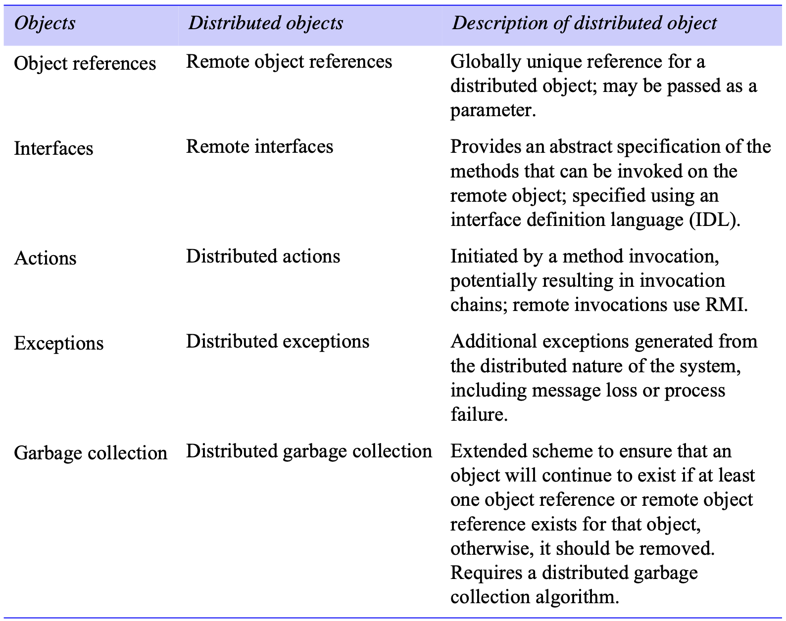
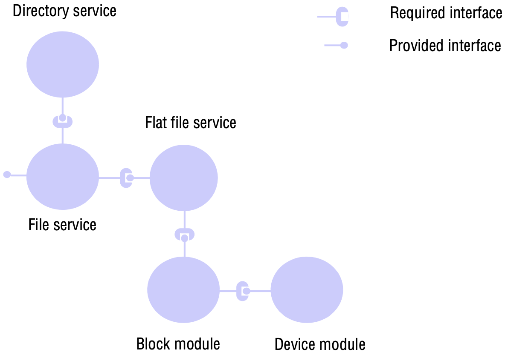

# 8 DISTRIBUTED OBJECTS AND COMPONENTS

[TOC]

## Introduction

**Distributed object middleware**. The key characteristic of distributed objects is that they allow you to adopt an object-oriented programming model for the development of distributed systems and, through this, hide the underlying complexity of distributed programming. This relatively simple approach has a number of important benefits, including the following:

- The *encapsulation* inherent in object-based solutions is well-suited to distributed programming.
- The related property of *data abstraction* provides a clean separation between the specification of an object and its implementation, allowing programmers to deal solely in terms of interfaces and not be concerned with implementation details such as the programming language and operating system used.
- This approach also lends itself to more *dynamic* and *extensible* solutions.

**Component-based middleware**. Component-based solutions have been developed to overcome a number of limitations that have been observed for application developers working with distributed object middleware:

- *Implicit dependencies*: Object interfaces do not describe what the implementation of an object depends on, making object-based systems difficult to develop (especially for third-party developers) and subsequently manage.
- *Programming complexity*: Programming distributed object middleware leads to a need to master many low-level details associated with middleware implementations.
- *Lack of separation of distribution concerns*: Application developers are obliged to consider details of concerns such as security, failure handling and concurrency, which are largely similar from one application to another.
- *No support for deployment*: Object-based middleware provides little or no support for the deployment of (potentially complex) configurations of objects.

## Distributed objects

*Distributed objects*

It must be stressed that programming with distributed objects is both different from and significantly more complex than standard object-oriented programming, as summarized below:

1. The differences
   - *Class* is a fundamental concept in object-oriented languages, but does not feature so prominently in distributed object middleware.
   - The style of *inheritance* is significantly different from that offered in most object-oriented languages.
2. The added complexities
   - *Inter-object communication*: A distributed object middleware framework must offer one or more mechanisms for objects to communicate in the distributed environment. This is normally provided by remote method invocation, although distributed object middleware often supplements this with other communications paradigms. CORBA provides an event service and an associated notification service, both implemented as services on top of the core middleware.
   - *Lifecycle management*: Lifecycle management is concerned with the creation, migration and deletion of objects, with each step having to deal with the distributed nature of the underlying environment.
   - *Activation and deactivation*: In non-distributed implementations, it can often be assumed that objects are active all the time while the process that contains them runs. In distributed systems, however, this cannot be assumed as the numbers of objects my be very large, and hence it would be wasteful of resources to have all objects available at any time. In addition, nodes hosting objects may be unavailable for periods of time. Activation is the process of making an object active in the distributed environment by providing the necessary resources for it to process incoming invocations - effectively, locating the object in virtual memory and giving it the necessary threads to execute. Deactivation is then the opposite process, rendering an object temporarily unable to process invocations.
   - *Persistence*: Objects typically have state, and it is important to maintain this state across possible cycles of activation and deactivation and indeed system failures. Distributed object middleware must therefore offer persistency management for stateful objects.
   - *Additional services*: A comprehensive distributed object middleware framework must also provide support for the range of distributed system services.

## From objects to components

*Components*: A software component is a unit of composition with contractually specified interfaces and explicit context dependencies only.

A given component specifies both its interfaces provided to the outside world and its dependencies on other components in the distributed environment. The dependencies are also represented as interfaces. More specifically, a component is specified in terms of a *contract*, which includes:

- a set of *provided interfaces* - that is, interfaces that the component offers as services to other components;
- a set of *required interfaces* - that is, the dependencies that this component has in terms of other components that must be present and connected to this component for it to function correctly.

In a given component configuration, every required interface must be bound to a provided interface of another component. This is also referred to as a *software architecture* consisting of components, interfaces and connections between interfaces.

*An example software architecture *