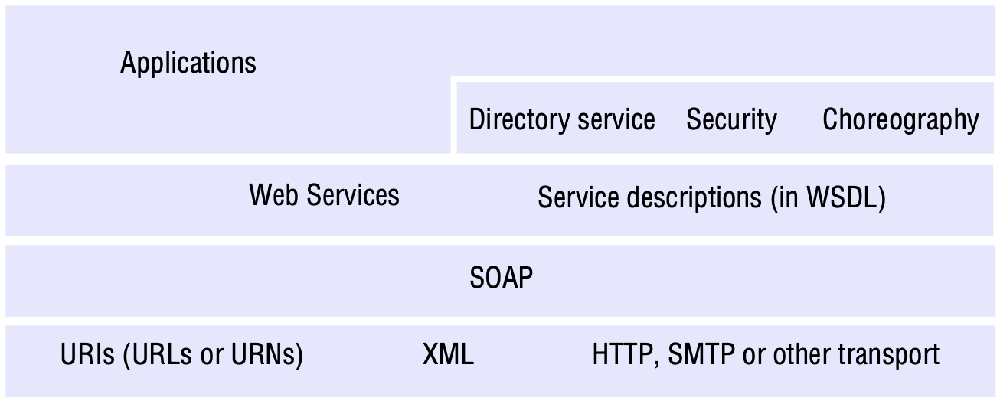
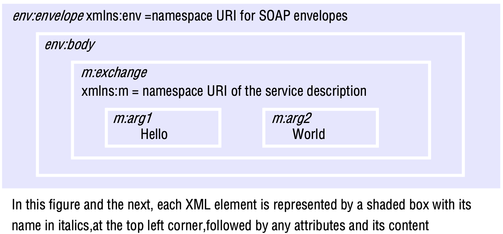

# WEB SERVICES

[TOC]

## Introduction

*Web services infrastructure and components*

## Web services

**Combination of web services**. Providing an interface for a web service allows its operations to be combined with those of other services to provide new functionality.

**Loose coupling**. In the context of web services, loose coupling refers to minimizing the dependencies between services in order to have a flexible underlying architecture (reducing the risk that a change in one service will have a knock-on effect on other services). Further enahanced by a number of additional features:

- Programming with interfaces provides one level of loose coupling by separating the interface from its implementation (and also supports important areas of heterogeneity)
- There is a trend towards simple, generic interfaces in distributed systems and this is exemplified by the minimal interface offered by the World Wide Web and the REST approach in web services.
- Web services can be used with a variety of communication paradigms, including request-reply communication, asynchronous messaging or indeed indirect communication paradigms. The level of coupling is directly affected by this choice.

### SOAP

SOAP is designed to eanble both client-server and asynchronous interaction over the Internet. It defines a scheme for using XML to represent the contents of request and reply messages as well as a scheme for the communication of documents. 

The SOAP specification states:

- How XML is to be used to represent the contents of individual messages;
- How a pair of single messages can be combined to produce a request-reply pattern;
- The rules as to how the recipients of messages should process the XML elements that they contain;
- How HTTP and SMTP should be used to communicate SOAP messages. It is expected that future versions of the specification will define how to use other transport protocols.

*Example of a simple request without headers*

**SOAP headers**. Message headers are intended to be used by intermediaries to add to the service that deals with the message carried in the corresponding body. However, two aspects of this usage are left unclear in the SOAP specification:

1. How the headers will be used by any particular higher middleware service.
2. How the messages will be routed via a set of intermediaries to the ultimate recipient.

**Transport of SOAP messages**. A transport protocol is required to send a SOAP message to its destination. SOAP messages are independent of the type of transport used - their envelopes contain no reference to the destination address. HTTP (or whatever protocol is used to transport a SOAP message) is left to specify the destination address.

## Service descriptions and IDL for web services

Interface definitions are needed to allow clients to communicate with services.