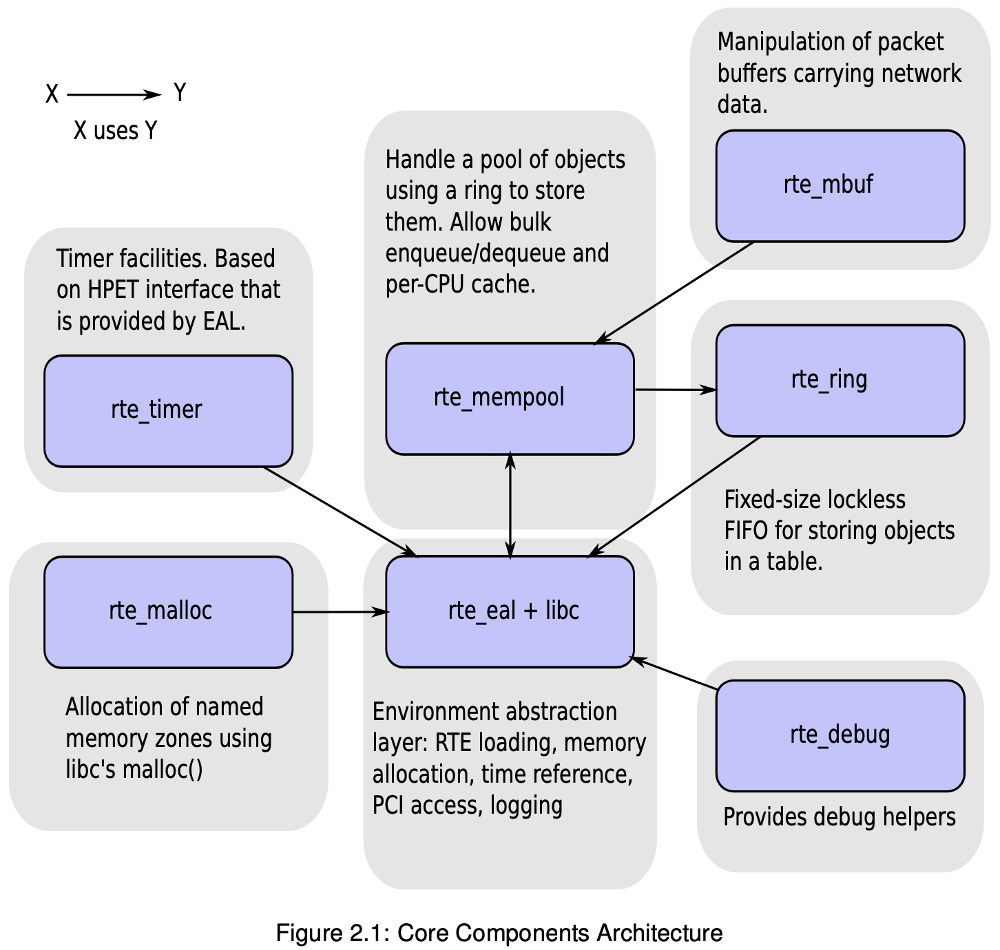

# CHAPTER2 OVERVIEW

[TOC]

## Environment

For DPDK applications, two environmental variables (`RTE_SDK` and `RTE_TARGET`) must be configured before compiling the applications.

## Core Components

