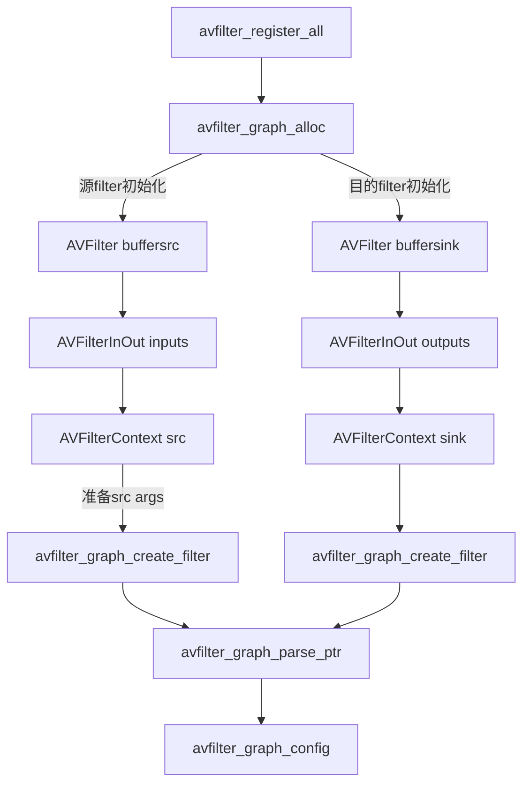

# 第十章 FFmpeg接口libavfilter的使用
libavfilter是FFmpeg中一个很重要的模块，其提供了很多音视频的滤镜，通过合理使用这些滤镜，可以达到事半功倍的效果;

## filtergraph和filter简述
### 音频滤镜

1. 音频滤镜

| 序号 | 音频滤镜名称      | 滤镜作用                                                     |
| ---- | ----------------- | ------------------------------------------------------------ |
| 1    | acompressor       | 主要用于减少声音信号的动态范围                               |
| 2    | acrossfade        | 交叉音频淡入淡出                                             |
| 3    | acrusher          | 降低声音保真度                                               |
| 4    | adelay            | 滞后一个或多个声道时间                                       |
| 5    | aecho             | 声音增加回声                                                 |
| 6    | aemphasis         | 声音波形滤镜                                                 |
| 7    | afade             | 声音淡入淡出                                                 |
| 8    | afftfilt          | 从频域上对采样应用任意表达式                                 |
| 9    | aformat           | 强制设置输入音频的输出格式                                   |
| 10   | agate             | 低通滤波方式音频降噪                                         |
| 11   | alimiter          | 防止声音信号大小超过预定的阀值                               |
| 12   | allpass           | 改变声音的频率和相位的关系                                   |
| 13   | aloop             | 声音采样循环                                                 |
| 14   | amerge            | 合并多个音频流形成一个多通道流                               |
| 15   | amix              | 混合多个音频流到一个输出音频流                               |
| 16   | anequalizer       | 每个声道进行高位参数多波段补偿                               |
| 17   | anull             | 将原始声音无损的传递给输出端                                 |
| 18   | apad              | 声音末尾填充静音数据                                         |
| 19   | aphaser           | 在输入声音上增加相位调整效果                                 |
| 20   | apulsator         | 根据低频振荡器改变左右声道的音量                             |
| 21   | aresample         | 对输入音频进行重采样                                         |
| 22   | areverse          | 翻转一个声音片段                                             |
| 23   | asetrate          | 不改变PCM数据，而修改采样率（慢放/快放）                     |
| 24   | ashowinfo         | 显示一行数据，用于展示每帧音频的各种信息，如序号,pts,fmt等   |
| 25   | astats            | 在时间域上，显示声道的统计信息                               |
| 26   | atempo            | 调整声音播放速度[0.5~2.0]                                    |
| 27   | atrim             | 对输入音频进行修剪，从而使输出只包含一部分原始音频           |
| 28   | bandpass          | 增加一个两级的，巴特沃斯带通滤波器                           |
| 29   | bandreject        | 增加一个量级的，巴特沃斯带组滤波器                           |
| 30   | bass              | 增加或减少音频的低频部分                                     |
| 31   | biquad            | 根据指定的系数增加一个双二阶IIR滤波器                        |
| 32   | bs2b              | Bauer立体声到立体声变换，用于改善带耳机的听觉感受            |
| 33   | channelmap        | 将通道重新定位（map）到新的位置                              |
| 34   | channelsplit      | 从输入音频流中分离每个通道到一个独立的输出流中               |
| 35   | chorus            | 对声音应用副唱效果，就像是有极短延时的回声效果               |
| 36   | compand           | 精简或者扩大声音的动态范围                                   |
| 37   | compensationDelay | 延时补偿                                                     |
| 38   | crystalizer       | 扩展声音动态范围的简单算法                                   |
| 39   | dcshift           | 对声音应用直流偏移（DC shift），主要是用于从声音中移除直流偏移（可能会在录制环节由硬件引起） |
| 40   | dynaudnorm        | 动态声音标准化，用于把声音峰值提升到一个目标等级，通过对原始声音进行某种增益来达到 |
| 41   | earwax            | 戴耳机时，声音听起来更随和                                   |
| 42   | equalizer         | 应用一个两极均等化滤镜，在一个范围内的频率会被增加或减少     |
| 43   | firequalizer      | 应用FIR均衡器                                                |
| 44   | flanger           | （弗兰基）镶边效果                                           |
| 45   | hdcd              | 解码高分辨率可兼容的数字信号数据                             |
| 46   | highpass          | 通过3db频率点，应用高通滤波器                                |
| 47   | join              | 把多个输入流连接成单一多通道流                               |
| 48   | ladspa            | 加载LADSPA（Linux声音开发者简单插件API）插件                 |
| 49   | loudnorm          | EBU R128响度标准化，包含了线性和动态标准化方法               |
| 50   | lowpass           | 通过3db频率点，应用低通滤波器                                |
| 51   | pan               | 通过制定的增益等级，来混合声音通道                           |
| 52   | replaygain        | 回播增益扫描器，主要是展示track_gain和track_peak值，对数据无影响 |
| 53   | resample          | 改变声音采样的格式，采样率和通道数                           |
| 54   | rubberband        | 使用librubberband进行实践拉伸和变调                          |
| 55   | sidechaincompress | 通过第二个输入信号来压缩侦测信号，这个滤镜会接收两个输入流而输出一个流 |
| 56   | sidechaingate     | 在把信号发送给增益衰减模块之前，过滤侦测信号                 |
| 57   | silencedetect     | 静音检测                                                     |
| 58   | silenceremove     | 从声音的开始，中间和结尾处移除静音数据                       |
| 59   | sofalizer         | 使用HRTFS（头部相关的变换函数）来创建虚拟扬声器，通过耳机给听者一种立体听觉效果 |
| 60   | stereotools       | 管理立体声信号的工具库                                       |
| 61   | stereowiden       | 增强立体声效果                                               |
| 62   | treble            | 增加或消减声音高频部分，通过一个两极shelving滤镜             |
| 63   | tremolo           | 正弦振幅调制                                                 |
| 64   | vibrato           | 正弦相位调制                                                 |
| 65   | volume            | 调制输入声音音量                                             |
| 66   | volumedetect      | 侦测输入流的音量大小，当流结束时，打印出相关的统计信息       |

2. 音频Source滤镜

   | 序号 | 音频滤镜名称 | 滤镜作用                                                     |
   | ---- | ------------ | ------------------------------------------------------------ |
   | 1    | abuffer      | 以某个格式缓存声音帧，用于后续滤镜链                         |
   | 2    | aevalsrc     | 根据指定的表达式来产生一个声音信号，一个表达式对应一个通道   |
   | 3    | anullsrc     | 空的声音源滤镜，返回未处理的声音帧，作为一种模板使用，用于给分析器或者调试器提供服务，或者作为一些滤镜的源 |
   | 4    | flite        | 合成声音使用libflite，启用这个功能，需要用 --enable-libflite来配置FFmpeg，这个库线程不安全。这个滤镜支持从文本合成为声音 |
   | 5    | anoisesrc    | 产生声音噪声信号                                             |
   | 6    | sine         | 通过正弦波振幅的1/8来创造一个声音源                          |

3. 音频Sink滤镜

   | 序号 | 音频滤镜名称 | 滤镜作用                                                     |
   | ---- | ------------ | ------------------------------------------------------------ |
   | 1    | abuffersink  | 缓存声音帧，在滤镜链尾端使用                                 |
   | 2    | anullsink    | 空的Sink滤镜，不处理输入数据，主要是作为一个模板，为其他分析器/调试工具提供源数据 |

### 视频滤镜

1. 视频滤镜

   todo

2. 视频Source滤镜

   | 序号 | 视频滤镜名称 | 滤镜作用                                                     |
   | ---- | ------------ | ------------------------------------------------------------ |
   | 1    | buffer       | 预缓存帧数据                                                 |
   | 2    | cellauto     | 构造元胞自动机模型                                           |
   | 3    | Coreimagesrc | OS-X上使用CoreImage产生视频源                                |
   | 4    | mandelbrot   | 构造曼德尔布罗特集分形                                       |
   | 5    | mptestsrc    | 构造各种测试模型                                             |
   | 6    | frei0r_src   | 提供frei0r源                                                 |
   | 7    | life         | 构造生命模型                                                 |
   | 8    | allrgb       | 返回4096x4096大小的，包含所有RGB色的帧                       |
   | 9    | allyuv       | 返回4096x4096大小的，包含所有YUV色的帧                       |
   | 10   | color        | 均匀色输出                                                   |
   | 11   | haldclutsrc  | 输出Hald CLUT，参照haldclut滤镜                              |
   | 12   | nullsrc      | 输出未处理视频帧，一般用与分析和调试                         |
   | 13   | rgbtestsrc   | 构造RGB测试模型                                              |
   | 14   | smptebars    | 构造彩色条纹模型（依据SMPTE Engineering Guideline EG 1-1990） |
   | 15   | smptehdbars  | 构造彩色条纹模型（依据SMPTE RP 219-2002）                    |
   | 16   | testsrc      | 构造视频测试模型                                             |
   | 17   | testsrc2     | 同testsrc，不同之处是其支持更多的像素格式                    |
   | 18   | yuvtestsrc   | 构造YUV测试模型                                              |
   
3. 视频Sink滤镜

   | 序号 | 视频滤镜名称 | 滤镜作用                               |
   | ---- | ------------ | -------------------------------------- |
   | 1    | buffersink   | 预缓存帧，用于传递给滤镜图表尾端       |
   | 2    | nullsink     | 什么都不做，仅仅是方便分析或调试器使用 |

## avfilter流程图




## 使用滤镜加LOGO操作
```c++
// 注册FFmpeg的滤镜操作接口
int main(int argc, char *argv[])
{
	avfilter_register_all();
	return 0;
}

// 获得滤镜处理的源
AVFilter *buffersrc = avfilter_get_by_name("buffer");
AVFilter *buffersink = avfilter_get_by_name("buffersink");
AVFilterInOut *outputs = avfilter_inout_alloc();
AVFilterInOut *inputs = avfilter_inout_alloc();

// 处理AVfilterGraph
AVFilterGraph *filter_graph;
filter_graph = avfilter_graph_alloc();
if (!outputs || !inputs || !filter_graph) {
	ret = AVERROR(ENOMEM);
}

// 创建AVFilterContext
AVFilterContext *buffersink_ctx;
AVFilterContext *buffersrc_ctx;
snprintf(args, sizeof(args), "video_size=%dx%d:pix_fmt=%d:time_base=%d/%d:pixel_aspect=%d/%d",
				dec_ctx->width, dec_ctx->height, dec_ctx->pix_fmt, time_base.num, time_base.den,
				dec_ctx->sample_aspect_ratio.num, dec_ctx->sample_aspect_ratio.den);
ret = avfilter_graph_create_filter(&buffersrc_ctx, buffersrc, "in", args, NULL, filter_graph);
if (ret < 0) {
	av_log(NULL, AV_LOG_ERROR, "cannot create buffer source\n");
}
/* buffer video sink: to terminate the filter chain. */
ret = avfilter_graph_create_filter(&buffersink_ctx, buffersink, "out", NULL, NULL, filter_graph);
if (ret < 0) {
	av_log(NULL, AV_LOG_ERROR, "cannot create buffer sink\n");
}

// 设置其他参数
ret = av_opt_set_int_list(buffersink_ctx, "pix_fmts", AV_PIX_FMT_YUV420P, AV_PIX_FMT_NONE, AV_OPT_SEARCH_CHILDREN);
if (ret < 0) {
	av_log(NULL, AV_LOG_ERROR, "cannot set output pixel format\n");
}

// 建立滤镜解析器
const char * filters_descr = "movie=logo.jpg[logo];[logo]colorkey=white:0.2:0.5[alphawm];[in][alphawn]overlay=20:20[out]";

outputs->name = av_strdup("in");
outputs->filter_ctx = buffersrc_ctx;
outputs->pad_idx = 0;
outputs->next = NULL;

inputs->name = av_strdup("out");
inputs->filter_ctx = buffersink_ctx;
inputs->pad_idx = 0;
inputs->next = NULL;

avfilter_graph_parse_ptr(filter_graph, filters_descr, &inputs, &outputs, NULL);
avfilter_graph_config(filter_graph, NULL);

// 数据解码
if (av_buffersrc_add_frame_flags(buffersrc_ctx, frame, AV_BUFFERSRC_FLAG_KEEP_REF) < 0) {
	av_log(NULL, AV_LOG_ERROR, "error while feeding the filtergrpah\n");
}

// 获取数据
while(1) {
	ret = av_buffersink_get_frame(buffersink_ctx, filt_frame);
	if (ret == AVERROR(EAGAIN) || ret == AVERROR_EOF)
		break;
	if (ret < 0)
		goto end;
	av_image_copy(video_dst_data, video_dst_linesize,
					(const uint8_t **)(frame->data), frame->linesize, AV_PIX_FMT_YUV420P,
					frame->width, frame->height);
	fwrite(video_dst_data[0], 1, video_dst_bufsize, video_dst_file);
	av_frame_unref(filt_frame);
} 
av_frame_unref(frame);
```
