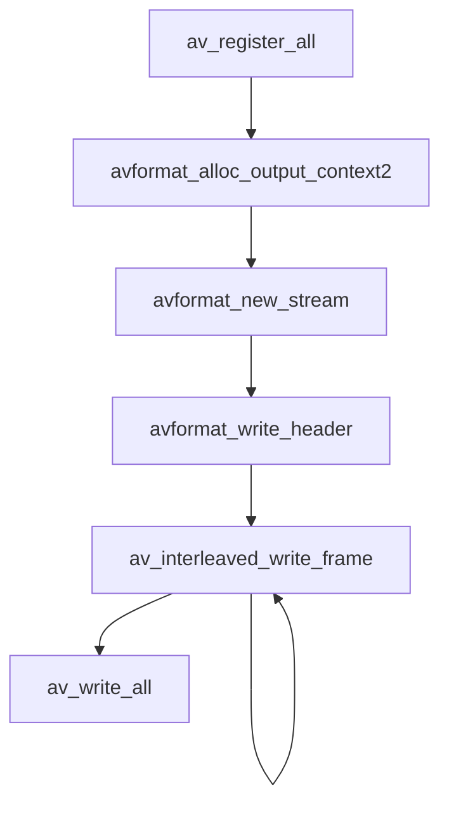
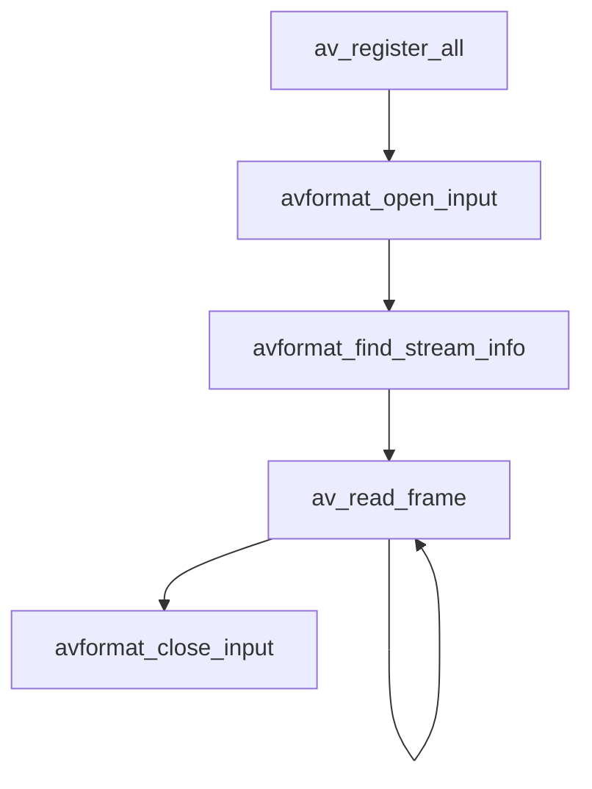
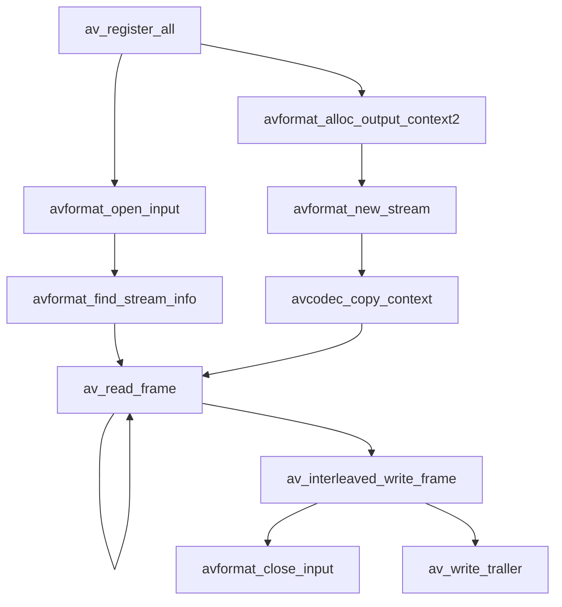
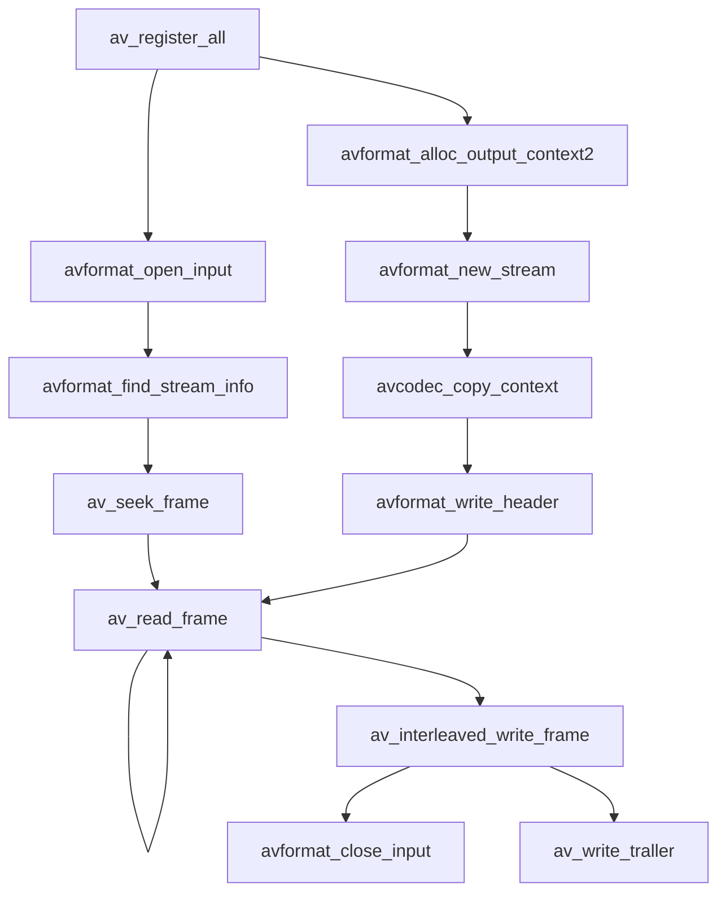
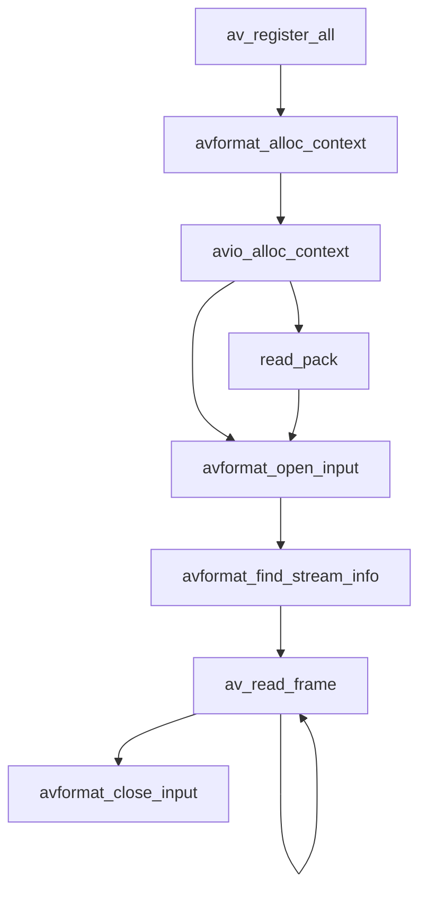

# FFmpeg接口libavformat的使用
## 音视频流封装


```c++
/*API注册*/
// 在使用ffmpeg的API之前，首先要注册使用FFmpeg的API，需要引用一些必要的头文件:
#include <stdlib.h>
#include <stdio.h>
#include <string.h>
#include <math.h>
#include <libavutil/channel_layout.h> 	// 用户音频声道布局操作
#include <libavutil/opt.h> 				// 设置操作选项操作
#include <libavutil/mathematics.h> 		// 用于数学相关操作
#include <libavutil/timestamp.h> 		// 用于时间戳操作
#include <libavformat/avformat.h> 		// 用于封装与解封操作
#include <libswscale/swscale.h> 		// 用于缩放，转换颜色格式操作
#include <libswresample/swresample.h>	// 用于进行音频采样率操作
int main(int argc, char **argv)
{
av_register_all();
return 0;    
}

// 申请AVFormatContext
// 在使用FFmpeg进行，封装格式相关的操作时，需要使用AVFormatContext作为操作的上下文的操作线索:
AVOutputFormat *fmt;
AVFormatContext *oc;
avformat_alloc_output_context2(&oc, NULL, "flv", filename);
if (!oc) {
    printf("cannot alloc flv format\n");
    return 1;
}
fmt = oc->oformat;

// 申请AVStream
// 申请一个将要写入的AVStream流，AVStream流主要作为存放音频，视频，字母数据流使用:
AVStream *st;
AVCodecContext *c;
st = avformat_new_stream(oc, NULL);
if (!ost->st) {
    fprintf(stderr, "Could not allocate stream\n");
    exit(1);
}
st->id = oc->nb_stream-1;

// 需要将Codec与AVStream进行对应，可以根据视频的编码参数对AVCodecContext的参数进行设置:
c->codec_id = ocdec_id;
c->bit_rate = 400000;
c->width = 352;
c->height = 288;
st->time_base = (AVRational){1, 25};
c->time_base = st->time_base;
c->gop_size = 12;
c->pix_fmt = AV_PIX_FMT_YUV420P;

// 为了兼容新版本FFmpeg的AVCodecparameters结构，需要做一个参数copy操作
ret = avcodec_parameters_from_context(ost->st->codecpar, c);
if (ret < 0) {
    printf("could not copy the stream parameters\n");
    exit(1);
}

// 增加目标容器头信息
// 在操作封装格式时，有些封装格式需要写入头部信息，所以在FFmpeg写封装数据时，需要先写封装格式的头部
ret = avformat_write_header(oc, &opt);
if (ret < 0 ) {
    printf("Error occurred when opening output file: %s\n", av_err2str(ret));
    return 1;
}

// 写入帧数据
// 在FFmpeg操作数据报时，均采用写帧操作进行音视频数据包的写入，
// 而每一帧在常规情况下均使用AVPacket接口进行音视频数据的存储，
// AVPacket结构中包含了PTS,DTS,Data等信息，数据在写入封装中时，会根据封装的特性写入对应的信息
AVFormatContext *ifmt_ctx = NULL;
AVIOContext* read_in = avio_alloc_context(inbuffer, 32 * 1024, 0, NULL, get_input_buffer, NULL, NULL);
if (read_in == NULL)
    goto end;
ifmt_ctx->pb = read_in;
ifmt_ctx->flags = AVFMT_FLAG_CUSTOM_IO;
if ((ret = avformat_open_input(&ifmt_ctx, "h264", NULL, NULL)) < 0) {
    av_log(NULL, AV_LOG_ERROR, "Cannot get h264 memory data\n");
    return ret;
}
while(1) {
    AVPacket_pkt = { 0 };
    av_init_packet(&pkt);
    ret = av_read_frame(ifmt_ctx, &pkt);
    if (ret < 0)
        break;
    av_packet_rescale_ts(pkt, *time_base, st->time_base);
    pkt->stream_index = st->index;
    return av_interleaved_write_frame(fmt_ctx, pkt);   
}

// 写容器尾信息
av_write_trailer(oc);
```

## 音视频文件解封装


```C++
// API注册
int main(int argc, char *argv[]) {
    av_register_all();
    return 0;
}

// 构建输入AVFormatContext
AVFormatContext *fmt_ctx = NULL;
if ((ret = avformat_find_stream_info(ifmt_ctx, 0)) < 0) {
	fprintf(stderr, "could not open input file '%s'", in_filename);
	goto end;
}

// 查找流信息
if ((ret = avformat_find_stream_info(fmt_ctx, NULL) < 0)) {
	fprintf(stderr, "could not find stream information\n");
	exit(1);
}

// 读取音视频流
av_init_packet(&pkt);
pkt.data = NULL;
pkt.size = 0;
while (av_read_frame(fmt_ctx, &pkt) >= 0) {
	AVPacket orig_pkt = pkt;
	do {
		ret = decode_packet(&got_frame, pkt);
		if (ret < 0)
				break;
		pkt.data += ret;
		pkt.size -= ret;
	} while(pkt.size > 0);
	av_packet_unref(&orig_pkt);
}

// 收尾
avformat_close_input(&fmt_ctx);
```

## 音视频文件转封装


```c++
int main(int argc, char *[argv])
{
	av_register_all();
	return 0;
}

// 构建输入AVFormatContext
AVFormatContext *ifmt_ctx = NULL;
if ((ret = avformat_open_input(&ifmt_ctx, in_filename, 0, 0)) < 0) {
	fprintf(stderr, "could not open input file '%s'", in_filename);
	goto end;
}

// 查找流信息
if ((ret = avformat_find_stream_info(ifmt_ctx, 0)) < 0) {
	fprintf(stderr, "failed to retrieve input stream information");
	goto end;
}

// 构建输出AVFormatContext
AVFormatContext *ofmt_ctx = NULL;
avformat_alloc_output_context2(&ofmt_ctx, NULL, NULL, out_filename);
if (!ofmt_ctx) {
	fprintf(stderr, "could not create output context\n");
	ret = AVERROR_UNKNOWN;
	goto end;
}

// 申请AVStream
AVStream *out_stream = avformat_new_stream(ofmt_ctx, in_stream->codec->codec);
if (!out_stream) {
	fprintf(stderr, "failed allocating output stream\n");
	ret = AVERROR_UNKNOWN;
}

// stream信息的复制
ret = avcodec_copy_context(out_stream->codec, in_stream->codec);
if (ret < 0) {
	fprintf(stderr, "failed to copy context from input to output stream codec context\n");
}
ret = avcodec_parameters_from_context(out_stream->codecpar, out_stream->code);
if (ret < 0) {
	fprintf(stderr, "could not copy the stream parameters\n");
}

// 写文件头信息
ret = avformat_write_header(ofmt_ctx, NULL);
if (ret < 0) {
	fprintf(stderr, "error occurred when opening output file\n");
}

// 数据包读取和写入
while (1) {
	AVStream *in_stream, *out_stream;
	ret = av_read_frame(ifmt_ctx, &pkt);
	if (ret < 0)
			break;
	in_stream = ifmt_ctx->streams[pkt.stream_index];
	out_stream = ofmt_ctx->streams[pkt.stream_index];
	pkt.pts = av_rescale_q_rnd(pkt.pts, in_stream->time_base, 
					out_stream->time_base, AV_ROUND_NEAR_INF|AV_ROUND_PASS_MINMAX);
	pkt.dts = av_rescale_q_rnd(pkt.dts, in_stream->time_base,
					out_stream->time_base, AV_ROUND_NEAR_INF|AV_ROUND_PASS_MINMAX);
	pkt.duration = av_rescale_q(pkt.duration, in_stream->time_base)
	pkt.pos = -1;
	ret = av_interleaved_write_frame(oofmt_ctx, &pkt);
	if (ret < 0) {
		fprintf(stderr, "error muxing packet\n");
		break;
	}
	av_packet_unref(&pkt);
}

// 写文件尾信息
av_write_trailer(ofmt_ctx);

// 收尾
avformat_close_input(&ifmt_ctx);
```

## 视频截取


```c++
av_seek_frame(ifmt_ctx, ifmt_ctx->streams[pkt.stream_index], ts_start, AVSEEK_FLAG_BACKWARD);
while(1) {
	AVStream *in_stream, *out_stream;
	ret = av_read_frame(ifmt_ctx, &pkt);
	if (ret < 0)
			break;
	in_stream = ifmt_ctx->streams[pkt.stream_index];
	out_stream = ofmt_ctx->streams[pkt.stream_index];
	if (av_compare_ts(pkt.pts, in_stream->time_base, 20, (AVRation){1, 1}) >= 0)
			break;
	pkt.pts = av_rescale_q_rnd(pkt.pts, in_stream->time_base, out_stream->time_base, 
					AV_ROUND_NEAR_INF|AV_ROUND_PASS_MINMAX);
	pkt.dts = av_rescale_q_rnd(pkt.dts, in_stream->time_base, out_stream->time_base,
					AV_ROUND_NEAR_INF|AV_ROUND_PASS_MINMAX);
	pkt.duration = av_rescale_q(pkt.duration, in_stream->time_base, out_stream->time_base);
	pkt.pos = -1;
	ret = av_interleaved_write_frame(ofmt_ctx, &pkt);
	if (ret < 0) {
		fprintf(stderr, "error muxing packet\n");
		break;
	}
	av_packet_unref(&pkt);
}
```

## avio内存数据操作


```c++
// api注册
int main(int argc, char *[argv])
{
	av_register_all();
	return 0;
}

// 读一个文件到内存
struct buffer_data {
	uint8_t *ptr;
	size_t size;
};
struct buffer_data bd = {0};
char *input_filename;
size_t buffer_size;
uint8_t *buffer = NULL;
ret = av_file_map(input_filename, &buffer, &buffer_size, 0, NULL);
if (ret < 0)
		return ret;
bd.ptr = buffer;
bd.size = buffer_size;

// 申请AVFormatContext
AVFormatContext *fmt_ctx = NULL;
if (!(fmt_ctx = avformat_alloc_context())) {
	ret = AVERROR(ENOMEM);
	return ret;
}

// 申请AVIOContext
avio_ctx_buffer = av_malloc(avio_ctx_buffer_size);
if (!avio_ctx_buffer) {
	ret = AVERROR(ENOMEM);
	return ret;
}
avio_ctx = avio_alloc_context(avio_ctx_buffer, avio_ctx_buffer_size, 0, &bd, &read_packet, NULL, NULL);
if (!avio_ctx) {
	ret = AVERROR(ENOMEM);
	return ret;
}
fmt_ctx->pb = avio_ctx;

// 打开AVFormatContext
ret = avformat_open_input(&fmt_ctx, NULL, NULL, NULL);
if (ret < 0) {
	fprintf(stderr, "could not open input\n");
	return ret;
}

// 查看音视频流信息
ret = avformat_find_stream_info(fmt_ctx, NULL);
if (ret < 0) {
	fprintf(stderr, "could not find stream information\n");
	return ret;
}

// 读取帧
while (av_read_frame(fmt_ctx, &pkt) >= 0) {
	if (pkt.flags & AV_PKT_FLAG_KEY) {
		fprintf(stderr, "pkt.flags = KEY\n");
	}
}
```
