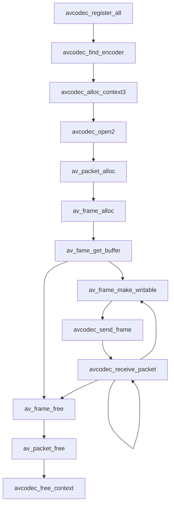
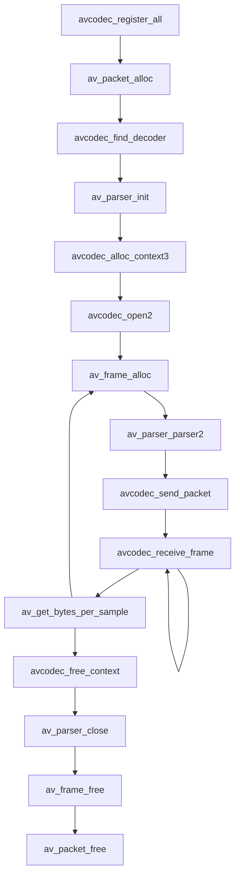
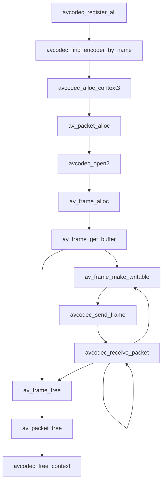
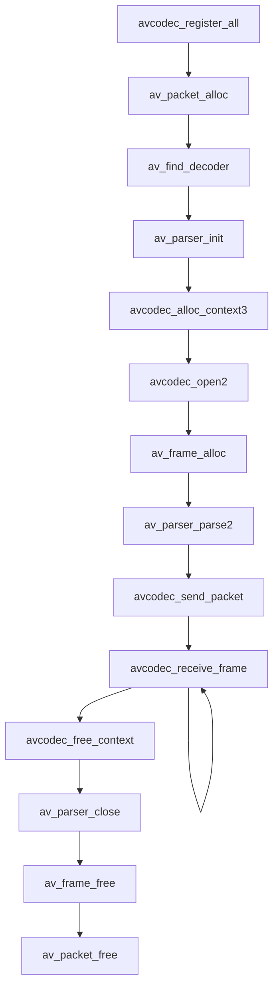
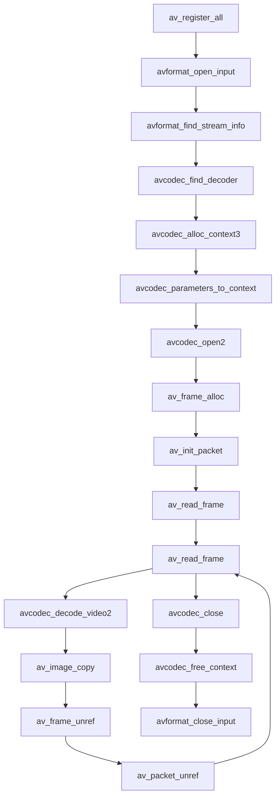
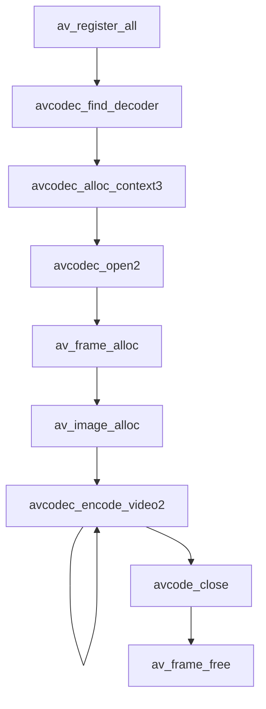

# 第九章 FFmpeg接口libavcodec的使用

## FFmpeg新接口
### 使用FFmpeg新接口音频编码流程



```c++
// 查找和打开编码器
const AVCodec *codec;
AVCodecContext *c = NULL;
AVFrame *frame;
AVPacket pkt;
avcodec_register_all();
codec = avcodec_find_encoder(AV_CODEC_ID_MP2);
if (!codec) {
	fprintf(stderr, "codec not found\n");
	exit(1);
}
c = avcodec_alloc_context3(codec);
if (!c) {
	fprintf(stderr, "could not allocate audio codec context\n");
	exit(1);
}
if (avcodec_open2(c, codec, NULL) < 0) {
	fprintf(stderr, "could not open codec\n");
	exit(1);
}
frame = av_frame_alloc();
if (!frame) {
	fprintf(stderr, "could not allocate audio frame\n");
	exit(1);
}
frame->nb_samples = c->frame_size;
frame->format = c->sample_fmt;
frame->channel_layout = c->channel_layout;
/* allocate the data buffers */
ret = av_frame_get_buffer(frame, 0);
if (ret < 0) {
	fprintf(stderr, "could not allocate audio data buffers\n");
	exit(1);
}

// 填充数据
t = 0;
tincr = 2 * M_PI * 440.0 / c->sample_rate;
for (i = 0; i < 200; i++) {
	/* make sure the frame is writable -- makes a copy if the encoder
	   kept a reference internally */
	ret = av_frame_make_writeable(frame);
	if (ret < 0)
			exit(1);
	samples = (uint16_t*)frame->data[0];
	for (j = 0; j < c->frame_size; j++) {
		samples[2*j] = (int)(sin(t) * 10000);
		for (k = 1; k < c->channels; k++) {
			samples[2*j + k] = samples[2*j];
			t += tincr;
		}
		encode(c, frame, pkt, f);
	}
}

// 音频编码
static void encode(AVCodecContext *ctx, AVFrame *frame, AVPacket *pkt, FILE *output) {
	int ret;
	/* send the frame for encoding */
	ret = avcodec_send_frame(ctx, frame);
	if (ret < 0) {
		fprintf(stderr, "error sending the frame to the encoder\n");
		exit(1);
	}
	/ *read all the available output packets (in general there may be any number of them)* /
	while (ret >= 0) {
		ret = avcodec_receive_packet(ctx, pkt);
		if (ret == AVERROR(EAGAIN) || ret == AVERROR_EOF) 
			return;
		else if (ret < 0) {
			fprintf(stderr, "error encoding audio frame\n");
			exit(1);
		}
		fwrite(pkt->data, 1, pkt->size, output);
		av_packet_unref(pkt);
	}		
}
```

### FFmpeg新接口音频解码
#### 音频解码API调用流程 



```c++
// 查找和打开解码器
const AVCodec *codec;
AVCodecContext *c = NULL;
AVCodecParserContext *parser = NULL;
AVPacket *pkt;
AVFrame *decoded_frame = NULL;
avcodec_register_all();
pkt = av_packet_alloc();
/* find the MPEG audio decoder */
codec = avcodec_find_decoder(AV_CODEC_ID_MP2);
if (!codec) {
	fprintf(stderr, "codec not found\n");
	exit(1);
}
parser = av_parser_init(codec->id);
if (!parser) {
	fprintf(stderr, "parser not found\n");
	exit(1);
}
c = avcodec_alloc_context3(codec);
if (!c) {
	fprintf(stderr, "could not allocate audio codec context\n");
	exit(1);
}
if (avcodec_open2(c, codec, NULL) < 0) {
	fprintf(stderr, "could not open codec\n");
	exit(1);
}

// 音频解码准备
while (data_size > 0) {
	if (!decoded_frame) {
		if (!(decoded_frame = av_frame_alloc())) {
			fprintf(stderr, "could not allocate audio frame\n");
			exit(1);
		}
	}
	ret = av_parser_parse2(parser, c, &pkt->data, &pkt->size, data, data_size, 
					AV_NOPTS_VALUE, AV_NOPTS_VALUE, 0);
	if (ret < 0) {
		fprintf(stderr, "error while parsing\n");
		exit(1);
	}
	ata += ret;
	ata_size -= ret;
	if (pkt->size)
			decode(c, pkt, decoded_frame, outfile);
	if (data_size < AUDIO_REFILL_THRESH) {
		memmove(inbuf, data, data_size);
		data = inbuf;
		len = fread(data + data_size, 1, AUDIO_INBUF_SIZE - data_size, f);
		if (len > 0)
				data_size += len;
	}
}

// 音频解码函数
static void decode(AVCodecContext *dec_ctx, AVPacket *pkt, AVFrame *frame, FILE *outfile) {
	int i, ch;
	int ret, data_size;
	/* send the packet with the compressed data to the deocder */
	ret = avcodec_send_packet(dec_ctx, pkt);
	if (ret < 0) {
		fprintf(stderr, "error submitting the packet to the decoder\n");
		exit(1);
	}
	/* read all the output frames (in general there may be any number of them) */
	while (ret >= 0) {
		ret = avcodec_receive_frame(dec_ctx, frame);
		if (ret == AVERROR(EAGAIN) || ret == AVERROR_EOF) {
			return;
		} else if (ret < 0) {
			fprintf(stderr, "error during decoding\n");
			exit(1);
		}
		data_size = av_get_bytes_per_sample(dec_ctx->sample_fmt);
		if (data_size < 0) {
			/* this should not occur, checking just for paranoia */
			fprintf(stderr, "failed to calculate data size\n");
			exit(1);
		}
		for (i = 0; i < frame->nb_samples; i++)
			for (ch = 0; ch < dec_ctx->channels; ch++)
					fwrite(frame->data[ch] + data_size*i, 1, data_size, outfile);
	}
}
```

### 视频编码API调用流程



### 视频解码API调用流程


## FFmpeg旧接口的使用(不建议)

### FFmpeg旧接口视频解码



```c++
// api注册
int main(int argc, char **argv)
{
  av_register_all();
  return 0;
}
// 查找解码器
AVCodecContext *dec_ctx;
AVStream *st = fmt_ctx->streams[stream_index];
AVCodec *dec = NULL;
dec = avcodec_find_decoder(st->codecpar->codec_id);
if (!dec) {
  fprintf(stderr, "failed to find %s codec\n", av_get_media_type_string(type));
  return AVERROR(EINVAL);
}
// 申请AVCodecContext
dec_ctx = avcodec_alloc_context3(dec);
if (!*dec_ctx) {
  fprintf(stderr, "failed to allocate the %s codec context\n", av_get_media_type_string(type));
  return AVERROR(ENOMEM);
}
// 同步AVCodecParameters
avcodec_parameters_to_context(*dec_ctx, st->codecpar);
// 打开解码器
if (ret = avcodec_open2(*dec_ctx, dec, NULL) < 0) {
  fprintf(stderr, "failed to open %s codec\n", av_get_media_type_string(type));
  return ret;
}
// 帧解码
AVCodecContext *video_dec_ctx = dec_ctx;
AVFrame *frame = av_frame_alloc();
AVPacket pkt;
ret = avcodec_decode_video2(video_dec_ctx, frame, got_frame, &pkt);
if (ret < 0) {
  fprintf(stderr, "error decoding video frame (%s)\n", av_err2str(ret));
  return ret;
}
// 帧存储
av_image_copy(video_dst_data, video_dst_linesize, (const uint8_t **)(frame->data), frame->linesize, pix_fmt, width, height);
fwrite(video_dst_data[0], 1, video_dst_bufsize, video_dst_file);
```

### FFmpeg旧接口视频编码



```c++
// API注册
int main(int argc, char *argv[])
{
  avcodec_register_all();
  return 0;
}

// 查找编码器
AVCodec *codec;
codec = avcodec_find_encoder(codec_id);
if (!codec) {
  fprintf(stderr, "codec not found\n");
  exit(1);
}

// 申请AVCodecContext
AVCodecContext *c = NULL;
c = avcodec_alloc_context3(codec);
if (!c) {
  fprintf(stderr, "Could not allocate video codec context\n");
  exit(1);
}

// 申请过AVCodecContext之后,需要设置编码参数，设置了AVCodecContext的参数之后才可以将参数传递给编码器
c->bit_rate = 400000;
c->width = 352;
c->height = 288;
c->time_base = (AVRational){1, 25};
c->gop_size = 10;
c->max_b_frames = 1;
c->pix_fmt = AV_PIX_FMT_YUV420P;

// 打开编码器
if (avcodec_open2(c, codec, NULL) < 0) {
  fprintf(stderr, "could not open codec\n");
  exit(1);
}

// 申请帧结构AVFrame
AVFrame *frame;
frame = av_frame_alloc();
if (!frame) {
  fprintf(stderr, "could not allocate video frame\n");
  exit(1);
}
frame->format = c->pix_fmt;
frame->width = c->width;
frame->height = c->height;
ret = av_image_alloc(frame->data, frame->linesize, c->width, c->height, c->pix_fmt, 32);
if (ret < 0) {
  fprintf(stderr, "could not allocate raw picture buffer\n");
  exit(1);
}

// 帧编码;frame信息存储空间申请完成之后，可以将视频数据写进frame->data中，写入的时候需要注意，如果是YUV数据，则要区分YUV的存储空间，frame数据写完之后，即可对数据进行编码
for (y = 0; y < c->height; y++) {
  for (x = 0; x < c->width; x++) {
    frame->data[0][y * frame->linesize[0] + x] = x + y + i * 3;
  }
}

for (y = 0; u < c->height/2; y++) {
  for (x = 0; x < c->width/2; x++) {
    frame->data[1][y * frame->linesize[1] + x] = 128 + y + i * 2;
    frame->data[2][y * frame->linesize[2] + x] = 64 + x + i * 5;
  }
}

ret = avcodec_encode_video2(c, &pkt, frame, &got_output);
if (ret < 0) {
  fprintf(stderr, "error encoding frame\n");
  exit(1);
}
fwrite(pkt.data, 1, pkt.size, f);
```

