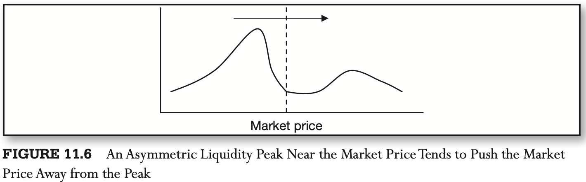

# CHAPTER 11 Automated Market Making 2

[TOC]

## Modeling Information in Order Flow

### Autocorrelation of Order Flow as a Predictor of Market Movement

Order flow is the difference in trade volume between trades initiated with market buy orders and trades triggered by market sell orders, all noted within a predetermined period of time. Trades begin with a market buy order are known as buyer-initiated. Similarly, trading volume caused by market sell orders is referred to as seller-initiated. This equation illustrates the definition of order flow:
$$
x_{t} = v_{t}^{a} - v_{t}^{b}
$$
, where $v_{t}^{a}$ is the trading volume resulting from market buy orders being matched with the ask side of the order book, and $v_{t}^{b}$ is the trading volume triggered by market sell orders hitting the bid side of the order book.

According to Lyons (2001), order flow is informative for three reasons:

1. Order flow can be thought of as market participants exposing their equity to their own forecasts.
2. Order flow data is decentralized with limited distribution.
3. Order flow shows large and nontrivial positions that will temporarily move the market regardless of whether the originator of the trades possesses any superior information, due to market impact.

### Order Flow Is Not Directly Observable

Order flow is not necessarily transparent to all market participants.

As a result, various models have sprung up to extract order flow information from the observable data. The most basic algorithm tests autocorrelation of trade signs. First, the algorithm separates all trades recorded over the past period of time $T$, say, 30 minutes, into buys and sells. The identification of trades can be performed using the Lee-Ready or volume clock rule. Trades identified as buys are assigned "trade direction value" of +1, and each sell trades is noted as -1. Next, the algorithm computes the autocorrelation function (ACF) for lagged trade direction variable, $x_{t}$:
$$
\rho_{t, t + \tau} = \frac{1}{N} \sum_{t = 1}^{N} x_{t} x_{t + \tau}
$$
, where $t$ is the sequential number of a given trade tick in the chosen evaluation interval $T$, and $N$ is the total number of ticks within the time interval. An ACF plot, linking the computed autocorrelation $\rho_{t, t + \tau}$ with a lag $\tau$, reveals trade dependencies.

Hasbrouck (1991), in estimating order autocorrelation, adjusts for returns caused by previously placed orders as well as effects of the time of day:
$$
x_{t} = \alpha_{x}\sum_{k = 1}^{K} \beta_{k} r_{t - k} + \sum_{m = 1}^{M}\gamma_{m} x_{t - m} + \sum_{t = 1}^{T}\delta D_{t} + \varepsilon_{t}
$$
, where $x_t$ is the order flow observed at time $t$, set to +1 when the given trade was estimated originate from a market buy order and -1 otherwise; $r_{t}$ is a one-trade return; and $D_{t}$ is the dummy indicator controlling for the time of day into which time $t$ falls.

### Order Aggressiveness as a Predictor of Market Movement

Aggressiveness refers to the percentage of orders that are submitted at market prices, as opposed to limit prices. The higher the percentage of market orders, the more aggressive is the trader in his bid to capture the best available price and the more likely the trader is to believe that the price of the security is about to move away from the market price.

Anand et al. (2005) use the following regression equation to estimate the impact of various order characteristics on the price changes measured as $Diff_{t}$, the difference between the bid-ask midpoints at times $t$ and $t + n$:
$$
Diff_{t} = \beta_{0} + \beta_{1} Size_{t} + \beta_{2} Aggressiveness_{t} + \beta_{3} Institutional_{t} + D_{1t} + ... + D_{n - 1, t} + \varepsilon_{t}
$$
, where $t$ is the time of the order submission, $n$ equals 5 and then 60 minutes after order submission. `Size` is the number of shares in the particular order divided by the mean daily volume of shares traded in the particular stock over the sample period. For buy orders, `Aggressiveness` is a dummy that takes the value 1 if the order is placed at or better than the standing quote and zero otherwise. `Institutional` is a dummy variable that takes the value 1 for institutional orders and 0 for individual orders. $D_{1}$ to $D_{n - 1}$ are stock-specific dummies associated with the particular stock that was traded.

The autocorrelation of market aggressiveness is thought to originate from either of the following sources:

- Large institutional orders that are transmitted in smaller slices over an extended period of time at comparable levels of market aggressiveness.
- Simple price momentum.

### Shape of the Order Book as a Predictor of Market Direction

Cao et al. (2004), for example, find that a liquidity peak close to the market price, for example, tends to push the market price away from the peak. However, a liquidity peak away from the market price tends to "pull" the market price toward the peak.

Rosu (2005) determines that the shape of the limit order book depends on the probability distribution for arriving market orders. High probabilities of large market orders lead to hump-shaped limit order books.

Berber and Caglio (2004) find that limit orders carry private information around events such as earnings announcements: a concentration of limit orders far away from the current market price is likely to reflect someone's postannouncement valuation of the traded instrument.

Cont, Kukanov, and Stoikov (2011) suggest that even Level 1 data can be used to generate successful predictions of the impending price movements. To predict the price movement, Cont et al. (2011) define a new variable, order flow imbalance (OFI):
$$
OFL_{k} = \sum_{n = N(t_{k} - 1) + 1}^{N(t_{k})} {e_{n}}
$$
, where $e_{n}$ represents an instantaneous change in the top-of-the-book liquidity, and is defined as follows:
$$
e_{n} = I_{\{p_{n}^{B} \geq p_{n - 1}^{B}\}}q_{n}^{B} - I_{\{p_{n}^{B} \leq p_{n - 1}^{B}\}}q_{n - 1}^{B} - I_{\{p_{n}^{B} \leq p_{n - 1}^{B}\}}q_{n}^{A} + I_{\{p_{n}^{B} \leq p_{n - 1}^{B}\}}q_{n - 1}^{A}
$$
, where $I$ is the indicator function, equal to 1 when the bracketed condition is true, and 0 otherwise, and $q^{B}$ and $q^{A}$ are the sizes at the best bid and the best ask, respectively.

### Evolution of Tick Data as a Predictor of Market Movement

Asymmetric information present in the markets leads to adverse selection, or the ability of informed trders to "pick off" uninformed market participants. According to Dennis and Weston (2001) and Odders-White and Ready (2006), the following measures of asymmetric information have been proposed over the years:

- Quoted bid-ask spread

  The bid-ask spread reflects the expectations of market movements by the market maker using asymmetric information.

- Effective bid-ask spread

  The effective bid-ask spread is computed as twice the difference between the latest trade price and the midpoint between the quoted bid and ask prices, divided by the midpoint between the quoted bid and ask prices:
  $$
  S_{t}^{e} = [\frac{4S_{t}}{S_{t}^{a} + S_{t}^{b}} - 1]
  $$
  The effective spread measures how far, in percentage terms, the latest realized price fell away from the simple midquote.

- Information-based impact

  The information-based impact measure of asymmetric information is attributable to Hasbrouck (1991). Brennan and Subrahmanyam (1996) specify the following vector autoregressive (VAR) model for estimation of the information-based impact measure, $\lambda$:
  $$
  V_{i,t} = \theta_{i,0} + \sum_{k = 1}^{K}\beta_{i,k}\Delta P_{i,t - k} + \sum_{m = 1}^{M}\gamma_{i,m}V_{i, t - m} + \tau_{i,t} \\
  \Delta P_{i,t} = \phi_{i, 0} + \phi_{i, 1} sign(\Delta P_{i,t}) + \lambda_{i}\tau_{i,t} + \varepsilon_{i,t}
  $$
  , where $\Delta P_{i,t}$ is the change in price of security $i$ from time $t - 1$ to time $t$, $V_{i,t} = sign(\Delta P_{i,t}).v_{i,t}$, and $v_{i,t}$ is the volume recorded in trading the security $i$ from time $t - 1$ to time $t$. Brennan and Subrahmanyam (1996) propose five lags in estimation of equation: $K = M = 5$.

- Adverse-selection components of the bid-ask spread

  The adverse selection components of the bid-ask spread is atributable to Glosten ahd Harris (1988). The model separates the bid-ask spread into the following three components:

  - Averse selection risk
  - Order-pricessing costs
  - Inventory risk

  $$
  \Delta P_{i,t} = (1 - \lambda_{i}) \frac{S_{i,t}}{2} sign(\Delta P_{i,t}) + \lambda_{i} \frac{S_{i,t}}{2} sign(\Delta P_{i,t}).v_{i,t} + \varepsilon_{i,t}
  $$

  where $\Delta P_{i,t}$ is the change in price of security $i$ from time $t - 1$ to time $t$, $V_{i,t} = sign(\Delta P_{i,t}).v_{i,t}$, $v_{i,t}$ is the volume recorded in trading the security $i$ from time $t - 1$ to time $t$, $S_{i,t}$ is the effective bid-ask spread as defined previously, and $\lambda_{i}$ is the fraction of the traded spread due to adverse selection.

- Probability of informed trading

  The probability of informed trading taking place is then determined as follows:
  $$
  PI = \frac{\alpha \mu}{\alpha \mu + 2 \omega}
  $$

  - $\alpha$: the probability of an event.
  - $\delta$: the probability of its having a negative effect on prices.
  - $(1 - \delta)$: the probability of the event's having a positive effect on prices.
  - $\omega$: investors uninformed of the event will keep placing orders on both sides of the market at a rate $\omega$.

  The parameters $\alpha, \mu$ and $\omega$ are then estimated from the following likelihood function over $T$ periods of time:
  $$
  L(B, S \mid \alpha, \mu, \omega, \delta) = \prod_{{t=1}}^{T} \ell(B, S, t \mid \alpha, \mu, \omega, \delta')
  $$
  , where $\ell(B, S, t | \alpha, \mu, \omega, \delta)$ is the likelihood of observing $B$ buys and $S$ sells within a specific period of time:
  $$
  \ell(B,S,t | \alpha, \mu, \omega, \delta) = (1 - \alpha)[exp(-\omega T) \frac{(\omega T)^{B}}{B!}][exp(-\omega T) \frac{(wT)^{S}}{S!}] \\
  + \alpha(1 - \delta)[exp(-(\omega + \mu)T) \frac{((\omega + \mu)T)^{B}}{B!}][exp(-\omega T)\frac{(\omega T)^{S}}{S!}] \\
  + \alpha \delta [exp(-\omega T) \frac{(\omega T)^{B}}{B!}][exp(-(\omega + \mu)T) \frac{((\omega + \mu)T)^{S}}{S!}]
  $$
  

