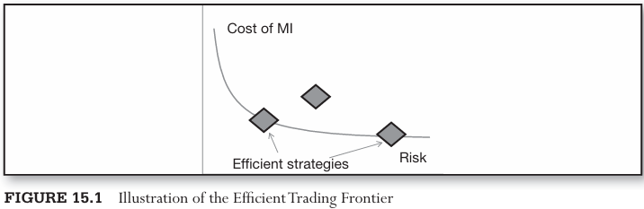

# CHAPTER 15 Minimizing Market Impact

[TOC]

## Why Execution Algorithms?

Execution algorithms have become essential for all investors, as execution algos help traders accumulate or liquidate large positions by breaking up orders into pieces, and reducing market impact and visibility of orders.

Different algorithms have been shown to substantially lower execution costs.

In addition to net execution costs, traders may consider the costs associated with the risk of the algorithms.

A sample efficient trading frontier is shown in the above figure. Analytically, it can be described as in the equation:
$$
min\ Cost(\alpha) + \lambda Risk(\alpha)
$$

- $\alpha$ is a measure of order aggressiveness, for example, counting the number of ticks away from the market each child order is placed.
- $Cost(\alpha)$ is the aggregate expected execution cost, including expected market impact, for all child orders of the strategy executed at the aggressiveness level $\alpha$​.
- $Risk(\alpha)$ is the cumulative risk associated with all the child orders placed at aggressiveness level $\alpha$.

## Order-Routing Algorithms

The order-routing algorithms target the following objectives:

- Minimize execution costs
- Obtain best price
- Maximize execution speed
- Maximize trading size
- Minimize trade footprint

### Minimize Execution Costs

Trading costs comprise several major components:

- Broker commissions, both fixed and variable
- Exchange fees
- Taxes
- Bid-ask spread
- Slippage
- Opportunity cost
- Market impact

### Obtain Best Price

The core principle of the best price trading is "buy low, sell high." Due to the natural price moves, the direction of the price can be difficult to predict, and advanced short-term forecasting models are required for this purpose.

### Maximize Execution Speed

The underlying rationale for selection of the exchange is this: place limit orders wherever the limit orders are fewest, and place market orders wherever the limit orders are most numerous. Such a process ensures that the orders have the highest probability of fast execution. The process is known as the minimal impact algorithm.

### Minimize Footprint

Every order is a credible signal as it reveals the trader's true beliefs, committed to the trader's capital. As a result, every order carries information about the current views of the trader.

### Maximize Trading Size

Most researchers develop execution algorithms in the following sequence:

1. Researchers explore published and not-yet-published academic research in the area of optimal execution algorithm design and implementation.
2. The researchers model the algorithm in econometric languages such as MatLab or R and, as a result, transition their code to faster programming languages like C++ or optimized Java.
3. The algorithm is tested on historical tick data utilizing assumptions and predictions about price movement generated by the algorithm, own orders.
4. If the previous step results in a satisfactory execution schedule and price, cost, and risk outcome, the algorithm is moved into production, where it is enabled to communicate in real time using quote-receiving and sending languages such as FIX, ITCH, OUCH, FAST, and the like.

### TWAP

TWAP attempts to conceal the order flow by breaking a large order into equally sized parcels, which are then sent out at equally spaced time intervals. Mathematically, TWAP executes a fixed portion 1/T of the order every predetermined unit of time. The resulting TWAP price is the arithmetic average of prices sampled at the regular unit time intervals:
$$
TWAP = \frac{1}{T} \sum_{1}^{T}Pt
$$

The TWAP algorithm is illustrated in the above Figure. When a trader chooses to execute a large order of size $S$ using TWAP, the trader also needs to decide on the total number $N$ of child orders or slices to execute, and the total execution time $T$. Next, an order slice of size $S/N$ is sent to the market every $T/N$ seconds, until the entire order of size $S$ is processed. The total number of slices $N$ and the execution time $T$ are best determined using characteristics specific to the traded security.

### VWAP

The VWAP algorithm is currently one of the most popular execution methodologies. The principle of VWAP is straightforward: break up a large order in such a way that VWAP child orders are larger when the trading volume is higher, and child orders are smaller when trading volume is lower. Higher trading volume is likely to provide larger pool of matching orders and result in faster and more cost-effective execution.

The above figure diagrams the VWAP algorithm:
$$
s_{t} = S \frac{\overline{V_{t}}}{\sum_{\tau \in T}\overline{V_{\tau}}}
$$
The resulting benchmark VWAP price can be determined as follows:
$$
VWAP = \frac{\sum_{\tau \in T} \overline{V_{\tau}}P_{\tau}}{\sum_{\tau \in T}\overline{V_{\tau}}}
$$
 The previous period's trading volume used in calculation of POV child order should exclude the volume generated by the POV trader himself:
$$
S_{POV,t} = (V_{t - 1} - S_{POV, t - 1})(POV)
$$

## Issues with Basic Models 

The key concept in Fourier analysis is Fourier transform, a mathematical construct connecting time and frequency domains. Continuous (as opposed to digital) forms of the Fourier transform are specified as follows:
$$
f(x) = \int_{-\infty}^{\infty}F(k)e^{2 \pi ikx} dk \\
F(k) = \int_{-\infty}^{\infty}f(x)e^{-2 \pi ikx} dx
$$
, where $x$ represents a time-based variable, and $F(k)$ is a frequency-domain function.

## Advanced Models

The order book's resilience, $h(E_{s})$, is a function of the trading process and is specified as follows:
$$
E_{t} = X_{t} - \int_{0}^{t}h(E_{s})ds
$$
, where $E_{t}$ is the aggregate size of limit orders available at $p$ ticks away from prevailing market price $P$ at time $t$, $X_{t}$ is the aggregate order flow, $E_{0} = 0$, and $\Delta X_{t} = \Delta E_{t}$ for $0 \leq t \leq T$. The function $h(E_{s})$ measures how fast the order book $p$ ticks away from the market recovers following an order of size $\Delta X_{t}$, and satisfies the following properties:

- The function is strictly increasing in $X$, and

- The function is a locally Lipschitz function on $[0, \infty): |h(x) - h(y)| \leq C|x - y|$ for all $x$ and $y$, where $C$ is a constant independent of $x$ and $y$, and the function has a bounded first derivative $\frac{dh}{dX} < \infty$. The trader's execution strategy $X$ measures the amount of the total order still left to be processed in the market. As such, $x_0 = X$ and $x_{T} = 0$. The trader's rate of trading is defined as:
  $$
  v_{t} = -\frac{\partial_{X_{t}}}{\partial_{t}}
  $$
  

Price process of the traded instrument, $S_{t}$, can be assumed to follow any continuous process. Independent of the shape of the price process $S_{t}$, the expected impact inflicted by strategy $X$ on price $S$ can always be measured as cost $C$:
$$
C = \int_{0}^{T} S_{t} dx_{t}
$$
The expected value of MI cost can be expressed via integration by parts as follows:
$$
E[C] = E[\int_{0}^{T}S_{t}dx_{t}] = E[S_{T}x_{T} - S_{0}x_{0} - \int_{0}{T}x_{t}dS_{t}]
$$

### When Price Follows Geometric Brownian Motion

Most security pricing models assume that prices follow geometric Brownian motion with price increments $dS_{t}$ exhibiting dependency on the contemporary price level $S_{t}$, as well as incurring drift $\mu$:
$$
dS_{t} = \mu S_{t}dt + \sigma S_{t} d Z_{t}
$$
The vanilla execution cost function, not incorporating any risk optimization measures, can then be specified as follows (see Forsyth et al., 2011):
$$
C = \eta \int_{0}^{T}v_{t}^{2}dt + \lambda \sigma \int_{0}^{T}S_{t}^{2} x_{t}^{2} dt
$$
, where, as before, the optimal rate of execution is $v_{t} = -\frac{\partial X_{t}}{\partial t}$. Under the assumption of geometric Brownian motion, the costs and the resulting optimal solution of the cost minimization problem are dependent on the price of the price path. However, as Forsyth et al. (2011) show, many strategies lead to almost identical outcome.

Euler-Lagrange equations produce the following closed-form solution for optimal cost-minimizing trading strategy:
$$
x_{t}^{*} = \frac{T - t}{T}[X - \frac{\lambda T}{4} \int_{0}^{t}S_{u}du]
$$
, The resulting expected minimal cost, $E[C_{min}(x^{*})] = E[\int_{0}^{T}((v_{t}^{*})^{2} + \lambda x_{t}^{*}S_{t})dt]$ becomes:
$$
E[C_{min}(x^{*})] = \frac{X^{2}}{T} + \frac{\lambda T X S_{0}}{2} - \frac{\lambda^{2}}{8\sigma^{6}} S_{0}^{2} \left(e^{\sigma^{2}T} - 1 - \sigma^{2}T - \frac{\sigma^{4}T^{2}}{4}\right)
$$
, See Forsyth et al. (2011) for derivation.

### When Price Follows a Generalized Market Impact-Based Function

While most now-traditional asset-pricing models, such as Black-Sholes, assume Geometric Brownian motion as the model accurately describing the evolution of security prices, a new breed of models proposes to model short-term price changes closer to their empirical roots. In such models, the price level at time $t$ is expected to evolve as follows (see Gatheral, 2011):
$$
S_{t} = S_{0} + \text{impact of prior trading} + risk(noise)
$$
, where the risk or noise component is the price-level independent $\int_{0}^{t}\sigma dZ_{s}$. The impact of prior trading is quantified using the execution strategy $X$ trading rate dynamics $u_{t} \equiv - \frac{dx}{dt}$ and the function measuring resiliency of the order book $h(E_{t})$. The expected execution cost can next be expressed as:
$$
E[C] = \frac{1}{2} \int_{0}^{T} \int_{0}^{t}h(E_{s})dX_{s}dX_{t}
$$
, To minimize expected cost $E[C]$, one is required to solve the following equation:
$$
\frac{\partial}{\partial_t} \frac{\partial E[C]}{\partial_{u_t}} = 0
$$
, which can be interpreted as follows: the optimal value of cost requires cost invariance with trading rate. Since the cost is directly dependent on volume impact $E_{t}$, the optimality condition requires that volume impact stays constant:
$$
E_{t} = const
$$
1
