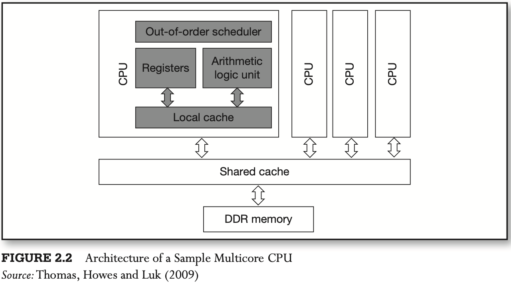
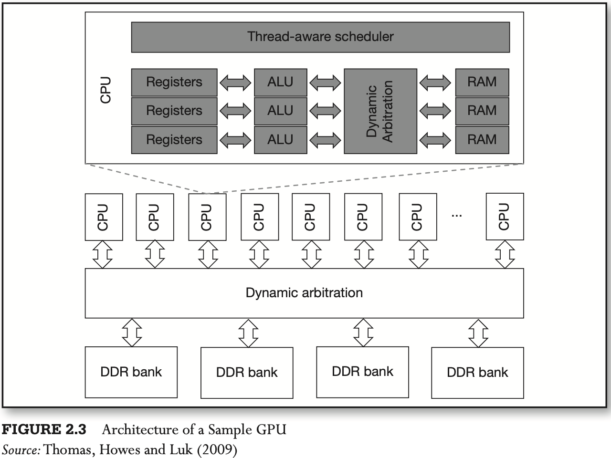
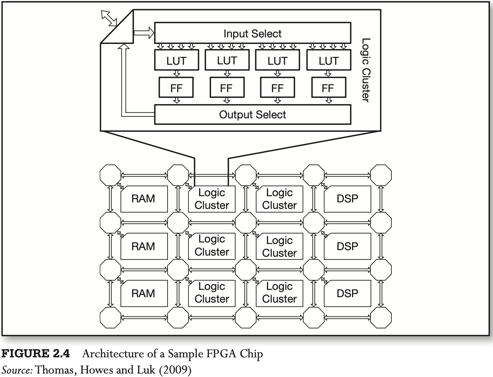
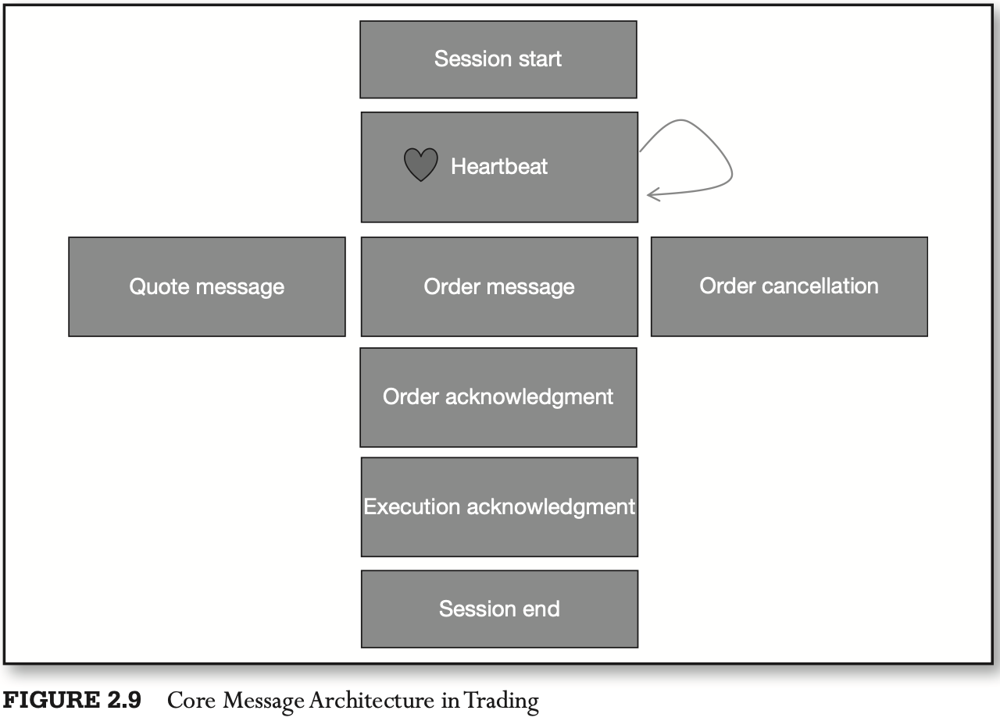

# CHAPTER 2 Technological Innovations, Systems, and HFT

[TOC]

Performance-wise, FPGAs tend to be superior to GPUs and CPUs, particularly when used to simultaneously process a limited number of time series.

The transmission speed of communication messages depends on several factors:

- Size of message.
- Connection bandwidth.
- TCP/IP and UDP "window" sizes, specifying how many bytes market participants are willing to send and receive at a message "slice".

Every stream of quote and trade communication includes the following key messages:

1. `Session start` is the message sent in the beginning of every communication session, sometimes only once a day.
2. `Heartbeat` is a recurrent message that notifies the participant's communication parties that the participant is online, in a state of good technological health, and open for business.
3. `Quote` message is a message carrying quote information, such as best bid and ask prices and sizes.
4. `Order` message is used to transmit actual order information.
5. `Order cancellation` message includes the unique identifier of the previously placed order that now needs to be canceled.
6. `Order acknowledgment` and `order cancellation acknowledgment` messages include confirmations of order placement or order cancellation, respectively.
7. `Execution acknowledgment` messages specify the details of execution: time of excution, obtained price, and execute quantity.
8. `Session end` message informs parties that a given trading entity has stopped trading and quoting for the day.