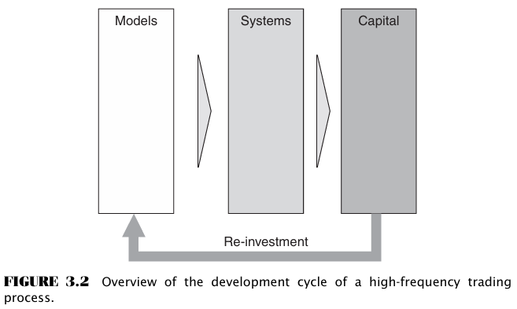
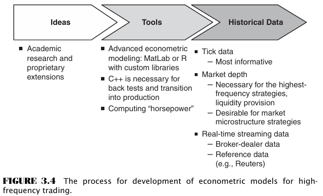
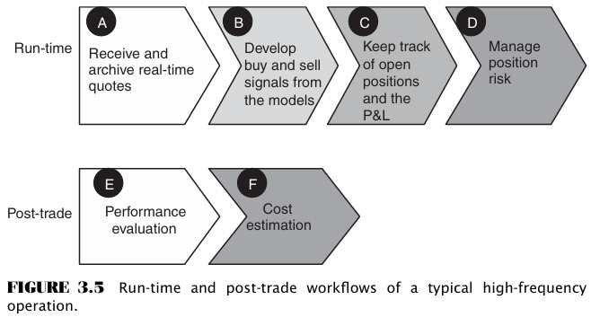
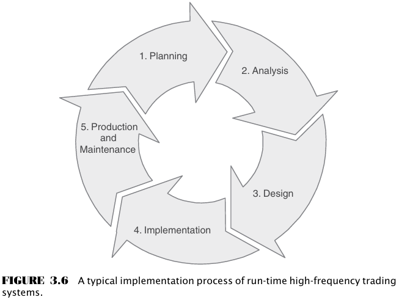

# CHAPTER 3 Overview of the Business of High-Frequency Trading

[TOC]

Quant frameworks are best suited to high-frequency trading for one simple reason: high-frequency generation of orders leaves little time for traders to make subjective non-quantitative decisions and input them into the system.

Three main components, make up the business cycle:

- Highly quantitative, econometric models that forecast short-term price moves based on contemporary market conditions.
- Advanced computer systems built to quickly execute the complex econometric models.
- Capital applied and monitored within risk and cost-management frameworks that are cautious and precise.

