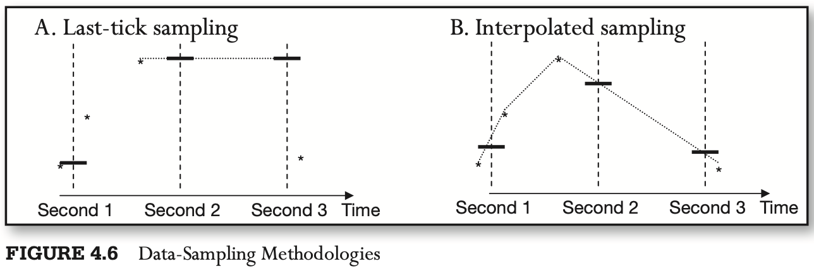

# CHAPTER 4 High-Frequency Data

[TOC]

High-frequency data, also known as `tick data`, are records of live market activity.

Most limit and market orders are placed in so-called "lot sizes": increments of certain number of units, known as a lot.

Summary of Properties of High-Frequency Data:

| Property of HFT Data                                   | Description                                                  | Pros                                                         | Cons                                                         |
| ------------------------------------------------------ | ------------------------------------------------------------ | ------------------------------------------------------------ | ------------------------------------------------------------ |
| Voluminous                                             | Each day of high-frequency data contains the number of observations equivalent to 30 years of daily data. | Large numbers of observations carry lots of information      | High-frequency data are difficult to handle manually         |
| Subject to bid-ask bounce                              | Unlike traditional data based on just closing prices, tick data carry additional supply-and-demand information in the form of bid and ask prices and offering sizes. | Bid and ask quotes can carry valuable information about impending market moves, which can be harnessed to the researcher's advantage. | Bid and ask quotes are separated by a spread. Continuous movement from bid to ask and back introduces a jump process, difficult to deal with through many conventional models. |
| Not normally or lognormally distributed                | Returns computed from tick are not normal or lognormal.      | Many tradable models are still to be discovered.             | Traditional asset pricing models assuming lognormality of prices do not apply. |
| Irregularly spaced in time                             | Arrivals of tick data are asynchronous.                      | Durations between data arrival carry information.            | Most traditional models require regularly spaced data; need to convert high-frequency data to some regular intervals, or "bars" of data. Converted data are often sparse (populated with zero returns), once again making traditional econometric inferences difficult. |
| Do not include buy or sell trade direction information | Level 1 and Level 2 data do not include information on whether the trade was a result of a market buy or a market sell order. | Data are leaner without trade direction information; trade information is more difficult for bystanders to extract. | The information on whether a trade is buyer initiated or seller initiated is a desired input in many models. |

There are generally thought to be anomalies in interdealer quote discrepancies:

1. Each dealer's quotes reflect that dealer's own inventory.
2. In an anonymous marketplace, such as a dark pool, dealers as well as other market makers may "fish" for market information by sending indicative quotes that are much off the previously quoted price to assess the available demand or supply.
3. Dacorogna et al. (2001) note that some dealers' quotes may lag real market prices.

The difference between the bid quote and the ask quote at any given time is known as the bid-ask spread.

Future realizations of the bid-ask spread can be estimated using the model suggested by Roll(1984), where the price of an asset at time $t$, $P_t$, is assumed to equal an unobservable fundamental value, $m_t$, offset by a value equal to half of the bid-ask spread, $s$. The price offset is positive when the next market order is a buy, and negative when the trade is a sell, as shown in the equation:
$$
P_t = m_t + \frac{s}{2}I_t
$$
, where:
$$
I_t = 
\begin{cases}
1, &\text{market buy at ask}\\
-1, &\text{market sell at bid}
\end{cases}
$$
, If either a buy or sell order can arrive next with equal probability, then $E[I_t] = 0$, and $E[\Delta_{p_t}] = 0$, absent changes in the fundamental asset value, $m_t$. The covariance of subsequent price changes, however, is different from 0:
$$
cov[\Delta_{P_t}, \Delta_{P_{t + 1}}] = E[\Delta_{P_t} \Delta_{P_{t + 1}}] = -\frac{s^2}{4}
$$
, As a result, the future expected spread can be estimated as follows:
$$
E[s] = 2 \sqrt{-cov[\Delta_{P_t}, \Delta_{P_{t + 1}}]} \text{ whenever } cov[\Delta_{P_t}, \Delta_{P_{t + 1}}] < 0
$$
To use standard econometric techniques in the presence of the bid-ask bounce, many practitioners convert the tick data to "midquote" format: the simple average of the latest bid and ask quotes. The midquote is used to approximate the price level at which the market is theoretically willing to trade if buyers and sellers agreed to meet each other halfway on the price spectrum. Mathematically, the midquote can be expressed as follows:
$$
\hat{q}_{t_m}^m = \frac{1}{2} \left( q_{t_a}^a + q_{t_b}^b \right), where t_m =
\begin{cases}
t_a, &\text{if } t_a \geq t_b\\
t_b, &\text{otherwise }
\end{cases}
$$
, The later condition for $t_m$ reflects the continuous updating of the mid-quote estimate: $\hat{q}_{t_m}^m$ is updated whenever the latest bets bid, $q_{t_b}^{b}$, or best ask quote, $q_{t_a}^{a}$, arrives, at $t_b$ or $t_a$ respectively.

Another way to sample tick quotes into a cohesive data series is by weighing the latest best bid and best ask quotes by their accompanying order sizes:
$$
\widetilde{q_t}^{s} = \frac{q_{t_b}^{b} s_{t_a}^{a} + q_{t_a}^{a} s_{t_b}^{b}}{s_{t_a}^{a} + s_{t_b}^{b}}
$$
, where $q_{t_b}^{b}$ and $S_{t_b}^{b}$ is the best bid quote and the best bid available size recorded at time $t_b$ (when $q_{t_b}^{b}$ became the best bid), and $q_{t_a}^{a}$ and $S_{t_a}^{a}$ is the best bid quote and the best bid available size recorded at time $t_a$.

Dacorogna et al. (2001) propose a potentially more precise way to sample quotes: linear time-weighted interpolation between adjacent quotes. At the core of the interpolation technique is an assumption that at any given time, unobserved quotes lie on a straight line that connects two neighboring observed quotes.

, Mathematically, the two sampling methods can be expressed as follows:

- Quote sampling using closing prices:
  $$
  \hat{q_t} = q_t, last
  $$

- Quote sampling using linear interpolation:
  $$
  \hat{q_t} = q_{t, last} + (q_{t, next} - q_{t, last}) \frac{t - t_{last}}{t_{next} - t_{last}}
  $$

, where $\hat{q_t}$ is the resulting sampled quote, $t$ is the desired sampling time(start of a new minute, for example), $t_{last}$ is the timestamp of the last observed quote prior to the sampling time $t$, $q_{t, last}$ is the value of the last quote prior to the sampling time $t$, $t_{next}$ is the timestamp of the first observed quote after the sampling time $t$, and $q_{t, next}$ is the value of the first quote after the sampling time $t$.

Duration models are used to estimate the factors affecting the time between any two sequential ticks. Such models are known as quote processes and trade processes, respectively. Duration models are also used to measure the time elapsed between price changes of a prespecified size, as well as the time interval between predetermined trade volume increments. The models working with fixed price are known as `price processes`; the models estimating variation in duration of fixed volume increments are known as `volume processes`.

Durations are often modeled using Poisson processes that assume that sequential events, like quote arrivals, occur independently of one another. The number of arrivals between any two time points $t$ and $(t + \tau)$ is assumed to have a Poisson distribution. In a Poisson process, $\lambda$ arrivals occur per unit time. In other words, the arrivals occur at an average rate of $(1/\lambda)$. The average arrival rate may be assumed to hold constant, or it may vary with time. If the average arrival rate is constant, the probability of observing exactly $K$ arrivals between times $t$ and $(t + \tau)$ is:
$$
P[(N(t + \tau) - N(t)) = k] = \frac{1}{k!}e^{-\lambda \tau} (\lambda \tau)^{k}, k = 0, 1, 2, ...
$$
The time interval between subsequent price changes of a specified magnitude is known as `price duration`. Price duration has been shown to decrease with increases in volatility. Similarly, the time interval between subsequent volume changes of a prespecified size is known as the `volume duration`. Volume duration has been shown to decrease with increases in liquidity.

Neither Level 1 nor Level 2 tick data contains identifiers specifying whether a given recorded trade was a result of a market buy order or a market sell order. To overcome this challenge, four methodologies have been proposed to estimate whether a trade was a buy or a sell from Level 1 data:

- Tick rule
- Quote rule
- Lee-Ready rule
- Bulk volume classification

According to the tick rule, the classification of a trade is performed by comparing the price of the trade to the price of the preceding trade; no bid or offer quote information is taken into account. Each trade is then classified into one of the four categories:

- `Uptick`, if the trade price is higher than the price of the previous trade.
- `Downtick`, if the trade price is lower than the price of the previous trade.
- `Zero-uptick`, if the price has not moved, but the last recorded move was an uptick.
- `Zero-downtick`, if the price has not moved, but the last recorded move was a downtick.

The so-called Lee-Ready rule classifies trades first using the quote rule. The trades occurring at the midpoint between the prevailing bid and ask quotes are not classified under the quote rule, and are subsequently classified using the tick rule.

The rule, named `bulk volume classification`, works as follows: for every unit of time or volume (a "volume bar", say every 100 shares traded), BVC assigns the probability of the observed volume being a buy as follows:
$$
Pr(V_{\tau} = B) = Z(\frac{p_{\tau} - p_{\tau - 1}}{\sigma \Delta P})
$$
, where:

- $V_{\tau}$ is the total volume observed during time or volume interval $\tau$.
- $p_{\tau} - p_{\tau - 1}$ is the price difference observed between the two subsequent time or volume bars, $\tau - 1$ and $\tau$.
- $\sigma \Delta P$ is the standard deviation of sequential time or volume-clock-based price changes.
- $Z$ is the PDF of a standard normal distribution.

, The buyer-initiated trade volume can then be estimated as:
$$
V_{\tau}^{B} = V_{\tau} Z (\frac{p_{\tau} - p_{\tau - 1}}{\sigma \Delta p})
$$
, According to the BVC, the probability of a specific volume being generated by a market sell order then becomes:
$$
Pr(V_{\tau} = S) = 1 - Pr(V_{\tau} = B) = 1 - Z(\frac{p_{\tau} - p_{\tau - 1}}{\sigma \Delta p})
$$
, And the respective size of the seller-initiated volume is then:
$$
V_{\tau}^{S} = V_{\tau}(1 - Z(\frac{p_{\tau} - p_{\tau - 1}}{\sigma \Delta p}))
$$
