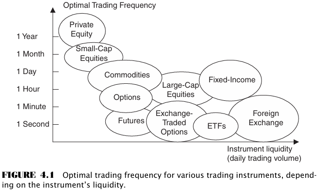

# CHAPTER 4 Financial Markets Suitable for High-Frequency Trading

[TOC]

For a market to be high-frequency trading suitable, there are three key elements of each market:

- Available liquidity.
- Electronic trading capability.
- Regulatory considerations.

Interest rate futures are commonly based on the 3-month deposit rate. The actual quotation for a futures bid or ask prices, $f_{bid}$ and $f_{ask}$, respectively, depends on the annualized bid or ask OTC forward rates, $r_{bid}$ and $r_{ask}$, as follows:
$$
f_{bid} = 100 \left(1 - \frac{r_{bid}}{100\%}\right) \\
f_{ask} = 100 \left(1 - \frac{r_{ask}}{100\%}\right)
$$

## Conclusion

The advantages of high-frequency trading in the developing electronic markets are two-fold:

- First-to-market high-frequency traders in the newly electronic markets are likely to capture significant premiums on their speculative activity simply because of the lack of competition.
- In the long term, none of the markets is a zero-sum game. The diverse nature of market participants ensures that all players are able to extract value according to their own metrics.

