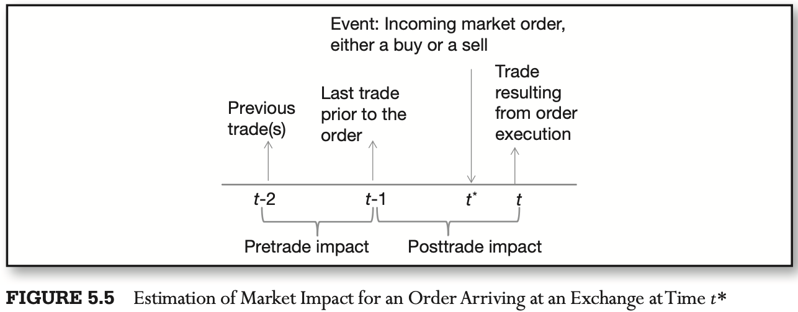
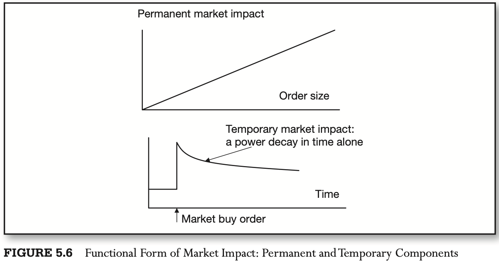

# CHAPTER 5 Trading Costs

[TOC]

Costs known prior to trading activity are referred to as `transparent` or `explicit`, and costs that have to be estimated are known as `latent` or `implicit`.

Transparent execution costs are generally known ahead of trading; they comprise:

- Broker Commissions.
- Exchange Fees
- Taxes

At the tick level of data, transparent costs are being increasingly dominated by implicit costs of the opportunity cost of investment:

- Bid-Ask Spreads

  The bid-ask spread is the difference between the best ask and the best bid at any given point in time, and represents the cost of instantaneous liquidation of a trading position. The spread can also be seen as the premium paid by traders desiring immediate execution via market orders.

- Slippage or Latency Costs

  `slippage` is the adverse change in the market price of the traded security that occurs from the time an investment decision is made until the time the trade is executed.

  In reality, slippage is not solely dependent on the speed of trading activity. Instead, slippage is also a direct frunction of the:

  1. Liquidity available in the market
  2. The number of market orders that have arrived to consume that liquidity.

  Stoikov and Rolf (2012) define cost of latency as the expected value of dollar-denominated savings resulting from executing with slow and fast (low-latency) infrastructures:
  $$
  COL = E[S_{t + 1} - S_{t}]
  $$
  , where $S_{t + 1}$ is the price obtained at time $t$ with latency $1$ and $S_t$ is the price obtained on the same financial instrument at the same time $t$ when latency $1$ approaches zero.

- Price Appreciation and Timing Risk Costs

  The price appreciation cost refers to the forecasted loss of investment value during the execution of a large position. The timing cost refers to random, unforecasted price movement ahead of execution of a child order.

- Opportunity Costs

  The opportunity cost is the cost associated with inability to complete an order.

- Market Impact Costs

  Market impact cost measures the adverse change in the market price following an order.

`market impact`(MI) can be attributed to several factors including:

- In the trading world with heterogeneous traders possessing different beliefs and information, MI is the negotiation or tatonnement process via which traders' information and beliefs are impounded into the security prices.
- Both market and limit orders represent traders' commitments of money and reputation, and therefore form credible signals to other market participants who may choose to trade in the same direction.
- Every market buy (sell) order temporarily depletes liquidity supply on the ask (bid) side of the order book, driving the next market buy (sell) order to the matched against a higher (lower) best available limit order price.

## Estimation of Market Impact

For market orders, the MI appears strongly concave in the order size, and the signs of market orders are autocorrelated in time: market buy orders tend to follow other market buy orders, and vice versa. A model unifying the preceding facts expresses the MI function as follow (Eisler, Bouchaud, and Kockelkoren, 2009):
$$
P_t = \sum_{t^{*} < t}[G(t, t^{*}) \in t^{*} (v_{t^{*}})^{\theta} + n_{t^{*}}] + p_{\infty}
$$

- $v_{t^{*}}$ is the volume of the trade at time $t^{*}$.
- $\in_{t^{*}}$ is the sign of the trade at time $t^{*}$.
- $n_{t^{*}}$ is the independent noise term that models any price change not induced by news.
- $G(t, t^{*})$ is the propagator function, which describes, on average, how prices respond to a single trade over time; $G(t, t^{*})$ decays with time.

The MI of an individual order recorded at time $t^{*}$ is then:
$$
MI_{t^{*}} = G(t, t^{*})\in_{t^{*}} (v_{t^{*}})^{\theta} + n_{t^{*}}
$$
The MI propagator function $G(t, t^{*})$ has to decay with time, and in a specific way, to satisfy the high autocorrelation of direction of subsequent trades. If $G$ did not decay, price returns would be proportional to the signs of the trades and returns would be highly autocorrelated in time. According to Eisler, Bouchaud and Kockelkoren (2009), $G$ decays as follows:
$$
G(t, t^{*}) \sim |t - t^{*}|^{- \beta}
$$
, where $= \frac{1 - \gamma}{2}$, and $\gamma < 1$ is the decay parameter in the correlation of subsequent trade signs:
$$
C(1) = (\in_{t} \in_{t + 1}) \sim (1)^{-\gamma}
$$
, $G(t, t^{*})$ further has the following boundary properties:
$$
G(t \to t^*) = \frac{\partial p_t}{\partial \xi_t}
$$
, where $\xi = \in_{t} v_{t}^{\theta} \sim N(0, \sigma)$ is normally distributed with mean zero and standard deviation $\sigma$.

## Empirical Estimation of Permanent Market Impact

### Basic Estimation Model

Under the assumption of linear functional form, the permanent MI can be estimated using a linear regression with the following specification:
$$
\Delta P_{t, \tau} = \alpha_{\tau} + \beta_{\tau}V_{t} + \beta_{\tau - 1}V_{t + 1} + \cdots + \beta_{1}V_{t + \tau - 1} + \varepsilon_{t, \tau}
$$
, where $t$ is the time of the trade, $\tau$ is the number of posttrade ticks or time units in the event window at which the trade impact is measured, $V_t$ is the size of the trade observed at time $t$, and $\Delta P_{t, \tau}$ is the normalized price change from time $t$ to time $\tau$ and can be expressed as shown in equation:
$$
\Delta P_{t, \tau} = ln(P_{\tau} - ln(P_{t}))
$$

### Additional Explanatory Variables

Commercial models for estimation of market impact often deploy additional explanatory variables, such as the observed spread, short-term volatility, and intertrade durations. To analyze the potential impact of these variables, one can extend the model of equation as follows:
$$
\Delta P_{t, \tau} = \alpha_{\tau} + \beta_{V, \tau}V_{t} + \beta_{\sigma, \tau}\hat{\sigma_{t}} + \beta_{S, \tau}\hat{S_t} + \beta_{T, \tau}\hat{T_t} + \varepsilon_{t, \tau}
$$

- $\Delta P_{t, \tau}$ represents the $\tau$-tick change in price
  $$
  \Delta P_{t, \tau} = ln(P_{\tau}) - ln(P_{t - \tau})
  $$

- $V_t$ denotes the size of the trade recorded at $t$.

- $\hat{\sigma_{t}}$ is the estimate of short-term volatility, and can be measured in several ways, as standard deviation, or as a long change of high and low prices during a predefined pretrade period beginning $\tau^{*}$ ticks before the trade tick $t$, as first suggested by Garman and Klass (1980):
  $$
  \sigma_{t} = ln(P_{High, [t - \tau^{*}, t - 1]}) - ln(P_{Low, [t - \tau^{*}, t - 1]})
  $$

- $\hat{S_t}$ is the average spread observed during the $\tau^{*}$ ticks preceding each trade. In data containing quotes, the average spread is the mean difference between the best offer and the best bid:
  $$
  s_t = \frac{1}{\tau - 1} \sum_{j = t - \tau}^{t - 1} Ask_{j} - Bid_{j}
  $$

- When quote data is unavailable, the average effective spread can still be estimated by assuming that sequential price changes occur at intervals equal to the effective spread. Such an assumption generally holds true whenever a buy follows a sell and vice versa, as the market buy is executed at the best ask, and the market sell hits the best bid. An approximation noted by Aldridge(2012c):
  $$
  s_t = \frac{1}{\tau - 1}\sum_{j = t - \tau}^{t - 1}|ln(P_j) - ln(P_{j - 1})|\text{ where } P_j \neq P_{j - 1}
  $$

- Finally, $\hat{T_t}$ is the average clock time between every two subsequent trades:
  $$
  T_t = \frac{1}{\tau - 1} \sum_{j = t - \tau}^{t - 1}t_j - t_{j - 1}
  $$

The Dufour and Engle (2000) specification of the VAR model that ascertains causality within five ticks from the time of each trade can be written as follows:
$$
\Delta P_t = \sum_{j = 1}^{5}a_j \Delta P_{t - j} + \sum_{t = 8}^{18}\gamma_{t}D_{t, i} + \sum_{j = 0}^{t}b_j Q_{i - j} + \varepsilon_i \\

Q_i = \sum_{j = 1}^{5}c_j \Delta P_{t - j} + \sum_{t = 8}^{18}\delta_t D_{t, i} + \sum_{j = 1}^{5} d_j Q_{i - j} + \TODO
$$

- $R_i$ is the instantaneous market impact following a trade tick $i$, calculated as a one tick log return, that is, as a difference of logarithms of the price of tick $i$, and the price of the previous trade tick $i - 1$
  $$
  \Delta P_t = ln(P_t) - ln(P_{t - 1})
  $$

- $Q_i$ is the direction of the trade $i$, with $Q_i = 1$ when a trade is a result of a buy market order, and $Q_i = -1$ for seller-initiated trades.

- $D_{t,i}$ is a "dummy" variable indicating the hour of the day:
  $$
  D_{t, i} = 
  \begin{cases}
  1, &\text{if trade i occurs in hour t}\\
  0, &\text{otherwise}
  \end{cases}
  $$
  
- $b_j$ and $d_j$, in turn, are functions of trade size:
  $$
  b_j = \alpha_{j} + \beta_{j} ln(V_{j}) \\
  d_j = \theta_{j} + \rho_{j} ln(V_{j})
  $$
  

