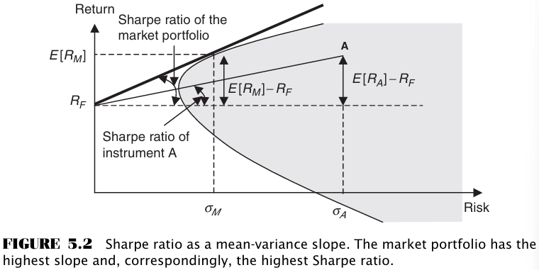
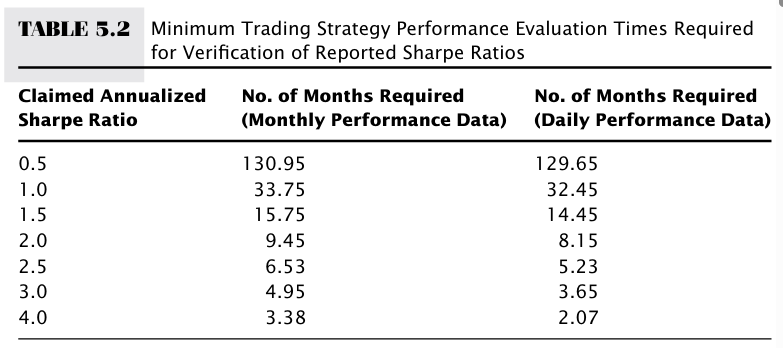

# CHAPTER 5 Evaluating Performance of High-Frequency Strategies

[TOC]

The high-frequency Sharpe ratio is computed as follows:
$$
SR = \frac{\overline{R}}{\sigma_{R}}
$$

- $\overline{R}$: the annualized average return from trading.
- $\sigma_{R}$: the annualized standard deviation of trading returns.
- $SR$: the Sharpe ratio.

## PERFORMANCE ATTRIBUTION

In a nutshell, performance attribution notes that $t$-period return on strategy $i$ that invests into individual securities with returns $r_{jt}$ in period $t$, with $j = 1, ..., J$, has an underlying factor structure:
$$
R_{it} = \sum_{j}x_{jt}r_{jt}
$$
, where $x_jt$ is the relative weight of the $j$th financial security in the portfolio at time $t$, $\sum_{j}x_{jt} = 1$. The $j$th financial security, in turn, has a period-$t$ return that can be explained by $K$ systematic factors:
$$
r_{jt} = \sum_{k}\lambda_{jk}F_{kt} + \varepsilon_{jt}
$$
, where $F_{kt}$ is one of $K$ underlying systematic factors in period $t, k = 1, ..., K$, $\lambda$ is the factor loading, and $\varepsilon_{jt}$ is the security $j$ idiosyncratic return in period $t$. Following Sharpe, factors can be assumed to be broad asset classes, as well as individual stocks or other securities. Combining up two equations, we can express returns as follows:
$$
R_{it} = \alpha_{i} + \sum_{k}b_{ik}F_{kt} + u_{it}
$$
, where $b_k$ measures the performance of the strategy that can be attributed to factor $k$, $\alpha_{i}$ measures the strategy's persistent ability to generate abnormal returns, and $u_{it}$ measures the strategy's idiosyncratic return in period $t$​​.

### Advantage

Performance attribution is a useful measure of strategy returns for the following reasons:

- The technique may accurately capture investment styles of black-box strategies in addition to the details reported by the designer of the strategy.
- Performance attribution is a measure of true added value of the strategy and lends itself to easy comparison with other strategies.
- Near-term persistence of trending factors allows forecasting of strategy performance based on performance attribution.

### Length of the Evaluation Period for High-Frequency Strategies

The higher the Sharpe ratio, the shorter the strategy evaluation period needed to ascertain the validity of the Sharpe ratio.

