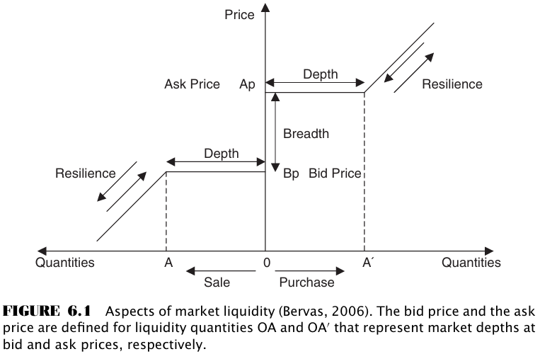

# CHAPTER 6 Orders, Traders, and Their Applicability ot High-Frequency Trading

[TOC]

Orders to buy or sell a security at the best available price when the order is placed are known as **market orders**. Orders to buy or sell a security at a particular price are known as **limit orders**.

