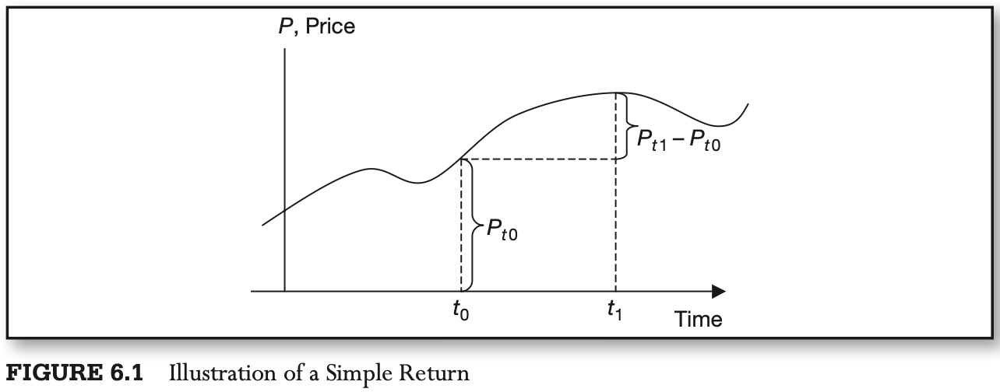
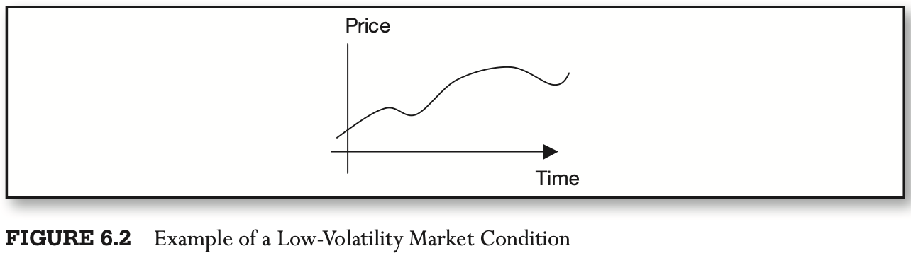
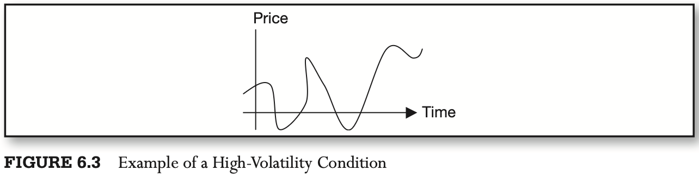
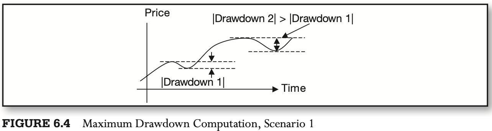
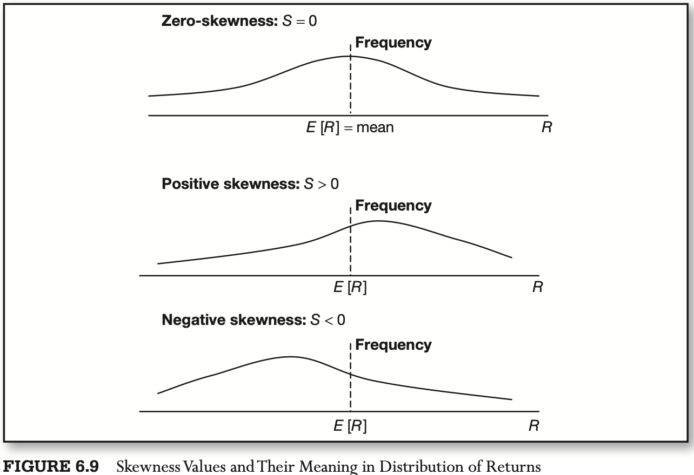
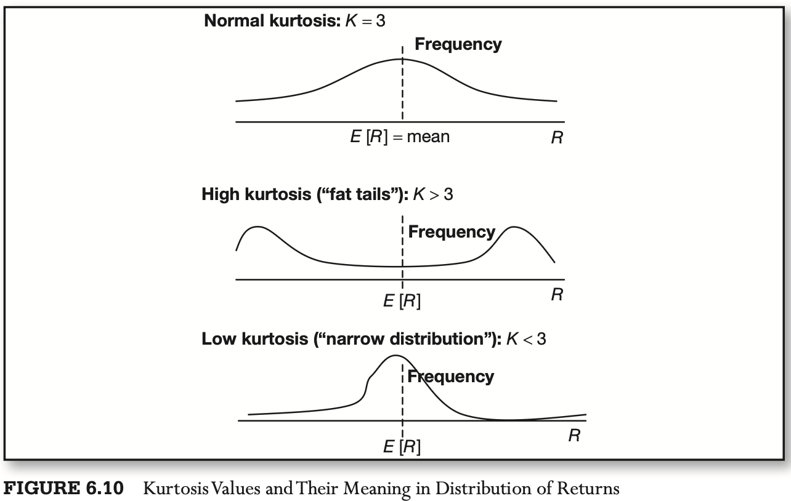

# CHAPTER 6 Performance and Capacity of High-Frequency Trading Strategies

[TOC]

## Principles of Performance Measurement

At the heart of a successful investment management to HFT lie three P's:

- Precision

  precision of mathematical metrics, refers to the exactitude required to quickly and reliably separate winning strategies from the losing ones.

- Productivity

  productivity of the investment process.

- Performance

  It is particularly relevant to high-frequency systems.

The simplest, least processed, data, such as tick data, is most informative and has consequently proven to be very valuable.

## Basic Performance Measures

### Return

Return can be expressed as a dollar difference in prices but is most often considered as a percentage change in value. The resulting dimensionless measure is independent of the price level of the financial instrument under consideration and allows easy cross-strategy and cross-asset comparison of performance:
$$
R_{t1} = \frac{P_{t1}}{P_{t0}} - 1
$$
, An equivalent log return metric is shown in equation:
$$
r_{t1} = ln(P_{t1}) - ln(P_{t0})
$$

### Volatility

Volatility of returns measures how much the return moves up and down around its average value. The movement of returns, often known as `dispersion`, is often taken as a measure of risk.

1. Simple standard deviation of returns:
   $$
   \hat{\sigma_{t}}^{2} = \frac{1}{N}\sum_{i = 1}^{N}(R_{t - i} - \overline{R_{t}})^{2}
   $$
   , where $\overline{R_{t}}$ is a simple average of $N$ observations preceding time $t$.

2. Weighted average deviation, emphasizing later observations, is also used often:
   $$
   \hat{\sigma_{t}}^{2} = \frac{\sum_{i = 1}^{N} w_i (R_{t - i} - \overline{R_t})^{2}}{\sum_{i = 1}^{N}w_i}
   $$
   , where $\overline{R} = \frac{\sum_{i = 1}^{N} w_i R_{t - i}}{\sum_{i = 1}^{N}W_i}$, and $w_i$ is the "data importance" weight corresponding to each individual returns $R$. All $w_i$ are often chosen to add up to 1 and to increase toward the most current observation:
   $$
   \sum_{i = 1}^{N}w_i = 1 \\
   w_i > w_{i + 1} > w_{i + 2} > \cdots > w_{i + N}
   $$

3. Average of open, high, low, and close prices is another metric of volatility:
   $$
   \hat{\sigma_{t}} = \frac{P_{t - N} + max(P_{\tau \in t - N, t - 1}) + min(P_{\tau \in t - N, t - 1}) + P_{t - 1}}{4}
   $$

4. High minus low recorded during a specific period of time is useful in analyses where many lagged variables are present:
   $$
   \hat{\sigma_{t}} = max(P_{\tau \in t - N, t - 1}) - min(P_{\tau \in t - N, t - 1})
   $$

5. Average square returns recorded over a certain period of time is yet another metric of volatility. This one has been shown to work particularly well with applications like generalized autoregressive conditional heteroskedasticity
   $$
   \hat{\sigma_{t}}^{2} = \frac{1}{N} \sum_{i = 1}^{N}(R_{t - i})^{2}
   $$

### Drawdown

Drawdown is measure of historical loss. It is recorded as a maximum loss relative to the highest previous value, the latter often referred to as the `water mark`.

The global maximum measured on the past data at any point in time is known as `high water mark`. A drawdown is then the lowest return in between two successive high water marks. The lowest drawdown is known as the maximum drawdown:
$$
max\ Drawdown = max_{\tau} P_{t \in \tau} - min_{\tau} P_{t_2 \in \tau} | \forall_{t_1} < t_2
$$

### Win Ratio

Win ratio explains what portion of the trades, trading days or trading months ended profitably:
$$
\text{WinRatio} = \frac{\text{\#Trading Periods}|_{Gain > 0}}{\text{Total\#Trading Periods}}
$$
, Win ratios help compare accuracy of predictive signals of strategies: better forecasts result in higher win ratios.

### Average Gain/Loss

Average gain and average loss are two metrics, statistically closely related to maximum drawdown.

Formally, for the strategy to deliver positive performance, the following inequality must hold:
$$
E[R] \geq (WinRatio) * E[Gain] + (1 - WinRatio) * E[Loss]
$$

### Correlation

Correlation measures co-movement of strategy returns with those of another strategy or financial instrument:
$$
\rho_{1,2} = \sum_{t}(R_{1,t} - E[R_1])(R_{2,t} - E[R_2])
$$
The `asymmetric` or `tail correlation` that can be computed by dividing the data sample into points when price returns of one of the instruments measured are positive and negative:
$$
\rho_{1,2} | R_1 > 0 = \sum_{t}(R_{1,t} - E[R_1])(R_{2,t} - E[R_2]) |_{R_1 > 0} \\
\rho_{1,2} | R_1 < 0 = \sum_{t}(R_{1,t} - E[R_1])(R_{2,t} - E[R_2]) |_{R_1 < 0}
$$

### Alpha and Beta

At its most basic level, alpha measures the return achieved by the strategy abstracted of any influences by the reference portfolio or the broader markets, measured by, say, the S&P 500 index.

Alpha reflects the performance of the strategy that is independent of the prevailing market conditions.

Beta is a multiplier that measures exactly how the strategy responds to the current market trends.

Alpha and beta are estimated using a linear regression (OLS):
$$
R_{i,t} = \alpha_{i} + \beta_{i}R_{p,t} + \varepsilon_{i,t}
$$
, where $R_{i,t}$ is the return on a high-frequency strategy $i$ observerd over a unit of time $t$, $R_{p,t}$ is the return on the reference portfolio observed over the same period of time, $\alpha_{i}$ and $\beta_{i}$ are the parameters to be estimated, and $\varepsilon_{i,t}$ is the "statistical estimation error" sepcific to each observation when above equation is applied to data. By the assumptions of the model of above equation, the errors $\varepsilon_{i,t}$ average to zero.

### Skewness and Kurtosis

Skewness and kurtosis are additional parameters used to describe the distribution of returns of the strategy. `Skewness` sescribes the tendency of the strategy to deliver positive or negative returns. Positive skewness of a return distribution implies that the strategy is more likey to post positive returns than negative returns.

`Kurtosis` measures the likelihood of extreme occurrences, that is, of severely positive and serverely negative returns relative to normal returns. When kurtosis is high, extreme returns are likely. When kurtosis is low, extreme returns are unlikely.

### Comparative Ratios

TODO