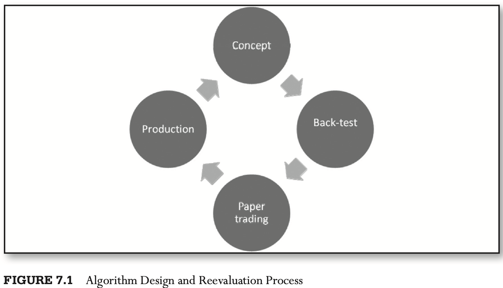

# CHAPTER 7 The Business of High-Frequency Trading

[TOC]

## Key Processes of HFT

The central value proposition of HFT is enabled by tick-by-tick data processing and high capital turnover. The technology behind identifying small changes in the quote stream is what differentiates this business and enables a trader to send rapid-fire signals to open and close positions.

In the development of a successful HFT system, human time is functionally split as follows:

- Quant HFT model development/proof of concept including back-tests: 15 percent.
- Risk management principles, model validation and policy development: 10 percent.
- Coding of trading and risk-management infrastructure: 40 percent.
- System testing: 20 percent.
- Run-time monitoring: 5 percent.
- Compliance and other administrivia: 10 percent.

### Financial Markets Suitable for HFT

To be appropriate for trading at high frequencies, two requirements must be met:

- The ability to quickly move in and out of positions.
- Sufficient market volatility to ensure that changes in prices exceed transaction costs.

### Economics of HFT

1. Costs of Doing HFT Business.

2. Costs of Data

   - Hardware
   - Connectivity
   - Software
   - Electronic Execution
   - Custody and Clearing
   - Staffing Costs
   - Administrative and Legal Costs

3. Capitalization of HFT

   The amount of the initial equity required depends on many factors, but can be approximated using the following variables:

   - Profitability of the HFT strategy to be traded with live capital.
   - Cost structure of the trading operation.
   - Sharpe ratio of the strategy.
   - Maximum drawdown of the strategy.

### Leverage of HFT

When the Sharpo ratio increases, the expected return in the numerator and the volatility in the denominator of the ratio increase proportionally by the amount of leverage, $L$:
$$
Sr^{HFT} = \frac{E[R_{annualized}]}{\sigma[R_{annualized}]} = \frac{E[R_{annualized}] \times L}{\sigma[R_{annualized}] \times L}
$$
, The expected return of the high-frequency operation must take into account the costs of doing business, so the Sharpe ratio of an HFT business is adjusted for expenses:
$$
SR^{\text{HFT Ops}} = \frac{E[R_{annualized}] \times L \times (Capital) - (\text{Annualized Expenses})}{\sigma[R_{annualized}] \times L \times (Capital)}
$$
, or, using daily data, and assuming 250 trading days per year:
$$
SR^{\text{HFT Ops}} = \frac{E[R_{daily}]\times L \times (Capital) - (\text{Daily Expenses})}{\sigma[R_{daily}] \times L \times (Capital)} \sqrt{250}
$$
, Expressions in above equations have to be positive for a profitable business, yet the leverage value $L$ cannot be increased infinitely.
