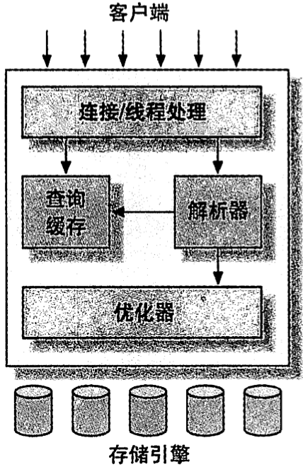

# 第一章 MySQL架构与历史

[TOC]


## MySQL逻辑架构



*MySQL服务器逻辑架构图*

### 连接管理与安全性

### 优化与执行


## 并发控制

### 读写锁

- `读锁（read lock）/共享锁（shared lock）` 共享的，互不阻塞；可以在同一时间同时读取同一资源而互不干扰；
- `写锁（write lock）/排他锁（exclusive lock）` 排他的，一个写锁会阻塞其它写锁和读锁；同一时间只允许一个用户写入，并防止其它用户读取正在写入的资源；

### 锁粒度

- `表锁（table lock）` 锁定整张表，是开销最小的策略；
- `行级锁（row lock）` 开销较大；


## 事务

ACID：

- 原子性(aotmicity)
- 一致性(consistency)
- 隔离性(isolation)
- 持久性(durability)

`脏读（Dirty Read）` 事务可以读取未提交的数据；。

`幻读（Phantom Read）` 当某个事务再次读取该范围的记录时，会产生幻行（Phantom Row）。 

### 隔离级别

- `READ UNCOMMITTED(未提交读)` 事务中的修改，即使没有提交，对其他事务也是可见的；
- `READ COMMITTED(提交读)` 大多数数据库的默认级别；事务从开始到提交之前，所做的任何修改对其他事务都是不可见的；
- `REPEATABLE READ(可重复读)` 在同一个事务中多次读取同样记录的结果是一致的；
- `SERIALIZABLE(可串行化)` 强制事务串行执行，在读入的每一行数据上都加锁。

ANSI SQL隔离级别：

| 隔离级别         | 脏读可能性 | 不可重复读可能性 | 幻读可能性 | 加锁读 |
| ---------------- | ---------- | ---------------- | ---------- | ------ |
| READ UNCOMMITTED | Yes        | Yes              | Yes        | No     |
| READ COMMITTED   | No         | Yes              | Yes        | No     |
| REPEATABLE READ  | No         | No               | Yes        | No     |
| SERIALIZABLE     | No         | No               | No         | Yes    |

### 死锁

`死锁` 两个或多个事务在同一资源上相互占用，并请求锁定对方占用的资源，从而导致恶性循环的现象。

### 事务日志

采用追加方式将**数据修改行为**而不是数据本身存入磁盘，如果数据的修改已经记录到日志并持久化，但数据本身还没有写回磁盘，此时系统崩溃，存储引擎在重启时能够自动回复这部分修改的数据。

### MySQL中的事务

MySQL默认采用自动提交（AUTOCOMMIT）模式，每个查询都被当作一个事务执行提交操作。

InnoDB采用`两阶段锁定协议（two-phase locking protocol）`。在事务执行过程中，随时都可以执行锁定，锁只有在执行COMMIT或者ROLLBACK的时候才会释放，并且所有的锁是在同一时刻被释放。


## 多版本并发控制

`多版本并发控制（Multiversion Concurrency Control，MVCC）`：

- `乐观（optimistic）并发控制`
- `悲观（pessimistic）并发控制`

MVCC只在`REPEATABLE READ`和`READ COMMITTED`两个隔离级别下工作，与其他隔离级别不兼容。


## MySQL的存储引擎

可以使用以下命令显示表的相关信息：

```sh
SHOW TABLE STATUS LIKE 'xx' \G # 显示表xx的信息
```

### InnoDB存储引擎

InnoDB是MySQL中的默认事务型引擎，被设计用来处理：大量正常提交，很少被回滚的短期(short-lived)事务。

InnoDB采用MVCC来支持高并发，默认使用`REPEATABLE READ（可重复读）`隔离级别。

通过使用`间隙锁（next-key locking）`同时锁定查询涉及的行和索引中的间隙，防止"幻读"的出现。

InnoDB基于聚簇索引建立表，由于聚簇索引的二级索引（secondary index，非主键索引）必须包含主键列，所以要求主键应尽可能的小，不然会导致所有索引都很大。

### MyISAM存储引擎

MyISAM是MySQL 5.1版本以前的默认存储引擎，设计简单，数据以紧密格式存储，在某些场景下性能很好；但是，不支持事务和行级锁，崩溃后无法安全恢复。

MyISAM特性：

| 特性                                | 描述                                                         |
| ----------------------------------- | ------------------------------------------------------------ |
| 加锁与并发                          | 对整张表加锁，而不是针对行。                                 |
| 修复                                | MySQL可以手工活自动地对MyISAM表执行检查和修复（速度非常慢，且可能会导致数据丢失） |
| 索引特性                            | 支持全文索引                                                 |
| 延迟更新索引键（Delayed Key Write） | 通过指定`DELAY_KEY_WRITE`选项，在每次修改执行完成时，将修改的索引写入到内存中的键缓冲区（in-memory key buffer） |
| 压缩表                              | 使用`myisampack`对那些创建并倒入数据后，不会再进行修改操作的表进行压缩，可以极大减少磁盘占用和I/O |

### MySQL内建的其它存储引擎

- Archive引擎
- Blackhole引擎
- CSV引擎
- Federated引擎
- Memory引擎
- Merge引擎
- NDB集群引擎

### 第三方存储引擎

OLTP类引擎：

面向列的存储引擎：

社区存储引擎：

### 选择合适的引擎

选择存储引擎时需要考虑以下几个因素：

- 事务
- 备份
- 崩溃恢复
- 特有的特性

### 转换表的引擎

将存储引擎转换为另一种存储引擎的方法：

1. ALTER TABLE

   可适用于任何存储引擎，但是需要执行很长时间；

   例，将表xx的引擎修改为InnoDB：

   ```sh
   ALTER TABLE xx ENGINE = InnoDB;
   ```

2. 导出与导入

   使用mysqldump工具将数据导出到文件，然后修改文件中的`CREATE TABLE`语句的存储引擎选项；

3. 创建与查询（CREATE和SELECT）

   例，（小数据量）将表xxx的引擎修改为xx：

   ```sh
   CREATE TABLE xx LIKE xxx;
   ALTER TABLE xx ENGINE=InnoDB;
   INSERT INTO xx SELECT * FROM xxx;
   ```

   例，（大数据量）将表xxx的引擎修改为xx：

   ```sh
   START TRANSACTION;
   INSERT INTO xx SELECT * FROM xxx WHERE id BETWEEN x AND y;
   COMMIT;
   ```


## MySQL时间线（Timeline）


## MySQL的开发模式


