# 第十章 复制

[TOC]


## 复制概述

MySQL支持两种复制方式：

- 基于行的复制
- 基于语句的复制

以上两种复制方式都是通过在主库上记录二进制日志，在备用库重放日志的方式来实现异步的数据复制。

### 复制解决的问题

- 数据分布
- 负载均衡
- 备份
- 高可用性和故障切换
- MySQL升级测试

### 复制如何工作

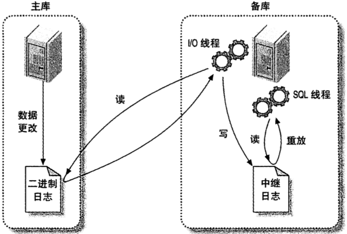

*MySQL复制如何工作*

1. 在主库上把数据更改记录到二进制日志（Binary Log）中。
2. 备库将主库上的日志复制到自己的中继日志（Relay Log）中。
3. 备库读取中继日志中的事件，将其重放到备库数据之上。


## 配置复制

### 创建复制账号

使用如下命令创建复制账号：

```sql
GRANT REPLICATION SLAVE, REPLICATION CLIENT ON *.* TO repl@'192.168.0.%' IDENTIFIED BY 'p4ssword',; # 创建账号，并赋予REPLICATION SLAVE权限和REPLICATION CLIENT
```

将REPLICATION CLIENT赋给主/备库的原因：

- 用来监控和管理复制的账号需要REPLICATION CLIENT权限，并且针对这两种目的使用同一个账号更加容易（而不是为某个目的单独创建一个账号）。
- 如果在主库上建立了账号，然后从主库将数据克隆到备库上时，备库也就设置好了-变成主库所需的配置；这样后续有需要可以方便地交换主备库的角色。

### 配置主库和备库

主库配置：

```ini
log_bin   = mysql-bin # 使用二进制日志
server_id = 10 # 服务器ID（唯一）
```

使用如下命令检查配置：

```sql
SHOW MASTER STATUS;
```

备库配置：

```ini
log_bin           = mysql-bin # 使用二进制日志
server_id         = 2 # 服务器ID
relay_log         = /var/lib/mysql/mysql-relay-bin # 中继日志的位置和名字
log_slave_updates = 1 # 允许将其重放的事件也记录到自身的二进制日志中
read_only         = 1 # 组织任何没有特权权限的线程修改数据
```

### 启动复制

使用如下命令设置对应的主库地址：

```sql
CHANGE MASTER TO 
	MASTER_HOST='server1',
	MASTER_USER='repl',
	MASTER_PASSWORD='p4ssword',
	MASTER_LOG_FILE='mysql-bin.000001',
	MASTER_LOG_POS=0;
```

使用如下命令开始复制：

```sql
START SLAVE;
```

使用如下命令检查复制是否正确执行：

```sql
SHOW SLAVE STATUS\G
```

使用如下命令查看复制线程的工作情况：

```sql
SHOW PROCESSLIST\G
```

### 从另一个服务器开始复制

让主/备库保持同步的条件：

- 在某个时间点的主库的数据快照。
- `日志文件坐标（log file coordinates）` 主库当前的二进制日志文件和获得数据快照时在该二进制日志文件中的偏移量。
- 从快照时间到现在的二进制日志。

从别的服务器克隆备库的方法：

- `使用冷备份` 关闭主库，把数据复制到备库。

- `使用热备份` 如果仅使用了MyISAM表，可以在主库运行时使用mysqlhotcopy或rsync来复制数据。

- `使用mysqldump` 

  ```sh
  mysqldump --single-transaction --all-databases --master-data=1 --host=server1 | mysql --host=server2
  ```

  - `--single-transaction` 使得转储的数据为事务开始前的数据。
  - `--lock-all-tables` 获得所有表的一致性转储。

- `使用快照或备份` 只要知道对应的二进制日志坐标，就可以使用主库的快照或者备份来初始化备库。

- `使用Percona Xtrabackup` 

- `使用另外的备库` 使用任何一种提及的克隆或者拷贝技术来从任意一台备库上将数据克隆岛另外一台服务器。

### 推荐的复制配置

| 与复制相关的配置                | 说明                                                         |
| ------------------------------- | ------------------------------------------------------------ |
| innodb_flusn_logs_at_trx_commit |                                                              |
| innodb_support_xa               |                                                              |
| innodb_safe_binlog              |                                                              |
| log_bin                         |                                                              |
| read_only                       | 阻止大部分用户更改非临时表。                                 |
| relay_log                       | 命名中继日志文件（避免基于机器名命名）。                     |
| relay_log_purge                 | SQL线程在重放完一个中继日志中的事件后会尽快将其删除。        |
| relay_log_space_limit           | 当所有中继日志的大小之和超过这个值，I/O线程停止，等待SQL线程释放磁盘空间。 |
| sync_binlog                     | 每次在提交事务前将二进制日志同步到磁盘上，保证服务器崩溃时不会丢失事件。 |
| skip_slave_start                | 阻止备库在崩溃后自动启动复制。                               |
| sync_master_info                |                                                              |
| sync_relay_log                  |                                                              |
| sync_relay_log_info             |                                                              |


## 复制的原理

### 基于语句的复制

### 基于行的复制

### 基于行或语句：哪种更优

两种复制模式对比：

| 复制模式     | 优点                                                         | 缺点                                                         |
| ------------ | ------------------------------------------------------------ | ------------------------------------------------------------ |
| 基于语句复制 | - 当主备的模式不同时，逻辑复制能够在多种情况下工作。<br>- 容易定位复制过程出现的问题。 | - 很多情况下无法正确复制。<br>- CPU占用高。                  |
| 基于行复制   | - 基本适用于所有场景。<br>- 减少锁的使用。<br>- 有利于数据恢复。<br>- 占用更少的CPU。<br>- 有利于及时发现数据不一致的行为。 | - 无法处理在备库修改表的schema的情况。<br>- 难以定位复制过程中出现的问题。 |

### 复制文件

复制时用到的文件：

| 文件                   | 说明                                                       |
| ---------------------- | ---------------------------------------------------------- |
| `mysql-bin.index`      | 二进制日志功能开启时创建，用于记录磁盘上的二进制日志文件。 |
| `mysql-relay-bin-index | 中继日志的索引文件，作用类似于`mysql-bin.index`。          |
| `master.info`          | 用于保存备库连接到主库所需要的信息。                       |
| `relay-log.info`       | 保存当前备库复制的二进制日志和中继日志坐标。               |

### 发送复制事件到其他备库

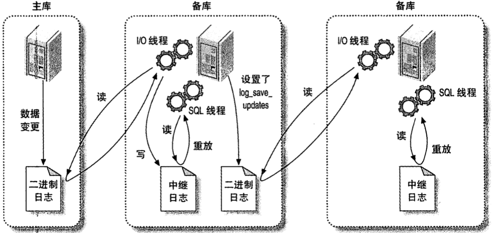

*将复制事件传递到更多的备库*

### 复制过滤器

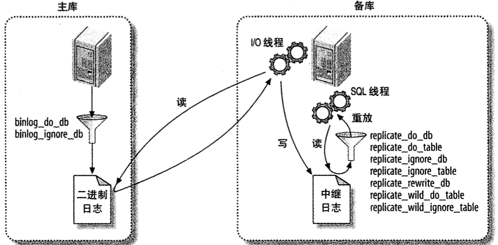

*复制过滤选项*

**注意：复制过滤很容易发生问题。**


## 复制拓扑

- 一个MySQL备库示例只能有一个主库。
- 每个备库必须有一个唯一的服务器ID。
- 一个主库可以有多个备库，一个备库可以有多个兄弟备库。
- 如果打开了`log_slave_updates`选项，一个备库可以把其主库上的数据变化传播到其他备库。

### 一主库多备库

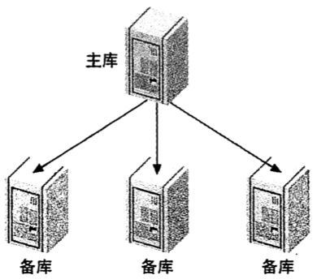

*一主多备结构*

用途：

- 为不同的角色使用不同的备库。
- 把一台备库当作待用的主库，除了复制没有其他数据传输。
- 将一台备库放到远程数据中心，用作灾难恢复。
- 延迟一个或多个备库，以备灾难恢复。
- 使用其中一个备库，作为备份，培训，开发或者测试使用服务器。

### 主动-主动模式下的主-主复制

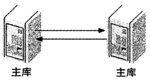

*主-主复制*

`主-主复制（也叫做双主复制或双向复制）` 包含两台服务器，每一个都被配置成对方的主库和备库。

### 主动-被动模式下的主-主复制

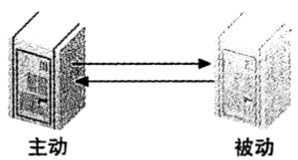

*主动-被动模式下的主-主复制*

### 拥有备库的主-主结构

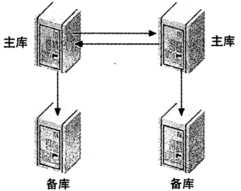

*拥有备库的主-主结构*

### 环形复制

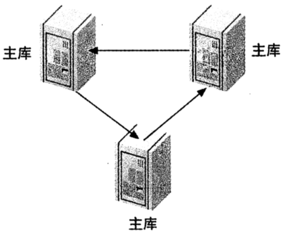

*环形复制拓扑*

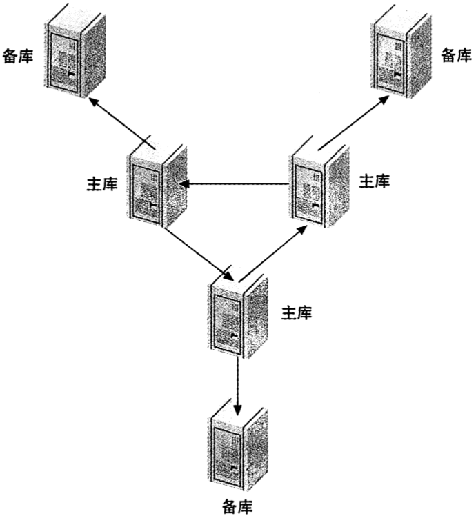

*拥有备库的环形结构*

### 主库，分发主库以及备库

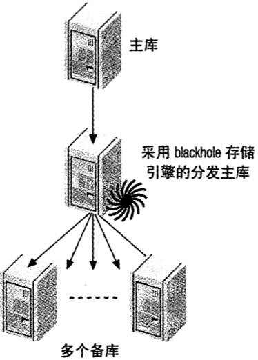

*一个主库，一个分发主库和多个备库*

### 树或金字塔形

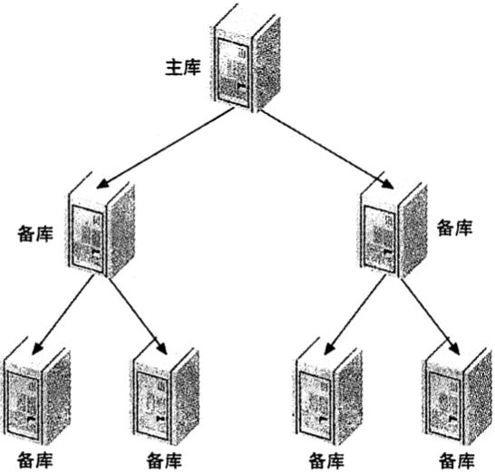

*金字塔形复制拓扑*

### 定制的复制方案

- 选择性复制

- 分离功能

- 数据归档

- 将备库用作全文检索

- 只读备库

- 模拟多主库复制

  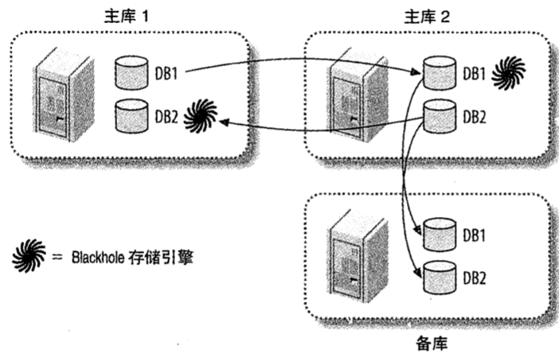

  *使用双主结构和blackhole存储引擎表模拟多主复制*

  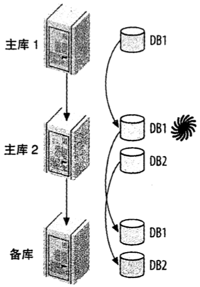

  *另一种模拟多主复制的方法*

- 创建日志服务器

  使用日志服务器比用`mysqlbinlog`来实现恢复更好的原因：

  1. 复制作为应用二进制日志的方法已经被大量的用户所测试，能够证明是可行的。`mysqlbinlog`并不能确保像复制那样工作，并且可能无法正确生成二进制日志中的数据更新。
  2. 复制的速度更快，因为无须将语句从日志导出来并传给MySQL。
  3. 可以很容易观察到复制过程。
  4. 能够更方便处理错误。
  5. 更方便过滤复制事件。
  6. 有时候`mysqlbinlog`会因为日志记录格式更改而无法读取二进制日志。


## 复制和容量规划

### 为什么复制无法扩展写操作

复制只能扩展读操作，无法扩展写操作；因为分发读操作那样把写操作等同地分发到更多服务器上。

### 备库什么时候开始延迟

### 规划冗余容量

构建冗余容量也是实心啊高可用性的最佳方式之一。


## 复制管理和维护

### 监控复制

查看主库当前有那些二进制日志在磁盘上的命令：

```sql
SHOW MASTER LOGS;
```

查看复制事件的命令：

```sql
SHOW BINLOG EVENTS IN 'mysql-bin.000223' FROM 12634\G # 查看偏移量为13634的二进制日志上的复制事件
```

### 测量备库延迟

造成备库延迟测量不准确的原因：

- 备库`Seconds_behind_master`值是通过将服务器当前的时间戳与二进制日志中的事件的时间戳相对比得到的，所以只有在执行事件时才能报告延迟。
- 如果备库复制线程没有运行，就会报延迟为NULL。
- 一些错误（如主备的`max_allowed_packet`不匹配，或者网络不稳定）可能中断复制/或者停止复制线程，但`Seconds_beind_master`将显示为9而不是显示错误。
- 即使备库线程正在运行，备库有时候可能无法计算延时。如果发生这种情况，备库会报0或者NULL。
- 一个大事务可能会导致延迟波动。
- 如果分发主库落后了，并且其本身也有已经追赶上它的备库，备库的延迟将显示为0，而事实上和源主库之间是有延迟的。

### 确定主备是否一致

### 从主库重新同步备库

### 改变主库

计划内提升备库为主库：

1. 停止向老的主库写入。
2. 让备库追赶上主库。
3. 将一台备库配置为新的主库。
4. 将备库和写操作指向新的主库，然后开启主库的写入。

计划外提升备库为主库：

1. 确定哪台备库的数据最新；检查每台备库上`SHOW SLAVE STATUS`命令的输出，选择其中`Master_Log_File/read_Master_Log_Pos`的值最新的那个。
2. 让所有备库执行完所有其从崩溃前的旧主库那获得的中继日志；如果在未完成前修改备库的主库，它会抛弃剩下的日志事件，从而无法获知该备库在什么地方停止。
3. 执行前一小节的5～7步。
4. 比较每台备库和新主库上的`Master_Log_File/Read_Master_Log_Pos`的值。
5. 执行前一小节的10～12步。

确定期望的日志位置：

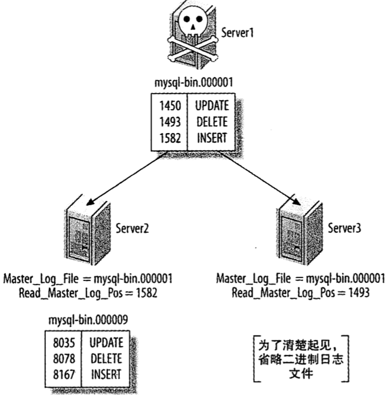

*当server1崩溃，server2已追赶上，但server3的复制落后*

### 在一个主-主配置中交换角色

通过以下步骤切换服务器角色，可以避免更新冲突的危险：

1. 停止主动服务器上的所有写入。
2. 在主动服务器上执行`SET GLOBAL read_only=1`，同时在配置文件里也设置一下`read_only`，防止重启后失效。
3. 在主动服务器上执行`SHOW MASTER STATUS`并记录二进制日志坐标。
4. 主动使用服务器上的二进制日志坐标在被动服务器上执行`SELECT MASTER_POS_WAIT()`；该语句将阻塞住，知道复制跟上主动服务器。
5. 在被动服务器上执行`SET GLOBAL read_only=0`，这样就变换成主动服务器。
6. 修改应用的配置，使其写入到新的主动服务器中。


## 复制的问题和解决方案

TODO

