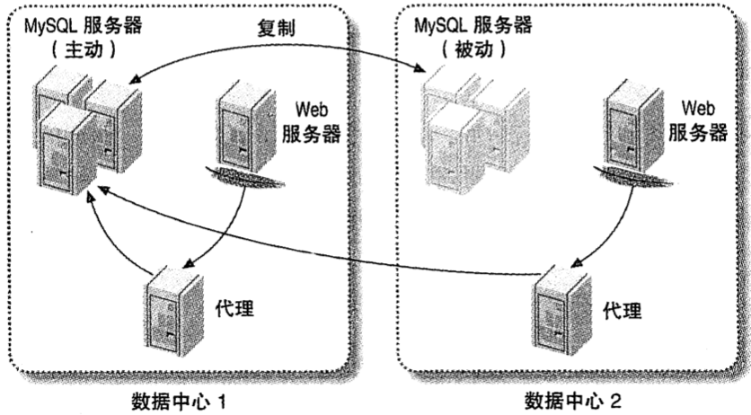

# 第十二章 高可用性

[toc]

## 什么是高可用性

## 导致宕机的原因

| 大类           | 子类                                                |
| -------------- | --------------------------------------------------- |
| 运行环境       | - 磁盘空间耗尽；                                    |
| 性能           | - 糟糕的SQL语法；` `- 糟糕的Schema和索引设计； |
| 复制           | - 主备数据不一致；                                  |
| 数据丢失或损坏 | - DROP TABLE的误操作；                              |
| 其他           |                                                     |

## 如何实现高可用性

### 提升平均失效时间（MTBF）

- 测试恢复工具和流程，包括从备份中恢复数据。
- 遵从最小权限原则。
- 保持系统干净，整洁。
- 使用好的命名和组织约定来避免产生混乱。
- 谨慎安排升级数据库服务器。
- 在升级前，使用诸如PerconaToolkit中的pt-upgrade之类的工具仔细检查系统。
- 使用InnoDB并进行适当的配置，确保InnoDB是默认存储引擎。如果存储引擎被禁止，服务器就无法启动。
- 确认基本的服务器配置是正确的。
- 通过skip_name_resolve禁止DNS。
- 除非能证明有效，否则禁止查询缓存。
- 避免使用复杂的特性。
- 监控重要的组件和功能。
- 尽量记录服务器的状态和性能指数，如果可能就尽量久地保存。
- 定期检查复制完整性。
- 将备库设置为只读，不要让复制自动启动。
- 定期进行查询语句审查。
- 归档并清理不需要的数据。
- 为文件系统保留一些空间。
- 养成习惯，评估和管理系统的改变，状态以及性能信息。

### 降低平均恢复时间（MTTR）

通过在系统中建立冗余来避免系统完全失效，并避免单点失效问题。

## 避免单点失效

采用两种方法为系统增加冗余：

- 增加冗余容量
- 重复组件

### 共享存储或磁盘复制

`磁盘复制技术（DRBD）`的缺点：

- DRBD的故障转移无法做到秒级以内。
- 必须在主动-被动模式下运行，代价昂贵。
- MyISAM表崩溃后需要花费很长时间来检查和修复，对于MyISAM表实际用处不大。
- DRBD无法代替备份。
- 对写操作而言增加了负担。

### MySQL同步复制

1. MySQL Cluster
2. Percona XtraDB Cluster

### 基于复制的冗余

## 故障转移和故障恢复

`故障转移（failover）`

`回退（fallback）`

`切换（switchover）`

### 提升备库或切换角色

### 虚拟IP地址或IP接管

为需要提供特定服务的MySQL实例指定一个逻辑IP地址，当MySQL实例失效时，可以将IP地址转移到另一台MySQL服务器上。

缺点：

- 需要把所有的IP地址定义在同一网段，或者使用网络桥接。
- 改变IP地址需要系统root权限。
- 有时候还需要更新ARP缓存。
- 需要确定网络硬件支持快速IP接管。
- 有些服务器即使完全丧失功能也会保持持有IP地址，所以可能需要从物理上关闭或断开网络连接。

### 中间件解决方案

*使用中间件来在各数据中心间路由MySQL连接*

### 在应用层中处理故障转移

## 总结
