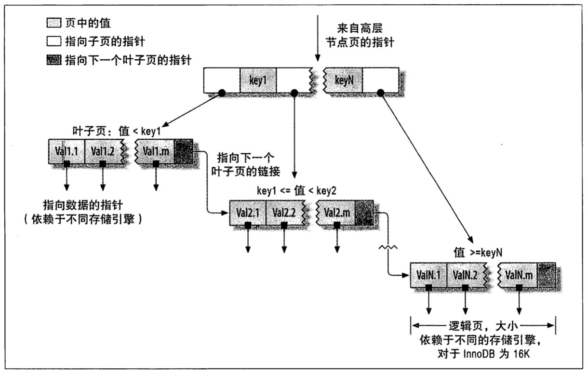
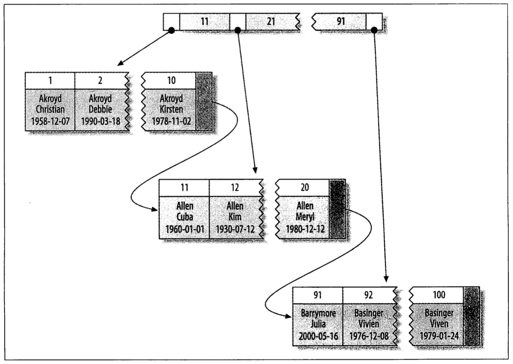
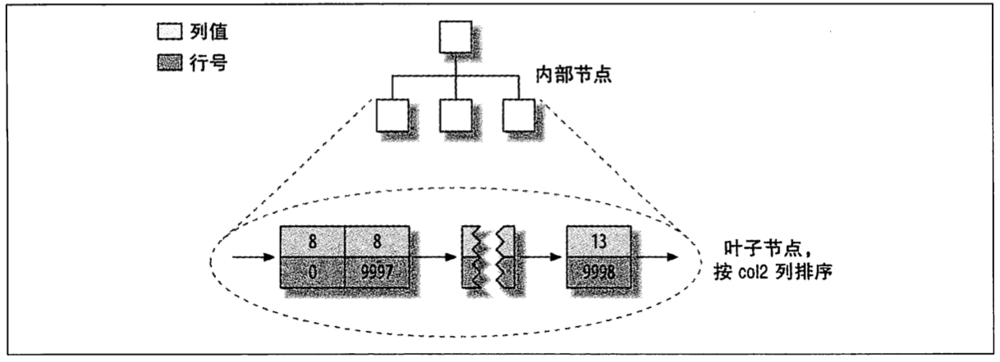
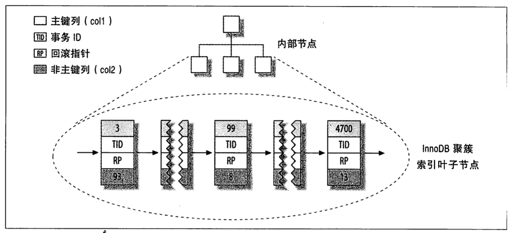
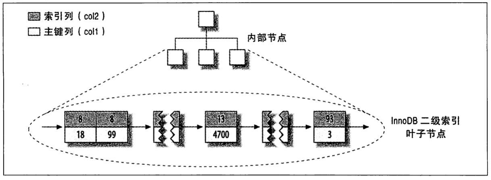
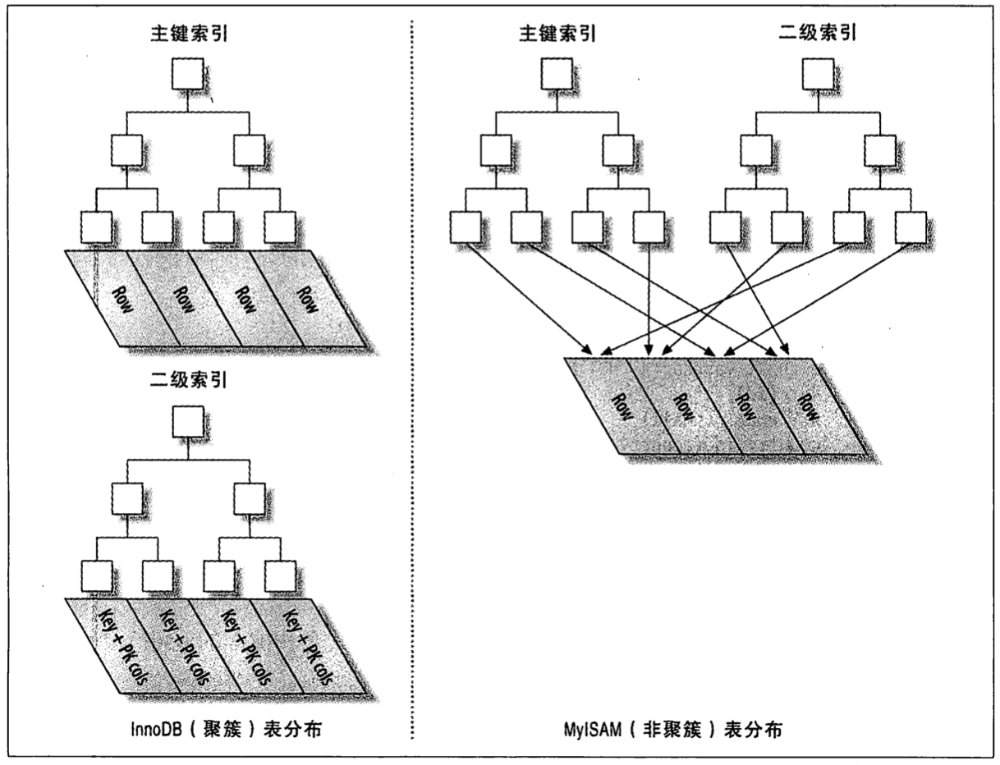
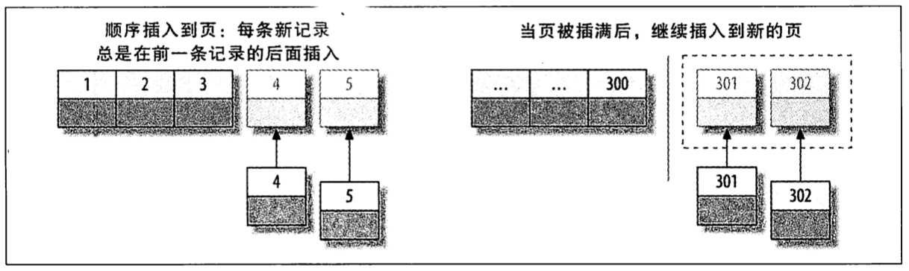
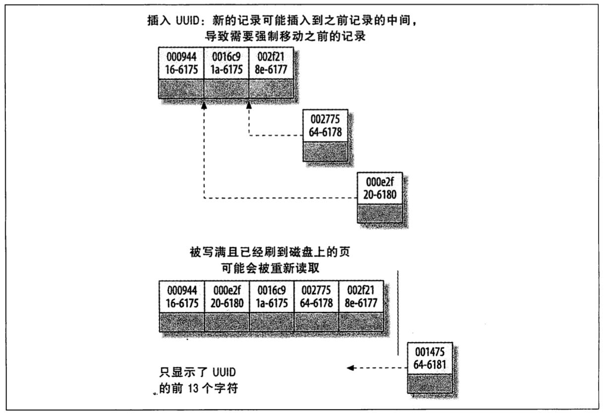
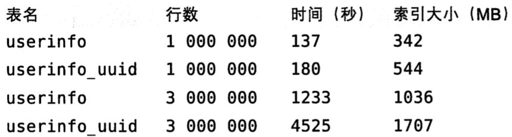

# 第五章 创建高性能的索引

[TOC]


## 索引基础

如果索引包含多个列，MySQL只能高效地使用索引最左前缀列。

### 索引的类型

- B-Tree索引

  B-Tree通常意味着所有的值都是按顺序存储的，并且每一个叶子页到根的距离相同；存储引擎从B-Tree索引的根节点开始搜索，而不再需要进行全表扫描来获取需要的数据，能搞加快访问数据的速度。

  

  *建立在B-Tree结构（从技术上来说是B+Tree）上的索引*

  索引对多个值进行排序的依据是CREATE TABLE语句中定义索引时列的顺序。

- 哈希索引

  哈希索引（hash index）基于哈希表实现，只有精确匹配索引所有列的查询才有效；存储引擎对所有的索引列计算一个`哈希码（hash code）`，并将所有的哈希码存储在索引中，同时在哈希表中保存指向每个数据行的指针。

  因为索引自身只需存储对应的哈希值，所以索引的结构十分紧凑，这让哈希索引查找的速度**非常快**。

  在存储引擎不支持哈希索引的情况下，基于B-Tree创建自定义哈希索引：

  1. 定义表

     ```sql
     CREATE TABLE pseudohash (
     	id int unsigned NOT NULL auto_increment,
       url varchar(255) NOT NULL,
       url_crc int unsigned NOT NULL DEFAULT 0,
       PRIMARY KEY(id)
     );
     ```

  2. 创建触发器

     ```sql
     DELIMITER // 
     CREATE TRIGGER pseudohash_crc_ins BEFORE INSERT ON pseudohash  FOR EACH ROW BEGIN 
     SET NEW.url_crc=crc32(NEW.url);
     END;
     //
     
     CREATE TRIGGER pseudohash_crc_upd BEFORE UPDATE ON pseudohash  FOR EACH ROW BEGIN
     SET NEW.url_crc=crc32(NEW.url);
     END;
     //
     
     DELIMITER;
     ```

  3. 使用

     ```sql
     INSERT INTO pseudohash (url) VALUES ('http://www.mysql.com');
     
     UPDATE pseudohash SET url='http://www.mysql.com/' WHERE id = 1;
     
     SELECT word, crc FROM words WHERE crc = CRC32('gnu') AND word = 'gnu'; # 避免哈希冲突的写法
     ```

- 空间数据索引（R-Tree）

  R-Tree主要用作地理数据存储，无须前缀查询。

- 全文索引

  主要用于查找文本中的关键词。

| 索引         | 适用场景                                                     | 限制                                                         |
| ------------ | ------------------------------------------------------------ | ------------------------------------------------------------ |
| B-Tree索引   | - 全值（所有列）匹配；<br>- 最左前缀（第一列）匹配；<br>- 列前缀（某一列值的开头部分）匹配；<br>- 范围匹配；<br>- 精确匹配某一列并范围匹配另一列；<br>- 只访问索引（无需访问数据行）的查询。 | - 如果不是按照索引的最左列开始查找，则无法使用索引；<br>- 不能跳过索引中的列；<br>- 如果查询中有某个列的范围查询，则其右边所有列都无法使用索引优化查找。 |
| 哈希索引     | - 只有简单的查找，无排序等需求的场景；<br>- 对性能非常敏感。 | - 不能使用索引中的值来避免读取行；<br>- 无法用于排序；<br>- 不支持部分索引列匹配查找；<br>- 不支持范围查询；<br>- 当出现哈希冲突时，对性能有较大影响；并且对索引的维护操作代价很高。 |
| 空间数据索引 | - 主要用于GIS场景。                                          | - MySQL对GIS支持很烂。                                       |
| 全文索引     | - 适用于MATCH AGAINST操作                                    |                                                              |


## 索引的优点

- 索引大大减少了服务器需要扫描的数据量；
- 索引可以帮助服务器避免排序和临时表；
- 索引可以将随机I/O变为顺序I/O。

对于非常小的表，简单的全表扫描更高效；对于中到大型的表，索引非常有效；对于特大型表，使用索引的代价非常大。


## 高性能的索引策略

### 独立的列

查询时，索引列不能是表达式的一部分，也不能是函数的参数。

例，下面为一些常见的错误：

```sql
SELECT actor_id FROM sakila.actor WHERE actor_id + 1 = 5; # 这里无法使用actor_id列的索引，因为它是表达式的一部分；

SELECT ... WHERE TO_DAYS(CURRENT_DATE) - TO_DAYS(date_col) <= 10; # 它是函数的参数；
```

### 前缀索引和索引选择性

`索引选择性` 不重复的索引值（cardinality，基数）和数据表的记录总数（`#T`）的比值，范围从`1/#T`到`1`之间；索引的选择性越高则查询效率越高。

索引很长的字符串会让索引变的大且慢，必须使用索引前缀来提升索引效率；索引前缀的长度需要同时满足较高的选择性和节约空间这两项要求，所以长度不能过长或过短。

**注意：虽然前缀索引是一种能使索引更小，更快的有效方法；但是，MySQL无法使用前缀索引做ORDER BY和GROUP BY，也无法使用前缀索引做覆盖扫描。**

例，前缀索引的使用：

1. 创建示例数据集

   ```sql
   CREATE TABLE sakila.city_demo(city VARCHAR(50) NOT NULL);
   INSERT INTO sakila.city_demo(city) SELECT city FROM sakila.city;
   INSERT INTO sakila.city_demo(city) SELECT city FROM sakila.city_demo;
   UPDATE sakila.city_demo SET city = (SELECT city FROM sakila.city ORDER BY RAND() LIMIT 1);
   ```

2. 计算不同前缀长度的选择性

   ```sql
   SELECT COUNT(DISTINCT LEFT(city, 3))/COUNT(*) AS sel3,
   	COUNT(DISTINCT LEFT(city, 4))/COUNT(*) AS sel4,
   	COUNT(DISTINCT LEFT(city, 5))/COUNT(*) AS sel5,
   	COUNT(DISTINCT LEFT(city, 6))/COUNT(*) AS sel6,
   	COUNT(DISTINCT LEFT(city, 7))/COUNT(*) AS sel7,
   	COUNT(DISTINCT LEFT(city, 8))/COUNT(*) AS sel8,
   FROM sakila.city_demo;
   ```

3. 根据前缀长度选择性计算结果，发现使用长度为7用来查找最频繁出现的城市前缀最合适

   ```sql
   ALTER TABLE sakila.city_demo ADD KEY (city(7)); # 创建前缀索引
   
   SELECT COUNT(*) AS cnt, LEFT(city, 7) AS pref FROM sakila.city_demo GROUP BY pref ORDER BY cnt DESC LIMIT 10; # 前缀长度为7
   ```
   

### 多列索引

在多个列上建立独立的单列索引大部分情况下**并不能**提高MySQL的查询性能。

- 当出现服务器对多个索引做相交操作时（通常有多个AND条件），通常意味着需要一个包含所有相关列的多列索引，而不是多个独立的单列索引；
- 当服务器需要对多个索引做联合操作时（通常有多个OR条件），通常需要耗费大量CPU和内存资源在算法的缓存，排序和合并操作上；特别是当其中有些索引的选择性不高，需要合并扫描返回的大量数据的时候。
- 优化器不会把这些计算到“查询成本”（cost）中，这样做不但会消耗更多的CPU和内存资源，还可能会影响查询的并发性。

例，建立多列索引：

1. 建表

   ```sql
   CREATE TABLE t (
   	c1 INT,
     c2 INT,
     c3 INT,
     KEY(c1),
     KEY(c2),
     KEY(c3)
   );
   ```

2. 使用

   ```sql
   SELECt c1, c2 FROM t WHERE c1 = 1 OR c2 = 1; # 在老版本的MySQL中，这个查询会直接使用全表扫描
   
   # 可以使用以下方式优化
   SELECT c1, c2 FROM t WHERE c1 = 1 
   UNION ALL
   SELECT c1, c2 FROM t WHERE c2 = 1 AND c1 <> 1;
   ```

### 选择合适的索引列顺序

将选择性最高的列放到索引最前列。

### 聚簇索引

`聚簇` 表示数据行和相邻的键值紧凑地存储在一起，一个表只能有一个聚簇索引。

*聚簇索引的数据分布*

优点：

- 可以把相关数据保存在一起；
- 数据访问更快；
- 使用覆盖索引扫描的查询可以直接使用页节点中的主键值。

缺点：

- 如果数据全部都在内存中，聚簇索引没有优势；
- 插入速度严重依赖于插入顺序；
- 更新聚簇索引列的代价很高，因为会强制InnoDB将每个被更新的行移动到新的位置；
- 基于聚簇索引的表在插入新行，或者主键被更新导致需要移动行的时候，可能面临“页分裂（page split）”问题，导致表占用更多的磁盘空间；
- 聚簇索引可能导致全表扫描变慢，尤其是行比较稀疏，或者由于页分裂导致数据存储不连续的时候；
- 二级索引（非聚簇索引）可能比想象的要更大，因为在二级索引的叶子结点包含了引用行的主键列；
- 二级索引访问需要两次索引查找，而不是一次。

注意点：

1. 主键尽量避免随机（避免随机的聚簇索引），原因如下：
   - 写入的目标页可能已经刷到磁盘上并从缓存中移除，或者是还没有被加载到缓存中，这将导致大量的随机I/O；
   - 因为写入是乱序的，InnoDB不得不频繁地做页分裂操作，页分裂会导致移动大量数据；
   - 由于频繁的页分裂，最终导致数据碎片化。

例1，聚簇与非聚簇索引的对比：

```sql
CREATE TABLE layout_test (
	col1 int NOT NULL,
  col2 int NOT NULL,
  PRIMARY KEY(col1),
  KEY(col2)
);
```


*MyISAM表layout_test的主键分布*



*MyISAM表layout_test的col2列索引的分布*



*InnoDB表layout_test的主键分布*

*InnoDB表layout_test的二级索引分布*



*聚簇和非聚簇表对比图*

例2，随机与非随机的主键对比：

```sql
CREATE TABLE userinfo (
  id int unsigned NOT NULL AUTO_INCREMENT, # 非随机的主键(连续的整数)
  ...
  PRIMARY KEY(id)
) ENGINE=InnoDB

CREATE TABLE userinfo_uuid (
  uuid varchar(36) NOT NULL, # 随机的主键
  ...
  PRIMARY KEY(id)
) ENGINE=InnoDB
```



*向聚簇索引插入顺序的索引值*



*向聚簇索引中插入无序的值*



*向InnoDB表插入数据的测试结果*

### 覆盖索引

`覆盖索引` 包含（或者说覆盖）所有需要查询的字段值的索引；

可以通过以下命令查看是否是覆盖索引：

```sql
EXPLAIN SELECT * FROM xx\G
# 如果返回结果里面有 Extra: Using index 则表示是覆盖索引
```

优点：

- 极大减少数据访问量；
- 对于I/O密集型的范围查询会比随机从磁盘读取每一行数据的I/O要少；
- 避免了额外的一次系统调用；
- 避免了对主键索引的二次查询。

覆盖索引失效原因：

- 索引没有覆盖本次查询；
- 在索引中执行了LIKE操作。

### 使用索引扫描来做排序

MySQl有两种方式可以生成有序的结果：

- 通过排序操作；
- 按索引顺序扫描。

以下情况不能使用索引做排序查询：

- 查询使用了两种不同的排序方向：

  ```sql
  ... WHERE rental_date = '2005-05-25' ORDER BY inventory_id DESC, customer_id ASC;
  ```

- 查询引用了一个不在索引中的列：

  ```sql
  ... WHERE rental_date = '2005-05-25' ORDER BY inventory_id, staff_id;
  ```

- 查询无法组合成索引的最左前缀：

  ```sql
  ... WHERE rental_date = '2005-05-25' ORDER BY customr_id;
  ```

- 查询的第一列是范围条件：

  ```sql
  ... WHERE rental_date > '2005-05-25' ORDER BY inventory_id, customer_id;
  ```

- 查询在同一列上有多个等于条件：

  ```sql
  ... WHERE rental_date = '2005-05-25' AND inventory_id IN(1, 2) ORDER BY customer_id;
  ```

### 压缩(前缀压缩)索引

MyISAM使用前缀压缩来减少索引的大小，能极大提高性能；但是对于倒序扫描（如ORDER BY DESC），效果不是很好。

### 冗余和重复索引

`重复索引` 在相同的列上按照相同的顺序创建的相同类型的索引（应尽量避免创建重复索引）。

`冗余索引` 如果创建了索引(A, B)，再创建索引(A)（应尽量避免创建冗余索引）。

例，重复索引：

```sql
CREATE TABLE test (
	ID INT NOT NULL PRIMARY KEY,
  A INT NOT NULL,
  UNIQUE(ID),
  INDEX(ID)
) ENGINE = InnoDB;
```

### 未使用的索引

创建索引但是从来不使用，对性能也是有影响的，因为索引也需要占用一定的空间。

### 索引和锁

InnoDB只有在访问行的时候才会加锁，而索引能够减少InnoDB访问的行数，从而减少锁的数量。

InnoDB在二级索引上使用共享锁（读锁），在访问主键索引使用排他锁（写锁）。


## 索引案例学习

### 支持多种过滤条件

### 避免多个范围条件

### 优化排序


## 维护索引和表

### 找到并修复损坏的表

### 更新索引统计信息

`索引基数（Cardinality）` 每个键值有多少条记录。

可以使用以下命令查看索引基数：

```sql
SHOW INDEX FROM sakila.actor\G
```

### 减少索引和数据的碎片

- `行碎片（Row fragmentation）` 数据行被存储为多个地方的多个片段中；
- `行间碎片（Intra-row fragmentation）` 逻辑上顺序的页，或者行在磁盘上不是顺序存储的；
- `剩余空间碎片（Free space fragmentation）` 数据页中有大量的空余空间。


## 总结

在选择索引和编写利用这些索引的查询时，有以下三个原则：

1. 单行访问是很慢的；
2. 按顺序访问范围数据是很快的；
3. 索引覆盖查询是很快的。


