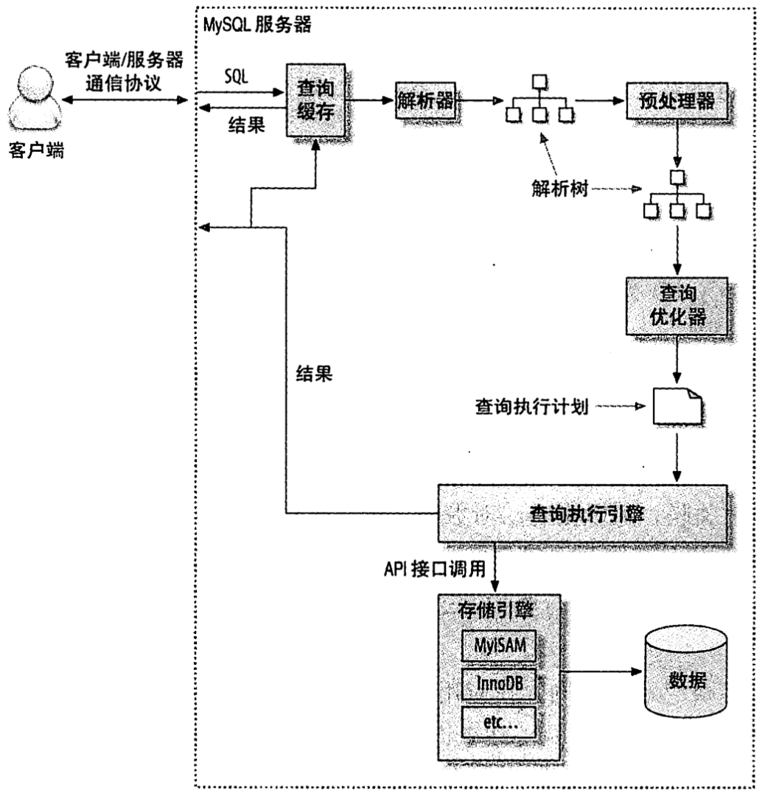
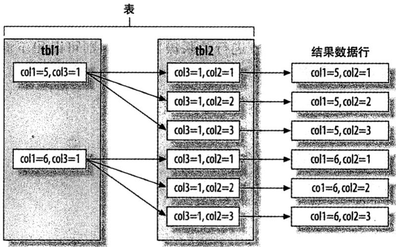
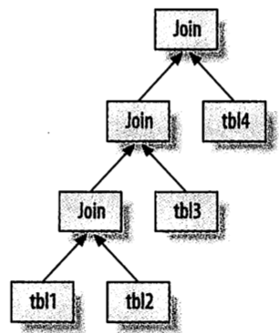
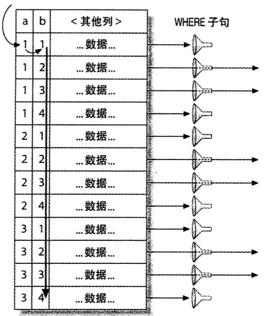
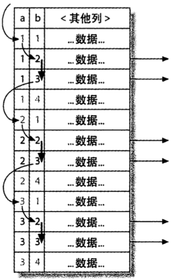

# 第六章 查询性能优化

[TOC]


## 为什么查询速度会慢


## 慢查询基础:优化数据访问

通过以下步骤来分析低效的查询：

1. 确认应用程序是否在检索大量超过需要的数据；
2. 确认MySQL服务器层是否在分析大量超过需要的数据行。

### 是否向数据库请求了不需要的数据

典型案例：

1. 查询不需要的记录

2. 多表关联时返回全部列

   ```sql
   SELECT * FROM sakila.actor # 返回三个表的全部数据列
   	INNER JOIN sakila.film_actor USING(actor_id) 
   	INNER JOIN sakila.film USING(film_id) 
   WHERE sakila.film.title = 'Academy Dinosaur';
   ```

3. 总是取出全部列

   每次看到`SELECT *`都需要小心。

4. 重复查询相同的数据

### MySQL是否在扫描额外的记录

衡量查询开销的三个指标：

- 响应时间
  - `服务时间` 数据库处理这个查询真正花了多长时间；
  - `排队时间` 服务器因为等待某些资源而没有真正执行查询的时间。
- 扫描的行数
- 返回的行数

一般MySQL能够使用如下三种方式应用WHERE条件，从好到坏依次为：

- 在索引中使用WHERE条件来过滤不匹配的记录；这是在存储引擎层完成的；
- 使用索引覆盖扫描（在Extra列中出现了Using index）来返回记录，直接从索引中过滤不需要的记录并返回命中的结果；这是在MySQL服务器层完成的，但无须再回表查询记录；
- 从数据库中返回数据，然后过滤不满足条件的记录（在Extra列中出现Using Where）；这在MySQL服务器层完成，MySQL需要先从数据表读出记录然后过滤。

如果发现查询需要扫描大量的数据但只返回少数的行，那么通常可以尝试下面的技巧去优化它：

- 使用索引覆盖扫描，把所有需要用的列都放到索引中；
- 改变库结构；
- 重写查询。


## 重构查询的方式

### 一个复杂查询还是多个简单查询

将一个复杂的查询分成多个简单查询。

### 切分查询

将一个大范围的查询拆分为多段查询。

### 分解关联查询

```sql
SELECT * FROM tag
	JOIN tag_post ON tag_post.tag_id=tag.id 
	JOIN post ON tag_post.post_id=post.id 
WHERE tag.tag='mysql';
```

可以分解成下面这些查询：

```sql
SELECT * FROM tag WHERE tag='mysql';

SELECT * FROM tag_post WHERE tag_id=1234;

SELECT * FROM post WHERE post.id in (123, 456, 567, 9098, 8904);
```

优点：

- 让缓存效率更高；
- 将查询分解后，执行单个查询可以减少锁的竞争；
- 在应用层做关联，可以更容易对数据库进行拆分，更容易做到高性能和可扩展；
- 查询本身效率也可能会有所提升；
- 可以减少冗余记录的查询；
- 这样做相当于在应用中实现了哈希关联，在某些场景哈希关联效率很高。


## 查询执行的基础



*查询执行路径*

### MySQL客户端/服务器通信协议

MySQL线程状态：

| 状态                           | 说明                                                         |
| ------------------------------ | ------------------------------------------------------------ |
| Sleep                          | 线程正在等待客户端发送新的请求                               |
| Query                          | 线程正在执行查询或者正在将结果发送给客户端                   |
| Locked                         | 线程正在等待表锁                                             |
| Analyzing and statistics       | 线程正在手机存储引擎的统计信息，并生成查询的执行计划         |
| Copying to tmp table [on disk] | 线程正在执行查询，并且将其结果集都复制到一个临时表中；如果状态后面还有“on disk”标记，那表示MySQL正将一个内存临时表放到磁盘上 |
| Sorting result                 | 线程正对结果集进行排序                                       |
| Sending data                   | 处于以下几种情况之一：<br>- 线程可能在多个状态之间传送数据<br>- 线程在生成结果集<br>- 线程在向客户端返回数据 |

### 查询缓存

### 查询优化处理

使用以下语句来的值MySQL计算当前查询的成本：

```sql
SHOW STATUS LIKE 'Last_query_cost';
```

MySQL优化策略：

- `静态优化` 直接对解析树进行分析，并完成优化；不依赖于特定的数值，在第一次完成后就一直有效；
- `动态优化` 和查询的上下文有关；在每次查询的时候都重新评估，算是“运行时优化”。

MySQL能够处理的优化类型：

- 重新定义关联表的顺序；
- 将外连接转化为内连接；
- 使用等价变换规则；
- 优化COUNT(), MIN()和MAX()；
- 预估并转化为常数表达式；
- 覆盖索引扫描；
- 子查询优化；
- 提前终止查询；
- 等值传播；
- 列表IN()的比较。

导致MySQL优化器选择错误的执行计划的原因：

- 统计信息不准确；
- 执行计划中的成本估算不等同于实际执行的成本；
- MySQL的最优可能和你想的最优不一样；
- MySQL从不考虑其他并发执行的查询；
- MySQL并不是任何时候都是基于成本的优化，有时也会基于一些其他的规则；
- MySQL不会考虑不受其控制的操作的成本；
- 优化器有时候无法估算所有可能的执行计划。

MySQL关联查询策略：MySQL对任何关联都执行嵌套循环关联操作，即MySQL先在一个表中循环取出单条数据，然后再嵌套循环到下一个表中寻找匹配的行，依次直到找到所有表中匹配的行；如果最后一个关联表无法找到更多的行，返回上一层关联表，依次类推。

关联优化器会尝试在所有的关联顺序中选择一个成本最小的来生成执行计划树；如果可能，优化器会遍历每一个表然后逐个做嵌套循环计算每一棵可能的执行计划树的成本，最后返回一个最优的执行计划。

MySQL的排序算法有：

- `两次传输排序（旧版本使用）` 读取行指针和需要排序的字段，对其进行排序，然后再根据排序结果读取所需要的数据行；
- `单次传输排序（新版本使用）` 先读取查询所需要的所有列，然后再根据给定列进行排序，最后直接返回排序结果。

例1，关联操作：

```sql
SELECT tbl1.col1, tbl2.col2
	FROM tbl1 LEFT OUTER JOIN tbl2 USING(col3) 
WHERE tbl1.col1 IN(5, 6);
```



*通过泳道图展示MySQL如何完成关联查询*

例2，多表关联：



*MySQL如何实现多表关联*

### 查询执行引擎

### 返回结果给客户端


## MySQL查询优化器的局限性

### 关联子查询

**某些情况**下，MySQL子查询会将外层表压到内层中，导致效率较差。

例，子查询：

```sql
SELECT * FROM sakila.film WHERE film_id IN(
	SELECT film_id FROM sakila.film_actor WHERE actor_id = 1);
```

MySQL优化器会自动将上述语句改写为（导致效率变差）：

```sql
SELECT * FROM sakila.film WHERE EXISTS (
	SELECT * FROM sakila.film_actor WHERE actor_id = 1 AND film_actor.film_id = film.film_id);
```

我们可以将上述子查询语句重写，以提高效率：

```sql
# 方法一 
SELECT film.* FROM sakila.film INNER JOIN sakila.film_actor USING(film_id) WHERE actor_id = 1;

# 方法二
SELECT * FROM sakila.film WHERE EXISTS(
	SELECT * FROM sakila.film_actor WHERE actor_id = 1 AND film_actor.film_id = film.film_id);
```

### UNION的限制

有时，MySQL无法将限制条件从外层压到哪层，使得原本能够限制部分返回结果的条件无法应用到内层查询的优化上。

例，使用UNION将查询结果联合：

```sql
(SELECT first_name, last_name FROM sakila.actor ORDER BY last_name)
UNION ALL
(SELECT first_name, last_name FROM sakila.customer ORDER BY last_name) LIMIT 20;
```

上述语句会造成临时表过大，可以改写为下面的语句：

```sql
(SELECT first_name, last_name FROM sakila.actor ORDER BY last_name LIMIT 20)
UNION ALL
(SELECT first_name, last_name FROM sakila.customer ORDER BY last_name LIMIT 20) LIMIT 20;
```

### 索引合并优化

### 等值传递

### 并行执行

MySQL无法利用多核特性来并行执行查询。

### 哈希关联

### 松散索引扫描

MySQL并不支持松散索引扫描（MySQL 5.0之后，在某些特殊场景支持），无法按照不连续的方式扫描一个索引。

例：

```sql
SELECT ... FROM tbl WHERE b BETWEEN 2 AND 3; # 因为索引的前导字段是列a，但是在查询中只指定了字段b，所以MySQL无法使用这个索引，只能通过全表扫描找到匹配的行
```



*MySQL通过全表扫描找到需要的记录*



*使用松散索引扫描效率会更高，但是MySQL现在还不支持这么做*

### 最大值和最小值优化

### 在同一表上查询和更新

MySQL不允许在同一张表同时进行查询和更新。

例，无效的的sql语句：

```sql
UPDATE tbl AS outher_tbl SET cnt = (
	SELECT count(*) FROM tbl AS inner_tbl WHERE inner_tbl.type = outer_tbl.type);
```

可以使用生成表（临时表）的形式绕过上述限制：

```sql
UPDATE tbl INNER JOIN(
	SELECT type, count(*) AS cnt FROM tbl GROUP BY type) AS der USING(type)
SET tbl.cnt = der.cnt;
```


## 查询优化器的提示（hint）

可以使用提示（hint）来控制优化器最终的执行计划。

| hint                | 功能                                                         | 适用场景                                                     |
| ------------------- | ------------------------------------------------------------ | ------------------------------------------------------------ |
| HIGH_PRIORTY        | 提高语句的优先级；                                           | - 使用表锁的存储引擎（非InnoDB或其他有细粒度锁机制和并发控制的引擎）； |
| LOW_PRIORITY        | 降低语句的优先级；                                           | - 使用表锁的存储引擎（非InnoDB或其他有细粒度锁机制和并发控制的引擎）； |
| DELAYED             | 将插入的行数据放入到缓冲区，在表空闲时批量将数据写入；       | - 日志系统；<br>- 需要写入大量数据，但是客户端不需要等待单条语句完成I/O的情景； |
| STRAIGHT_JOIN       | - 放在SELECT关键字之后：让查询中所有的表按照在语句中出现的顺序进行关联；<br>- 放在两个关联表名字之间：固定其前后两个表的关联顺序； | - MySQL没能选择正确的关联顺序时；                            |
| SQL_SMALL_RESULT    | 告诉优化器结果集会很小，可以将结果集放在内存中的索引临时表，以避免排序操作； | - 结果集很小                                                 |
| SQL_BIG_RESULT      | 告诉优化器结果集会很大，建议使用磁盘临时表做排序操作；       | - 结果集很大                                                 |
| SQL_BUFFER_RESULT   | 高速优化器将查询结果放入到一个临时表，然后尽可能快地释放表锁； | - 客户端内存较小                                             |
| SQL_CACHE           | 将结果集换存在查询缓存中；                                   |                                                              |
| SQL_NO_CACHE        | 不要将结果集换存在查询缓存中；                               |                                                              |
| SQL_CALC_FOUND_ROWS | 计算除去LIMIT子句后这个查询要返回的结果集的总数；            |                                                              |
| FOR UPDATE          | 对符合条件的**数据行（行级锁）**进行加锁；                   | - 仅限InnoDB引擎                                             |
| LOCK IN SHARE MODE  | 对符合条件的**数据行（行级锁）**进行加锁；                   | - 仅限InnoDB引擎                                             |
| USE INDEX           | 建议使用指定的索引来查询记录；                               |                                                              |
| IGNORE INDEX        | 不使用指定的索引来查询记录；                                 |                                                              |
| FORCE INDEX         | 强制使用指定的索引来查询记录；                               |                                                              |

| 控制优化器行为的参数   | 说明                                                         | 适用场景                         |
| ---------------------- | ------------------------------------------------------------ | -------------------------------- |
| optimizer_search_depth | 控制优化器在穷举执行计划时的限度；                           | - 查询长时间处于“Statistics”状态 |
| optimizer_prune_level  | （默认开启）让优化器根据需要扫描的行数来决定是否跳过某些执行计划； |                                  |
| optimizer_switch       | 包含了一些开启/关闭优化器特性的标志位；                      |                                  |


## 优化特定类型的查询

### 优化COUNT()查询

MyISAM只有在没有任何`WHERE`条件的情况下，`COUNT(*)`才非常快；当带有`WHERE`子句时，`COUNT()`速度和其他引擎没有区别。

如果对于COUNT值的精确度要求不高，可以使用EXPLAIN的优化器估算结果，来加快速度。

例，使用MyISAM的`COUNT(*)`语句：

```sql
SELECT COUNT(*) FROM world.City WHERE ID > 5;

SELECT COUNT(color = 'blue' OR NULL) AS blue, COUNT(color = 'red' OR NULL) AS red FROM items;
```

### 优化关联查询

- 确保`ON`或者`USING`子句中的列上有索引；
- 确保任何的`GROUP BY`和`ORDER BY`中的表达式只涉及到一个表的列；
- 当升级MySQL的时候需要注意：关联语法，运算符优先级等其他可能会发生变化的地方。

### 优化子查询

尽可能使用关联查询。

### 优化GROUP BY和DISTINCT

对于需要对关联查询做分组（GROUP BY），并且是按照查找表中的某个列进行分组，那么通常采用查找表的标识列分组的效率会比其他列更高。

例，优化GROUP BY查询：

```sql
SELECT actor.first_name, actor.last_name, COUNT(*) FROM sakila.film_actor 	INNER JOIN sakila.actor USING(actor_id) 
GROUP BY actor.first_name, actor.last_name; 
```

按照下面的写法效率会更高：

```sql
SELECT actor.first_name, actor.last_name, COUNT(*) FROM sakila.film_actor 	INNER JOIN sakila.actor USING(actor_id) 
GROUP BY film_actor.actor_id;
```

### 优化LIMIT分页

例1，对于非常大的表使用LIMIT：

```sql
SELECT film_id, description FROM sakila.film ORDER BY title LIMIT 50, 5;
```

使用下面的“延迟关联”语句可以极大提升效率：

```sql
SELECT film.film_id, film.description FROM sakila.film 
	INNER JOIN(SELECT film_id FROM sakila.film ORDER BY title LIMIT 50, 5) AS lim USING(film_id);
```

例2，使用"OFFSET"提升效率：

```sql
SELECT * FROM sakila.rental WHERE rental_id < 10086 ORDER BY rental_id DESC LIMIT 20; # OFFSET=10086
```

### 优化SQL_CALC_FOUND_ROWS

### 优化UNION查询

### 静态查询分析

### 使用用户自定义变量

使用自定义变量的场景：

- 需要变量具有“左值”的功能（即，在给变量赋值的同时使用这个变量）；

自定义变量不适用的场景：

- 使用自定义变量的查询，无法使用查询缓存；
- 不能在使用常量或者标识符的地方使用自定义变量；
- 用户自定义变量的生命周期是在一个连接中有效，所以不能用它们来做连接间的通信；
- 如果使用连接池或者持久化连接，自定义变量可能让看起来毫无关系的代码发生交互；
- 在5.0之间的版本，是大小写敏感的，所以要注意代码在不同MySQL版本间的兼容性问题；
- 不能显式地声明自定义变量的类型；
- MySQL优化器在某些场景下可能会将这些变量优化掉；
- 赋值的顺序和赋值的时间点并不总是固定的，这依赖于优化器的决定；
- 赋值符号`:=`的优先级非常低，所以需要注意，赋值表达式应该使用明确的括号；
- 使用未定义变量不会产生任何语法错误。

例1，自定义和使用变量：

```sql
# 自定义变量
SET @one := 1;
SET @min_actor := (SELECT MIN(actor_id) FROM sakila.actor);
SET @last_week := CURRENT_DATE-INTERVAL 1 WEEK;

# 使用自定义变量
SELECT ... WHERE col <= @last_week;
```

例2，使用“左值”变量：

```sql
SET @rownum := 0;
SELECT actor_id, @rownum := @rownum + 1 AS rownum FROM sakila.actor LIMIT 3;
```

例3，避免重复查询：

```sql
UPDATE t1 SET lastUpdated = NOW() WHERE id = 1 AND @now := NOW();
SELECT @now;
```

例4，统计插入的数量：

```sql
INSERT INTO t1(c1, c2) VALUES(4, 4), (2, 1), (3, 1) 
	ON DUPLICATE KEY UPDATE c1 = VALUES(c1) + (0 * (@x := @x + 1));
```

例5，确定取值的顺序：

```sql
SET @rownum := 0;
SELECT actor_id, first_name, @rownum AS rownum FROM sakila.actor
	WHERE @rownum <= 1 ORDER BY first_name, LEAST(0, @rownum := @rownm + 1);
```

例6，在UNION查询中提高缓存命中率：

```sql
SELECT GREATEST(@found := -1, id) AS id, 'users' AS which_tbl FROM users WHERE id = 1
UNION ALL
	SELECT id, 'users_archived' FROM users_archived WHERE id = 1 AND @found IS NULL
UNION ALL
	SELECT 1, 'reset' FROM DUAL WHERE (@found := NULL) IS NOT NULL;
```


## 案例学习

### 使用MySQL构建一个队列表

### 计算两点之间的距离

### 使用用户自定义函数


## 总结

