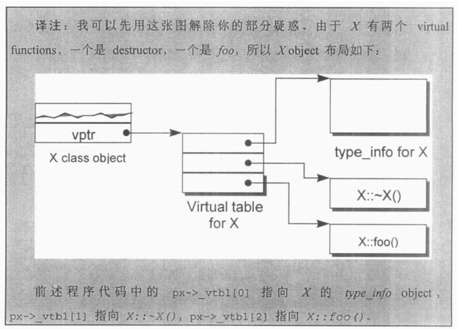

# 第一章 关于对象（Object Lessons）

[TOC]


c++在布局以及存取时间上主要的额外负担是由virtual引起的，包括：

- **virtual function(虚函数)**: 用以支持一个有效率的“执行期绑定”（runtime binding）。
- **virtual base class(虚基类)**: 用以实现“多次出现在继承体系中的base class，有一个单一而被共享的实例”(其实就是菱形继承)。


## c++对象模式(The C++ Object Model)

在C++中，有两种`class data members`: 

- static
- nonstatic

以及三种`class member functions`:

- static
- nonstatic
- virtual

### 简单对象模型(A Simple Object Model)


此时一个class object的大小计算方式为：$指针大小 \times class中声明的member个数$

### 表格驱动对象模型（A Table-driven Object Model）


在`Member Data Table`中存的是实际的数据元素；`Function Member Table`中存的仍然是函数的地址；

### C++对象模型（The C++ Object Model）

只有`nonstatic data member`是存在object内部的，其余全部存在外部，并且对于virtual的函数，两个步骤重要：

1. 每一个class产生出一堆指向`virtual functions`的指针，放在`virtual table`(虚表, vtbl)中。

2. 每一个`class object`被安插一个指针，指向相关的`virtual table`，通常这个指针被称为**vptr**。vptr的设定（setting）和重置（resetting）都由每一个class的`constructor`,`destructor`和`copy assignment`运算符自动完成。每一个class所关联的`type_info object`（用以支持runtime type identification, RTTI）也经由virtual table被指出来，通常放在表格的第一个slot。


### 加上继承（Adding Inheritance）

继承关系也可以指定为虚拟（virtual，也就是共享的意思）：

```c++
class istream : virtual public ios { ... };
class ostream : virtual public ios { ... };
```

在虚拟继承的情况下，`base class`不管在继承串链中被派生（derived）多少次，永远只会存在一个实例（称为subobject）。

### 对象模型如何影响程序(How the Object Model Effects Programs)

例，class X定义了`copy constructor`, `virtual destructor`和一个`virtual function foo()`。

```c++
X foobar() // NRV优化
{
    X xx;
    X *px = new X;

    // foo()是一个virtual function
    xx.foo();
    px->foo();

    delete px;
    return xx;
};
```

内部转化可能是：

```c++
void foobar( X &_result )
{
    // 构造_result
    // _result用来取代local xxx ...
    _result.X::X();

    // 扩展 X *px = new X;
    px = _new( sizeof(X) );
    if ( px != 0 )
        px->X::X();

    // 扩展xx.foo()但不使用virtual机制
    // 以_result取代xx
    foo( &_result );

    // 使用virtual机制扩展px->foo()
    ( *px->vtbl[ 2 ] )( px )

    // 扩展delete px;
    if (px != 0) {
        (*px->vtbl[ 1 ])(px);
        _delete(px);
    }

    // 无须使用named return statement
    // 无须摧毁local object xx
    return;
};
```

类X的对象模型如下：




## 关键词所带来的差异(A Keyword Distinction)

关键字`struct`和`class`的差异：在c语言中，`struct`代表的是一个数据集合体，没有`private date`,`member function`；而在c++中，`struct`和`class`均是代表类，唯一的差别在于类的**默认访问权限和默认继承类型**是不同的：

|关键字|默认访问权限|默认继承模型|
|--|--|--|
|struct|public|public|
|class|private|private|


## 对象的差异(An Object Distinction)

c++程序设计模型直接支持三种`programming paradigms(程序设计范式)`:

1. 程序模型(**procedural model**)
2. 抽象数据类型模型(**abstract data type model, ADT**)
3. 面向对象模型(**object-oriented model**)

c++以下列方法支持多态：

1. 经由一组隐式的转化操作。
2. 经由`virtual function`机制。
3. 经由`dynamic_cast`和`typeid`运算符。

一个`class object`的内存大小组成:

- 其`nonstatic data members`的总和大小。
- 加上任何由于`alignment`的需求而填补(`padding`)上去的空间(可能存在于`members`之间，也可能存在于集合体边界)。
  
    > alignment就是将数值调整到某数的倍数。在32位计算机上，通常alignment为4bytes(32位)，以使`bus`的“运输量”达到最高效率。
- 加上为了支持`virtual`而由内部产生的任何额外负担(`overhead`)。

例:

```c++
class ZooAnimal {
public:
    ZooAnimal();
    virtual ~ZooAnimal();
    // ...
    virtual void rotate();

protected:
    int loc;
    String name;
};

ZooAnimal za("Zoey");
ZooAnimal *pza = &za;
```

其内存布局如下：


- 一个指向地质1000的整数指针，在32位机器上，将涵盖地址空间1000~1003
- 如果String是传统的8-bytes(包括一个4-bytes的字符指针和一个用来标识字符串长度的整数)，那么一个ZooAnimal指针将横跨地址空间1000~1015

一个指针或引用，不管它指向哪一种数据类型，指针本身所需的内存大小是固定的。
转换(cast)其实是一种编译器指令。大部分情况下它并不改变一个指针所含的真正地址，它只影响“被指出之内存的大小和其内容”的解释方式。

例，定义一个class Bear继承自class ZooAnimal:

```c++
class Bear : public ZooAnimal {
public:
    Bear();
    ~Bear();
    // ...
    void rotate();
    virtual void dance();
    // ...
protected:
    enum Dances { ... };

    Dances dances_known;
    int cell_block;
};

Bear b( "Yogi" );
Bear *pb = &b;
Bear &rb = *pb;
```

内存布局如下：


### 派生类和基类的类型转换

1. 针对类对象，用基类对象为派生类对象赋值或者初始化，或者用类型转换符将基类对象转化为派生类对象，都是**非法的**；用派生类对象为基类对象赋值或初始化，或者用类型转换符将派生类对象转化为基类对象，是**可以的，但是不发生切割(sliced)**。

2. 针对指针或者引用，将基类对象绑定到派生类对象的指针或引用上，这是**非法的**；而将派生类对象绑定到基类的指针或者引用上，则是**合法的**，并且这是多态的基础条件。

