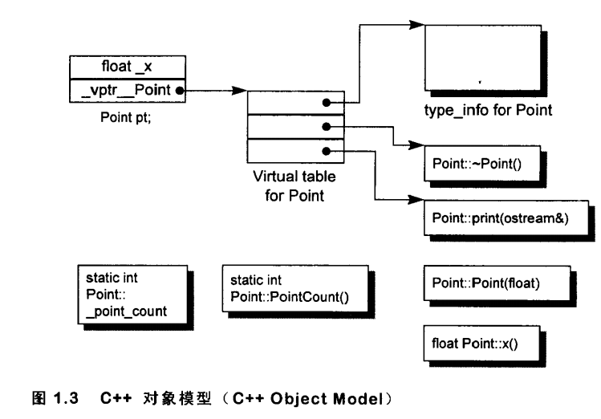

# 第一章 关于对象（Object Lessons）

[TOC]


c++在布局以及存取时间上主要的额外负担是由virtual引起的，包括：

- **virtual function**机制- 用以支持一个有效率的“执行期绑定”（runtime binding）。
- **virtual base class** - 用以实现“多次出现在继承体系中的base class，有一个单一而被共享的实例”。


## c++对象模式(The C++ Object Model)

在C++中，有两种`class data members`: static和nonstatic，以及三种`class member functions`: static, nonstatic和virtual。

### 简单对象模型(A Simple Object Model)


### 表格驱动对象模型（A Table-driven Object Model）


### C++对象模型（The C++ Object Model）

Nonstatic data members被配置于每一个class object之内，static data members则被存放在个别的class object之外。Static和nonstatic function members也被放在个别的class object之外。Virtual functions则以两个步骤支持之：

1. 每一个class产生出一堆指向virtual functions的指针，放在表格中。这个表格被称为virtual table(**vtbl**)。

2. 每一个class object被安插一个指针，指向相关的virtual table。通常这个指针被称为**vptr**。vptr的设定（setting）和重置（resetting）都由每一个class的constructor, destructor和copy assignment运算符自动完成。每一个class所关联的type_info object（用以支持runtime type identification, RTTI）也经由virtual table被指出来，通常放在表格的第一个slot。



### 加上继承（Adding Inheritance）

继承关系也可以指定为虚拟（virtual，也就是共享的意思）：

```c++
class istream : virtual public ios { ... };
class ostream : virtual public ios { ... };
```

在虚拟继承的情况下，base class不管在继承串链中被派生（derived）多少次，永远只会存在一个实例（称为subobject）。

c++最初采用的继承模型并不运用任何间接性：`base class subobject`的`data members`被直接放置于`derived class object`中。

自`c++ 2.0`起才新导入的`virtual base class`

### 对象模型如何影响程序(How the Object Model Effects Programs)


## 关键词所带来的差异(A Keyword Distinction)

1. 关键词`struct`本身并不一定要象征其后随之声明的任何东西。

2. `struct`关键词的使用实现了C的数据抽象观念，而`class`关键词实现的是C++的ADT(Abstract Data Type)观念。

3. c++中凡处于同一个access section的数据，必定保证以其声明顺序出现在内存布局当中。然而被放置在多个`access sections`中的各笔数据，排列顺序就不一定了。

4. 组合(composition)，而非继承，才是把c和c++结合在一起的唯一可行方法

5. C `struct`在c++中的一个合理用途，是当你要传递“一个复杂的class object的全部或部分”到某个C函数去时，`struct`声明可以将数据封装起来，并保证拥有与C兼容的空间布局。然而这项保证只在组合（composition）的情况下才存在。如果是“继承”而不是“组合”，编译器会决定是否应该有额外的`data members`被安插到`base struct subobject`之中。


## 对象的差异(An Object Distinction)

c++程序设计模型直接支持三种`programming paradigms(程序设计范式)`:

1. 程序模型(**procedural model**)

2. 抽象数据类型模型(**abstract data type model, ADT**)

3. 面向对象模型(**object-oriented model**)

c++以下列方法支持多态：

1. 经由一组隐式的转化操作。

2. 经由`virtual function`机制。

3. 经由`dynamic_cast`和`typeid`运算符。

需要多少内存才能表现一个`class object`:

- 其`nonstatic data members`的总和大小。
- 加上任何由于`alignment`的需求而填补(`padding`)上去的空间(可能存在于`members`之间，也可能存在于集合体边界)。
    
    alignment就是将数值调整到某数的倍数。在32位计算机上，通常alignment为4bytes(32位)，以使`bus`的“运输量”达到最高效率。
- 加上为了支持`virtual`而由内部产生的任何额外负担(`overhead`)。

一个指针或引用，不管它指向哪一种数据类型，指针本身所需的内存大小是固定的。

### 指针的类型(The Type of a Pointer)

- 一个指向地质1000的整数指针，在32位机器上，将涵盖地址空间1000~1003
- 如果String是传统的8-bytes(包括一个4-bytes的字符指针和一个用来标识字符串长度的整数)，那么一个ZooAnimal指针将横跨地址空间1000~1015


转换(cast)其实是一种编译器指令。大部分情况下它并不改变一个指针所含的真正地址，它只影响“被指出之内存的大小和其内容”的解释方式。


```c++
Bear b;
ZooAnimal *pz = &b;
Bear *pb = &b;
```
pb所涵盖的地址包含整个Bear object，而pz所涵盖的地址只包含Bear object中的ZoomAnimal subobject。

除了ZoomAnimal subobject中出现的members，你不能够使用pz来直接处理Bear的任何members。唯一例外是通过virtual机制：

```c++
// 不合法：cell_block不是ZoomAnimal的一个member,
// 虽然我们知道pz目前指向一个Bear object
pz->cell_block;

// ok: 经过一个显式的downcast操作就没有问题！
(static_cast< Bear* >(pz))->cell_block;

// 下面这样更好，但它是一个run-time operation，成本较高
if (Bear* pb2 = dynamic_cast<Bear*>(pz))
    pb2->cell_block;

// ok: 因为cell_block是Bear的一个member
pb->cell_block;
```

当我们写`pz->rotate();`时，pz的类型将在编译时期决定以下两点：

- 固定的可用接口。也就是说，pz只能够调用ZoomAnimal的public接口。
- 该接口的access level(例如 rotate()是ZooAnimal的一个public member)。

编译器在(1)初始化以及(2)指定(assignment)操作(将一个class object指定给另一个class object)之间做出了仲裁。编译器必须确保如果某个object含有一个或一个以上的vptrs，那些vptrs的内容不会被base class object初始化或改变。


当一个`base class object`被直接初始化为（或是被指定为）一个`derived class object`时，`derived object`就会被切割(sliced)以塞入较小的base type内存中。**即，将子类赋值给父类时，子类会被切割。**
