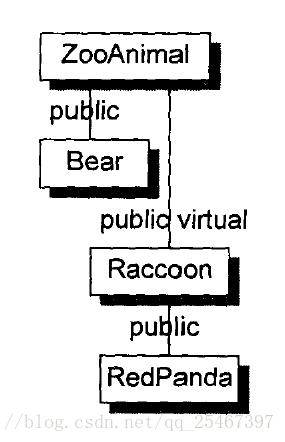
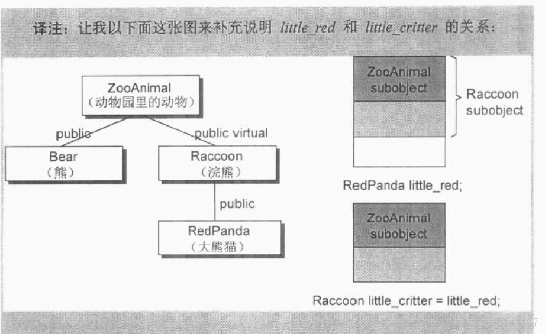

# 第二章 构造函数语意学(The Semantics of Constructors)

**explicit**(显式)能够制止"单一参数的constructor"被当做一个conversion运算符。

## Deafult Constructor的构造操作

例:

```c++
class Foo { public: int val; Foo *pnext; };

void foo_bar()
{
    Foo bar;
    if ( bar.val || bar.pnext )
        // ... do something
    // ...
}
```

c++标准规定合成默认构造函数的规则如下：

没有任何user-declaerd constructor的类，那么会有一个default constructor被隐式(implicitly)声明出来，称之为trivial(没有什么作用的) constructor.

注意：

1. 任何类如果没有定义默认的构造函数，编译器**不一定**会合成默认构造函数，只有当它认为你需要时，才给你合成；

2. 编译器合成出来的默认构造函数**不一定**会显式设置每一个数据成员的默认值；

### 四种需要合成notrivial constructor的情况:

- 类成员中有成员是类对象，并且该成员的类含有默认构造函数。

```c++
class Foo { public: Foo(), Foo( int ) ... };
class Bar { public: Foo foo; char *str; };

void foo_bar()
{
    Bar bar; // Bar::foo必须在此处初始化
    if (str) {}
    ...
}
```

在类`Bar`中有一个成员`foo`，带有默认构造函数，因此编译器会为类`Bar`生成一个默认的构造函数如下：

```c++
inline
Bar::Bar()
{
    foo.Foo::Foo();
}
```

编译器不会对其它成员变量做初始化，我们需要手动来为它做初始化：

```c++
Bar::Bar() { str = 0; }
```

编译器会将之扩张为：

```c++
Bar::Bar()
{
    foo.Foo::Foo();
    str = 0;
}
```

**注意：编译器不会初始化当前类中所含的其他值（这是程序员的责任）。**

如果多个类成员对象都要求构造函数初始化操作，构造的顺序和声明的顺序一致。

例，如果`Bar`中还有一个成员`foo2`且声明顺序在成员`str`后，那么编译器扩张构造函数如下：

```c++
Bar::Bar() {
    foo.Foo::Foo();
    foo2.Foo2::Foo2();
    str = 0;
}
```

- 基类有默认构造函数。 

- 带有虚函数的类。

例：class声明或者继承了一个`virtual function`：

```c++
class Widget {
public:
    virtual void flip() = 0;
    // ...
};

void flip( const Widget& widget ) { widget.flip(); }

class Bell : public Widget{};
class Whistle : public Widget{};

void foo()
{
    Bell b;
    Whistle w;
    
    flip( b );
    flip( w );
}
```

下面的扩张行动会在编译期发生：

1. 一个vtblL(`virtual function table`, 虚函数表)会被编译器产生出来，内放class的`virtual functions`地址。

2. 在每一个`class object`中，一个vptr(`point to vtbl`)会被编译器合成出来。
此外，`widget.flip()`的虚拟调用操作(`virtual invocation`)会被重新改写，以使用`widget`的`vptr`和`vtbl`中的`flip()`条目：

```c++
// widget.flip()的虚拟调用操作（virtual invocation）的转变
(*widget.vptr[ 1 ])( &widget )
```

`1` 表示`flip()`在`virtual table`中的固定索引；
`&widget`代表要交给“被调用的某个flip()函数实例”的**this**指针；

- 存在虚基类（有直接虚拟基类或继承链上有虚基类）

例，必须使得`virtual base class`在其每一个`derived class object`中的位置在执行期转被妥当：

```c++
class X { public: int i; }
class A : public virtual X { public: int j; };
class B : public virtual X { public: double d; };
class C : public A, public B { public: int k; };

// 无法在编译期决定(resolve)出pa->X::i的位置
void foo( const A* pa ) { pa->i = 1024; }

main()
{
    foo( new A );
    foo( new C );
    // ...
}
```

## Copy Constructor的构造操作

以下情况会出现默认构造函数：

1. 显式对对象进行初始化
2. 当对象被当作参数交给某个函数
3. 当函数返回一个非引用的类对象

### Default Memberwise Initialization(默认成员逐一初始化)

如果一个类没有提供任何的复制构造函数，那么该类内部以`default memberwise initialization`的方法来复制构造；实际上就是`bitwise copies(位逐次拷贝)`，即把类对象中的所有数据成员按顺序拷贝到另一个对象身上；如果有`data members`是类类型，那么就会递归地施行`bitwise copies`，例：

```cpp
class Word {
public:
    // ...没有explicit copy constructor
private:
    int _occurs;
    String _word;
};
Word word(2, "word");
Word word2 = word1;
```

最后一句的赋值操作可能是这样的：

```c++
word2._occurs = word1._occurs;
word2._word = word1._word;
```

### 不要Bitwise Copy Semantics

有以下4种情况不展现出`bitwise copy semantics`:

1. 类中含有成员类对象，并且此类对象含有默认构造函数。
2. 基类带有拷贝构造函数。
3. 类中存在虚函数。
4. 存在虚基类（有直接虚拟基类或继承链上有虚基类）。

### 重新设定Virtual Table的指针

一个class声明了一个或多个`virtual functions`会产生以下扩张操作：

- 增加一个`virtual function table(vtbl)`，内含每一个有作用的`virtual function`的地址。
- 一个指向`virtual function table`的指针（vptr），安插在每一个`class object`内。

例，

```c++
class ZooAnimal {
public:
    ZooAnimal();
    virtual ~ZooAnimal();

    virtual void animate();
    virtual void draw();
    // ...
private:
    // ZooAnimal的animate()和draw()
    // 所需要的数据
};

class Bear : public ZooAnimal {
public:
    Bear();
    void animate();
    void draw();
    virtual void dance();
    // ...
private:
    // Bear的animate(),draw()和dance()
    // 所需要的数据
};
Bear yogo; // 用Bear的默认构造函数初始化yogi
Bear winnie = yogi; // 将yogi的vptr值拷贝给winnie的vptr，安全
```

### 处理Virtual Base Class Subobject

一个`virtual base class`的存在会使`bitwise copy semantics`无效。

`default copy constructor`如果未被声明的话，会被视为`nontrivial`。

例，假设有这样的继承关系：



```c++
class Raccoon : public virtual ZooAnimal {
public:
    Raccoon() {}
    Raccoon( int val ) {}
    // ...
private:
    // 所有必要的数据
};

class RedPanda : public Raccoon {
public:
    RedPanda() {}
    RedPanda( int val ) {}
    // ...
private:
    // 所有必要的数据
};
```

如果只是一个`Raccoon object`作为另一个`Raccoon object`的初值，"bitwise copy"就足够了。

```c++
Raccoon rocky;
Raccoon little_cirtter = rocky;
```

但是如果以`RedPanda object`作为`Raccoon object`的初值，编译器必须判断"能否正常执行存取ZooAnimal的subobject的动作"

```c++
RedPanda little_red;
Raccoon little_cirtter = little_red;
```

为了正确完成`little_critter`的初值设定，编译器必须合成一个`copy constructor`，安插一些代码以设定`virtual base class pointer/offset`的初值。




## 程序转化语意学(Program Transformation Semantics)

### 显式的初始化操作(Explicit Initialization)

必要的程序转化有两个阶段：

1. 重写每一个定义。
2. class的`copy constructor`调用操作会被安插进去。

例：

```c++
X x0;
void foo_bar() {
    X x1( x0 );
    X x2 = x0;
    X x3 = X( x0 );
    // ...
}
```

转化为：

```c++
void foo_bar() {
    X x1;
    X x2;
    X x3;

    // 编译器安插 X copy construction的调用操作
    x1.X::X( x0 );
    x2.X::X( x0 );
    x3.X::X( x0 );
    // ...
}
```

### 参数的初始化(Argument Initialization)

将一个`class object`当做参数传给一个函数或者作为一个函数的返回值，相当于以下形式的初始化：

已知函数：`void foo(X x0);`有以下调用：

```c++
X xx;
foo(xx);
```

由于是传值或者返回值（而非引用），策略是导入临时性的对象，并且调用`copy constructor`将其初始化，然后将临时性对象交给函数。

```c++
X __temp0;
__temp0.X::X( xx );
foo( __temp0 );
```

### 返回值的初始化(Return Value Initialization)

例，函数的转化：

```c++
X bar()
{
    X xx;
    // 处理xxx ...
    return xx;
}
```

转化为：

```c++
// c++伪代码
void
bar(X& __result)
{
    X xx;
    
    // 编译器所产生的default constructor调用操作
    xx.X::X();

    // ...处理xx

    // 编译器所产生的copy constructor调用操作
    __result.X::XX(xx);

    return;
}
```

上面的转化流程如下：

1. 增加一个返回值的引用类型的额外参数，用来防止返回值；
2. 在return之前安插一个`copy constructor`调用操作，来初始化那个额外参数；

### 在使用者层面做优化(Optimization at the User Level)

直接返回构造的临时对象即可

### 在编译器层面做优化(Optimization at the Compiler Level)

例，编译器`Named Return Value(NRV)`优化：

```c++
X bar()
{
    X xx;
    // ...处理xx
    return xx;
}
```

优化为:

```c++
void
bar( X &__result )
{
    // default constructor被调用
    // c++伪代码
    __result.X::X();

    // ...直接处理 __result
    return;
}
```

### Copy Constructor: 要还是不要?

假如class需要大量的`memberwise`初始化操作，例如以传值(by value)的方式传回object，那么提供一个`copy constructor`的`explicit inline`函数实例就非常合理。


## 成员们的初始化队伍(Member Initialization List)

下列4种情况必须使用成员初始化列表：

1. 当初始化一个`reference member`时；
2. 当初始化一个`const member`时；
3. 当调用一个base class的`constructor`，而它拥有一组参数时；
4. 当调用一个member class的`constructor`，而它拥有一组参数时；

编译器会一一操作`initialization list`，以适当顺序在`constructor`之内安插初始化操作，并且在任何`explicit user code`之前。

**注意：list中的项目顺序是由class中的members声明顺序决定的，不是由`initialization list`中的排序顺序决定的。**

`initialization list`被放在`explicit user code`之前。

**忠告：请使用"存在于constructor”体内的一个member"，而不要使用“存在于member initialization list中的member“，来位另一个member设定初值。**

简略地说，编译器会对`initialization list`一一处理并可能重新排列，以反映出members的声明顺序。它会安插一些代码到constructor体内，并置于任何`explicit user code`之前。
