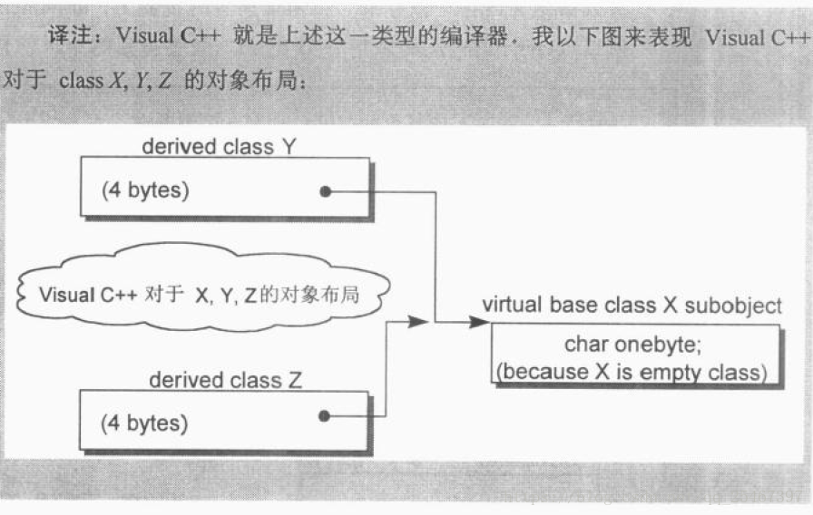
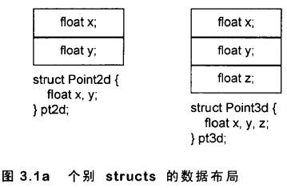
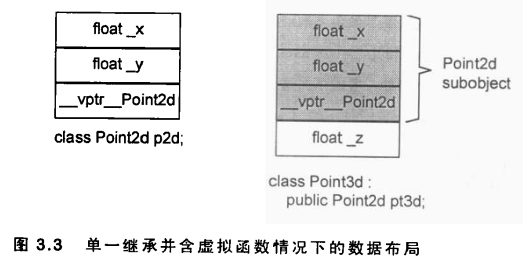
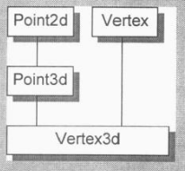
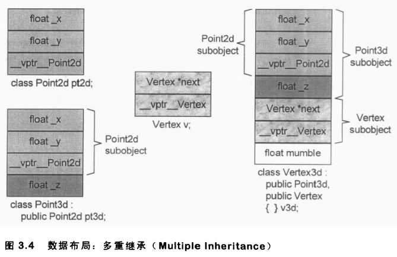
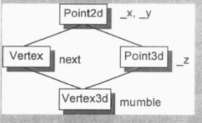
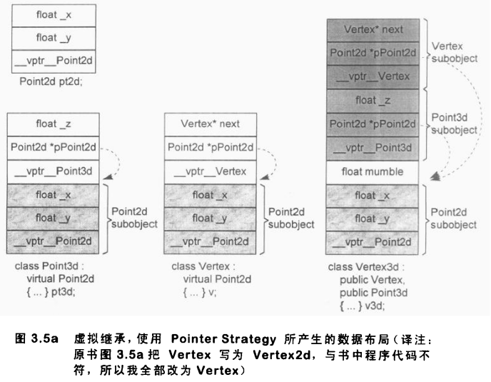
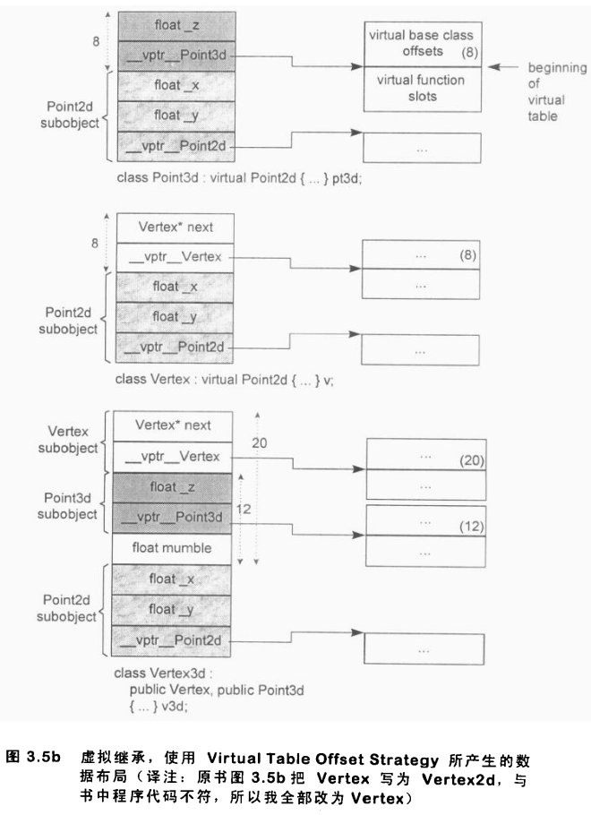

# 第三章 Data语意学

一个空类的大小通常为1，是因为编译器为其安插了一个char，以便这个类的任意两个object能够在内存中配置独一无二的地址。

一个类的大小通常与机器和编译器有关，受以下三个因素的影响：

1. 语言本身的额外负担
2. 编译器对于特殊情况所提供的优化处理
3. Alignment的限制(对齐原则)
内存对齐使得它们能够更有效地在内存中存取，Alignment指将数值调整至某数的整数倍，一般32位机器Alignment为4bytes.

例：

```c++
class X{};                      // 1
class Y : public virtual X{};   // 8
class Z : public virtual X{};   // 8
class A : public Y, public Z{}; // 12
```



一个`virtual base class subobject`只会在`derived class`只存在一份实例，`class A`的大小由以下几点决定：

- 共享的虚基类X的实例，大小为1bytes；
- class Y的大小减去因配置`class X`的大小，结果是4bytes;
- class A自己的大小0bytes;
- Alignment: $4+4+1+3=12$;
所以`sizeof(A)=12`，这是没有做特殊处理，如果做了特殊处理，Alignment的3bytes也不需要，因此`sizeof(A)=8`;


## Data Member的绑定

早期c++两种防御性程序设计风格（预防不可预料性）:

1. 把所有的`data member`放在class声明起头
```c++
class Point3d {
    // 在class 声明起头处防止所有的data member
    float x, y, z;
public:
    ...    
}
```
2. 把所有`inline function`放在class声明处
```c++
class Point3d {
public:
    // class的声明处放inline function
    Point3d();
    float X() const;
}
```

这个古老的规则被称为"member rewriting rule"：一个`inline`函数实体，在整个class声明未被完全看见之前，是不会被评估求值的。但是如果一个inline函数在声明之后被立即定义，那么还是会被评估求值。

这个规则对于`成员函数的参数列表`不为真，考虑一个`嵌套的定义`：

```c++
#include <iofstream>
using namespace std;
typedef float length;
class Point3d {
public:
    // length被决议为global
    // _val被决议为Point3d::_val
    void mumble(length val) { _val = val; }
    length mumble() {
        cout << typeid(_val).name() << endl;
        return _val;
    }
private:
    typedef int length;
    length _val;
};

int main()
{
    Point3d p;
    p.mumble();
    cout << typeid(p.mumble()).name();
    return 0;
}
```


## Data Member的布局

静态成员变量存储在`data segment`，与`class object`无关

c++标准要求：**较晚出现（声明的）member在class object中有较高的位置，不一定得连续排列**，例如边界调整(alignment)就可能在`member`和`member`之间填补一些bytes。

还有vptr，传统上回放在`member`的最后，也有放置在`class object`最前端的。所以member的排列顺序视编译器而定。

目前，各家编译器都是一个以上的`access section`连锁在一起，依照声明的顺序成为一个连续区块。


## Data member的存取

假设有这样一个类：

```c++
class Point {
private:
    float _x;
    float _y;
    static int count;
};
Point::count = 0;
Point origin, *pt = &origin;
```

Member分为`static member`和`nonstatic member`；存取方式：通过指针（引用）存取和通过对象存取。

### static member存储

static member可视为一个global变量，但是只在class生命周期内可见。static member只有一个实例放置在data segment。因此每次取用static member时，在内部会被转换为唯一的extern实例的操作。例：

```c++
origin.count = 2; // 直接className::static_member
pt->count = 2;    // 直接className::static_member
```

通过指针，引用，对象调用行为都是一致的。

对于复杂的继承结构，行为和上述是一样的。

通过函数调用呢？例：

```c++
foobar().count = 2; // c++标准要求foobar()必须被求值，evaluated

// 下面是可能的转化：
(void) foobar();
Point::count = 2;
```

取一个`static member`的地址，会得到**指向该数据类型的指针，而不是指向class member的指针**。例：

```c++
&Point::count; // 得到的类型是 const int* 而非 Point::int*
```

如果两个class，每一个都声明了一个`static member freeList`，都存放在`data segment`，就会导致名字冲突，解决办法就是`name-mangling`，得到独一无二的名称(即`name-mangling算法`)。

### Nonstatic data members

非静态成员都是**直接存放在每一个class object中**，所以只有经过class object(或者`*this`)才能进行存取。

对一个非静态成员变量的存取操作，编译器需要把class object的地址加上data member的偏移量(offset)，例：

```c++
&origin._y = 0.0;
// 地址&origin._y将等于
&origin + (&Point::_y - 1)
```

注意上面的 `- 1`，因为`&Point::_y`总是等于`offset + 1`，所以要减1。那为什么`&Point::_y`总是等于`offset+1`呢？这是为了区分"指向class第一个member"和"指向class的member但是该class没有任何member"这两种情况。

offset是在编译期就确定了的，但是如果存取的是一个从`virtual base class`继承下来的`member`，使用指针或者引用存取，由于不知道该指针或者引用的动态类型，因此存取操作必须延迟到运行期，经过一个额外的引导才能解决。如果使用的是class object存取，那member的offset编译期就确定了。


## 继承与Data Member

最简单不含继承的类：

```c++
class Point2d {
private:
    float x, y;
} pt2d;
class Point3d {
private:
    float x, y, z;    
} pt3d;
```

内存模型如下：



### 加上多态

```c++
class Point2d {
public:
    Point2d( float x = 0.0, float y = 0.0 )
        : _x( x ), _y( y ) {};
    float x() { return _x; }
    float y() { return _y; }

    void x( float newX ) { _x = newX; }
    void y( float newY ) { _y = newY; }

    void operator += ( const Point2d& rhs ) {
        _x += rhs.x();
        _y += rhs.y();
    }
    // ... more members

protected:
    float _x, _y;
};

// inheritance from concrete class
class Point3d : public Point2d {
public:
    Point3d( float x = 0.0, float y = 0.0, float z = 0.0 )
        : Point2d(x, y), _z(z) {};
    virtual float z() { return z; }
    void z(float newZ) { _z = newZ; }
    virtual void operator += (const Point2d& rhs) {
        Point2d::operator += (rhs);
        _z += rhs.z();
    }
};
```

加入虚函数的额外负担：

1. 导入虚表，用来存放声明的每一个虚函数，再加上首位的一个slots(为了支持RTTI)。
2. 每个class object导入一个vptr, 提供执行期的链接，使得每一个class object都能找到虚函数表。
3. 加强constructor，使之能够位vptr设定初值，让其指向虚表。
4. 加强destructor，使之能够抹掉指向虚表的指针。

这个时后，operator+=就能作用在一个Point3d和一个Point2d身上:

```c++
Point2d p2d(2.1, 2.2);
Point3d p3d(3.1, 3.2, 3.3);
p3d += p2d;
```

vptr可以放在class object的前端，这种代价是丧失了c语言的兼容性；所以vptr通常放在class object的后段，这种内存模型如下：



在Point2d subobject中的`__vptr_Point2d`指向的虚函数表和Point2d内存模型中的一般是不一样的。

### 多重继承

假设有这样的类继承关系：



类的声明如下：

```c++
class Point2d {
protected:
    float _x, _y;
};

class Point3d : public Point2d {
protected:
    float _z;    
};

class Vertex {
protected:
    Vertex *next;
};

class Vertex3d : public Point3d, public Vertex {
protected:
    float mumble;
};
```

指定操作`pv=&v3d`；内部转化可能是：

```c++
pv = (Vectex*)(((char*)&v3d) + sizeof(Point3d));
```

指定操作`pv=pv3d`;内部转化可能是：

```c++
pv = (Vectex*)((char*)pv3d) + sizeof( Point3d );
```

由于`pv3d`可能为空指针0，因此需要一个条件测试:

```c++
pv = pv3d ? (Vertex*) ((char*) pv3d) + sizeof( Point3d ) : 0;
```

内存模型如下：



多重继承的条件下可能存在多个vptr，因此可能存在多个虚函数表。

### 虚拟继承

考虑经典的一个例子就是`iostream library`:

```c++
class ios{};
class istream : public virtual ios{};
class ostream : public virtual ios{};
class iostream : public istream, public ostream{};
```

实现虚拟继承的挑战在于:**istream和ostream中各自都要维护一个ios subobject，但是要折叠成iostream维护的单一的ios subobject，并且还可以保存base class和derived class的指针和引用直接的多台操作**。

一般的解决方法：将subobject分成两个部分：一个不变区域和一个共享区域。不变区域中的数据，总是具有固定的offset，可以直接被存取；共享区域则是放置的virtual base class subobject的部分，每次派生后的位置会发生变化，因此需要简介存取。

各家编译器实现技术的差异就在于如何实现间接存取，例：



```c++
class Point2d {
    float _x, _y;
};
class Point3d : public virtual Point2d {
private:
    float _z;
};
class Vertex : public virtual Point2d {
private:
    Vertex* next;
};
class Vertex3d : public Point3d, public Vertex {
private:
    float mumble;
};
```

一般的策略是先安排不变区域，再建立共享区域。如何存取class的共享部分呢？cfront的做法是：**在每一个derived class object中安排一些指针，每一个ie指针指向virtual base class**。例：

```c++
void Point3d::operator += (const Point3d& rhs) {
    _x += rhs._x;
    _y += rhs._y;
    _z += rhs._z;
}

// 在cfront的策略下，函数体可能内部转化为ie：
__vbcPoint2d->_x += rhs.__vbcPoint2d->_x;
__vbcPoint2d->_y += rhs.__vbcPoint2d->_y;
_z += rhs._z;
// __vbcPoint2d就是指向virtual base class(共享部分)的指针
```

另外，派生类和基类的转换：

```c++
Vectex3d *pv3d;
Point2d *p2d = pv3d;
// 在cfront的策略下，函数体可能内部转化为：
Point2d *p2d = pv3d ? pv3d.__vbcPoint2d : 0;
```

cfront的这种策略的缺点（问题）在于：

1. 每一个对象中都必须存在一个额外的指针来指向virtual base class, 额外负担。
2. 如果继承链加长，会导致简介存取层次的增加。然而我们希望存取时间固定，不随着继承链的长度而变化。

第二个问题的解决办法：使用空间换时间，将拷贝所的nested（嵌套的）virtual base class指针放到derived class object中。

内存模型如下：



第一个问题的解决有两种方法：

- 第一种是Microsoft编译期引入所谓的`virtual base class table`，每一个class object如果有一个或者多个`virtual base class`，就由编译器安插一个指针指向`virtual base class table`；
- 第二种也是Bjarne比较喜欢的方法，在vbtl中，将索引分为正值和负值，如果是负值，则索引到`virtual base class offsets`，如果是正值，则正常索引到`virtual functions`。



在class Point3d内存模型中，`__vptr__Point3d[-1] = 8`;在`class Vertex`内存模型中，`__vptr__Pointed[-1] = 8`；在`class Vectex3d`内存模型中，`__vptr_Point3d[-1] = 20`；

因此之前的`operator+=`操作可能转化为：

```c++
(this + __vptr__Point3d[-1])->_x += (rhs+__vptr__Point3d[-1])->_x;
(this + __vptr__Point3d[-1])->_y += (rhs + __vptr_Point3d[-1])->_y;
_z += rhs._z;
// this指针最开始指向头部，this+8便指向Point2d subobject
```

之前的派生类和基类的转换则可能转化为：

```c++
Point2d *p2d = pv3d ? pv3d->__vptr__Point3d[-1];
```
