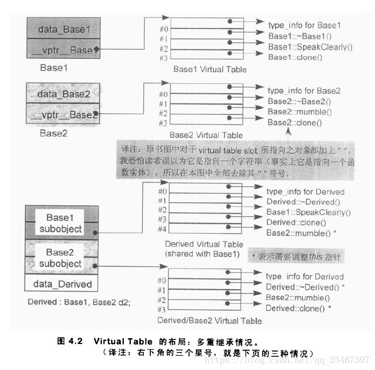
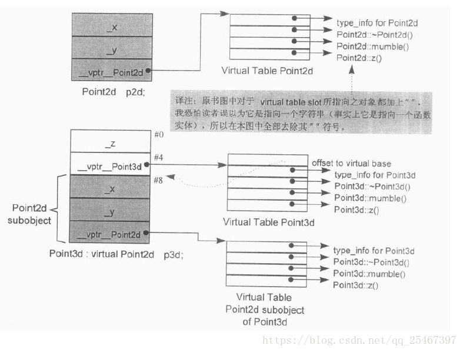

# 第四章 function语意学

[TOC]

## Nonstatic Member Functions(非静态成员函数)

准则：非静态成员函数至少和一般的非成员函数有相同的效率。编译器内部已经将成员函数转化为非成员函数。

转化流程：

1. 添加this指针作为函数的第一个参数，如果成员函数是const,那么this指针的类型为:`const className* const`；并且对每一个`nonstatic data member`的存取改经由this指针来存取。

2. 函数名处理,"name mangling"，函数名称+参数链表+参数类型的形式进行重新编码命名，使其成为一个独一无二的名称。

3. "NRV"优化，`Name Return Value`，如果有返回值的话，添加一个引用类型的参数来代替返回值。

例：

```c++
Point setPoint(const Point& point);
```

可能会被转化成:

```c++
void setPoint_crefpoint(const Point* this, const Point& point, Point& __result);
```


## Virtual Member Functions(虚成员函数)

`virtual function`一般实现模型：每一个class都有且仅有一个virtual table(虚表)，内含虚函数的地址，每个Object都有一个vptr(虚表指针)指向虚表所在。

例：假设normalize()是Point的一个虚函数，ptr是Point类型的指针，那么`ptr->normalize()`在内部转换为：`(*ptr->vptr[1])(ptr);`;

1是`virtual table slot`的索引值，关联到`normalize`函数，第二个ptr表示this指针。

执行期的额外信息来支持多态，对于每一个class object增加两个members(在编译期就确定了):
- 一个字符串或者数字来表示class的类型。
- 一个指针(vptr)指向持有程序的虚函数的执行期地址的表格（虚表）.

`virtual table`中的`active virtual function`包括:
- class本身定义的函数实例,重写了(overriding)了`base class virtual functions`;
- 继承自`base class`的函数实例；
- `pure_virtual_called()`纯虚函数实例；

### 单一继承的情况:

对于`base class Point`的声明如下:

```c++
class Point {
public:
    virtual ~Point();
    virtual Point& mult(float) = 0;
    float x() const { return _x; }
    virtual float y() const { return 0; }
    virtual float z() const { return 0; }
protected:
    Point{float x = 0.0 };
    float _x;
}
```

Point的内存布局如下:


对于Point对象pt, `__vptr_Point`指向虚表,而虚表的第一个索引即slot0一定是用来表示class的类型,接下来的徐南数的地址的顺序是按照声明顺序来的,第一个声明的虚函数是虚析构函数,所以slot1指向`Point::~Point()`,以此类推.

- 当有一个`class Point2D`继承自Point:

```c++
class Point2d : public Point {
public:
    Point2d(floag x = 0.0, float y = 0.0) : Point(x), _y(y) {}
    ~Point2d();
    Point2d& mult(float);
    float y() const { return _y; }
protected:
    float _y;
};
```

Point2D的内存布局如下:


虚表的第一个索引即`slot0`还是用来标识class的类型,接下来的虚函数的地址的顺序依然是按照声明顺序来的,此时的声明顺序是按照继承来的**基类的声明顺序**.

第一个声明的虚函数是虚析构函数,所以`slot1`指向`Point2d::~Point2d()`, `slot2`指向`mult()`取代了纯虚函数,`slot3`指向自己的`y()`函数实例(重写了基类),`slot4`则指向将继承而来的`z()`的函数实例.

- Point3d继承自Point2d:

```c++
class Point3d : public Point2d {
public:
    Point3d(float x= 0.0, float y = 0.0, float z = 0.0) : Point2d(x, y), _z(z) {}
    ~Point3d();
    Point2d& mult(float);
    float z() const { return _z; }
protected:
    float _z;
};
```

Point3D的内存布局如下:


现在假设这样的式子:`ptr->z();`如何在编译期设定虚函数的调用呢?

- 不知道ptr的真正类型,但是可以经过ptr存取到该对象的虚表;
- 每一个`z()`函数的地址都被放在虚表的`slot4`中;

因此编译器可以将其转换为:`(*ptr->vptr[4])(ptr);`但到底是哪一个虚表或者选择哪一个vptr,只有在执行期才能知道.


## 多重继承的情况

考虑这样的类继承关系:


声明如下：

```c++
class Base1 {
public:
    Base1();
    virtual ~Base1();
    virtual void speakClearly();
    virtual Base1 *clone() const;
protected:
    float data_Base1;
};

class Base2 {
public:
    Base2();
    virtual ~Base2();
    virtual void mumble();
    virtual Base2 *clone() const;
protected:
    float data_Base2;
};

class Derived : public Base1, public Base2 {
public:
    Derived();
    virtual ~Derived();
    virtual Derived *clone() const;
protected:
    float data_Derived;
};
```

多重继承的内存布局如下：



对于多重继承的派生类，一个`derived class`内含`n-1`个额外的虚表，其中n标识上一层继承的`base class`的个数，因此对于该继承体系中的`Derived`，会产生2个虚表，分别对应于`Base1`和`Base2`。

假设有这样的代码：`Base2 *pbase2 = new Derived;`新的`Derived`对象的地址就必须指向`Base2 subobject`，因此会产生一个`Base1`大小的偏移量（sizeof(Base1)）进行调整如下：

```c++
Derived *temp = new Derived;
Base2 *pbase2 = temp ? temp : sizeof(Base1)+temp;
```

同样的，删除`pbase2`所指向的对象时，也需要作出调整使得指向正确的起始点。这种offset的方法只有在执行期才能确定。

Thunk技术：以适当的offset值调整this指针；跳转到虚函数。

比如代码`delete pbase2;`thunk看起来如下：

```c++
this += sizeof(base1);
Derived::~Derived(this);
```

针对每一个虚表，Derived对象中由对应的vptr，vptr将在构造函数中设定初始值。这一点可以说明构造函数一般不能是虚函数。

Derived关联的两个虚表可能有这样的名称：

- vptr_Derived; // 主要表格，关联到Base1
- vtbl_Base2_Derived; // 次要表格，关联到Base2

### 虚继承的情况

考虑下面的虚继承：Point3d虚继承自Point2d。

```c++
class Point2d {
public:
    Point2d(float x = 0.0, float y = 0.0);
    virtual ~Point2d();
    virtual void mumble();
    virtual float z();
protected:
    float _x, _y;
};

class Point3d : public virtual Point2d {
public:
    Point3d(float x = 0.0, float y = 0.0, float z = 0.0);
    ~Point3d();
    float z();
protected:
    float _z;
}
```

内存布局如下：



**建议：不要再virtual base class中声明nonstatic data member.**

## Static Member Function(静态成员函数)

静态成员最重要的特性在于它**没有this指针**，以下特性来源于这个主要特性：

- 不能够直接存取class中的`nonstatic members`;
- 不能被声明为`const`, `volatile`, `virtual`;
- 不需要经由`class object`才被调用，可以直接经由classname::调用。

因此静态成员函数转化为一般的`nonmember`函数调用时，不会添加this指针，指挥应用"name mangling"以及"NRV"优化。

例：假设一个三维坐标点类Point3d，有个静态函数定义为：

```c++
int Point3d::object_count() { return _object_count; }
```

转化为：`int object_count__5Point3dSFV() { return _object_count_5Point3dSFV; }`

其中SFV表示`static member function`，拥有一个空白(void)的参数链表(argument list)。

如果取一个静态成员函数的地址，获取的是其在内存中的位置，也就是其地址，地址的类型是"nonmember函数指针"而非"class member function指针"。

例：

```c++
&Point3d::object_count();
```

得到的类型是:`int(*)();`而不是：`int (Point3d::*)();`


## 其它杂项

### 1.函数效能

对于`nonmember`, `static member`, `nonstatic member`函数都是转化为一样的形式，所以三者的效率完全一样。inline函数经过优化后效率由了极大地提升。

### 2.指向Member Functions的指针

1. 指向`non-virtual nonstatic member functions`的指针

例：`double (Point::*pmf)(); // 声明pmf函数指针指向Point的member function`

指定其值：`pmf = &Point::y; // y是Point的成员函数`

或者直接声明是赋值：`double (Point::*pmf)() = &Point::y;`

假设一个Point对象origin以及一个Point指针ptr,那么可以这样调用：`(origin.*pmf)();`或者`(ptr->*pmf)();`

编译器的转化为：`(pmf)(&origin);`或者`(pmf)(ptr);`

2. 指向`Virtual Member Functions`的指针

对一个虚成员函数取地址，所能获得的只是一个索引值。

假设有如下Point声明:

```c++
class Point {
public:
    virtual ~Point();
    float x();
    float y();
    virtual float z();
}
```

取析构函数的地址：`&Point::~Point();`得到索引1；取`&Point::x()`的到函数在内存中的地址；取`&Point::z()`得到索引2。若通过函数指针pmf来调用z():

```c++
float (Point::*pmf)() = &Point::z();
Point* ptr;
(ptr->*pmg)();
```

内部转换为：`(*ptr->vptr[(int)pmf])(ptr);`实际`(int)pmf`就是2，还是原来的形式：`(*ptr->vptr[2])(ptr);`还有一个问题在于如何辨别这个数值是内存地址还是索引值？cfront2.0给出了答案：

```c++
(((int)pmf)& ~127)?(*pmf)(ptr):(*ptr->vptr[(int)pmf]());
```

对于`x&~127当x<=127`，这种实现技巧必须假设继承体系中的virtual functions的个数小于128。

3. 多重继承下，指向Virtual Member Functions的指针。

4. 指向Member Functions的指针的效率。

### 3.Inline Functions

内联函数只是建议请求编译器实行，真正决定内联还是看编译器本身。如果请求被接受，编译器必须认为它可以用一个表达式合理地将这个函数扩展开来。通常编译器会计算`assignments`, `function calls`, `virtual function calls`等操作的次数的总和来决定是否内联。

一般处理`inline function`的两个阶段：

- 分析函数定义，以决定函数的"instrinsic inline ability"(本质的能力)。
- 真正的inline函数扩展操作是在调用的那点上。

### 4.形式参数（Formal Arguments）

在内联函数的扩展期间，形式参数有什么变化？例：

```c++
inline int min(int i, int j) { return i < j ? i : j; }
inline int bar() {
    int minval;
    int val1 = 1024;
    int val2 = 2048;
    minval = min(val1, val2);
    minval = min(1024, 2048);
    minval = min(foo(), bar()+1);
    return minval;
}
```

标识(1)中直接参数替换:`minval = val1 < val2 ? val1 : val2;`

标识(2)中直接拥抱常量：`minval = 1024;`

标识(3)中引发参数副作用，需要导入两个临时对象： `int t1,t2; minval = (t1=foo()), (t2=bar()+1), t1<t2?t1:t2;`

### 局部变量(Local Variables)

如果在inline定义中加入局部变量：

```c++
inline int min(int i, int j) {
    int minval = i < j ? i : j;
    return minval;
}
```

假设有操作：`int minval = min(val1, val2);`为了维护局部变量可能变成：

```c++
int __min_lv_minval;
int minval = (__min_lv_minval = val1 < val2 ? val1 : val2), __min_lv_minval);
```

inline函数的每一个局部变量都必须放在函数调用的一个封闭的区段中，拥有独一无二的名称。另外，如果扩展多次，可能会产生很多临时变量：

```c++
int minval = min(val1, val2) + min(foo(), foo() + 1);
```

可能扩展为：

```c++
// 为局部变量产生的临时对象
int __min_lv_minval_00, __min_lv_minval_01;
// 为放置副作用产生的临时变量
int t1, t2;
int minval = (__min_lv_minval_00 = val1 < val2 ? val1 : val2),
        __min_lv_minval_00)
        +
        ((__min_lv_minval_01=(t1=foo()), (t2=bar()+1),
        t1<t2?t1:t2),__min_lv_minval_00);
```

因此如果一个inline函数参数带有副作用或者进行多重调用或者函数内部有多个局部变量，这样都会产生临时对象，产生大量的扩展代码，使得程序大小爆增。
