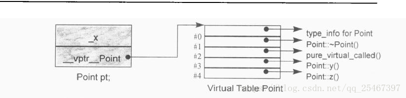
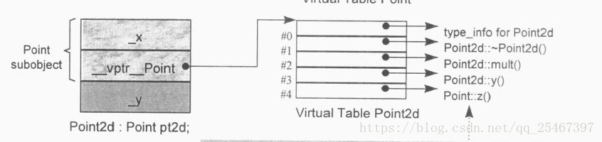
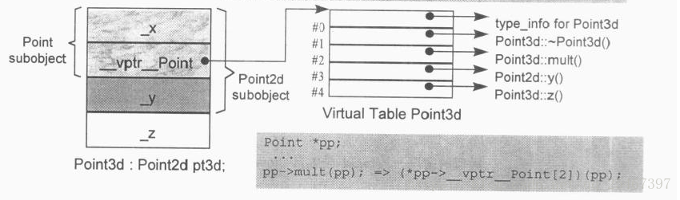
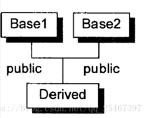

# 第四章 function语意学

## Nonstatic Member Functions(非静态成员函数)

准则：非静态成员函数至少和一般的非成员函数有相同的效率。编译器内部已经将成员函数转化为非成员函数。

转化流程：

1. 添加this指针作为函数的第一个参数，如果成员函数是const,那么this指针的类型为:`const className* const`；并且对每一个`nonstatic data member`的存取改经由this指针来存取。

2. 函数名处理,"name mangling"，函数名称+参数链表+参数类型的形式进行重新编码命名，使其成为一个独一无二的名称。

3. "NRV"优化，`Name Return Value`，如果有返回值的话，添加一个引用类型的参数来代替返回值。

例：

```c++
Point setPoint(const Point& point);
```

可能会被转化成:

```c++
void setPoint_crefpoint(const Point* this, const Point& point, Point& __result);
```


## Virtual Member Functions(虚成员函数)

`virtual function`一般实现模型：每一个class都有且仅有一个virtual table(虚表)，内含虚函数的地址，每个Object都有一个vptr(虚表指针)指向虚表所在。

例：假设normalize()是Point的一个虚函数，ptr是Point类型的指针，那么`ptr->normalize()`在内部转换为：`(*ptr->vptr[1])(ptr);`;

1是`virtual table slot`的索引值，关联到`normalize`函数，第二个ptr表示this指针。

执行期的额外信息来支持多态，对于每一个class object增加两个members(在编译期就确定了):
- 一个字符串或者数字来表示class的类型。
- 一个指针(vptr)指向持有程序的虚函数的执行期地址的表格（虚表）.

`virtual table`中的`active virtual function`包括:
- class本省定义的函数实例,重写了(overriding)了`base class virtual functions`;
- 继承自`base class`的函数实例
- `pure_virtual_called()`纯虚函数实例

### 单一继承的情况:

对于`base class Point`的声明如下:

```c++
class Point {
public:
    virtual ~Point();
    virtual Point& mult(float) = 0;
    float x() const { return _x; }
    virtual float y() const { return 0; }
    virtual float z() const { return 0; }
protected:
    Point{float x = 0.0 };
    float _x;
}
```

Point的内存布局如下:



对于Point对象pt, `__vptr_Point`指向虚表,而虚表的第一个索引即slot0一定是用来表示class的类型,接下来的徐南数的地址的顺序是按照声明顺序来的,第一个声明的虚函数是虚析构函数,所以slot1指向`Point::~Point()`,以此类推.

- 当有一个`class Point2D`继承自Point:

```c++
class Point2d : public Point {
public:
    Point2d(floag x = 0.0, float y = 0.0) : Point(x), _y(y) {}
    ~Point2d();
    Point2d& mult(float);
    float y() const { return _y; }
protected:
    float _y;
};
```

Point2D的内存布局如下:



虚表的第一个索引即`slot0`还是用来标识class的类型,接下来的虚函数的地址的顺序依然是按照声明顺序来的,此时的声明顺序是按照继承来的**基类的声明顺序**.

第一个声明的虚函数是虚析构函数,所以`slot1`指向`Point2d::~Point2d()`, `slot2`指向`mult()`取代了纯虚函数,`slot3`指向自己的`y()`函数实例(重写了基类),`slot4`则指向将继承而来的`z()`的函数实例.

- Point3d继承自Point2d:

```c++
class Point3d : public Point2d {
public:
    Point3d(float x= 0.0, float y = 0.0, float z = 0.0) : Point2d(x, y), _z(z) {}
    ~Point3d();
    Point2d& mult(float);
    float z() const { return _z; }
protected:
    float _z;
};
```

Point3D的内存布局如下:



现在假设这样的式子:`ptr->z();`如何在编译期设定虚函数的调用呢?

- 不知道ptr的真正类型,但是可以经过ptr存取到该对象的虚表;
- 每一个`z()`函数的地址都被放在虚表的`slot4`中;

因此编译器可以将其转换为:`(*ptr->vptr[4])(ptr);`但到底是哪一个虚表或者选择哪一个vptr,只有在执行期才能知道.


## 多重继承的情况

考虑这样的类继承关系:



