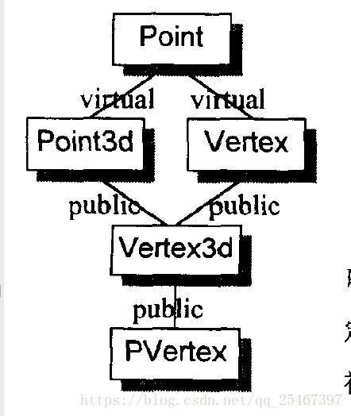

# 第五章 构造析构拷贝语意学

对于`abstract base class(抽象基类)`,class中的data member应该被初始化，并且**只在constructor中或者在其它member functions中指定初值。**

## 纯虚函数的存在

纯虚函数，虚函数在声明后加上`=0`，纯虚函数的意义在于只定义一个可继承的接口，并没有**实现**（虚函数意义在于定义一个可继承的接口并且有一份缺省实现，普通的成员函数意义在于定义一个可继承的接口并且有一份强制实现）。

纯虚函数不能经由虚拟机制调用，但是可以被静态调用`(invoked statically, AbsractClassName::pureFunction())`。

唯一的例外在于：对于`pure vitual destructor`，一定要定义它，因为每一个`derived class destructor`会被编译器加以扩张，**以静态调用的方式调用其“每一个virtual base class”以及"上一层base class"的destructor**，因此只要缺乏任何一个`base class destrctor`以及"上一层base class"的destructor，就会导致链接失败。一个较好的替代方案就是：**不要把virtual destructor声明成pure。**

## 纯虚函数的规格

一个函数几乎不会被后继的`derived class`改写，而且是inline函数，将其改写成`virtual function`是一个糟糕的选择。

一般而言，把所有的成员都声明为虚函数，然后再经过编译器优化把非必要的`virtual invocation`去除，并不是好的设计理念。

## 虚拟规格中const存在

可以先将虚函数声明了const,如果后继有`derived instance`必须修改`data member`,再将const去掉就好了。

## 重新考虑class的声明

原来的声明如下：

```c++
class Abstract_base {
public:
    virtual ~Abstract_base()=0;
    virtual void interface() const = 0;
    virtual const char* mumble() const { return _mumble; }
private:
    char* _mumble;
}
```

重新声明如下：

```c++
class Abastract_base {
public:
    virtual ~Abstract_base(); // 不再是纯虚函数
    virtual void interface() = 0; // 不再是cosnt
    const char* //不再是虚函数
        mumble() const { return _mumble; }
private:
    Abstact_base(char *pc = 0); // 新增一个带有唯一参数的constructor
    char* _mumble;
}
```

重新声明如下：

```c++
class Abstract_base {
public:
    virtual ~Abstract_base(); // 不再是纯虚函数
    virtual void interface() = 0; // 不再是const
    const char* // 不再是虚函数
        mumble() const { return _mumble; }
private:
    Abstact_base(char *pc = 0); // 新增一个带有唯一参数的constructor
    char* _mumble;
}
```

一. 无继承的情况下的对象构造

考虑下面的这个调用片段

```c++
Point global;
Point foobar() {
    Point local;
    Point *heap = new Point;
    *heap = local;
    delete heap;
    return local;
}
```

三种对象产生方式：global内存配置，local内存配置和heap内存配置。

Point定义如下：

```c++
typedef struct { float x, y, z; }Point;
```

POD类型：plain Old Data，c风格的strcut结构体定义的数据结构。

以c++来编译这段代码的话，编译器会为Point声明：trival默认构造函数，trival析构函数，trival拷贝构造函数，trival拷贝赋值运算符。

第一行代码`Point global;`，会在程序启始时调用Point的constructor，然后在系统产生的`exit()`之前调用destructor。

在c语言中，global被视为一个“临时性对象”，没有显式初始化，被存放在`data segment`中的BSS区段（Block Start By Symbol，放置没有初始化的全局变量），但是在C++中，全局对象都是以“初始过的数据”来对待，因此置于`data segment`。

第三行代码`Point local;`这个局部变量没有经过初始化，可能成为一个潜在的问题。

第四行代码`Point *heap = new Point;`声明一个堆上的对象，其中new运算符会被转化为：

```c++
Point *heap = __new(sizeof(Point));
```

此时并没有`default constructor`施行于`*heap objectl`。

第五行代码`heap = local;`由于local没有初始化，因此会产生编译警告`local is used before being initaalized`。

接着`delete heap;`会被转化为`__delete(heap);`这样会触发heap的`trival destructor`。

最后函数已传值的方式将local当作返回值传回，这样会触发`trival copy constructor`，不过由于该对象是个POD类型，所以return操作只是一个简单的`bitwise copy`。

### 抽象数据类型

将`Point`不在声明为POD，提供private数据，但是没有virtual function:

```c++
class Point {
public:
    Point(float x = 0.0, float y = 0.0, float z = 0.0) :
        _x(x), _y(y), _z(z) {}
private:
    float _x, _y, _z;
};
```

对于global实例：

```c++
Point global;
```

现在有了默认构造函数作用在其身上，由于global定义在全局范畴，其初始化操作会延迟到程序启动（startup）时才开始。（统一构造一个`_main()`函数，该函数内调用所有global对象的默认构造函数）

例：

```c++
void mumble {
    Point local1 = {1.0, 1.0, 1.0};
    Point local2;
    local2._x = 1.0;
    local2._y = 1.0;
    local2._z = 1.0;
}
```

`explicit initalization list`会比较有效率。

考虑`Point *heap = new Point;`与之前不同在于，Point有自己的notrival默认构造函数，所以会显式调用这个默认构造函数如下：

```c++
Point *heap = __new(sizeof(Point));
if (heap != 0)
    heap->Point:Point();
```

其它的操作和之前一致。

为继承做准备：

限制对z的存取操作

```c++
class Point {
public:
    Point(float x = 0.0, float y = 0.0) : _x(x), _y(y) {}
    virtual float z();
private:
    float _x, _y;
};
```

增加了虚函数之后，所定义的constructor被附加了一些代码，用来初始化vptr:

```c++
Point::Point(Point *this, float x, float y) : _x(x), _y(y) {
    this->__vptr_Point = __vbtl_Point; // 设定虚表
    this->_x = x; // 扩展初值列表
    this->_y = y;
    return this; // 返回this
}
```

合成一个`copy constructor`和一个`copy assignment operator`，其操作是nontrival，但是implicit destructor仍然是trival。如果以一个子类对象初始化父类对象，且是以位运算为基础，那么vptr的设定有可能是非法的。

```c++
inline Point*
Point::Point(Point *this, const Point& rhs) {
    this->__vptr_Point = __vbtl_Point;
    // 将rhs坐标的连续位拷贝到this对象
    return this;
}
```

还是考虑很早的调用片段，其它的除了`heap = local;`其他行为和上面都一样。首先函数原型发生变化：

```c++
void foobar(Point& __result); // NRV优化后的函数原型
```

由于有了拷贝构造函数，`heap = local;`内部转化为：

```c++
__result.Point::Point(local); // __result是NRV优化产生的参数
```

进一步整个函数优化为：

```c++
void foobar(Point& __result) {
    __result.Point::Point(0.0, 0.0);
    // heap的部分与前面相同
    return;
}
```

### 继承体系下的对象构造

当我们定义一个object如：`T object;`实际上会发生什么呢？如果T有一个constructor(不管是trival还是notrival)，它都会被调用，我们要探讨的是constructor调用伴随了什么？

1. 如果有virtual base class，虚基类的构造函数必须被调用，从深往浅，从左往右：

    - 如果class位于成员初值列，有任何显式指定的参数都应该传递过去；若没有位于初值列，而class含有一个默认构造函数，也应该调用。
    - class中的每一个virtual base class subobject的偏移量必须在执行期可存取。
    - 如果class是最底层的class，其constructors可能被调用。

2. 如果有base class,基类的构造函数必须被调用;
   
    - 如果class位于成员初值列，有任何显示指定的参数都应该传递过去。
    - 如果没有位于初值列，而class含有一个默认构造（拷贝）函数，也应该调用。
    - 如果class是多重继承下的第二或者后继的base class,那么this指针应该有所调整。

3. 如果有虚函数，必须设定vptr指向适当的虚表；

4. 如果一个member没有出现在成员初值列表中，但是该member又有一个默认构造函数，那么这个默认构造函数必须被调用；

5. 成员初值列表中的member初始化操作放在constructor的函数体内，且顺序和声明顺序一致。

再次以Point为例：

```c++
class Point {
public:
    Point(float x = 0.0, float y = 0.0);
    Point(const Point&);
    Point& operator=(const Point&);
    virtual ~Point();
    virtual float z() { return 0.0; }
private:
    float _x, _y;
};
```

以Point为基础的类Lines的扩张过程：

```c++
class Lines {
    Point _begin, _end;
public:
    Lines(float = 0.0, float = 0.0, float = 0.0, float = 0.0);
    Lines(const Point&, const Point&);
    draw();
};
```

来看第二个构造函数的定义与内部转化：

```c++
Lines::Lines(const Point& begin, const Point& end) : 
    _begin(begin), _end(end) {} // 定义
// 下面是内部转化，将初始值列中的成员构造放入函数体，调用这些成员的构造函数
Lines* Lines::Lines(Lines *this, const Point& begin, const Point& end) {
    this->_begin.Point::Point(begin);
    this->_end.Point::Point(end);
    return this;
}
```

当我们写下`Lines a;`这个时候调用构造函数要进行函数匹配。还是考虑它的析构函数吧，合成的`destructor`在内部可能如下：

```c++
inline void
Lines::~Lines(Lines *this) {
    this->_begin.Point::~Point();
    this->_end.Point::~Point();
}
```

类似的当我们写下`Lines b = a;`这个时候调用合成的拷贝构造函数，合成的拷贝构造在内部可能如下：

```c++
inline Line&
Lines::Lines(const Lines& rhs) {
    if(*this = rsh) return *this;
    // 证同测试，或者可以采用copy and swap，具体见effective c++
    // 还要注意深拷贝和浅拷贝
    this->_begin.Point::Point(rhs._begin);
    this->_end.Point::Point(rhs._end);
    return *this;
}
```


## 虚拟继承

考虑下面这个虚拟继承（继承自Point）

```c++
class Point3d : public virtual Point {
public:
    Point3d(float x = 0.0, float y = 0.0, float z = 0.0)
        : Point(x, y), _z(z) {}
    Point3d(const Point3d& rhs)
        : Point(rhs), _z(rhs._z) {}
    ~Point3d();
    Point3d& operator=(const Point3d&);
    virtual float z() { return _z; }
private:
    float _z;
}
```

传统的constructor扩张并没有用，因为virtual base calss的共享性的原因。试想以下继承关系：

```c++
class Vertex : birtual public Point {};
class Vertex3d : public Point3d, public Vertex {};
class PVertex : public Vertex3d {};
```



实际Point3d的constructor的扩充如下：

```c++
// c++伪代码
Point3d*
Point3d::Point3d(Point3d* this, bool __most_derived,
                 float x = 0.0, float y = 0.0, float z = 0.0) {
    if(__most_derived != false) this->Point::Point();
    // 虚拟继承下两个虚表的设定
    this->__vptr_Point3d = __vtbl_Point3d;
    this->__vptr_Point3d_Point = _vtbl_Point3d__Point;
    this->z = rhs.z;
    return this;
}
```

而非如下传统的扩张：

```c++
// c++伪代码
Point3d*
Point3d::Point3d(Point3d* this,
                 float x = 0.0, float y = 0.0, float z = 0.0) {
    this->Point::Point();
    this->__vptr_Point3d = __vtbl_Point3d;
    this->__vptr_Point3d_Point = __vtbl_Point3d__Point;
    this->z = rhs.z;
    return this;
}
```

两种扩张的不同之处在于参数`__mst_derived`，在更加深层次的继承情况下，例如Vextex3d，调用Point3d和Vertex的constructor时，总会将该参数设置为false，于是就压制了两个constructors对Point constructor的调用操作。例：

```c++
// c++伪代码
Vextex3d*
Vextex3d::Vextex3d(Vextex3d* this, bool __most_derived,
                   float x = 0.0, float y = 0.0, float z = 0.0) {
    if(__most_derived != false) this->Point::Point();
    // 设定__most_derived为false
    this->Point3d::Point3d(false, x, y, z);
    this->Vertex::Vertex(false, x, y);
    // 设定vptrs
    return this;
}
```

这样使得各个对象都能正确无误地调用其virtual base class subobject。

vptr初始化语意学

当我们定义一个PVertex object时，constructor的调用顺序是：

```c++
Point(x, y);
Point3d(x, y, z);
Vertex(x, y, z);
Vertex3d(x, y, z);
PVertex(x, y, z);
```

假设每一个class都定义一个`virtual function size();`返回该class的大小。我们来看看定义的`PVertex constructor:`

```c++
PVertex::Pvertex(float x, float y, float z)
    : _next(0), Vertex3d(x, y, z), Point(x, y) {
    if (spyOn)
        cerr << "Within Pvertex::PVertex()"
             << "size: " << size() << endl;
}
```

vptr的初始化操作：在base class constructor调用操作之后，但是在程序员供应的代码或“成员初值列中所列出的成员初始化操作”之前。

constructor的执行算法通常如下：

1. 在derived class constructor中，所有的virtual base class 以及上一层的base class的constructor会被调用。
2. 上述完成后，对象的vptrs被初始化，指向相关的虚表。
3. 如果有成员初值列，将在constructor的函数体内展开，这必须是在vptr设定之后才做的，以免有一个virtual member function被调用。
4. 最后执行程序员的代码。

之前的PVertex constructor可能被扩张成：

```c++
PVertex*
PVertex::Pvertex(PVertex* this, bool __most_derived,
                 float x, float y, float z) {
    // 有条件调用virtual base class constructor
    if(__most_derived != false) this->Point::Point();
    // 无条件调用上一层base class constructor
    this->Vertex3d::Vertex3d(x, y, z);
    // 设定vptr
    this->__vptr_PVertex = __vtbl_PVertex;
    this->__vptr_Point3d_PVertex = __vtbl_Point3d_PVertex;
    // 执行程序员的代码
    if(spyOn)
        cerr << "Within Pvertex::PVertex()"
             << "size: "
             // 虚拟机制调用
             << (*this->__vptr_PVertex[3].faddr)(this)
             << endl;
    return this;
}
```

下面是vptr必须被设定的两种情况：

1. 当一个完整的对象被析构起来时，如果我们声明一个Point对象，则Point constructor必须设定其vptr。
2. 当一个subobject constructor调用了一个virtual function时。

在class的constructor的成员初值列中调用该class的一个虚函数，这是安全的。因为vptr的设定总保证在成员初值列扩展之前就被设定好；但是这在语义上时不安全的，因为函数本身可能依赖未被设定初值的成员。

考虑这种情况：当需要为base class constructor提供参数时，在class的constructor的成员初值列中调用该class的一个虚函数这就是不安全的，此时vptr要么尚未被设定好，要么指向错误的class。

### 对象复制语意学

当我们指定一个class object给另一个class object时，通常有三种选择：

1. 什么都不做，实施默认的行为。
2. 提供一个`explicit copy assignment operator`。
3. 显式拒绝指定一个class object给另一个class object，声明为private或者采用继承的方法

利用Point class来帮助讨论：

```c++
class Point {
public:
    Point(float x = 0.0, float y = 0.0);
private:
    float _x, _y;
};
```

只有默认行为所导致的语意不安全或者不正确时，才需要设计一个`copy assignment operator`。例：

```c++
Point a, b;
a = b;
```

这里的`operator=`是由bitwise copy完成，并没有copy assignment operator被调用。当然，我们也可以提供一个copy constructor，为的是把NRV打开：

```c++
inline Point&
Point::operator=(const Point& p) {
    _x = p._x;
    _y = p._y;
    return *this;
}
// Point3d虚拟继承自Point
class Point3d : virtual public Point {
public:
    Point3d(float x = 0.0, float y = 0.0, float z = 0.0);
private:
    float _z;
};
```

如果没有为Point3d设定一个copy assignment operator,编译器就会为其合成一个：

```c++
inline Point3d&
Point3d::operator=(point3d* this, const Point3d& p) {
    this->Point::operator=(p); // base class operator=
    _z = p._z; // memberwise copy
    return *this;
}
```

copy assignment operator缺乏一个member assignment list,类似于成员初值列，比如：

```c++
inline Point3d&
Point3d::operator=(const Point3d& p)
    : Point(p), _z(p._z) {} // 这是不支持的，只能写成上面合成的形式
```

缺少member assignment list，编译器一般就没有办法压抑上层base class的copy operator被调用。还是考虑之前的继承体系，类Vertex虚拟自Point，并且从Point3d和Vertex派生出Vertex3d。则copy operator如下：

```c++
inline Vertex&
Vertex operator=(const Vertex& v) {
    this->Point::operator=(v);
    _next = v._next;
    return *this;
}
inline Vertex3d&
Vertex operator=(const Vertex3d& v) {
    this->Point::operator=(v);
    this->Point3d::operator=(v);
    this->Vertex::operator=(v);
    return *this;
}
```

编译器如何在Point3d和Vertex的copy assignment operator压制Point的copy assignment operator呢？
