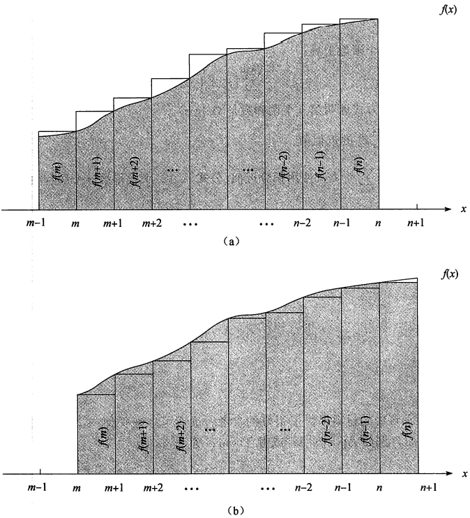

# 附录A：求和

[TOC]

## A.1 求和公式及其性质

给定一个数列$a_1, a_2, ..., a_n$，其中$n$是非负整数，可以将有限和$a_1+a_2+...+a_n$写作：$\sum_{k=1}^{n} a_k$。

给定一个无线数列$a_1, a_2, ...,$ 可以将其无限和$a_1 + a_2 + ...$ 写作：$\sum_{k=1}^{\infty} a_k$，即$\lim_{n \rightarrow \infty} \sum_{k=1}^{n} a_k$。当其极限不存在时，该级数**发散**；反之，该级数**收敛**。对于收敛级数，不能随意对其项改变求和顺序。而对于**绝对收敛级数（若对于级数$\sum_{k=1}^{\infty}a_k$，有级数$\sum_{k=1}^{\infty}|a_k|$也收敛，则称其为绝对收敛级数），则可以改变其项的求和顺序。

### 线性性质

对于任意实数$c$和任意有限序列$a_1, a_2, ..., a_n$和$b_1, b_2, ..., b_n$，有$\sum_{k=1}^{n}(ca_k + b_k) = c\sum_{k=1}^{n}a_k + \sum_{k=1}^{n}b_k$线性性质对于无限收敛级数同样适用。

### 等差级数

和式$\sum_{k=1}^{n}k = 1 + 2 + ... + n$是一个等差级数，其值为：
$$
\begin{equation}\begin{split} 
\sum_{k=1}^{n}k &= \frac{1}{2}n(n+1) \\
&= \theta(n^2)
\end{split}\end{equation}
$$

### 平方和与立方和

平方和与立方和的求和公式如下：
$$
\begin{equation}\begin{split} 
\sum_{k=0}^{n} k^2 &= \frac{n(n+1)(2n+1)}{6} \\
\sum_{k=0}^{n} k^3 &= \frac{n^2(n+1)^2}{4}
\end{split}\end{equation}
$$

### 几何级数

对于实数$x \neq 1$，和式

$\sum_{k=0}^{n} x^k = 1 + x + x^2 + ... + x^n$

是一个**几何级数**（或称**指数级数**），其值为

$\sum_{k=0}^{n}x^k = \frac{x^{n+1}-1}{x-1}$

当和是无限的且$|x| < 1$时，有无限递减几何级数

$\sum_{k=0}^{\infty} x^k = \frac{1}{1-x}$。

### 调和级数

对于正整数$n$，第$n$个调和数是

$H_n = 1 + \frac{1}{2} + \frac{1}{3} + \frac{1}{4} + ... + \frac{1}{n} = \sum_{k=1}^{n}\frac{1}{k} = ln\ n + O(1)$。

### 级数积分与微分

通过对调和级数进行积分或微分，得到$\sum_{k=0}^{\infty} = \frac{x}{(1-x)^2}$，其中，$|x| < 1$。

### 裂项级数

对于任意序列$a_0, a_1, ..., a_n$有$\sum_{k=1}^{n}(a_k - a_{k-1}) = a_n - a_0$。因为$a_1, a_2, ..., a_{n-1}$中的每一项被加和减均刚好一次，称其和裂项相消（telescopes）。

类似的有$\sum_{k=0}^{n-1}(a_k - a_{k+1}) = a_0 - a_n$。

考虑级数$\sum_{k=1}^{n-1}\frac{1}{k(k+1)}$，因为可以将每一项改写成$\frac{1}{k(k+1)} = \frac{1}{k} - \frac{1}{k=1}$，得到$\sum_{n-1}^{k=1}\frac{1}{k(k+1)} = \sum{n-1}{k=1}(\frac{1}{k} - \frac{1}{k+1}) = 1 - \frac{1}{n}$。

### 乘积

有限积$a_1 a_2 ... a_n$可以写作$\prod_{k=1}^{n} a_k$，当$n=0$时，定义积的值为$1$。我们可以用如下恒等式将一个含有求积项的公式转化为一个含和项的公式$lg(\prod_{k=1}^{n}a_k) = \sum_{k=1}^{n}lg a_k$。

## A.2确定求和时间的界

### 数学归纳法

数学归纳法是求级数值的最基本方法。例，证明对于某个常数$c$，$\sum_{k=0}^{n}3^k \leqslant c3^n$成立。对于初始条件$n = 0$，只要$c \geqslant 1$，就有$\sum_{k=0}^{n} 3^k = 1 \leqslant c \cdot 1$成立。假定该界对于$n$成立，则需证其对于$n+1$也成立。只要$(1/3 + 1/c) \leqslant 1$，或者等价地，$c \geqslant 3/2$成立，就有：
$$
\begin{equation}\begin{split} 
\sum_{k=0}^{n+1}3^k &= \sum_{k=0}^{n}3^k + 3^{n+1} \\ 
& \leqslant c3^n + 3^{n=1} \\
& = (\frac{1}{3} + \frac{1}{c})c3^{n+1} \\
& \leqslant c3^{n+1}
\end{split}\end{equation}
$$
因此，我们想要证明的$\sum_{k=0}^{n}3^k = O(3^n)$成立。

### 确定级数中各项的界

有时，通过求得级数中每一项的界，我们可以获得该级数的一个理想的上界。并且，通常用级数中最大的项的界作为其他项的界就足够了。

例，等差级数$\sum_{k=1}^{n}k=\frac{1}{2}n(n+1)$的一个可快速获得的上界是$\sum_{k=1}^{n}k \leqslant \sum_{k=1}^{n}n = n^2$；通常，对于级数$\sum_{k=1}^{n}a_k$，如果令$a_{max} = \underset{1 \leqslant k \leqslant n}{max} a_k$，则有$\sum_{k=1}^{n}a_k \leqslant n \cdot a_{max}$。

### 分割求和

分割求和是求取复杂和式界的好方法。其方法是，首先将一个级数按下标范围划分后表示为两个或多个级数的和，然后对每一个划分出的级数分别求界。

$\sum_{k=1}^{n} \frac{1}{k} \leqslant \sum_{i=0}^{\lfloor lgn \rfloor} \sum_{j=0}^{2^i - 1} \frac{1}{2^i + j} \leqslant \sum_{i=0}^{\lfloor lgn \rfloor} \sum_{2^i - 1}^{j=0} \frac{1}{2^i} = \sum_{i=0}^{\lfloor lgn \rfloor} 1 \leqslant lg\ n + 1$

### 通过积分求和的近似

当一个和式的形式为$\sum_{k=m}^{n}f(k)$时，其中$f(k)$是单调递增函数，我们可以用积分求其近似值：$\int^{n}_{m-1} f(x) dx \leqslant \sum_{k=m}^{n} f(x) \leqslant \int_{m}^{n+1} f(x) dx$。

例，通过积分求和：

*积分方法求$\sum_{k=m}^{n}f(k)$的近似值。图中每个矩形内标明了该矩形的面积，且矩形总面积代表和的值。曲线下方的阴影区域代表积分近似值。通过比较(a)中的这两个面积，可得$\int_{m-1}^{n} f(x) dx \leqslant \sum_{k=m}^{n} f(k)$，并且在将这些长方形向右移动一个单位后，由（b）得$\sum_{k=m}^{n}f(k) \leqslant \int_{m}^{n+1} f(x) dx$*

