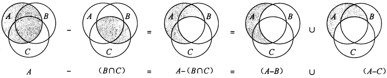

# 附录B：集合等离散数学内容

## B.1 集合

集合是由不同对象聚集而成的一个整体，称其中的对象为成员或元素；如果一个对象$x$是集合$S$的一个成员，则写作$x \in S$。

当两个集合$A$和$B$包含相同的元素时，称集合$A$与$B$是相等的，写作$A=B$。

常见集合的符号表示：

- $\phi$ 表示空集合，即集合中不包括任何元素。
- $Z$表示整数集合，即集合${..., -2, -1, 0, 1, 2, ...}$。
- $R$表示实数集合。
- $N$表示自然数集合，即集合${0, 1, 2, ...}$。

集合操作：

- 集合$A$和$B$的交是集合：$A \cap B = \{x: x \in A 且 x \in B \}$
- 集合$A$和$B$的并是集合：$A \cup B = \{x: x \in A 且 x \in B \}$
- 集合$A$和$B$的差是集合：$A - B = \{x: x \in A 且 x \in B \}$

集合操作遵循下列法则：

- 空集律

  $A \cap \phi = \phi$

  $A \cup \phi = A$

- 幂等律

  $A \cap A = A$

  $A \cup A = A$

- 交换律

  $A \cap B = B \cap A$

  $A \cup B = B \cup A$

- 结合律

  $A \cap (B \cap C) = (A \cap B) \cap C$

  $A \cup (B \cup C) = (A \cup B) \cup C$
  
- 分配律

  $A \cap (B \cup C) = (A \cap B) \cup (A \cap C)$

  $A \cup (B \cap C) = (A \cup B) \cap (A \cup C)$

- 吸收律

  $A \cap (A \cup B) = A$

  $A \cup (A \cap B) = A$

- 德.摩根定律

  $A - (B \cap C) = (A - B) \cup (A - C)$

  $A - (B \cup C) = (A - B) \cap (A - C)$

  

  将德.摩根定律用集合补形式表示：对于任意两个集合$B, C \subseteq U$，有
  $$
  \overline{B \cap C} = \overline{B} \cup \overline{C} \\
  \overline{B \cup C} = \overline{B} \cap \overline{C}
  $$
  如果两个集合间不存在共有元素，即$A \cap B = \phi$，则称集合$A$与集合$B$是不相交的。

  如果集合满足：

  1. 这些子集互不相交，即$S_i, S_i \in \beta$与$i \neq j$蕴含$S_i \cap S_i = \phi$。
  2. 他们的并为S，即$S = \underset{S_i \in \beta}{\bigcup} S_i$，则称集合$S$的非空子集构成的集合$\beta = \{S_i\}$构成$S$的一个划分；换句话说，如果$\beta$中的每个元素出现且仅出现在一个$S_i \in \beta$中，则$\beta$构成了$S$的一个划分。

  