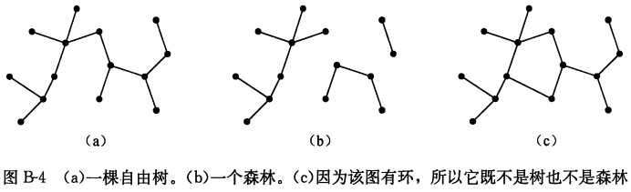
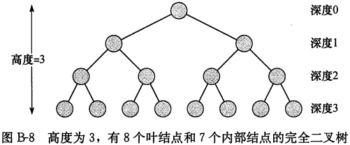

# 附录B：集合等离散数学内容

## B.1 集合

集合是由不同对象聚集而成的一个整体，称其中的对象为成员或元素；如果一个对象$x$是集合$S$的一个成员，则写作$x \in S$。

当两个集合$A$和$B$包含相同的元素时，称集合$A$与$B$是相等的，写作$A=B$。

常见集合的符号表示：

- $\phi$ 表示空集合，即集合中不包括任何元素。
- $Z$表示整数集合，即集合${..., -2, -1, 0, 1, 2, ...}$。
- $R$表示实数集合。
- $N$表示自然数集合，即集合${0, 1, 2, ...}$。

集合操作：

- 集合$A$和$B$的交是集合：$A \cap B = \{x: x \in A 且 x \in B \}$
- 集合$A$和$B$的并是集合：$A \cup B = \{x: x \in A 且 x \in B \}$
- 集合$A$和$B$的差是集合：$A - B = \{x: x \in A 且 x \in B \}$

集合操作遵循下列法则：

- 空集律

  $A \cap \phi = \phi$

  $A \cup \phi = A$

- 幂等律

  $A \cap A = A$

  $A \cup A = A$

- 交换律

  $A \cap B = B \cap A$

  $A \cup B = B \cup A$

- 结合律

  $A \cap (B \cap C) = (A \cap B) \cap C$

  $A \cup (B \cup C) = (A \cup B) \cup C$
  
- 分配律

  $A \cap (B \cup C) = (A \cap B) \cup (A \cap C)$

  $A \cup (B \cap C) = (A \cup B) \cap (A \cup C)$

- 吸收律

  $A \cap (A \cup B) = A$

  $A \cup (A \cap B) = A$

- 德.摩根定律

  $A - (B \cap C) = (A - B) \cup (A - C)$

  $A - (B \cup C) = (A - B) \cap (A - C)$

  

  将德.摩根定律用集合补形式表示：对于任意两个集合$B, C \subseteq U$，有
  $$
  \overline{B \cap C} = \overline{B} \cup \overline{C} \\
  \overline{B \cup C} = \overline{B} \cap \overline{C}
  $$
  如果两个集合间不存在共有元素，即$A \cap B = \phi$，则称集合$A$与集合$B$是不相交的。

  如果集合满足：

  1. 这些子集互不相交，即$S_i, S_i \in \beta$与$i \neq j$蕴含$S_i \cap S_i = \phi$。
  2. 他们的并为S，即$S = \underset{S_i \in \beta}{\bigcup} S_i$，则称集合$S$的非空子集构成的集合$\beta = \{S_i\}$构成$S$的一个划分；换句话说，如果$\beta$中的每个元素出现且仅出现在一个$S_i \in \beta$中，则$\beta$构成了$S$的一个划分。

集合中的元素数目称为集合的基数（或大小），表示为$|S|$。如果两个集合内的元素可以一一对应，则称这两个集合基数相同。

空集的基数是$| \phi | = 0$。

如果一个集合的基数是自然数，则称这个集合是**有限**的；否则，是**无限**的。

若一个无限集合可以与自然数集合$N$构成一一对应，则该集合是**可数无限**的；否则是**不可数**的。

对于两个优先集合$A$和$B$，有等式：$|A \cup B| = |A| + |B| - |A \cap B|$，从中可以得出$|A \cup B| \leqslant |A| + |B|$。

一个包含$n$个元素的有限集称为**$n$集合**；称1集合为**单元集**；如果一个集合的子集包含$k$个元素，则称其为$k$子集。

集合$S$的所有子集构成的集合（包含空集和集合$S$本身）可以表示为$2^S$，称$2^S$为$S$的幂集。

两个元素$a$和$b$构成的有序对可以表示为$(a, b)$，其正式定义为$(a, b)=\{a, \{a, b\}\}$。

集合$A$与$B$的笛卡尔积，表示为$A \times B$，是第一个元素为$A$中成员，第二个元素为$B$中成员的所有有序对的集合；更正式的定义是$A \times B = \{(a, b): a\in A 且 b \in B\}$。

$n$个集合$A_1, A_2, ..., A_n$的笛卡尔积是一组$n$元组的集合：$A_1 \times A_2 \times \cdot \cdot \cdot \times A_n = \{(a_1, a_2, \cdot \cdot \cdot, a_n): a_i \in A_i, i = 1, 2, \cdot \cdot \cdot, n\}$；当所有集合都是有限集时，其基数为：$|A_1 \times A_2 \times \cdot \cdot \cdot \times A_n| = |A_1| \cdot |A_2| \cdot \cdot \cdot |A_n|$；我们将单一集合$A$上的$n$重笛卡尔积表示为集合$A^n = A \times A \times \cdot \cdot \cdot \times A$。

## B.2 关系

**定理 B.1 (等价关系与划分对应)** 集合A上的任意等价关系R的等价类构成了集合A的一个划分，同事任意集合A的一个划分决定了A上的一个等价关系，而划分中的集合即为等价类。

## B.3 函数

给定两个集合$A$和$B$，称函数$f$是$A$和$B$上的二元关系，需满足对于所有$a \in A$，有且仅有一个$b \in B$使$(a, b) \in f$。这里称集合$A$为$f$的定义域，集合$B$为$f$的陪域。

给定一个函数：$f: A \rightarrow B$，如果$b = f(a)$，则称$a$是$f$的自变量，$b$是$f$在$a$处的值。

一个长度为$n$的**有限序列**是一个函数$f$，其定义域为$n$个整数构成的集合$\{0, 1, ..., n-1\}$。

**无限序列**是一个函数，其定义域是自然数集合$N$。

如果一个函数的值域与其陪域相同，则该函数是**满射**。

如果函数$f: A \rightarrow B$对于不同的自变量产生不同的值，即$a \neq a'$蕴含$f(a) \neq f(a')$，则函数$f$是**单射**的。

如果函数$f: A \rightarrow B$即是单射又是满射，则它是**双射**。

当一个函数$f$是双射时，定义其逆$f^{-1}$为：$f^{-1}(b) = a 当且仅当 f(a) = b$。

## B.4 图

**有向图G**是一个二元组$(V, E)$，其中$V$是有限集，而$E$是$V$上的二元关系。集合$V$称为图$G$的顶点集，其元素称为**顶点**。集合$E$是$G$的**边集**，其元素称为**边**。

在**无向图**$G = (V, E)$中，边集$E$由无序的顶点对组成，而不是有序对。也就是说，一条边是一个集合$\{u, v\}$，其中$u, v \in V$且$u \neq v$。

如果$(u, v)$是有向图$G = (V, E)$中的一条边，则称$(u, v)$**射出**或**离开**顶点$u$，且$(u, v)$射入或进入顶点$v$。

如果$(u, v)$是无向图$G = (V, E)$中的一条边，则称$(u, v)$与顶点$u$和$v$关联。

如果$(u, v)$是图$G = (V, E)$中的一条边，则称顶点$v$邻接于顶点$u$。当图是无向图时，邻接关系是对称的。当图是有向图时，邻接关系不一定是对称的。

无向图中顶点的**度**是值关联于该顶点的边的数目。如果一个顶点的度为0，则它是**孤立**的。顶点的**出度**是指离开该顶点的边的数目，顶点的**入度**是指进入该顶点的边的数目。

图$G = (V, E)$中从顶点$u$到顶点$u'$的一条**长度**为$k$的路径是一个顶点序列$<v_0, v_1, v_2, ..., v_k>$，其中$u = u_0, j' = u_k$，且$(u_{i-1}, v_i) \in E, i = 1, 2, ..., k$。

如果一个无向图中每个顶点从所有其它顶点都是可达的，则称该图是**连通**的。

如果一个有向图中任意两个顶点互相可达，则该有向图是**强连通**的。

两个图$G=(V, E)$和$G' = (V', E')$是同构的，如果存在一个双射：$f:V \rightarrow V'$，使得$(u, v) \in E$，当且仅当$(f(u), f(v)) \in E'$。

如果$V' \subseteq V$且$E' \subseteq E$，则称图$G' = (v', E')$是$G = (V, E)$的子图。给定一个集合$V' \subseteq V$，$G$关于$V'$的**导出子图**是图$G' = (V', E')$，其中$E' = \{(u, v) \in E: u, v \in V'\}$。

给定无向图$G=(V, E)$，$G$的**有向版本**是有向图$G' = (V, E')$，其中$(u, v) \in E'$当且仅当$(u, v) \in E$。

给定有向图$G = (V, E)$，其**无向版本**是无向图$G' = (V, E')$，其中$(u, v) \in E'$当且仅当$u \neq v$且$(u, v) \in E$。

**完全图**是图中每对顶点均邻接的无向图。

**二分图**是一个无向图$G=(V, E)$，其顶点集$V$可以被划分为两个集合$V_1$和$V_2$，且$(u, v) \in E$蕴含$u \in V_1$且$v \in V_2$或者蕴涵$u \in V_2$且$v \in V_1$。

无向无环图是一个**森林**。

连通无向无环图是一棵**(自由)树**。

**多重图**与无向图类似，但它可以在顶点间存在多条边，并允许自环。

**超图**也与无向图类似，但是其每一条**超边**连接的不是两个顶点，而是任意顶点子集。

## B5.1 自由树

**自由树**是一个连通的，无环的无向图。

**定理 B.2（自由树性质）** 令$G = (V, E)$是一个无向图。下面的描述是等价的：

1. $G$是自由树。
2. $G$中任何两项点由唯一简单路径相连。
3. $G$是连通的，但是从图中移除任意一条边得到的图均不连通。
4. $G$是连通的，且$|E| = |V| - 1$。
5. $G$是无环的，且$|E| = |V| - 1$。
6. $G$是无环的，但是如果向$E$中添加任何一条边，均会造成图包含一个环。

## B 5.2 有根树和有序树

**有根树**是一棵自由树，其顶点中存在一个与其它顶点不同的顶点，我们称该不同顶点为树的**根**。

如果从树$T$的根$r$到一个结点$x$的简单路径上最后一条边是$(y, x)$，则$y$是$x$的**双亲**，而$x$是$y$的孩子。

如果两个节点有相同的双亲，则它们是**兄弟**。一个没有孩子的结点为**叶节点**（或称为**外部结点**）。一个非叶结点是**内部结点**。

有根树$T$中一个结点$x$的孩子数目等于结点$x$的**度**。从根$r$到结点$x$的一条简单路径的长度即为$x$在$T$中的**深度**。

**有序树**是一棵有根树，其中每个节点的孩子是有序的。

## B.5.3 二叉树和位置树

**二叉树**$T$是定义在有限结点集上的结构，它或者不包含任何结点，或者包含三个不相交的结点集合：一个**根**结点，一棵称为**左子树**的二叉树，以及一棵称为**右子树**的二叉树。

不包含任何结点的二叉树称为**空树**或**零树**，有时用符号NIL表示。

**完全k叉树**是所有叶结点深度相同，且所有内部结点度为$k$的$k$叉树。

