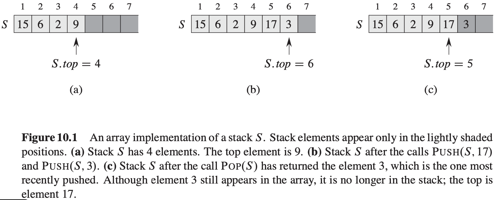
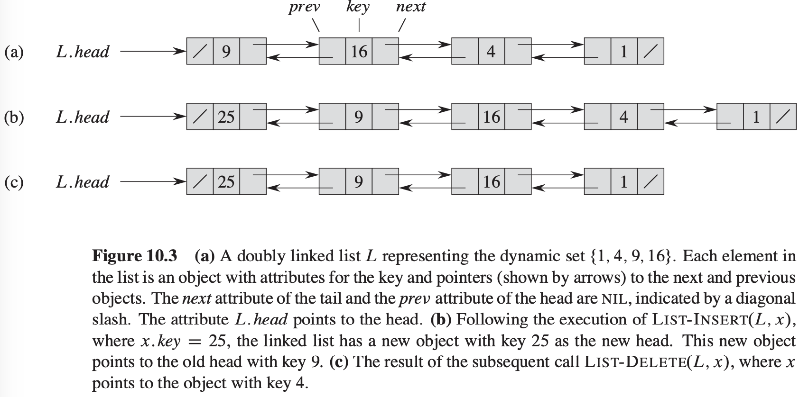

[中文版](chapter10_zh.md) | English

# Elementary Data Structures

[TOC]


## Stacks and queues

### Stacks



```c++
STACK-EMPTY(S)
if S.top == 0
    return TRUE
else return FALSE
```

```c++
PUSH(S, x)
S.top = S.top + 1
S[S.top] = x
```

```c++
POP(S)
if STACK-EMPTY(S)
    error "underflow"
else S.top = S.top - 1
    return S[S.top + 1]
```

### Queues


```c++
ENQUEUE(Q, x)
Q[Q.tail] = x
if Q.tail == Q.length
    Q.tail = 1
else Q.tail = Q.tail + 1
```

```c++
DEQUEUE(Q)
x = Q[Q.head]
if Q.head = Q.leght
    Q.head = 1
else Q.head = Q.head + 1
return x
```


## Linked lists

A **linked list** is a data structure in which the objects are arranged in a linear order.



### Searching a linked list

```c++
LIST-SEARCH(L, k)
x = L.head
while x != NIL and x.key != k
    x = x.next
return x
```

### Inserting into a linked list

```c++
LIST-INSERT(L, x)
x.next = L.head
if L.head != NIL
    L.head.prev = x
L.head = x
x.prev = NIL
```

### Deleting from a linked list

```c++
LIST-DELETE(L, x)
if x.prev != NIL
    x.prev.next = x.next
else L.head = x.next
if x.next != NIL
    x.next.prev = x.prev
```

### Sentinels


A **sentinel** is a dummy object that allows us to simplify boundary conditions.


## Implementing pointers and objects

### A multiple-array representation of objects


### A single-array representation of objects


### Allocating and freeing objects

```c++
ALLOCATE-OBJECT()
if free == NULL
    error "out of space"
else x = free
    free = x.next
    return x
```

```c++
FREE-OBJECT(x)
x.next = free
free = x
```


## Representing rooted trees

### Binary trees


### Rooted trees with unbounded branching


