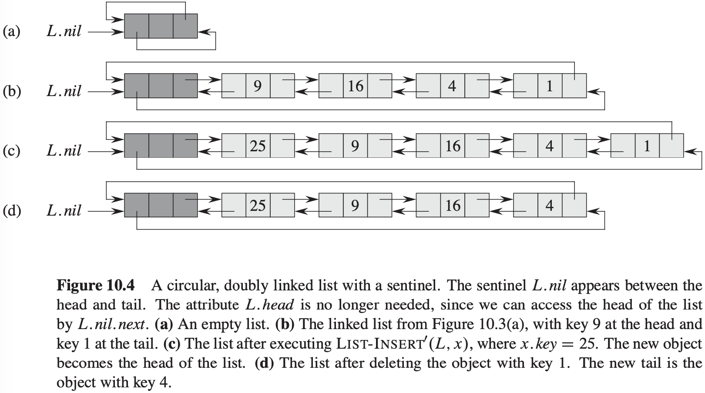
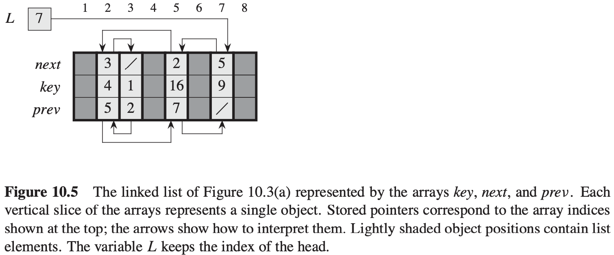

# 第10章 基本数据结构


## 10.1 栈和队列

### 栈


```c++
STACK-EMPTY(S)
if S.top == 0
    return TRUE
else return FALSE
```

```c++
PUSH(S, x)
S.top = S.top + 1
S[S.top] = x
```

```c++
POP(S)
if STACK-EMPTY(S)
    error "underflow"
else S.top = S.top - 1
    return S[S.top + 1]
```

### 队列


*利用数组$Q[1..12]$实现一个队列。只有出现在浅灰色格子里的才是队列的元素。（a）队列包含5个元素，位于$Q[7..11]$。（b）依次调用ENQUEUE(Q, 17)， ENQUEUE(Q, 3)和ENQUEUE(Q, 5)后队列的构成。（c）在调用DEQUEUE(Q)并返回原对头的关键字值15后，队列的构成。此时新的队头元素的关键字为6*

```c++
ENQUEUE(Q, x)
Q[Q.tail] = x
if Q.tail == Q.length
    Q.tail = 1
else Q.tail = Q.tail + 1
```

```c++
DEQUEUE(Q)
x = Q[Q.head]
if Q.head = Q.leght
    Q.head = 1
else Q.head = Q.head + 1
return x
```


## 10.2 链表


### 链表的搜索

```c++
LIST-SEARCH(L, k)
x = L.head
while x != NIL and x.key != k
    x = x.next
return x
```

### 链表的插入

```c++
LIST-INSERT(L, x)
x.next = L.head
if L.head != NIL
    L.head.prev = x
L.head = x
x.prev = NIL
```

### 链表的删除

```c++
LIST-DELETE(L, x)
if x.prev != NIL
    x.prev.next = x.next
else L.head = x.next
if x.next != NIL
    x.next.prev = x.prev
```

### 哨兵

`哨兵（sentinel）`是一个哑对象，其作用是简化边界条件的处理。哨兵基本不能降低数据结构相关操作的渐近时间界，但可以降低常数因子。在循环语句中使用哨兵的好处往往在于可以使代码简洁，而非提高速度。




## 10.3 指针和对想的实现

### 对象的多数组表示



### 对象的单数组表示


### 对象的分配与释放

```c++
ALLOCATE-OBJECT()
if free == NULL
    error "out of space"
else x = free
    free = x.next
    return x
```

```c++
FREE-OBJECT(x)
x.next = free
free = x
```


## 10.4 有根树的表示

### 二叉树


### 分支无限制的有根树


### 树的其它表示方法

