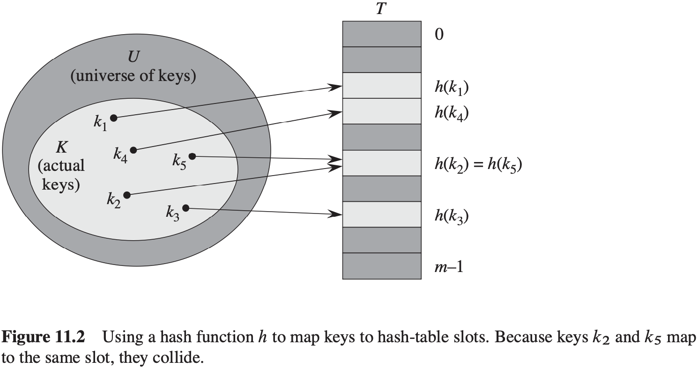

[中文版](chapter11_zh.md) | English

# 11 Hash Tables

[TOC]


## Direct-address tables


## Hash tables




### Collision resolution by chaining

```c++
CHAINED-HASH-INSERT(T, x)
insert x at the head of list T[h(x.key)]
```

```c++
CHAINED-HASH-SEARCH(T, k)
search for an element with key k in list T[h(k)]
```

```c++
CHAINED-HASH-DELETE(T, x)
delete x from the list T[h(x.key)]
```

### Analysis of hashing with chaining

**Theorem 11.1** In a hash table in which collisions are resolved by chaining, an unsuccessful search takes average-case time $\theta(1 + \alpha)$, under the assumption of simple uniform hashing.

**Proof** TODO

**Theorem 11.2** In a hash table in which collisions are resolved by chaining, a successful search takes average-case time $\theta(1 + \alpha)$, under the assumption of simple uniform hashing.

**Proof** TODO


## Hash functions

What makes a good hash function?

A good hash function satisfies (approximately) the assumption of simple uniform hashing: each key is equally likely to hash to any of the $m$ slots, independently of where any other key has hashed to.

Occasionally we do know the distribution. For example, if we know that the keys are random real numbers $k$ independently and uniformly distributed in the range $0 \leq k < 1$, then the hash function $h(k) = \lfloor km \rfloor$ satisfies the condition of simple uniform hashing.

### The division method

In the **division method** for creating hash functions, we map a key $k$ into one of $m$ slots by taking the remainder of $k$ divided by $m$. That is, the hash function is $h(k) = k\ mod\ m$.

### The multiplication method

The **multiplication method** for creating hash functions operates in two steps:

1. We multiply the key $k$ by a constant $A$ in the range $0 < A < 1$ and extract the fractional part of $kA$.

2. We multiply this value by $m$ and take the floor of the result. In short, the hash function is

   $h(k) = \lfloor m(kA\ mod\ 1) \rfloor$

   where "k A mod 1" means the fractional part of $k A$, that is, $k A - \lfloor k A \rfloor$.


### Universal hashing

**Theorem 11.3** Suppose that a hash function $h$ is chosen randomly from a universal collection of hash functions and has been used to hash $n$ keys into a table $T$ of size $m$, using chaining to resolve collisions. If key $k$ is not in the table, then the expected length $E[n_{h(k)}]$ of the list that key $k$ hashes to is at most the load factor $\alpha = n / m$. If key $k$ is in the table, then the expected length $E[n_{h(k)}]$ of the list containing key $k$ is at most $1 + \alpha$.

**Proof** TODO

**Corollary 11.4** Using universal hashing and collision resolution by chaining in an initially empty table with $m$ slots, it takes the expected time $\theta(n)$ to handle any sequence of $n$ $INSERT$, $SEARCH$, and $DELETE$ operations containing $O(m)\ INSERT$ oerations. 

**Proof** TODO

**Theorem 11.5** The class $H_{pm}$ of hash functions defined by $h_{ab}(k) = ((ak + b)mod\ p)mod\ m$ and $H_{pm} = \{h_{ab}: a \in Z_p^{*}, b \in Z_p\}$ is universal.

**Proof** TODO


## Open addressing

In **open addressing**, all elements occupy the hash table itself.

```c++
HASH-INSERT(T, k)
i = 0
repeat
    j = j(k, i)
    if T[j] == NIL
        T[j] = k
        return j
    else i = i + 1
until i == m
error "hash table overflow"
```

```c++
HASH-SEARCH(T, k)
i = 0
repeat
    j = h(k, j)
    if T[j] == k
        return j
    i = i + 1
until T[j] == NIL or i == m
return NIL
```

### Linear probing

Given an ordinary hash function $h': U \rightarrow \{0, 1, ..., m-1\}$, which we refer to as an **auxiliary hash function**, the method of **linear probing** uses the hash function $h(k, i) = (h'(k) + i)\ mod\ m, for\ i=0, 1, ..., m-1$. Given key $k$, we first probe $T[h'(k)]$, i.e., the slot given by the auxiliary hash function. We next probe slot $T[h'(k) + 1]$, and so on up to slot $T[m - 1]$. Then we wrap around to slots $T[0]$, $T[1]$, ... until we finally probe slot $T[h'(k) - 1]$. Because the initial probe determines the entire probe sequence, there are only $m$ distinct probe sequences.

### Quadratic probing

**Quadratic probing** uses a hash function of the form
$$
h(k, i) = (h'(k) + c_1i + c_2i^2)\ mod\ m
$$
, where $h'$ is an auxiliary hash function, $c_1$ and $c_2$ are positive auxiliary constants, and $i = 0, 1, ..., m - 1$.

### Double hashing

Double hashing offers one of the best methods available for open addressing because the permutations produced have many of the characteristics of randomly chosen permutations. **Double hashing** uses a hash function of the form:
$$
h(k, i) = (h_1 (k) + ih_2 (k))\ mod\ m
$$
, where both $h_1$ and $h_2$ are auxiliary hash functions.


### Analysis of open-address hashing

**Theorem 11.6** Given an open-address hash table with load factor $\alpha = n / m < 1$, the expected number of probes in an unsuccessful search is at most $1 / (1 - \alpha)$, assuming uniform hashing.

**Proof** TODO

**Corollary 11.7** Inserting an element into an open-address hash table with load factor $\alpha$ requires at most $1 / (1 - \alpha)$ probes, on average, assuming uniform hashing.

**Proof** TODO

**Theorem 11.8** Given an open-address hash table with load factor $\alpha < 1$, the expected number of probes in a successful search is at most $\frac{1}{\alpha} ln \frac{1}{1 - \alpha}$, assuming uniform hashing and assuming that each key in the table is equally likely to be searched for.

**Proof** TODO


## Perfect hashing


**Theorem 11.9** Suppose that we store $n$ keys in a hash table of size $m = n^2$ using a hash function $h$ randomly chosen from a universal class of hash functions. Then, the probability is less than $1/2$ that there are any collisions.

**Proof** TODO

**Theorem 11.10** Suppose that we store $n$ keys in a hash table of size $m = n$ using a hash function $h$ randomly chosen from a universal class of hash functions. Then, we have $E[\sum_{j=0}^{m-1} n_j ^ 2] < 2n$, where $n_j$ is the number of keys hashing to slot $j$.

**Proof** TODO

**Corollary 11.11** Suppose that we store $n$ keys in a hash table of size $m = n$ using a hash function $h$ randomly chosen from a universal class of hash functions, and we set the size of each secondary hash table to $m_j = n_j^2$ for $j = 0, 1, ..., m - 1$. Then, the expected amount of storage required for all secondary hash tables in a perfect hashing scheme is less than $2n$.

**Proof** TODO

**Corollary 11.12** Suppose that we store $n$ keys in a hash table of size $m = n$ using a hash function $h$ randomly chosen from a universal class of hash functions, and we set the size of each secondary hash table to $m_j = n_j^2$ for $j = 0, 1, ..., m - 1$. Then, the probability is less than $1 / 2$ that the total storage used for secondary hash tables equals or exceeds $4n$.

**Proof** TODO

