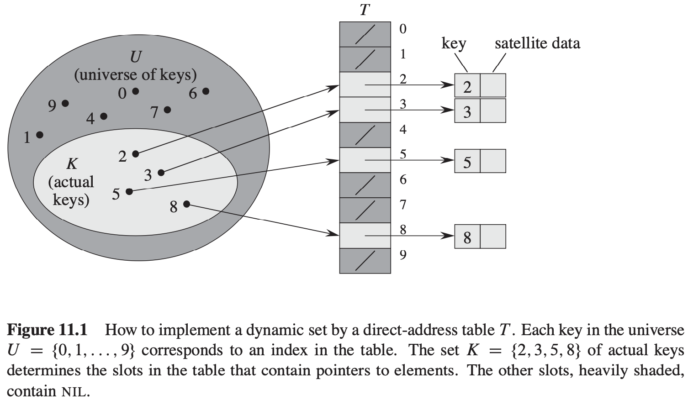
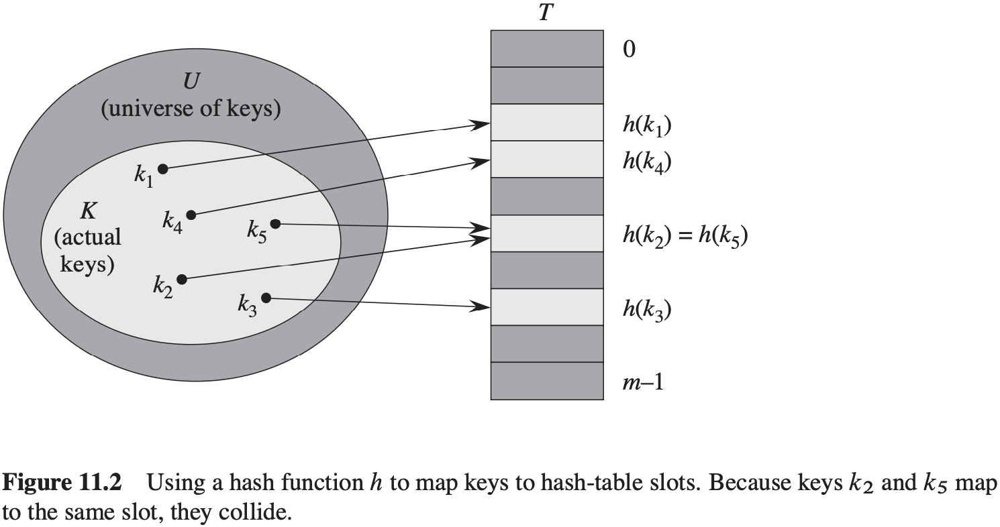
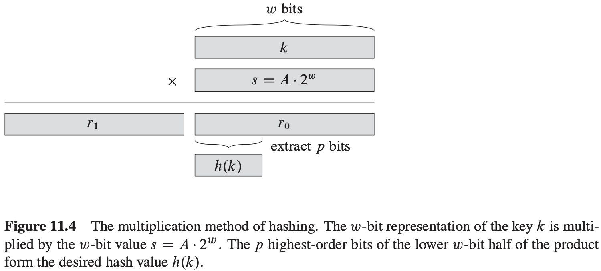
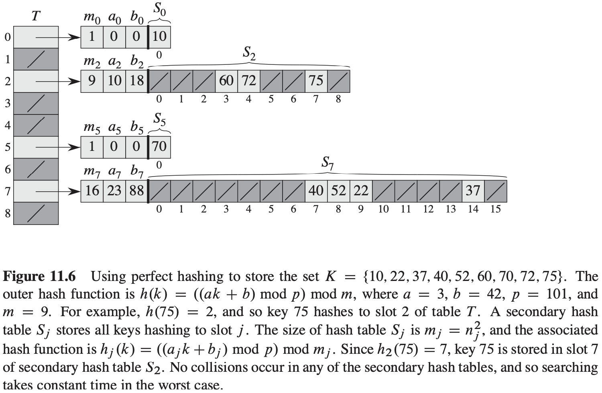

# 第11章 散列表

[TOC]


## 11.1 直接寻址表




## 11.2 散列表



### 通过链接法解决冲突

```c++
CHAINED-HASH-INSERT(T, x)
insert x at the head of list T[h(x.key)]
```

```c++
CHAINED-HASH-SEARCH(T, k)
search for an element with key k in list T[h(k)]
```

```c++
CHAINED-HASH-DELETE(T, x)
delete x from the list T[h(x.key)]
```


### 链接法散列的分析

**定理 11.1** 在简单均匀散列的假设下，对于用链接法解决冲突的散列表，一次不成功查找的平均时间为$\theta(1+\alpha)$。

**证明** 在简单均匀散列的假设下，任何尚未被存储在表中的关键字$k$都等可能地被散列到$m$个槽中的任何一个。因而，当查找一个关键字$k$时，在不成功的情况下，查找的期望时间就是查找至链表$T[h(k)]$末尾的期望时间，这一时间的期望长度为$E[n_{h(k)}] = \alpha$。于是，一次不成功的查找平均要检查$\alpha$个元素，并且所需要的总时间（包括计算$h(k)$的时间）为$\theta(1+\alpha)$。

**定理 11.2** 在简单均匀散列的假设下，对于用链接法解决冲突的散列表，一次成功查找所需的平均时间为$\theta(1+\alpha)$。

**证明** 假设要查找的元素是表中存放的$n$个元素中任何一个，且是等可能的。在对元素$x$的一次成功查找中，所检查的元素数就是$x$所在的链表中$x$前面的元素数多1。在该链表中，因为新的元素都是在表头插入的，所以出现在$x$之前的元素都是在$x$之后插入的。为了确定所检查元素$x$的期望数目，对$x$所在的链表，在$x$之后插入到表中的期望元素数加1，再对表中的$n$个元素$x$取平均。设$x_i$表示插入到表中的第$i$个元素，$i=1, 2, ..., n$，并设$k_i = x_i \cdot key$。对关键字$k_i$和$k_j$，定义指示器随机变量$X_{ij} = I\{h(k_i) = h(k_j)\}$。在简单均匀散列的假设下，有$Pr\{h(k_i) = h(k_j)\} = 1/m$，从而根据引理5.1，有$E[x_{ij}] = 1/m$。于是，在一次成功的查找中，所检查元素的期望数目为：
$$
\begin{equation}\begin{split} 
E[\frac{1}{n} \sum_{i=1}^{n}(1 + \sum_{j=i+1}^{n}X_{ij})] &= \frac{1}{n} \sum_{i=1}^{n} (1 + \sum_{j=i+1}^{n} E[X_{ij}]) \\
&= \frac{1}{n} \sum_{i=1}^{n}(1 + \sum_{j=i+1}^{n} \frac{1}{m}) = 1 + \frac{1}{nm} \sum_{i=1}^{n} (n - i) \\
&= 1 + \frac{1}{nm}(\sum_{i=1}^{n}n - \sum_{i=1}^{n}i) = 1 + \frac{1}{nm} (n^2 - \frac{n(n+1)}{2}) \\
&= 1 + \frac{n-1}{2m} = 1 + \frac{\alpha}{2} - \frac{\alpha}{2n}
\end{split}\end{equation}
$$
因此，一次成功的查找所需要的全部时间（包括计算散列函数的时间）为$\theta(2 + \alpha / 2 - \alpha / 2n) = \theta(1 + \alpha)$。


## 11.3 散列函数

好的散列函数的特点：

一个好的散列函数应（近似地）满足简单均匀散列假设：每个关键字都被等可能地散列到$m$个槽位中的任何一个，并与其它关键字已散列到哪个槽位无关。

有时，我们知道关键字的概率分布。例如，如果各关键字都是随机的实数$k$，他们独立均匀地分布于$0 \leqslant k < 1$范围中，那么散列函数$h(k) = \lfloor km \rfloor$就能满足简单均匀散列的假设条件。

### 11.3.1 除法散列法

在用来设计散列函数的除法散列法中，通过取$k$除以$m$的余数，将关键字$k$映射到$m$个槽中的某个上，即散列函数为：$h(k) = k\ mod\ m$。

### 11.3.2 乘法散列法

构造散列函数的乘法散列法步骤：

1. 用关键字$k$乘上常数$A(0 < A < 1)$，并提取$kA$的小数部分；
2. 用$m$乘以这个值，再向下取整。总之，散列函数为：$h(k) = \lfloor m(kA\ mod\ 1) \rfloor$。



### 11.3.3 全域散列法

**定理 11.3** 如果$h$选自一组全域散列函数，将$n$个关键字散列到一个大小为$m$的表$T$中，并用链接法解决冲突。如果关键字$k$不在表中，则$k$被散列至其中的链表的期望长度$E[n_{h(k)}]$至多为$\alpha = n/m$。如果关键字$k$在表中，则包含关键字$k$的链表的期望长度$E[n_{h(k)}]$至多为$1+\alpha$。

**证明** TODO

**推论 11.4** 对于一个具有$m$个槽位且初始时为空的表，利用全域散列法和链接法解决冲突，需要$\theta(n)$的期望时间来处理任何包含了$n$个INSERT，SEARCH和DELETE的操作序列，其中该序列包含了$O(m)$个INSERT操作。

**证明** 由于插入操作的数目为$O(m)$，有$n = O(m)$，从而有$\alpha = O(1)$。INSERT操作和DELETE操作需要常量时间，每一个SEARCH操作的期望时间为$O(1)$。于是，根据期望值的线性性质可知，整个$n$个操作序列的期望时间为$O(n)$。因为每个操作所用时间为$\Omega (1)$，所以$\theta(n)$的界成立。

**定理 11.5** 由公式$h_{ab}(k) = ((ak + b)mod\ p)mod\ m$和公式$H_{pm} = \{h_{ab}: a \in Z_p^{*}, b \in Z_p\}$定义的散列函数簇$H_{pm}$是全域的。

**证明** TODO


## 11.4 开放寻址法

```c++
HASH-INSERT(T, k)
i = 0
repeat
    j = j(k, i)
    if T[j] == NIL
        T[j] = k
        return j
    else i = i + 1
until i == m
error "hash table overflow"
```

```c++
HASH-SEARCH(T, k)
i = 0
repeat
    j = h(k, j)
    if T[j] == k
        return j
    i = i + 1
until T[j] == NIL or i == m
return NIL
```

### 线性探查

给定一个普通的散列函数$h': U \rightarrow \{0, 1, ..., m-1\}$，称之为辅助散列函数（auxiliary hash function），线性探查(linear probing)方法采用的散列函数为：$h(k, i) = (h'(k) + i)mod\ m, i=0, 1, ..., m-1$。给定一个关键字$k$，首先探查槽$T[h'(k)]$，即由辅助散列函数所给出的槽位。再探查槽$T[h'(k) - 1]$。在线性探查方法中，初始探查位置决定了整个序列，故只有$m$种不同的探查序列。

### 二次探查

二次探查（quadratic probing）采用如下形式的散列函数：$h(k, i) = (h'(k) + c_1 i + c_2 i^2) mod\ m$；其中$h'$是一个辅助散列函数，$c_1$和$c_2$为正的辅助常数，$i = 0, 1, ..., m-1$。

### 双重散列

双重散列（double hashing）是用于开放寻址法的最好方法之一，因为它所产生的排列具有随机选择排列的许多特性。双重散列采用如下形式的散列函数：$h(k, i) = (h_1 (k) + ih_2 (k))mod\ m$；其中$h_1$和$h_2$均为辅助散列函数。


### 开放寻址散列的分析

**定理 11.6** 给定一个装载因子为$\alpha = n/m<1$的开放寻址散列表，并假设是均匀散列的，则对于一次不成功的查找，其期望的探查次数至多为$1/(1-\alpha)$。

**证明** TODO

**推论 11.7** 假设采用的是均匀散列，平均情况下，向一个装载因子为$\alpha$的开放寻址散列表种插入一个元素至多需要做$1/(1-\alpha)$次探查。

**证明** TODO

**定理 11.8** 对于一个装载因子为$\alpha < 1$的开放寻址散列表，一次成功查找中的探查期望至多为$\frac{1}{\alpha} ln \frac{1}{1 - \alpha}$；假设采用均匀散列，且表中的每个关键字被查找的可能性是相同的。

**证明** TODO


## 11.5 完全散列



**定理 11.9** 如果从一个全域散列函数类中随机选出散列函数$h$，将$n$个关键字存储在一个大小为$m = n^2$的散列表中，那么表中出现冲突的概率小于$1/2$。

**证明** 共有${n \choose 2}$对关键字可能发生冲突；如果$h$是从一个全域散列函数类$H$中随机选出，那么每一对关键字冲突的概率为$1/m$。设$X$是一个统计冲突次数的随机变量。当$m=n^2$时，期望的冲突次数为：$E[X] = {n \choose 2} \cdot \frac{1}{n^2} = \frac{n^2 - n}{2} \cdot \frac{1}{n^2} < \frac{1}{2}$。运用马尔可夫不等式，$Pr\{X \geqslant t\} \leqslant E[X]/t$，将$t=1$代入，即完成证明。

**定理 11.10** 如果从某个全域散列函数类中随机选出散列函数$h$，用它将$n$个关键字存储到一个大小为$m = n$的散列表中，则有$E[\sum_{j=0}^{m-1} n_j ^ 2] < 2n$；这里$n_j$为散列到槽$j$中的关键字数。

**证明** 我们从下面的恒等式开始，这个等式对任何非负的整数$a$成立：$a^2 = a + 2{a \choose 2}$，于是有：
$$
\begin{equation}\begin{split} 
E[\sum_{j=0}^{m-1} n_j^2] &= E[\sum_{j=0}^{m-1}(n_j + 2{n_j \choose 2})] \\
&= E[\sum_{j=0}^{m-1}n_j] + 2E[\sum_{j=0}^{m-1}{n_j \choose 2}] \\
&= E[n] + 2E[\sum_{j=0}^{m-1}{n_j \choose 2}] \\
&= n + 2E[\sum_{j=0}^{m-1}{n_j \choose 2}]
\end{split}\end{equation}
$$
为了计算和式$\sum_{j=0}^{m-1}{n_j \choose 2}$，注意到它是散列表中发生冲突的关键字的总对数。根据全域散列性质，这一和式的期望值至多为${n \choose 2} \frac{1}{m} = \frac{n(n-1)}{2m} = \frac{n-1}{2}$；因为$m=n$，于是：$E[\sum_{j=0}^{m-1} n_j ^ 2] \leqslant n + 2\frac{n-1}{2} = 2n - 1 < 2n$。

**推论 11.11** 如果从某一全域散列函数类中随机选出散列函数$h$，用它将$n$个关键字存储到一个大小为$m=n$的散列表中，并将每个二次散列表的大小设置为$m_j = n_j ^ 2 (j=0, 1, ..., m-1)$，则在一个完全散列方案中，存储所有二次散列表所需的存储总量的期望值小于$2n$。

**证明** 因为$m_j = n_j ^ 2 (j=0, 1, ..., m-1)$，给出$E[\sum_{j=0}^{m-1} m_j] = E[\sum_{j=0}^{m-1} n_j ^ 2] < 2n$。

**推论 11.12** 如果从某一全域散列函数类中随机选出散列函数$h$，用它将$n$个关键字存储到一个大小为$m = n$的散列表中，并将每个二级散列表的大小置为$m_j = n_j ^ 2 (j = 0, 1, ..., m-1)$，则用于存储所有二级散列表的存储总量等于或大于$4n$的概率小于1/2。

**证明** 应用马尔可夫不等式，即$Pr\{X \geqslant t\} \leqslant E[X]/t$。并将$X = \sum_{j=0}^{m-1} m_j$和$t = 4n$代入不等式$E[\sum_{j=0}^{m-1} m_j] = E[\sum_{j=0}^{m-1} n_j ^ 2] < 2n$，得到：$Pr\{\sum_{j=0}^{m-1} m_j \geqslant 4n\} \leqslant \frac{E[\sum_{j=0}^{m-1} m_j]}{4n} < \frac{2n}{4n} = 1/2$。

