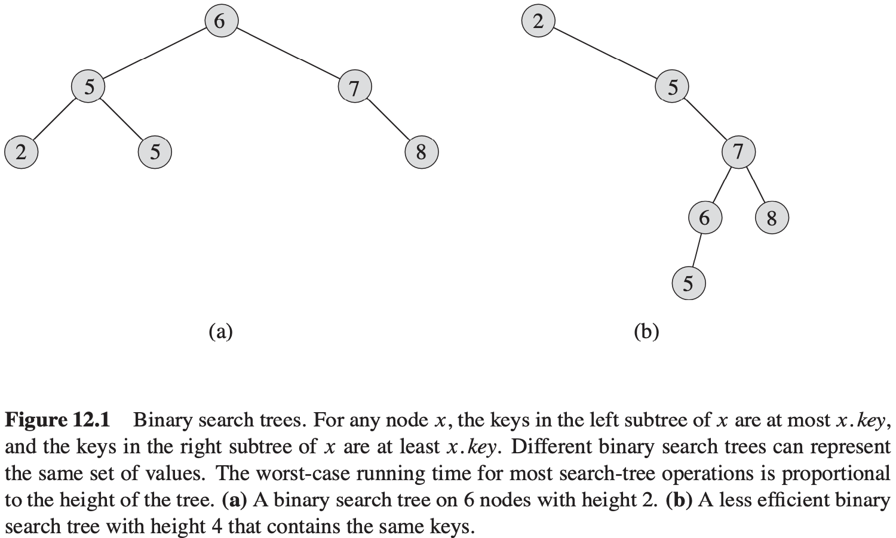
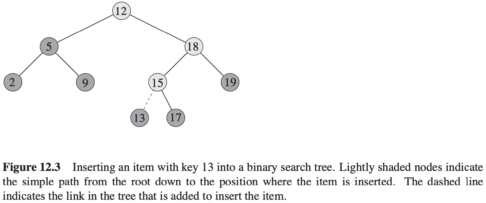
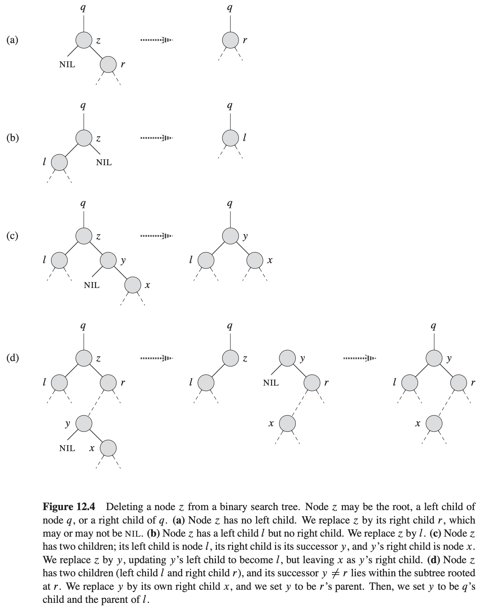

[中文版](chapter12_zh.md) | English

# Binary Search Trees

[TOC]

## What is a binary search tree?

**binary-search-tree property:** Let $x$ be a node in a binary search tree. If $y$ is a node in the left subtree of $x$, then $y.key \leq x.key$. If $y$ is a node in the right subtree of $x$, then $y.key \geq x.key$.

**Theorem 12.1** If $x$ is the root of an $n$-node subtree, then the call $INORDER-TREE-WALK(x)$ takes $\theta(n)$ time.

The binary-search-tree property allows us to print out all the keys in a binary search tree in sorted order by a simple recursive algorithm, called an **inorder tree walk**.

A **preorder tree walk** prints the root before the values in either subtree.

A **postorder tree walk** prints the root after the values in its subtrees.

## Querying a binary search tree

**Searching**

$$
\begin{align}
& TREE-SEARCH(x, k) \\
& if\ x == NIL\ or\ k == x.key \\
& \qquad return\ x \\
& if\ k < x.key \\
& \qquad return\ TREE-SEARCH(x.left, k) \\
& else\ return\ TREE-SEARCH(x.right, k)
\end{align}
$$

$$
\begin{align}
& ITERATIVE-TREE-SEARCH(x, k) \\
& while\ x\neq NIL\ and\ k \neq x.key \\
& \qquad if\ k < x.key \\
& \qquad \qquad x = x.left \\
& \qquad else\ x = x.right \\
& return\ x
\end{align}
$$
**Minimum and maximum**
$$
\begin{align}
& TREE-MINIMUM(x) \\
& while\ x.left \neq NIL \\
& \qquad x = x.left \\
& return\ x
\end{align}
$$

$$
\begin{align}
& TREE-MAXIMUM(x) \\
& while\ x.right \neq NIL \\
& \qquad x = x.right \\
& return x
\end{align}
$$

**Successor and predecessor**
$$
\begin{align}
& TREE-SUCCESSOR(x) \\
& if\ x.right \neq NIL \\
& \qquad return\ TREE-MINIMUM(x.right) \\
& y = x.p \\
& while\ y \neq NIL\ and\ x == y.right \\
& \qquad x = y \\
& \qquad y = y.p \\
& return\ y
\end{align}
$$
**Theorem 12.2** We can implement the dynamic-set operations $SEARCH$, $MINIMUM$, $MAXIMUM$, $SUCCESSOR$, and $PREDECESSOR$ so that each one runs in $O(h)$ time on a binary search tree of height $h$.

## Insertion and deletion

**Insertion**
$$
\begin{align}
& TREE-INSERT(T, z) \\
& y = NIL \\
& x = T.root \\
& while\ x\neq NIL \\
& \qquad y = x \\
& \qquad if\ z.key < x.key \\
& \qquad \qquad x = x.left \\
& \qquad else\ x = x.right \\
& z.p = y \\
& if\ y == NIL \\
& \qquad T.root = z \\
& elseif\ z.key < y.key \\
& \qquad y.left = z \\
& else\ y.right = z \\
\end{align}
$$

**Deletion**
$$
\begin{align}
& TRANSPLANT(T, u, v) \\
& if\ u.p == NIL \\
& \qquad T.root = v \\
& elseif\ u == u.p, left \\
& \qquad u.p.left = v \\
& else\ u.p.right = v \\
& if\ v \neq NIL \\
& \qquad v.p = u.p
\end{align}
$$

$$
\begin{align}
& TREE-DELETE(T, z) \\
& if\ z.left == NIL \\
& \qquad TRANSPLANT(T, z, z.right) \\
& elseif\ z.right == NIL \\
& \qquad TRANSPLANT(T, z, z, left) \\
& else\ y = TREE-MINIMUM(z.right) \\
& \qquad if\ y.p \neq z \\
& \qquad \qquad TRANSPLANT(T, y, y.right) \\
& \qquad \qquad y.right = z.right \\
& \qquad \qquad y.right.p = y \\
& \qquad TRANSPLANT(T, z, y) \\
& \qquad y.left = z.left \\
& \qquad y.left.p = y \\
\end{align}
$$

**Theorem 12.3** We can implement the dynamic-set operations $INSERT$ and $DELETE$ so that each one runs in $O(h)$ time on a binary search tree of height $h$.

## Randomly built binary search trees

**Theorem 12.4** The expected height of a randomly built binary search tree on $n$ distinct keys is $O(lg\ n)$.
