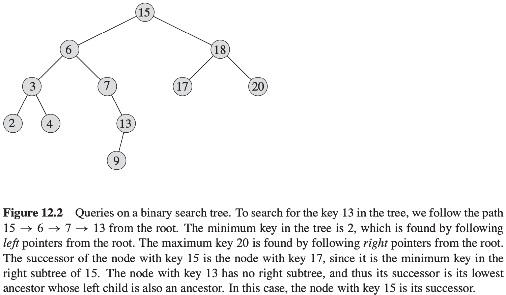

# 第12章 二叉搜索树

## 12.1 什么是二叉搜索树

**二叉搜索树性质** 设$x$是二叉搜索树中的一个结点。如果$y$是$x$左子树中的一个结点，那么$y.key \leqslant x.key$。如果$y$是$x$右子树中的一个结点，那么$y.key \geqslant x.key$。

**中序遍历（inorder tree walk）** 输出的子树根的关键字位于其左子树的关键字值和右子树的关键字值之间。

**先序遍历（preorder tree walk）** 输出的根的关键字在其左右子树的关键字值之前。

**后序遍历（postorder tree walk）** 输出的根的关键字在其左右子树的关键字值之后。

**定理 12.1** 如果$x$是一棵有$n$个结点子树的根，那么调用INORDER-TREE-WALK(x)需要$\theta(n)$时间。

## 12.2 查询二叉搜索树

**查找**

递归模式查找：
$$
\begin{align}
& TREE-SEARCH(x, k) \\
& if\ x == NIL\ or\ k == x.key \\
& \qquad return\ x \\
& if\ k < x.key \\
& \qquad return\ TREE-SEARCH(x.left, k) \\
& else\ return\ TREE-SEARCH(x.right, k)
\end{align}
$$

while模式查找：
$$
\begin{align}
& ITERATIVE-TREE-SEARCH(x, k) \\
& while\ x\neq NIL\ and\ k \neq x.key \\
& \qquad if\ k < x.key \\
& \qquad \qquad x = x.left \\
& \qquad else\ x = x.right \\
& return\ x
\end{align}
$$

**最大关键字元素和最小关键字元素**
$$
\begin{align}
& TREE-MINIMUM(x) \\
& while\ x.left \neq NIL \\
& \qquad x = x.left \\
& return\ x
\end{align}
$$

$$
\begin{align}
& TREE-MAXIMUM(x) \\
& while\ x.right \neq NIL \\
& \qquad x = x.right \\
& return x
\end{align}
$$

**后继和前驱**
$$
\begin{align}
& TREE-SUCCESSOR(x) \\
& if\ x.right \neq NIL \\
& \qquad return\ TREE-MINIMUM(x.right) \\
& y = x.p \\
& while\ y \neq NIL\ and\ x == y.right \\
& \qquad x = y \\
& \qquad y = y.p \\
& return\ y
\end{align}
$$
**定理 12.2** 在一棵高度为$h$的二叉搜索树上，动态集合上的操作SEARCH, MINIMUM, MAXIMUM, SUCCESSOR和PREDECESSOR可以在$O(h)$时间内完成。

## 12.3 插入和删除

**插入**
$$
\begin{align}
& TREE-INSERT(T, z) \\
& y = NIL \\
& x = T.root \\
& while\ x\neq NIL \\
& \qquad y = x \\
& \qquad if\ z.key < x.key \\
& \qquad \qquad x = x.left \\
& \qquad else\ x = x.right \\
& z.p = y \\
& if\ y == NIL \\
& \qquad T.root = z \\
& elseif\ z.key < y.key \\
& \qquad y.left = z \\
& else\ y.right = z \\
\end{align}
$$

**删除**
$$
\begin{align}
& TRANSPLANT(T, u, v) \\
& if\ u.p == NIL \\
& \qquad T.root = v \\
& elseif\ u == u.p, left \\
& \qquad u.p.left = v \\
& else\ u.p.right = v \\
& if\ v \neq NIL \\
& \qquad v.p = u.p
\end{align}
$$

$$
\begin{align}
& TREE-DELETE(T, z) \\
& if\ z.left == NIL \\
& \qquad TRANSPLANT(T, z, z.right) \\
& elseif\ z.right == NIL \\
& \qquad TRANSPLANT(T, z, z, left) \\
& else\ y = TREE-MINIMUM(z.right) \\
& \qquad if\ y.p \neq z \\
& \qquad \qquad TRANSPLANT(T, y, y.right) \\
& \qquad \qquad y.right = z.right \\
& \qquad \qquad y.right.p = y \\
& \qquad TRANSPLANT(T, z, y) \\
& \qquad y.left = z.left \\
& \qquad y.left.p = y \\
\end{align}
$$

**定理 12.3** 在一棵高度为$h$的二叉搜索树上，实现动态集合操作INSERT和DELETE的运行时间均为$O(h)$。

## 12.4 随机构建二叉搜索树

**定理 12.4** 一棵有$n$个不同关键字的随机构建二叉搜索树的期望高度为$O(lg\ n)$。

