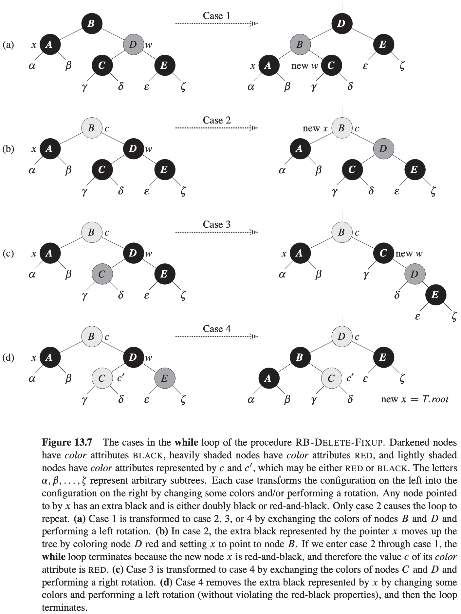

# 第13章 红黑树

**红黑树（red-black tree）**是许多平衡搜索树中的一种，可以保证在最坏情况下基本动态集合操作的时间复杂度为$O(lg\ n)$。

## 13.1 红黑树的性质

一棵红黑树是满足下面红黑性质的二叉搜索树：

1. 每个结点或是**红色**的，或是**黑色**的。
2. 根结点是**黑色**的。
3. 每个叶结点(NIL)是**黑色**的。
4. 如果一个结点是**红色**的，则它的两个子结点都是**黑色**的。
5. 对每个结点，从该结点到其所有后代叶结点的简单路径上，均包含相同数目的黑色结点。

**引理 13.1** 一棵有$n$个内部结点的红黑树的高度至多为$2 lg(n + 1)$。

## 13.2 旋转

$$
\begin{align}
& LEFT-ROTATE(T, x) \\
& y = x.right \\
& x.right = y.left \\
& if\ y.left \neq T.nil \\
& \qquad y.left.p = x \\
& y.p = x.p \\
& if\ x.p == T.nil \\
& \qquad T.root = y \\
& elseif\ x == x.p.left \\
& \qquad x.p.left = y \\
& else\ x.p.right = y \\
& y.left = x \\
& x.p = y
\end{align}
$$

## 13.3 插入

$$
\begin{align}
& RB-INSERT(T, z) \\
& y = T.nil \\
& x = T.root \\
& while\ x \neq T.nil \\
& \qquad y = x \\
& \qquad if\ z.key < z.key \\
& \qquad \qquad x = x.left \\
& \qquad else\ x = x.right \\
& z.p = y \\
& if\ y == T.nil \\
& \qquad T.root = z \\
& elseif\ z.key < y.key \\
& \qquad y.left = z \\
& else\ y.right = z \\
& z.left = T.nil \\
& z.right = T.nil \\
& z.color = RED \\
& RB-INSERT-FIXUP(T, z)
\end{align}
$$

$$
\begin{align}
& RB-INSERT-FIXUP(T, z) \\
& while\ z.p.color == RED \\
& \qquad if\ z.p == z.p.p.left \\
& \qquad \qquad y = z.p.p.right \\
& \qquad \qquad if\ y.color == RED \\
& \qquad \qquad \qquad z.p.color = BLACK \\
& \qquad \qquad \qquad z.color = BLACK \\
& \qquad \qquad \qquad z.p.p.color = RED \\
& \qquad \qquad \qquad z = z.p.p \\
& \qquad \qquad else\ if\ z == z.p.right \\
& \qquad \qquad \qquad z = z.p \\
& \qquad \qquad \qquad LEFT-ROTATE(T, z) \\
& \qquad \qquad z.p.color = BLACK \\
& \qquad \qquad z.p.p.color = RED \\
& \qquad \qquad RIGHT-ROTATE(T, z.p.p) \\
& \qquad else(same\ as\ then\ clause\ with\ "right"\ and\ "left"\ exchanged) \\
& T.root.color = BLACK
\end{align}
$$

## 13.4 删除

$$
\begin{align}
& RB-TRANSPLANT(T, u, v) \\
& if\ u.p == T.nil \\
& \qquad T.root = v \\
& elseif\ u == u.p.left \\
& \qquad u.p.left = v \\
& else\ u.p.right = v \\
& v.p = u.p
\end{align}
$$

$$
\begin{align}
& RB-DELETE-FIXUP(T, x) \\
& while\ x \neq T.root\ and\ x.color == BLACK \\
& \qquad if\ x == x.p.left \\
& \qquad \qquad w = x.p.right \\
& \qquad \qquad if\ w.color == RED \\
& \qquad \qquad \qquad w.color = BLACK \\
& \qquad \qquad \qquad x.p.color = RED \\
& \qquad \qquad \qquad LEFT-ROTATE(T, x.p) \\
& \qquad \qquad \qquad w = x.p.right \\
& \qquad \qquad if\ w.left.color == BLACK\ and\ w.right.color == BLACK \\
& \qquad \qquad \qquad w.color = RED \\
& \qquad \qquad \qquad x = x.p \\
& \qquad \qquad else\ if\ w.right.color == BLACK \\
& \qquad \qquad \qquad w.left.color = BLACK \\
& \qquad \qquad \qquad w.color = RED \\
& \qquad \qquad \qquad RIGHT-ROTATE(T, w) \\
& \qquad \qquad \qquad w = x.p.right \\
& \qquad \qquad w.color = x.p.color \\
& \qquad \qquad x.p.color = BLACK \\
& \qquad \qquad w.right.color = BLACK \\
& \qquad \qquad LEFT-ROTATE(T, x.p) \\
& \qquad \qquad x = T.root \\
& \qquad else(same\ as\ then\ clause\ with\ "right"\ and\ "left"\ exchanged) \\
\end{align}
$$

$$
\begin{align}
& RB-DELETE(T, z) \\
& y = z \\
& y - original - color = y.color \\
& if\ z.left == T.nil \\
& \qquad x = z.right \\
& \qquad RB-TRANSPLANT(T, z, z.right) \\
& elseif\ z.right == T.nil \\
& \qquad x = z.left \\
& \qquad RB-TRANSPLANT(T, z, z.left) \\
& else\ y = TREE-MINIMUM(z.right) \\
& \qquad y - original - color = y.color \\
& \qquad x = y.right \\
& \qquad if\ y.p == z \\
& \qquad \qquad x.p = y \\
& \qquad else\ RB-TRANSPLANT(T, y, y.right) \\
& \qquad \qquad y.right = z.right \\
& \qquad \qquad y.right.p = y \\
& \qquad RB-TRANSPLANT(T, z, y) \\
& \qquad y.left = z.left \\
& \qquad y.left.p = y \\
& \qquad y.color = z.color \\
& if\ y - original - color == BLACK \\
& \qquad RB-DELETE-FIXUP(T, x) 
\end{align}
$$

**分析**

RB-DELETE运行的总时间为$O(lg\ n)$。
