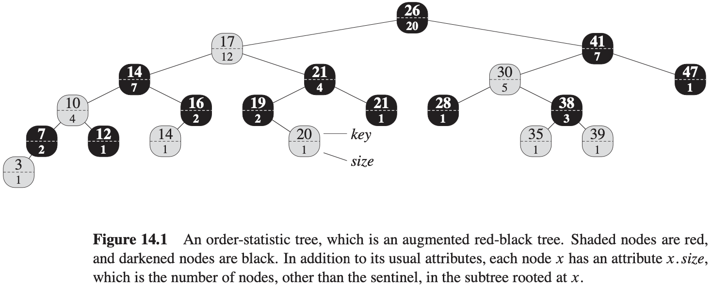
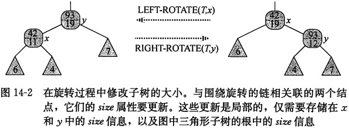
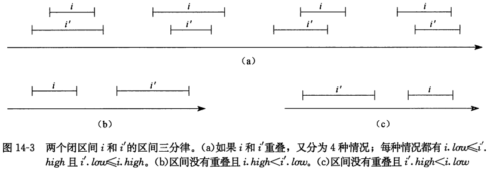
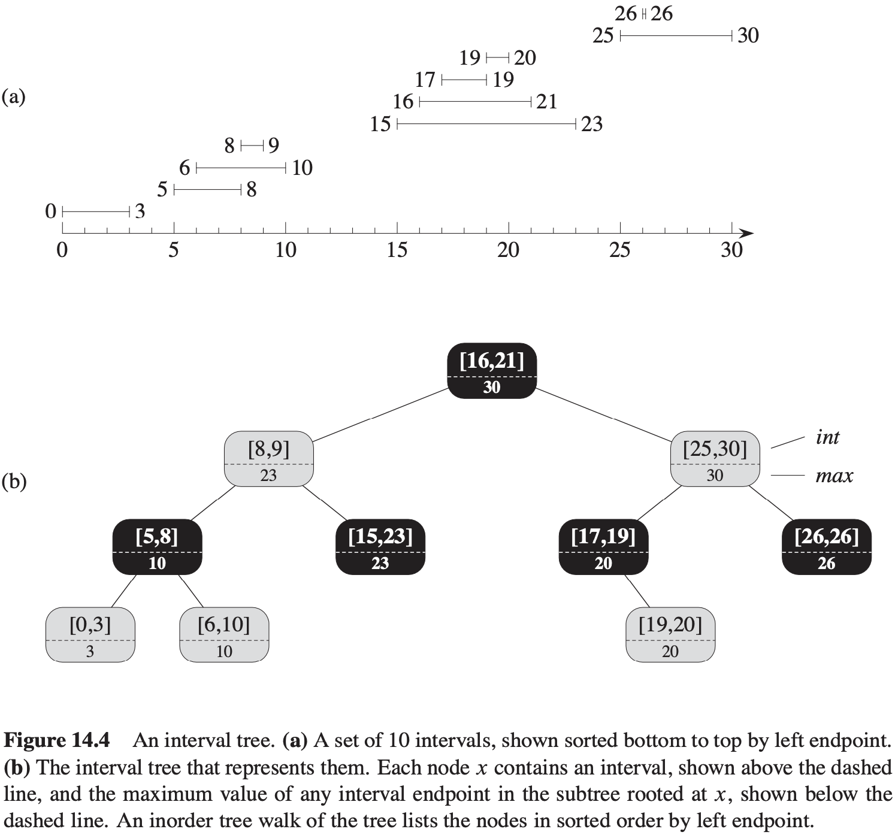
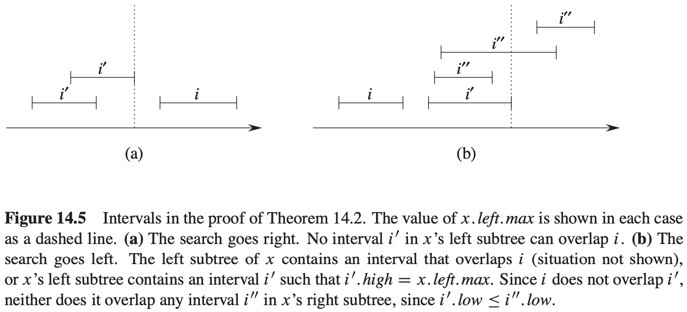

[中文版](chapter14_zh.md) | English

# 14 Augmenting Data Structures

[TOC]

## Dynamic order statistics

**Retrieving an element with a given rank**
$$
\begin{align}
& OS-SELECT(x, i) \\
& r = x.left.size + 1 \\
& if\ i == r \\
& \qquad return\ x \\
& elseif\ i < r \\
& \qquad return\ OS-SELECT(x.left, i) \\
& else\ return\ OS-SELECT(x.right, i - r)
\end{align}
$$
The running time of $OS-SELECT$ is $O(lg\ n)$ for a dynamic set of $n$ elements.

**Determining the rank of an element**
$$
\begin{align}
& OS-RANK(T, x) \\
& r = x.left.size + 1 \\
& while\ y \neq T.root \\
& \qquad if\ y == y.p.right \\
& \qquad \qquad r = r + y.p.left.size + 1 \\
& \qquad y = y.p \\
& return r
\end{align}
$$
**Maintaining subtree sizes**

## How to augment a data structure

We can break the process of augmenting a data structure into four steps:

1. Choose an underlying data structure.
2. Determine additional information to maintain in the underlying data structure.
3. Verify that we can maintain the additional information for the basic modifying operations on the underlying data structure.
4. Develop new operations.

**Augmenting red-black trees**

**Theorem 14.1 (Augmenting a red-black tree)**: Let $f$ be an attribute that augments a red-black tree $T$ of $n$ nodes, and suppose that the value of $f$ for each node $x$ depends on only the information in nodes $x, x.left, and x.right$, possibly including $x.left.f$ and $x.right.f$. Then, we can maintain the values of $f$ in all nodes of $T$ during insertion and deletion without asymptotically affecting the $O(lg\ n)$ performance of these operations.

## Interval trees

We can represent an interval $[t_1, t_2]$ as an object $i$, with attributes $i.low = t_1$(the **low endpoint**) and $i.high = t_2$ (the **high endpoint**). We say that intervals $i$ and $i'$ **overlap** if $i \cap i' \neq \phi$, that is, if $i.low \leq i'.high$ and $i'.low \leq i.high$. As Figure 14.3 shows, any two intervals $i$ and $i'$ satisfy the **interval trichotomy**; that is, exactly one of the following three properties holds:

1. $i$ and $i'$ overlap,
2. $i$ is to the left of $i'(i.e.,\ i.high < i'.low)$,
3. $i$ is to the right of $i'(i.e.,\ i'.high < i.low)$.

An **interval tree** is a red-black tree that maintains a dynamic set of elements, with each element $x$ containing an interval $x.int$. Interval trees support the following operations:

- $INTERVAL-INSERT(T, x)$ adds the element $x$, whose $int$ attribute is assumed to contain an interval, to the interval tree $T$.
- $INTERVAL-DELETE(T, x)$ removes the element $x$ from the interval tree $T$.
- $INTERVAL-SEARCH(T, i)$ returns a pointer to an element $x$ in the interval tree $T$ such that $x.int$ overlaps interval $i$, or a pointer to the sentinel $T.nil$ if no such element is in the set.

$$
\begin{align}
& INTERVAL-SEARCH(T, i) \\
& x = T.root \\
& while x \neq T.nil\ and\ i\ does\ not\ overlap\ x.int \\
& \qquad if\ x.left \neq T.nil\ and\ x.left.max \geqslant i.low \\
& \qquad \qquad x = x.left \\
& \qquad else\ x = x.right \\
& return\ x
\end{align}
$$
**Theorem 14.2** Any execution of $INTERVAL-SEARCH(T, i)$ either returns a node whose interval overlaps $i$, or it returns $T.nil$ and the tree $T$ contains no node whose interval overlaps $i$.

