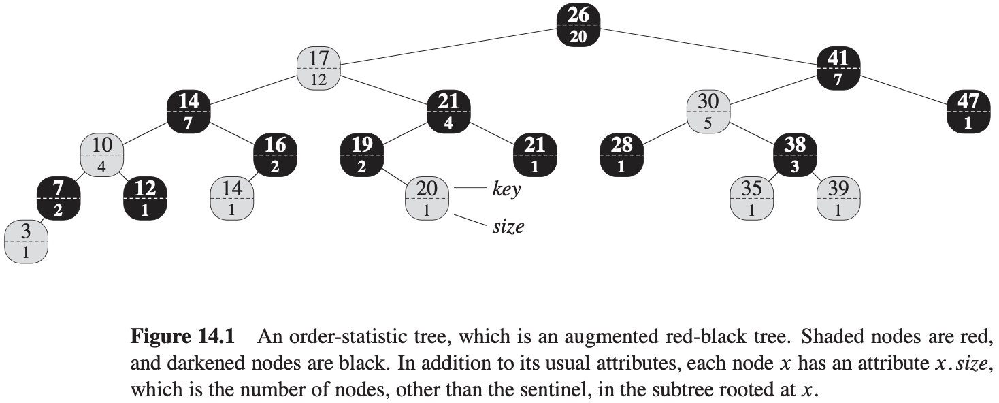
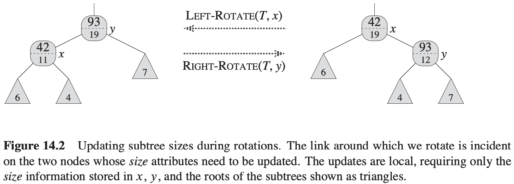
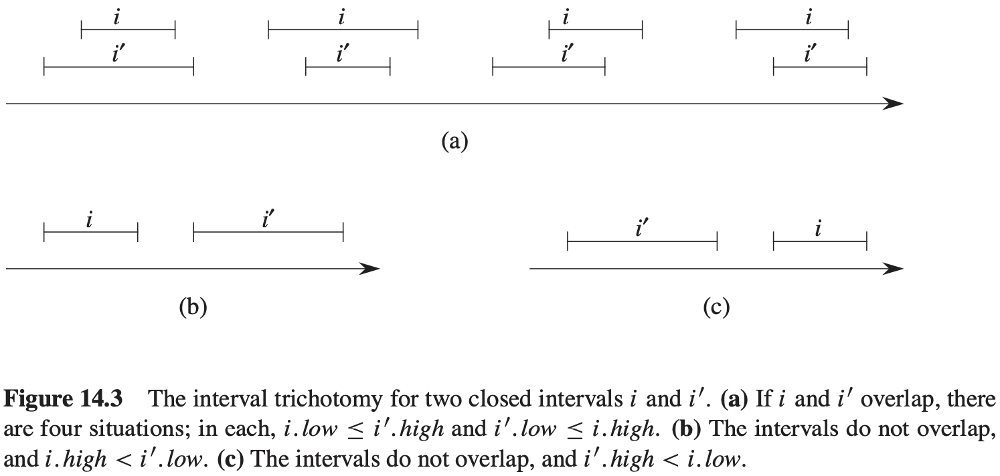
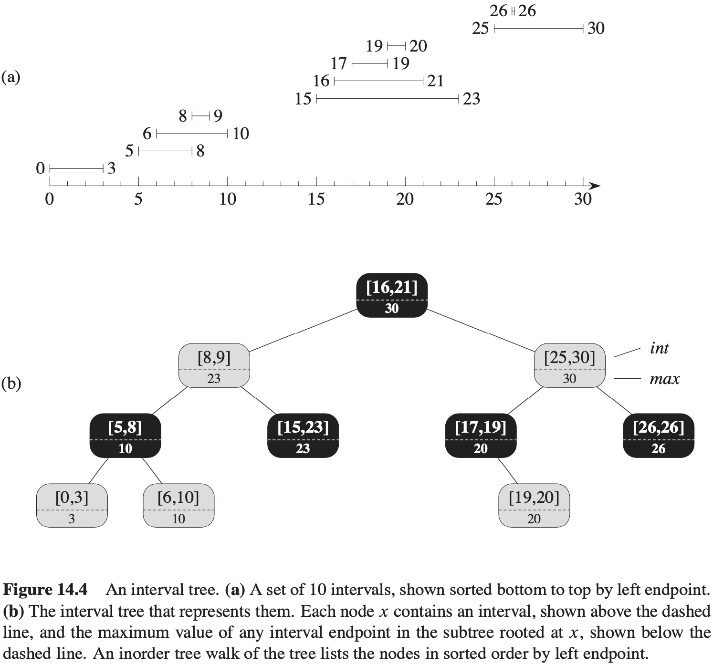

# 第14章 数据结构的扩张

## 14.1 动态顺序统计

**查找具有给定秩的元素**
$$
\begin{align}
& OS-SELECT(x, i) \\
& r = x.left.size + 1 \\
& if\ i == r \\
& \qquad return\ x \\
& elseif\ i < r \\
& \qquad return\ OS-SELECT(x.left, i) \\
& else\ return\ OS-SELECT(x.right, i - r)
\end{align}
$$
对于$n$个元素的动态集合，OS-SELECT的运行时间为$O(lg\ n)$。

**确定一个元素的秩**
$$
\begin{align}
& OS-RANK(T, x) \\
& r = x.left.size + 1 \\
& while\ y \neq T.root \\
& \qquad if\ y == y.p.right \\
& \qquad \qquad r = r + y.p.left.size + 1 \\
& \qquad y = y.p \\
& return r
\end{align}
$$
**对子树规模的维护**

## 14.2 如何扩张数据结构

扩张一种数据结构可以分为4个步骤：

1. 选择一种基础数据结构。
2. 确定基础数据结构中要维护的附加信息。
3. 检验基础数据结构上的基本修改操作能否维护附加信息。
4. 设计一些新操作。

**对红黑树的扩张**

**定理 14.1**（红黑树的扩张）设$f$是$n$个结点的红黑树$T$扩张的属性，且假设对任一结点$x$，$f$的值仅依赖于结点$x, x.left和x.right$的信息，还可能包括$x.left.f和x.right.f$。那么，我们可以在插入和删除操作期间对$T$的所有结点的$f$值进行维护，并且不影响这两个操作的$O(lg\ n)$渐近时间性能。

## 14.3 区间树

我们把一个区间$[t_1, t_2]$表示成一个对象$i$，其中属性$i.low = t_1$为**低端点（low endpoint）**，属性$i.high = t_2$为**高端点（high endpoint）**。我们称区间$i$和$i'$**重叠（overlap）**，如果$i \cap i' \neq \emptyset$，即如果$i.low \leqslant i'.high且i'.low \leqslant i.high$。

任何两个区间$i$和$i'$满足**区间三分律（interval trichotomy，即下面三条性质之一成立）**：

1. $i$和$i'$重叠。
2. $i$在$i'$的左边（也就是$i.high < i'.low$）。
3. $i$在$i'$的右边（也就是$i'.high < i.low$）。

**区间树（interval tree）** 是一种对动态集合进行维护的红黑树，其中每个元素$x$都包含一个区间$x.int$。区间树支持下列操作：

- $INTERVAL-INSERT(T, x)$：将包含区间属性int的元素$x$插入到区间树$T$中。
- $INTERVAL-DELETE(T, x)$：从区间树$T$中删除元素$x$。
- $INTERVAL-SEARCH(T, i)$：返回一个指向区间树$T$中元素$x$的指针，使$x.int$与$i$重叠；若此元素不存在，则返回$T.nil$。

$$
\begin{align}
& INTERVAL-SEARCH(T, i) \\
& x = T.root \\
& while x \neq T.nil\ and\ i\ does\ not\ overlap\ x.int \\
& \qquad if\ x.left \neq T.nil\ and\ x.left.max \geqslant i.low \\
& \qquad \qquad x = x.left \\
& \qquad else\ x = x.right \\
& return\ x
\end{align}
$$
**定理 14.2** $INTERVAL-SEARCH(T, i)$的任意一次执行，或者返回一个其区间与$i$重叠的结点，或者返回$T.nil$，此时树$T$中没有任何结点的区间与$i$重叠。

