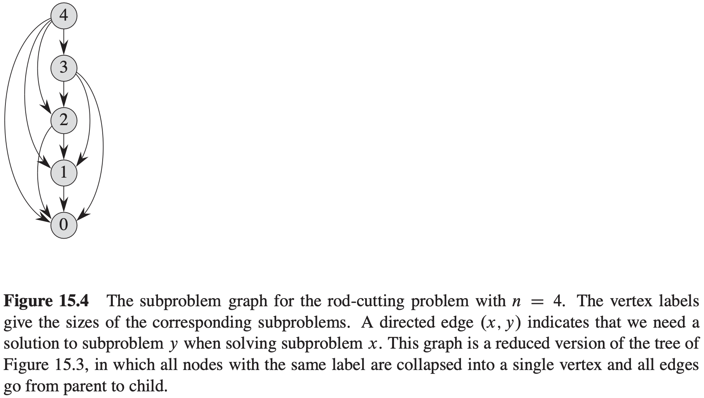
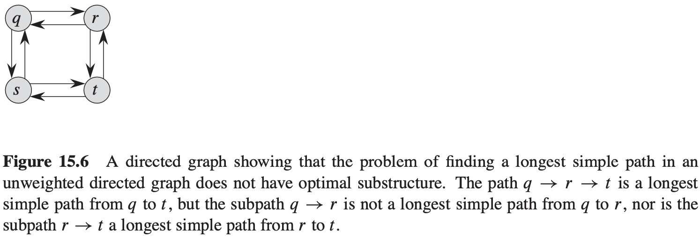
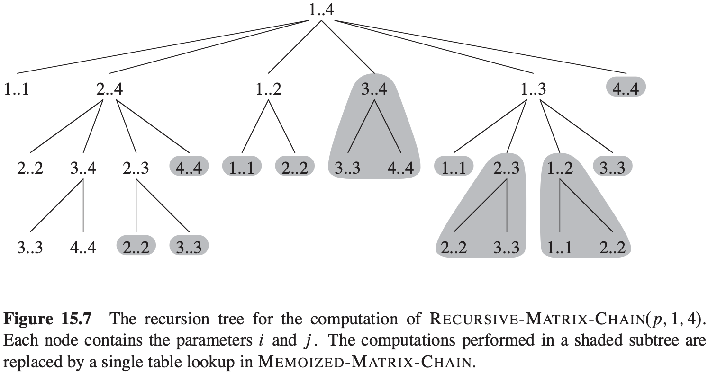
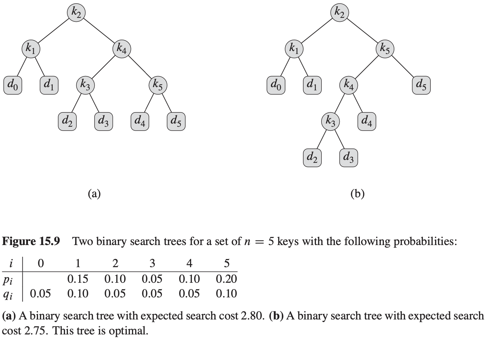

[中文版](chapter15_zh.md) | English

# 15 Dynamic Programming

[TOC]

We typically apply dynamic programming to **optimization problems**.

When developing a dynamic-programming algorithm, we follow a sequence of four steps:

1. Characterize the structure of an optimal solution.
2. Recursively define the value of an optimal solution.
3. Compute the value of an optimal solution, typically in a bottom-up fashion.
4. Construct an optimal solution from computed information.

## Rod cutting

The **rod-cutting problem** is the following. Given a rod of length $n$ inches and a table of prices $p_i$ for $i = 1, 2, ..., n$, determine the maximum revenue $r_n$ obtainable by cutting up the rod and selling the pieces. Note that if the price $p_n$ for a rod of length $n$ is large enough, an optimal solution may require no cutting at all.

**Recursive top-down implementation**
$$
\begin{align}
& CUT-ROD(p, n) \\
& if\ n == 0 \\
& \qquad return\ 0 \\
& q = - \infty \\
& for\ i = 1\ to\ n \\
& \qquad q = max(q, p[i] + CUT-ROD(p, n - i)) \\
& return\ q \\
\end{align}
$$

The running time of CUT-ROD: $T(n) = 1 + \sum_{j = 0}^{n - 1} T(j) = 2^n$.

**Using dynamic programming for optimal rod cutting**

- top-down with memoization
  $$
  \begin{align}
  & MEMOIZED-CUT-ROD(p, n) \\
  & let\ r[0..n]\ be\ a\ new\ array \\
  & for\ i = 0\ to\ n \\
  & \qquad r[i] = - \infty \\
  & return\ MEMOIZED-CUT-ROD-AUX(p, n, r)
  \end{align}
  $$

  $$
  \begin{align}
  & MEMOIZED-CUT-ROD-AUX(p, n, r) \\
  & if\ r[n] \geqslant 0 \\
  & \qquad return\ r[n] \\
  & if\ n == 0 \\
  & \qquad q = 0 \\
  & else\ q = - \infty \\
  & \qquad for\ i = 1\ to\ n \\
  & \qquad \qquad q = max(q, p[i] + MEMOIZED-CUT-ROD-AUX(p, n - i, r)) \\
  & r[n] = q \\
  & return\ q
  \end{align}
  $$

- bottom-up method
  $$
  \begin{align}
  & BOTTOM-UP-CUT-ROD(p, n) \\
  & let\ r[0..n]\ be\ a\ new\ array \\
  & r[0] = 0 \\
  & for\ j = 1\ to\ n \\
  & \qquad q = - \infty \\
  & \qquad for\ i = 1\ to\ j \\
  & \qquad \qquad q = max(q, p[i] + r[j - i]) \\
  & \qquad r[j] = q \\
  & return\ r[n]
  \end{align}
  $$

**Subproblem graphs**

**Reconstructing a solution**
$$
\begin{align}
& EXTENDED-BOTTOM-UP-CUT-ROD(p, n) \\
& let\ r[0..n]\ and\ s[0..n]\ be\ new\ arrays \\
& r[0] = 0 \\
& for\ j = 1\ to\ n \\
& \qquad q = - \infty \\
& \qquad for\ i = 1\ to\ j \\
& \qquad \qquad if\ q < p[i] + r[j - 1] \\
& \qquad \qquad \qquad q = p[i] + r[j - i] \\
& \qquad \qquad \qquad s[j] = i \\
& \qquad r[j] = q \\
& return\ r\ and\ s
\end{align}
$$

$$
\begin{align}
& PRINT-CUT-ROD-SOLUTION(p, n) \\
& (r, s) = EXTENDED-BOTTOM-UP-CUT-ROD(p, n) \\
& while\ n > 0 \\
& \qquad print\ s[n] \\
& \qquad n = n - s[n]
\end{align}
$$

## Matrix-chain multiplication

We state the **matrix-chain multiplication problem** as follows: given a chain $<A_1, A_2, ..., A_n>$ of $n$ matrices, where for $i = 1, 2, ..., n$, matrix $A_i$ has dimension $p_{i - 1} \times p_i$, fully parenthesize the product $A_1 A_2 ... A_n$ in a way that minimizes the number of scalar multiplications:
$$
\begin{align}
& MATRIX-MULTIPLY(A, B) \\
& if\ A.columns \neq B.rows \\
& \qquad error\ "incompatible\ dimensions" \\
& else\ let\ C\ be\ a\ new\ A.rows \times B.columns\ matrix \\
& \qquad for\ i = 1\ to\ A.rows \\
& \qquad \qquad for\ j = 1\ to\ B.columns \\
& \qquad \qquad \qquad c_{ij} = 0 \\
& \qquad \qquad \qquad for\ k = 1\ to\ A.columns \\
& \qquad \qquad \qquad \qquad c_{ij} = c_{ij} + a_{ik} \cdot b_{kj} \\
& return\ C
\end{align}
$$
**Counting the number of parenthesizations**
$$
P(n) = 
\begin{cases}
1, &if\ n = 1\\
\sum_{n - 1}^{k = 1}P(k)P(n - k), &if\ n \geqslant 2
\end{cases}
$$
**Applying dynamic programming**
$$
\begin{align}
& MATRIX-CHAIN-ORDER(p) \\
& n = p.length - 1 \\
& let\ m[1..n, 1..n]\ and\ s[1..n - 1, 2..n]\ be\ new\ tables \\
& for\ i = 1\ to\ n \\
& \qquad m[i,i] = 0 \\
& for\ l = 2\ to\ n \\
& \qquad for\ i = 1\ to\ n - l + 1 \\
& \qquad \qquad j = i + l - 1 \\
& \qquad \qquad m[i, j] = \infty \\
& \qquad \qquad for\ k = i\ to\ j - 1 \\
& \qquad \qquad \qquad q = m[i, k] + m[k + 1, j] + p_{i - 1}p_kp_j \\
& \qquad \qquad \qquad if\ q < m[i, j] \\
& \qquad \qquad \qquad \qquad m[i, j] = q \\
& \qquad \qquad \qquad \qquad s[i, j] = k \\
& return\ m\ and\ s
\end{align}
$$

## Elements of dynamic programming

**Subtleties**

You should be careful not to assume that optimal substructure applies when it does not. Consider the following two problems in which we are given a directed graph $G = (V, E)$ and vertices $u, v \in V$.

- **Unweighted shortest path**: Find a path from $u$ to $v$ consisting of the fewest edges. Such a path must be simple, since removing a cycle from a path produces a path with fewer edges.
- **Unweighted longest simple path**: Find a simple path from $u$ to $v$ consisting of the most edges. We need to include the requirement of simplicity because otherwise we can traverse a cycle as many times as we like to create paths with an arbitrarily large number of edges.

**Overlapping subproblems**
$$
\begin{align}
& RECURSIVE-MATRIX-CHAIN(p, i, j) \\
& if\ i = j \\
& \qquad return\ 0 \\
& m[i, j] = \infty \\
& for\ k = i\ to\ j - 1 \\
& \qquad q = RECURSIVE-MATRIX-CHAIN(p, i, k) \\
& \qquad \qquad + RECURSIVE-MATRIX-CHAIN(p, k + 1, j) \\
& \qquad \qquad + p_{i-1}p_{k}p_{j} \\
& \qquad if\ q < m[i, j] \\
& \qquad \qquad m[i, j] = q \\
& return\ m[i, j]
\end{align}
$$

**Memoization**
$$
\begin{align}
& MEMOIZED-MATRIX-CHAIN(p) \\
& n = p.length - 1 \\
& let\ m[1..n, 1..n]\ be\ a\ new\ table \\
& for\ i = 1\ to\ n \\
& \qquad for\ j = i\ to\ n \\
& \qquad \qquad m[i, j] = \infty \\
& return\ LOOKUP-CHAIN(m, p, 1, n)
\end{align}
$$

$$
\begin{align}
& LOOKUP-CHAIN(m, p, i, j) \\
& if\ m[i, j] < \infty \\
& \qquad return\ m[i, j] \\
& if\ i == j \\
& \qquad m[i, j] = 0 \\
& else\ for\ k = i\ to\ j - 1 \\
& \qquad q = LOOKUP-CHAIN(m, p, i, k) + LOOKUP-CHAIN(m, p, k + 1, j) + p_{i - 1}p_{k}p_{j} \\
& \qquad if\ q < m[i, j] \\
& \qquad \qquad m[i, j] = q \\
& return\ m[i, j]
\end{align}
$$

## Longest common subsequence

In the **longest-common-subsequence problem**, we are given two sequences $X = <x_1, x_2, ..., x_m>$ and $Y = <y_1, y_2, ..., y_n>$ and wish to find a maximum length common subsequence of $X$ and $Y$.

**Theorem 15.1 (Optimal substructure of an LCS)** Let $X = <x_1, x_2, ..., x_m>$ and $Y = <y_1, y_2, ..., y_n>$ be sequences, and let $Z = <z_1, z_2, ..., z_k>$ be any LCS of $X$ and $Y$.

1. If $X_m = y_n$, then $z_k = x_m = y_n$ and $Z_{k - 1}$ is an LCS of $X_{m - 1}$ and $Y_{n - 1}$.
2. If $x_m \neq y_n$, then $z_k \neq x_m$ implies that $Z$ is an LCS of $x_{m - 1}$ and $Y$.
3. If $x_m \neq y_n$, then $z_ \neq y_n$ implies that $Z$ is an LCS of $X$ and $Y_{n - 1}$.

Example:
$$
\begin{align}
& LCS-LENGTH(X, Y) \\
& m = X.length \\
& n = Y.length \\
& let\ b[1..m, 1..n]\ and\ c[0..m, 0..n]\ be\ new\ tables \\
& for\ i = 1\ to\ m \\
& \qquad c[i, 0] = 0 \\
& for\ j = 0\ to\ n \\
& \qquad c[0, j] = 0 \\
& for\ i = 1\ to\ m \\
& \qquad for\ j = 1\ to\ n \\
& \qquad \qquad if\ x_i == y_i \\
& \qquad \qquad \qquad c[i, j] = c[i - 1, j - 1] + 1 \\
& \qquad \qquad \qquad b[i, j] = "↖" \\
& \qquad \qquad elseif\ c[i - 1, j] \geqslant c[i, j - 1] \\
& \qquad \qquad \qquad c[i, j] = c[i - 1, j] \\
& \qquad \qquad \qquad b[i, j] = "↑" \\
& \qquad \qquad else\ c[i, j] = c[i, j - 1] \\
& \qquad \qquad \qquad b[i, j] = "←" \\
& return\ c\ and\ b
\end{align}
$$

$$
\begin{align}
& PRINT-LCS(b, X, i, j) \\
& if\ i == 0\ or\ j == 0 \\
& \qquad return \\
& if\ b[i, j] = "↖" \\
& \qquad PRINT-LCS(b, X, i - 1, j - 1) \\
& \qquad print\ x_i \\
& elseif\ b[i, j] = "↑" \\
& \qquad PRINT-LCS(b, X, i - 1, j) \\
& else\ PRINT-LCS(b, X, i, j - 1)
\end{align}
$$

## Optimal binary search trees

**optimal binary search tree**. Formally, we are given a sequence $K = <k_1, k_2, ..., k_n>$ of $n$ distinct keys in sorted order (so that $k_1 < k_2 < ... < k_n$), and we wish to build a binary search tree from these keys. For each key $k_i$, we have a probability $p_i$ that a search will be for $k_i$.

$$
\begin{align}
& OPTIMAL-BST(p, q, n) \\
& let\ e[1..n + 1, 0..n], w[1..n + 1, 0..n],\ and\ root[1..n, 1..n]\ be\ new\ tables \\
& for\ i = 1\ to\ n + 1 \\
& \qquad e[i, i - 1] = q_{i - 1} \\
& \qquad w[i, i - 1] = q_{i - 1} \\
& for\ l = 1\ to\ n \\
& \qquad for\ i = 1\ to\ n - l + 1 \\
& \qquad \qquad j = i + l - 1 \\
& \qquad \qquad e[i, j] = \infty \\
& \qquad \qquad w[i, j] = w[i, j - 1] + p_j + q_j \\
& \qquad \qquad for\ r = i\ to\ j \\
& \qquad \qquad \qquad t = e[i, r - 1] + e[r + 1, j] + w[i, j] \\
& \qquad \qquad \qquad if\ t < e[i, j] \\
& \qquad \qquad \qquad \qquad e[i, j] = t \\
& \qquad \qquad \qquad \qquad root[i, j] = r \\
& return\ e\ and\ root
\end{align}
$$

